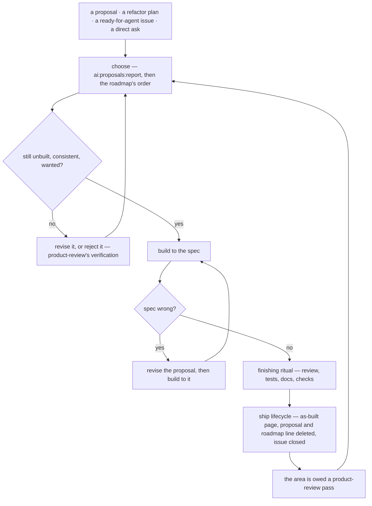

# Building Proposals

`product-review` fills `apps/web/content/docs/proposals/` with specs; this skill empties it. It owns the stretch between a spec and a shipped page — which one to take, what to check before a line is written, what to do when the spec is wrong, and how a ship hands its area back — and states nothing the skills it passes through already own: the proposal's shape and lifecycle are the `docs` skill's, the finishing audit is `finishing`'s, the push is `review-queue`'s.

## Settled — do not re-propose

- **A size, effort or priority field on a proposal.** A proposal's frontmatter is fixed (`docs`, `references/page-frontmatter.md`), and a hand-kept estimate is stale the day the code moves under it. Cost is read off what the page already states by `pnpm ai:proposals:report`; priority is the area roadmap's order (`references/choosing.md`).
- **A backlog or queue file of what to build next.** The proposals tree, the roadmaps and the report already are one; a second list is a copy that drifts.
- **Building a proposal as written without re-verifying it first.** It was written against the code of its day, and a seam that has moved since is found before the build, not halfway through it (`references/building.md`).
- **Departing from a spec silently.** A build that finds the spec wrong revises the proposal or the as-built page says what was built instead; a feature page that matches neither the code nor the spec it came from is the stale record the next review argues with (`references/building.md`).
- **Shipping the code now and the docs "later".** The as-built page, the deleted proposal and the roadmap line go in the change that ships the behaviour (`references/shipping.md`).
- **Fanning several proposals out to parallel agents unasked.** Executing a written spec is the one delegation the `model-delegation` skill allows, and only when the user asks for it.

## The loop

## Rules

- **Choose from the report, not from reading every page** — `pnpm ai:proposals:report` sizes each open proposal, orders them cheapest first and lists the areas owed a pass; the pick weighs that cost against the roadmap's order (`references/choosing.md`).
- **One proposal, or one sub-spec of a folder, per build**, taken in the folder index's build order — a folder is never built whole in one go (`references/choosing.md`).
- **Re-verify before building** — the checks every product-review pass runs, on this one page, before the first edit (`references/building.md`).
- **A feature asked for with no proposal** gets the same written-record check a proposal had before it was written — `deferred/`, `rejected/` and the area's reference product — and is then built directly; the ask is the spec (`references/building.md`).
- **What the build leaves out is written down** as a deferred or rejected page, so the next product-review pass does not find it again as a gap (`references/building.md`).
- **Ship in the same change** — the lifecycle is the `docs` skill's (`references/page-shapes.md`, "Lifecycle map"); what a build adds to it is `references/shipping.md`.
- **Hand the area back** — a ship moves the surface the last product-review pass judged, and the report lists the area as owed until a pass names it (`references/shipping.md`).

## Reference pages

- `references/choosing.md` — when asked what to build next or for the low-hanging fruit, reading the report, or taking a folder of sub-specs or a ready-for-agent issue.
- `references/building.md` — before the first edit of a build, when a feature is asked for with no proposal, and when the spec turns out wrong halfway.
- `references/shipping.md` — when the build is done: what the ship lifecycle owes beyond the docs skill's map, the issue it closes and the pass it hands back.
