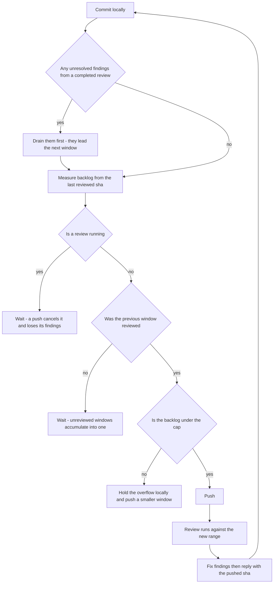

# CodeRabbit Conventions

## What Triggers a Review

CodeRabbit auto-reviews **only PRs targeting the default branch (`main`)**. Develop-base PRs are skipped ("Auto reviews are disabled on base/target branches other than the default branch") and are triggered by commenting `@coderabbitai review`.

**Never add `reviews.auto_review.base_branches`.** Manual triggering there is deliberate, not a gap: it keeps control of _when_ a review starts — which is what makes the never-push-into-a-running-review rule below workable — and stops every intermediate push spending a rate-limit slot. If a PR was not reviewed, comment `@coderabbitai review`; do not change the config. The setting reads like an obvious fix and has been "helpfully" added before.

`.coderabbit.yaml` is read from the PR's **base branch**, so a config change only takes effect once it is on that branch — `references/config-editing.md`.

## Opening a PR Spends a Review Slot

**Creating a PR against the default branch, and every push to one, starts a review** — the slot goes immediately and the next is about an hour out.

So ask first, every time. Agreement on the goal ("get this reviewed") is not permission to spend the slot before the shape is settled: the commit range, the cut point, and the base's `.coderabbit.yaml` all have to be final. Until then push the branch and stop — a branch is free and re-cuttable, a PR is not. Opened one too early? Close it; the slot is already gone and the commits stay reviewable under the PR they belong to.

## Never Push Into an In-Flight Review

Pushing while a review runs cancels it and retriggers a fresh one, costing a slot and losing the in-progress findings. CodeRabbit is **incremental** — it does not re-review commits it has already reviewed — so a cancelled review's comments do not come back on the next run. They are gone.

```bash
gh pr checks --json name,state,bucket,description --jq '.[] | select(.name=="CodeRabbit")'
# {"bucket":"pass","description":"Review rate limited","name":"CodeRabbit","state":"SUCCESS"}
```

**Read `bucket` first, then `description`.** `bucket` is gh's normalization across both representations a check can take, so `pending` means a live review whatever CodeRabbit reports underneath — it posts a **commit status** (`pending`/`success`/`failure`/`error`), while Actions entries on the same PR are check runs reporting `IN_PROGRESS`/`QUEUED`. Keying on the state string alone means a representation change reads as terminal.

| bucket / description                          | meaning                        | push?                         |
| :-------------------------------------------- | :----------------------------- | :---------------------------- |
| `pending` (any description)                   | live review, a push cancels it | **wait**                      |
| `pass` / `Review completed`                   | finished                       | push                          |
| `pass` / `Review rate limited`                | never started, nothing running | **push**                      |
| `pass` / skip comment says `Too many files`   | never started                  | push, but fix the count first |
| `fail`, missing row, or anything unrecognised | unknown                        | **wait**, then look           |

The last row is the default, not an edge case: being wrong about a running review costs its findings and a slot, being wrong about a finished one costs a minute.

Symptoms that a push landed mid-review: a `> [!CAUTION] Failed to replace (edit) comment` / `putComment timed out` comment from the bot, or a review returning far fewer comments than the diff warrants.

## The Four Gates

They are not interchangeable — the first is about leaving findings unanswered, the second about cancelling a review, the third about accumulating an unreviewed window, the fourth about overflowing the cap.



**Drain the open findings before composing a window — they are its first commits, not its last.** A completed review's findings are the only work with an expiry date: threads go stale as the code under them moves, a finding answered three windows later is answered against code the reviewer never saw, and the reviewer re-raises what looks unaddressed. Fresh work has no such clock, so it always yields. This gates **what the window contains**, not merely its order: a window that would exceed the cap drops queued work to keep the fixes in. Count what is open before deciding it is drained (`references/review-feedback.md` — an empty result is usually a wrong filter, not a clean PR).

**The check answers "is one running", never "has the last push been reviewed".** `Review completed` is the status of whichever review ran most recently, which may have covered a range two pushes back — the check names no range at all, so reading it as clearance for the current head is a category error. Every review body states its own range, so the last reviewed sha is a fact to read rather than infer:

```bash
gh api "repos/:owner/:repo/pulls/<pr>/reviews?per_page=100" --paginate \
  --jq '.[] | select(.user.login=="coderabbitai[bot]") | select((.body|length) > 0)
        | "\(.submitted_at)  \(.body | capture("between (?<a>[0-9a-f]{40}) and (?<b>[0-9a-f]{40})") | "\(.a[0:9])..\(.b[0:9])")"' | tail -3
git diff --name-only <last-reviewed-sha>..origin/<branch> | wc -l   # already pushed and unreviewed
git diff --name-only <last-reviewed-sha>..HEAD | wc -l              # what the next push would add
```

**Take the second number before a push.** The pipeline deliberately keeps local commits ahead of the reviewed frontier, so `..origin/<branch>` measures the pushed backlog only and omits exactly the commits the push is about to add — it can read comfortably under the cap while the push lands well over it. Use `..origin/<branch>` only to answer "is a previous window still unreviewed"; use `..HEAD` (or `..<cut-sha>` when holding a tail back) to size the window.

The budget is measured **from that sha, not from the last push**. An unreviewed window does not clear — it accumulates. Two pushes of 35 and 80 that each looked compliant are one 115-file window, over the cap, and the review is skipped outright rather than truncated.

**A rate-limited status does not prove the frontier stalled.** CodeRabbit advances its incremental checkpoint over commits it never posted a review body for: the status still reads `Review rate limited`, no range names them, and they count as reviewed anyway. Reading that as an unreviewed window inflates the next backlog by everything it silently covered and stalls pushes to protect a review that will never run. The reviewed range is evidence the checkpoint moved, never evidence it did not. The probe is the retrigger itself — `@coderabbitai review` replies `Already reviewed` when the checkpoint covers the head, and starts a review when it does not. Read **the reply to the probe**, never whichever bot comment is newest (`references/review-feedback.md`); a decline costs nothing.

**This says when a push is _safe_, never when it is _authorised_.** The standing rule overrides everything here: commit the coherent change and **never push unless the user asks** — rate-limited, recovery and force-pushes alike. Given the ask, `Review rate limited` is not a wait state: nothing is running, so holding the branch stalls the working tree for an hour to protect a review that does not exist. Under a standing ask ("keep pushing while it's parked"), treat the review as an async thread and keep pushing rather than waiting for one to be asked for each time. **The ask supplies authorisation, never an exemption from the gates** — every push still clears all four, the in-flight gate included, so a standing ask never licenses pushing into a running review. It applies per push, not per work session: the second push re-reads the gates from scratch, and if the first push's review is still running it waits, however recently permission was given.

## PR File Budget

The cap is **100 files per review** — the Open Source tier's limit is popularity-scaled and can move, so treat it as current-best-known; the bot's skip comment states the current one. Aim each window at **~90 changed files**, close enough to fill the slot without risking it:

```bash
# Committed since branching, plus anything not yet committed — as a set, since a file can be in both.
{ git diff --name-only "$(git merge-base <base-branch> HEAD)"; git status --porcelain -uall | cut -c4-; } |
  sort -u | wc -l
```

Count the **union**, not the sum: a file with both committed and working-tree changes is one file to CodeRabbit, and summing it twice cuts the chunk early.

**Incremental reviews refresh the budget.** CodeRabbit reviews only the files changed since its last completed review, not the cumulative PR diff, so within one long-lived PR the budget applies **per cycle** — measure `<last-reviewed-sha>..HEAD`. The merge-base count above governs the **first** review of a PR and any full re-review.

The budget is a **target to fill, not only a cap**. A slot costs an hour whether it reads 12 files or 90, so an under-filled window is the most expensive kind. A single roadmap item is typically 8–15 files, so one-item-per-PR wastes most of a slot and multiplies rounds. Batch items until the estimate approaches ~90, grouping by what they touch so coupling stays inside one review: items sharing a schema section, a router or a settings object belong in the same PR — splitting them creates stacked branches that cannot start until their parent merges. Items whose only overlap is additive (a new row on a shared blade) can land separately with a stated merge order.

### Pipelining — work lands on `develop`, review runs against the `develop` → `main` PR

**There are no per-chunk feature branches.** Work is committed and pushed straight to `develop`, and the single long-lived PR is `develop` → `main`. Because that PR's base is the default branch, every push to `develop` auto-triggers a review — no trigger comment, no PR per chunk. Keeping that PR open is what makes the pipeline work.

1. Commit continuously on `develop`. When the delta since the last reviewed sha approaches ~90 files, that chunk is ready.
2. Push it. The push starts a review.
3. **Keep working locally while it runs.** Commits are free; only pushes trigger reviews. The local commit queue is what absorbs the hour.
4. When the review completes, address its findings, commit the fixes, verify, and push them **together with** the next queued chunk — then reply to every finding. That single push starts the next cycle. Replying last is what makes a reply checkable: it can name the commit that answers the finding, where a reply written before the push points at nothing.
5. Repeat, so review effort tracks the work instead of gating it.

The invariant: a chunk is a **push** boundary, not a work boundary. If step 4's fixes plus the queued chunk exceed the budget, push the fixes with only part of the queue and hold the rest — never split a fix away from the finding it answers. Which commits ride in a window, and how a late-authored fix is moved to its front: `references/window-composition.md`.

## Reading and Answering Findings

- **Nitpicks live only in the review body**, inside the collapsed `🧹 Nitpick comments (M)` block — never as inline comments. Fetching only the inline endpoint loses them silently.
- **Inline comments can fail to post at all**, and the review says so with a `> [!CAUTION] Inline review comments failed to post` block. The findings are still listed in the body's agent-prompt block, so a run that posted fewer threads than it claims is not a run with fewer findings.
- **Reconcile before concluding.** Each review body states `Actionable comments posted: N` and `🧹 Nitpick comments (M)`. Both are ground truth: fewer in hand than that means you are missing some — go find them rather than reporting what you happened to fetch.
- **Reply to every finding, including rejected ones** — a silent skip is indistinguishable from an oversight. State the verdict in the first line (`Agreed, fixed in <sha>` / `Not a real issue, no change`) and give the evidence; these threads are the record of why the code looks the way it does.
- **Push the fix commits first, then reply.** A reply citing a sha the remote does not have is one CodeRabbit cannot resolve — it answers that it can't find the commit, and the thread's evidence is worthless from then on. Order: commit → check the review has settled → push → reply with the pushed sha.
- **Verify before accepting.** CodeRabbit reasons from names and prior "learnings" and will confidently assert semantics the code does not have — check the implementation, and when it flags a pattern, grep for the repo's existing convention rather than taking the suggested diff. If a finding is real, check whether its twin exists elsewhere; the scan is per-file and routinely stops one file short.

## Deep Dives

- `references/review-feedback.md` — when fetching a PR's feedback, counting what is still open, or replying to a comment.
- `references/window-composition.md` — when a push would exceed the cap, or work authored last has to be reviewed first.
- `references/config-editing.md` — when changing `.coderabbit.yaml`.
- `references/release-pr-cutting.md` — when a PR has grown past the file limit and its review is skipped outright.
- `references/exclusions.md` — when deciding whether a file may be excluded, generating the list, or removing the exclusions.
