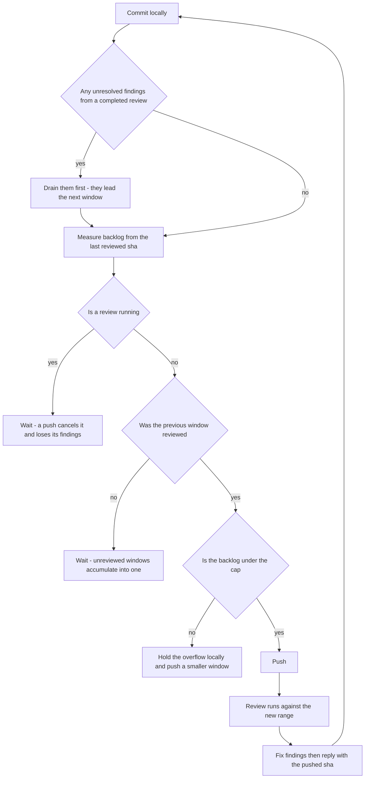

# CodeRabbit Conventions

## Settled — do not re-propose

- **Sizing a window with `gh pr view --json changedFiles`.** It counts the cumulative diff against the base branch rather than what moved since the last completed review, so on this repo's standing `develop`→`main` PR it reads a multiple of the real window and manufactures an over-cap emergency out of a healthy push. It is the fastest thing to reach for and wrong every time a PR has been reviewed more than once, which is every time. Read the frontier (`references/measuring-the-window.md`).
- **Adding `develop` to `reviews.auto_review.base_branches`** so develop-base PRs review themselves. It turns every intermediate PR into a spent slot; a develop-base PR is triggered by hand with `@coderabbitai review` ("What Triggers a Review").
- **Excluding files to bring an over-budget window under the cap.** Exclusion hides the work from the only review it will ever get. Cut the tail to a queue branch and re-push a sub-cap window instead (`references/exclusions.md`, `references/release-pr-cutting.md`).
- **Holding a finished chunk until `format`/`typecheck`/`lint`/tests come back.** Checks are minutes and a slot is an hour, so that spends the scarce resource to protect the cheap one — and a failure found afterwards is one more commit in the next window (`references/pipelining.md`).
- **One roadmap item per PR.** A slot costs an hour whether it reads 12 files or 90, so an under-filled window is the most expensive kind ("PR File Budget").
- **Grepping the review body for the word "nitpick"** to collect them. The buckets are not a fixed set — duplicates, refactor suggestions and an additional-comments block appear once a review carries many — so a grep silently drops whichever bucket it did not name (`references/review-feedback.md`).

## What Triggers a Review

CodeRabbit auto-reviews **only PRs targeting the default branch (`main`)**. Develop-base PRs are skipped ("Auto reviews are disabled on base/target branches other than the default branch") and are triggered by commenting `@coderabbitai review`.

**Never add `reviews.auto_review.base_branches`.** Manual triggering there is deliberate, not a gap: it keeps control of _when_ a review starts — which is what makes the never-push-into-a-running-review rule below workable — and stops every intermediate push spending a rate-limit slot. If a PR was not reviewed, comment `@coderabbitai review`; do not change the config. The setting reads like an obvious fix and has been "helpfully" added before.

`.coderabbit.yaml` is read from the PR's **base branch**, so a config change only takes effect once it is on that branch — `references/config-editing.md`.

## Opening a PR Spends a Review Slot

**Creating a PR against the default branch, and every push to one, starts a review** — the slot goes immediately and the next is about an hour out.

So ask first, every time. Agreement on the goal ("get this reviewed") is not permission to spend the slot before the shape is settled: the commit range, the cut point, and the base's `.coderabbit.yaml` all have to be final. Until then push the branch and stop — a branch is free and re-cuttable, a PR is not. Opened one too early? Close it; the slot is already gone and the commits stay reviewable under the PR they belong to.

**Creating the PR is itself the start of a review, so the moment after `gh pr create` is an in-flight one.** The next section's rule applies from that instant, and the trap is that the CodeRabbit check has not appeared yet — there is no `pending` row to read, because the review is queued rather than reporting. An absent row is the table's unrecognised case (**wait**), never clearance. What makes this the easy mistake is that the correction wanting to go out is usually the author's own: a claim in the body that turned out wrong, a stale comment, a typo spotted on re-reading. It feels like tidying the PR before anyone looks, and it is in fact a push into a live review — it cancels that review, loses its findings, spends the next slot, and cancels the CI run the PR just started. Corrections found after opening are a later window's commits. Fix the PR **body** freely (`gh pr edit` touches no sha), commit the code correction locally, and push it once the review lands.

## Never Push Into an In-Flight Review

Pushing while a review runs cancels it and retriggers a fresh one, costing a slot and losing the in-progress findings. CodeRabbit is **incremental** — it does not re-review commits it has already reviewed — so a cancelled review's comments do not come back on the next run. They are gone.

```bash
gh pr checks --json name,state,bucket,description --jq '.[] | select(.name=="CodeRabbit")'
# {"bucket":"pass","description":"Review rate limited","name":"CodeRabbit","state":"SUCCESS"}
```

**Read `bucket` first, then `description`.** `bucket` is gh's normalization across both representations a check can take, so `pending` means a live review whatever CodeRabbit reports underneath — it posts a **commit status** (`pending`/`success`/`failure`/`error`), while Actions entries on the same PR are check runs reporting `IN_PROGRESS`/`QUEUED`. Keying on the state string alone means a representation change reads as terminal.

| bucket / description                          | meaning                        | push?                         |
| :-------------------------------------------- | :----------------------------- | :---------------------------- |
| `pending` (any description)                   | live review, a push cancels it | **wait**                      |
| `pass` / `Review completed`                   | finished                       | push                          |
| `pass` / `Review rate limited`                | never started, nothing running | **push**                      |
| `pass` / skip comment says `Too many files`   | never started                  | push, but fix the count first |
| `fail`, missing row, or anything unrecognised | unknown                        | **wait**, then look           |

The last row is the default, not an edge case: being wrong about a running review costs its findings and a slot, being wrong about a finished one costs a minute.

Symptoms that a push landed mid-review: a `> [!CAUTION] Failed to replace (edit) comment` / `putComment timed out` comment from the bot, or a review returning far fewer comments than the diff warrants.

## The Four Gates

They are not interchangeable — the first is about leaving findings unanswered, the second about cancelling a review, the third about accumulating an unreviewed window, the fourth about overflowing the cap.



**Drain the open findings before composing a window — they are its first commits, not its last.** A completed review's findings are the only work with an expiry date: threads go stale as the code under them moves, a finding answered three windows later is answered against code the reviewer never saw, and the reviewer re-raises what looks unaddressed. Fresh work has no such clock, so it always yields. This gates **what the window contains**, not merely its order: a window that would exceed the cap drops queued work to keep the fixes in. Count what is open before deciding it is drained (`references/review-feedback.md` — an empty result is usually a wrong filter, not a clean PR).

**The check answers "is one running", never "has the last push been reviewed".** `Review completed` is the status of whichever review ran most recently, which may have covered a range two pushes back — the check names no range at all, so reading it as clearance for the current head is a category error. Reading the last reviewed sha, sizing the window against it, and why a rate-limited status is not proof the frontier stalled: `references/measuring-the-window.md`.

**This says when a push is _safe_, never when it is _authorised_.** The standing rule overrides everything here: commit the coherent change and **never push unless the user asks** — rate-limited, recovery and force-pushes alike. Given the ask, `Review rate limited` is not a wait state: nothing is running, so holding the branch stalls the working tree for an hour to protect a review that does not exist. Under a standing ask ("keep pushing while it's parked"), treat the review as an async thread and keep pushing rather than waiting for one to be asked for each time. **The ask supplies authorisation, never an exemption from the gates** — every push still clears all four, the in-flight gate included, so a standing ask never licenses pushing into a running review. It applies per push, not per work session: the second push re-reads the gates from scratch, and if the first push's review is still running it waits, however recently permission was given.

## PR File Budget

The cap is **100 files per review** — the Open Source tier's limit is popularity-scaled and can move, so treat it as current-best-known; the bot's skip comment states the current one. Aim each window at **~90 changed files**, close enough to fill the slot without risking it — counting the union of committed and working-tree changes, and measuring per cycle rather than per PR (`references/measuring-the-window.md`).

The budget is a **target to fill, not only a cap**. A slot costs an hour whether it reads 12 files or 90, so an under-filled window is the most expensive kind. A single roadmap item is typically 8–15 files, so one-item-per-PR wastes most of a slot and multiplies rounds. Batch items until the estimate approaches ~90, grouping by what they touch so coupling stays inside one review: items sharing a schema section, a router or a settings object belong in the same PR — splitting them creates stacked branches that cannot start until their parent merges. Items whose only overlap is additive (a new row on a shared blade) can land separately with a stated merge order.

### Pipelining — `references/pipelining.md`

There are no per-chunk feature branches: work is committed and pushed straight to `develop`, and the single long-lived `develop` → `main` PR auto-reviews every push. **Planning the push cadence, deciding where a window boundary falls, or holding a tail that does not fit** is that page.

## Reading and Answering Findings

**"Fix the CodeRabbit comments" means every finding the run produced**, at every severity and in every place the
run put one. Nobody has to list the categories, and a request naming one of them ("the review comments") is not a
request scoped to that one. A finding is skipped only when it is genuinely invalid, and then it is answered like
any other: a reply saying why. Severity and delivery channel are different axes — a minor arrives as an inline
thread as readily as a major — and it is the channel, never the severity, that decides whether a fetch finds it.

- **Nitpicks live only in the review body**, inside the collapsed `🧹 Nitpick comments (M)` block — never as inline comments. Fetching only the inline endpoint loses them silently. Grepping the body for the word is the other way to lose them: the buckets are not a fixed set — duplicates, refactor suggestions and an additional-comments block appear once a review carries many — so read them with the one call in `references/review-feedback.md`, which suppresses boilerplate rather than naming categories.
- **Outside-diff-range findings live only in the review body too**, inside the `> [!CAUTION] Some comments are outside the diff` block's `⚠️ Outside diff range comments (K)` list — the platform will not accept an inline thread on a line the diff does not touch. They are ordinary findings that landed on untouched lines, frequently the most substantive ones in a run, and they have no thread to resolve, so the fix commit is their only record.
- **Inline comments can fail to post at all**, and the review says so with a `> [!CAUTION] Inline review comments failed to post` block. The findings are still listed in the body's agent-prompt block, so a run that posted fewer threads than it claims is not a run with fewer findings.
- **Reconcile before concluding.** Each review body states its own counts — `Actionable comments posted: N`, `🧹 Nitpick comments (M)`, `⚠️ Outside diff range comments (K)`. All three are ground truth: fewer in hand than that means you are missing some — go find them rather than reporting what you happened to fetch. The body's `🤖 Prompt for all review comments with AI agents` block is the cross-check, because it lists all three categories in one place under `Inline comments:` / `Nitpick comments:` / `Outside diff comments:` headings.
- **Reply to every finding, including rejected ones** — a silent skip is indistinguishable from an oversight. State the verdict in the first line (`Agreed, fixed in <sha>` / `Not a real issue, no change`) and give the evidence; these threads are the record of why the code looks the way it does.
- **Push the fix commits first, then reply.** A reply citing a sha the remote does not have is one CodeRabbit cannot resolve — it answers that it can't find the commit, and the thread's evidence is worthless from then on. Order: commit → check the review has settled → push → reply with the pushed sha.
- **A finding class that is wrong every time is answered in `.coderabbit.yaml`, not in replies.** Where a repo convention makes some whole category of finding invalid — a formatter's or hook's output, a generated file's shape, a deliberate idiom — replying to each instance costs a paragraph per window and the next review raises them again, because nothing it read changed. One `reviews.path_instructions` entry naming the category ends it for every future window. The tell is a review whose minor findings are one thing restated N times: that is one config edit wearing N hats. It only takes effect once it is on the base branch (`references/config-editing.md`), so the current window still gets replies — the entry is what stops the window after it.
- **Verify before accepting.** CodeRabbit reasons from names and prior "learnings" and will confidently assert semantics the code does not have — check the implementation, and when it flags a pattern, grep for the repo's existing convention rather than taking the suggested diff. If a finding is real, check whether its twin exists elsewhere; the scan is per-file and routinely stops one file short.

## Deep Dives

- `references/review-feedback.md` — when fetching a PR's feedback, counting what is still open, or replying to a comment.
- `references/measuring-the-window.md` — before a push: reading the last reviewed sha, counting the backlog against it, and what a rate-limited status does and does not prove.
- `references/pipelining.md` — when planning the push cadence, or deciding where a window boundary falls.
- `references/window-composition.md` — when a push would exceed the cap, or work authored last has to be reviewed first.
- `references/config-editing.md` — when changing `.coderabbit.yaml`.
- `references/release-pr-cutting.md` — when a PR has grown past the file limit and its review is skipped outright.
- `references/exclusions.md` — when deciding whether a file may be excluded, generating the list, or removing the exclusions.
