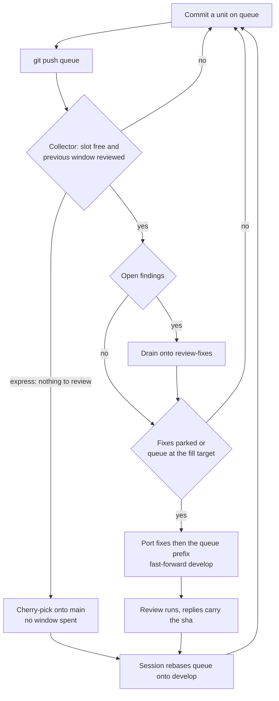

# Pipelining a push against a running review

Read when planning the push cadence, when deciding what the session pushes and what it never touches, or when
the collector has moved `develop` and the session has to catch up. This page holds the whole procedure; `SKILL.md`
keeps the cap, the gates and the finding rules it operates under. The design in full, with the cycle, the runner
and the ref ownership as separate pages: `apps/web/content/docs/infra/review-collector/`.

## Three branches, one writer each

**There are no per-chunk feature branches, and the session never pushes `develop`.** The session's checked-out
branch is `queue`; it commits coherent units there and pushes after every commit. The single long-lived
`develop` → `main` pull request is the release pull request, and every push to `develop` auto-triggers a review
because that pull request's base is the default branch. What pushes `develop` is the **review collector** —
`pnpm ai:coderabbit:collect`, run by the `ReviewCollector` workflow whenever `queue` is pushed or CodeRabbit
submits a review.

| Ref            | Written by                                 | What it holds                                                                   |
| :------------- | :----------------------------------------- | :------------------------------------------------------------------------------ |
| `queue`        | the session                                | its linear history — every unported commit in authoring order, no window cuts   |
| `develop`      | the collector                              | the reviewed frontier plus at most one unreviewed window, moved by fast-forward |
| `review-fixes` | the collector                              | fixes a drain produced that no window has carried yet                           |
| `main`         | a person, and the collector's express lane | the released trunk, plus the commits that never needed a window                 |

A queue push spends nothing: it starts no review, only a collector run that measures. So the standing rule
that a `develop` push is asked for every time is unchanged and now never applies to the session — the collector
holds the authorisation, and the four gates of `SKILL.md` are the gates it clears from the remote on every run.

**A commit with nothing in it to review never occupies a window.** The collector's express lane proves that from
the diff — every file a 100% rename or an import specifier following one, and no file anything reads by its path
— and cherry-picks those onto `main`, out of queue order, so a sweep stops eating a budget counted in files and
spent on findings. Nothing is asked of the session except the composition below; the design is
`apps/web/content/docs/infra/review-collector/express-lane.md`.

**So commit a sweep's moves apart from its repairs.** A commit that carries the renames _and_ the refreshed size
snapshot has one content change in it, and one is enough: the proof is per commit, and a window is cut at commit
boundaries, so half a commit cannot take the lane. This is the rule `references/window-composition.md` already
states for the cut's sake, and the lane is the second reason for it.

## The session's loop

1. Commit a unit on `queue`. Run the finishing checks; commit their repairs as their own commit behind the unit
   (`references/window-composition.md`), because the collector cuts at commit boundaries and every cut must be
   green on its own.
2. `git push`. Plain while `queue` sits on `develop`'s head, `--force-with-lease` after a rebase — the queue is a
   backup of unpushed work, not a reviewed artifact, and the lease is what keeps two machines from dropping
   each other's commits.
3. Before the next unit, `git fetch`, and when `origin/develop` moved, `git rebase origin/develop`. A
   fast-forwarded `develop` makes the rebase a no-op; a cherry-picked window drops the ported commits by patch
   id and re-parents the rest.
4. Keep working. The collector fires on the push, reads the frontier and the check, drains any open findings
   onto `review-fixes`, and when the slot is free and the queue has reached the fill target, ports the largest
   green prefix under the cap and fast-forwards `develop`. Its replies name the pushed sha.



**What the session must not do:** push `develop`, touch `review-fixes`, or cut a window. A commit that would have
been "the last one under the cap" is just a commit — the collector measures the cut on the tree it is about to
push, one cherry-pick at a time, and holds the first commit that overflows.

**A finding the session answers itself** is a commit on `queue` carrying the trailer `Answers: <comment id>` (a
body-only finding: `Drains: <review id>`). The collector's open-finding predicate honours a trailer on the
queue's unported commits, so it neither re-fixes the finding nor replies before the commit is on `develop`. A
rejection needs no sha and may be replied to directly.

**When the collector reports a conflict** — its parked fixes changed a file the queue's next commit also changed
— the session rebases `queue` onto `origin/review-fixes`, not onto `develop`: the fixes will lead the next window,
and a queue that already carries them replays them as empty.

**`main` is synced by the collector, not the session.** After the release pull request merges, the push to
`main` runs the cycle and `develop` is fast-forwarded to it; a dependency bump that lands on `main` alone is folded
into the next window as a merge commit, lockfile rebuilt the `git` skill's way, so it rides a slot that was being
spent anyway. A merge of `main` into `queue` the session makes is never owed to `develop` — the porter takes only
the commits the queue authored — and the session's next rebase onto `develop` linearises it away.

**The collector can be run by hand when its workflow is off.** `gh workflow disable ReviewCollector.yaml` stops
every trigger; `pnpm ai:coderabbit:collect` then runs the same cycle from a checkout whose `gh` login is the
collector's account — never this checkout, which the script switches branches in and refuses when dirty, but a
detached `git worktree add` on `origin/develop` with its own `pnpm i` and `@esposter/shared` build. It clears the
four gates from the remote exactly as the runner does, so the standing rule is unchanged: the run is asked for.
`gh workflow enable ReviewCollector.yaml` hands the cycle back.

**A finding the session answers on `queue` ports in queue order, not first.** Only `review-fixes` commits lead a
window. A fix committed at the queue's tail waits for the windows ahead of it, and its thread reply with the sha
comes when it lands; picking it ahead of the commits it was written on top of conflicts, so the wait is the cost
of answering in-session rather than leaving the drain to it.

## Re-opening the standing PR after it merges

The pipeline assumes the `develop` → `main` PR is open; once it merges there is none, and the collector exits until
a person opens one. That is a slot spend like any push, so it is asked for rather than assumed (`SKILL.md`,
"Opening a PR Spends a Review Slot").

Size that window from the **merge base**, not from a reviewed sha — a PR's first review reads the cumulative diff
(`references/measuring-the-window.md`), so the count is
`git fetch origin main && git diff --name-only $(git merge-base origin/main HEAD)..HEAD` and the ~90-file target
applies to it whole. Everything already on `main` is outside it, which is why the merge base rather than `main` is
the left-hand side — and the fetch is load-bearing rather than hygiene, because this measurement is taken exactly
once the previous PR has merged: `origin/main` is a remote-tracking ref, so an unfetched one still points at the
commit before that merge and the merge base walks back past it, counting the whole merged window a second time.

```bash
git push origin develop
gh pr create --base main --head develop --title "<type>(<scope>): <what the window carries>" --body "<summary>"
```

The body is the window's summary rather than the last commit's: what moved, what was deliberately left and why
(the same reasons the commit messages carry), and a test plan naming the checks that were run. A reader arriving
at the PR should not have to read sixteen commits to learn what one window did.
