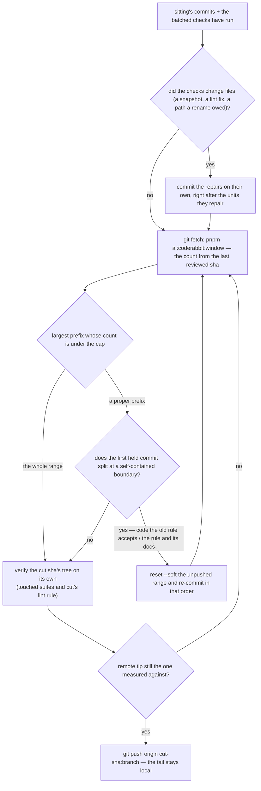

# Composing a push window

Read when a push would exceed the file cap, when work authored last has to be reviewed first, when a sitting's commits have to be cut so the pushed head is green on its own, or when roadmap items are being batched into one window.

A window is a **prefix of the unpushed range**, so what rides in it is decided by commit order, not authoring order. Push a prefix and hold the rest by naming the cut sha:

```bash
git push origin <cut-sha>:<branch>      # everything after <cut-sha> stays local
```

## Cutting a sitting into a window

The same steps every time, so a window is filled without a rewritten pushed commit or a head that fails CI:



**Every cut is a green tree.** The pushed head runs CI on its own, so a commit that a later commit repairs is not a valid cut: the size snapshot a barrel reorder moved, the key-files path a rename owed, the import order lint rewrote — each is a red shard until the commit carrying it lands. The batched checks at the end of a sitting are what produce those repairs, so they are committed **as their own commit directly behind the units they repair**, never folded into the next behaviour change, where they would be held with it. That commit is the natural cut.

**A change and the enforcer it lands split at the old rule.** When a change is code plus the rule that demands it plus the docs that record it, and the rule the tree already carries accepts the new code, the code goes in this window and the rule with its docs in the next — the cut's tree is green under the rule it carries. Never the reverse: a rule ahead of its sites fails lint on every one of them.

**Re-splitting the unpushed range is free; a pushed commit is never rewritten.** With a clean tree, `git reset --soft origin/<branch>` puts every unpushed change back in the index and `git add <paths>` / `git commit` re-cuts it in the order the window needs; the reordering recipe below is the same operation for whole commits. Both stop at `origin/<branch>` — that ref is the reviewed frontier and other sessions' pushes, and a rewrite past it is the checkpoint desync the last section describes.

**Verify the cut, not only the head.** The checks ran against the tip, which includes the held tail; the cut's tree is that tip minus the tail, so what the tail touches is re-run against the cut — the package suites whose snapshots it moved, the docs suite whose paths it fixed, and lint with the plugin at the cut (`git show <cut>:scripts/src/oxlint/<plugin>.ts` into a scratch file beside the others, a scratch config at the repo root naming it, deleted after).

**Fill to the cap.** A slot costs an hour whether it reads 20 files or 99, so the prefix is the largest one under the cap, and a prefix that lands at 99 is pushed rather than held at 84. The ~90 figure the skill aims at is what a prefix usually lands on, never a reason to hold one that fits. Other sessions push the same branch, so the count is re-read after a fetch and the push goes out only while the remote tip is still the one it was measured against.

## Reordering so a fix leads

Work authored last but wanted first — review fixes, a config change, anything gating the next cycle — is **prepended to the unpushed range** rather than left at the tip, where it would wait a whole cycle behind the queued chunk. Reordering unpushed commits is free; they exist nowhere else:

```bash
FIX=$(git rev-parse <fix-sha>)
OLD=$(git rev-parse HEAD)                             # the old tip, so the reset is recoverable
test -z "$(git status --porcelain -uall)" || exit 1   # a dirty tree loses work the reset cannot restore
git reset --hard origin/<branch>                      # the reviewed frontier
pick() {
  local commits
  commits=$(git rev-list "$1") || return 1   # an unresolvable range fails rather than listing nothing
  test -n "$commits" || return 0             # either range is empty when the fix was authored first or last
  git cherry-pick "$1"
}
git cherry-pick "$FIX"                    # the fix goes first
pick "origin/<branch>..$FIX^"             # the work it was authored on top of
pick "$FIX..$OLD"                         # anything after it
```

`pick` exists because `cherry-pick` errors on an empty commit set rather than skipping it, and because a range git cannot resolve also lists nothing — separating the two matters once the reset has already moved the tip, where treating an unresolvable range as empty would silently drop those commits.

Only reorder when the fix is **independent of the commits it jumps**. One that edits a file a jumped commit rewrote conflicts on replay, and resolving it means rewriting the fix against the older text — there it belongs where it was authored. Cherry-pick cannot replay a merge commit either: drop the merge from the range and redo it at the end.

## The cap is a gate on the push, not a target to recover from

Measure before every push and hold the overflow locally. A push that overshoots is not a setback costing one review cycle — it is one that can cost every cycle after it. The only way to shrink an over-budget branch is to rewind it, and a force-push desynchronises CodeRabbit's incremental checkpoint from the branch: after a rewind it can measure the next window from a sha whose files it has already reviewed, inflating the count well past the local one, and every later push inherits that baseline.

When a push has already overshot, the recovery is to shorten `develop`, park the remainder on a queue branch, and drain it one window at a time — `references/release-pr-cutting.md`. Last resort, with a real cost.

**Exclusions are rarely the answer, and never for a substantive file.** Over budget is a chunking problem: split the work, or land it in stages so each cycle stays under the cap. Excluding a file that carries real content buys a smaller review, not a better one — the diff still ships, just unread. When to reach for one anyway, and the procedure: `references/exclusions.md`.

## Batching roadmap items to fill a window

A single roadmap item is typically 8–15 files, so one-item-per-PR wastes most of a slot and multiplies rounds. Batch items until the estimate approaches ~90, grouping by what they touch so coupling stays inside one review: items sharing a schema section, a router or a settings object belong in the same PR — splitting them creates stacked branches that cannot start until their parent merges. Items whose only overlap is additive (a new row on a shared blade) can land separately with a stated merge order.
