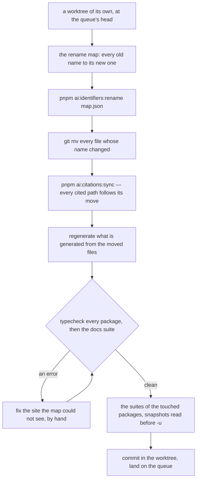

# Renaming Across the Repository

Read when a rename reaches more than a handful of files — a naming convention changing, a table or type renamed everywhere, a folder of files moved — or when planning one.

A rename across hundreds of files is mechanical, and the only way it goes wrong is by touching what it should not: a word in a comment, a string, a Vue template's text, an object key that only shares the spelling, or another session's edit in the same file. So it runs as a pipeline whose every step is a tool, in a tree of its own, and it is finished by the checks rather than by reading.

- **A worktree of its own.** The checkout is shared with other sessions, and a rename touches files they may be editing; a worktree at the queue's head gives the rename a tree nobody else writes to, and its commit lands on the queue like any other.
- **The map is written, not discovered.** A JSON file in the scratchpad holding the `RenameMap` (`scripts/src/models/identifiers/rename/RenameMap.ts`): the modules and source directories that own the renamed exports, every old name and its new one — derived by the convention the rename carries out rather than chosen per name — the accessors a name is also read through as a property (`query` for `db.query.users`), and the specifiers of moved files. It is reviewed as data before anything runs.
- **`pnpm ai:identifiers:rename <map>` renames a name only where a file binds it** — imports it from a module the map names, or declares it in one of the map's sources — and only in code, read from TypeScript's syntax tree rather than the text: strings, comments, template literal text and a Vue file's template are skipped, an object key that merely shares the spelling is left alone, a shorthand key keeps its key (`{ name }` becomes `{ name: newName }`), a binding that shadows the name is renamed with its reads, and a spread (`...name`) is still renamed. A name the map cannot see bound (a relation key, a string index into a type) is left for the next step rather than guessed.
- **The type checker is the second pass.** Typecheck every package; each error is a site the map could not see, fixed by hand. A rename is done when every package typechecks and the docs suite passes — never when a grep comes back empty.
- **Prose follows the tools, not a search.** `pnpm ai:citations:sync` rewrites every cited path a `git mv` moved; the docs suite reports a backticked name the tree no longer holds; a bare word in a sentence is only renamed where it names code.
- **A database rename is hinted**, never regenerated as a drop and a create: the `drizzle` skill (`references/migrations.md`, "Renames"), and its `references/schemas-and-names.md` for a move between schemas.
