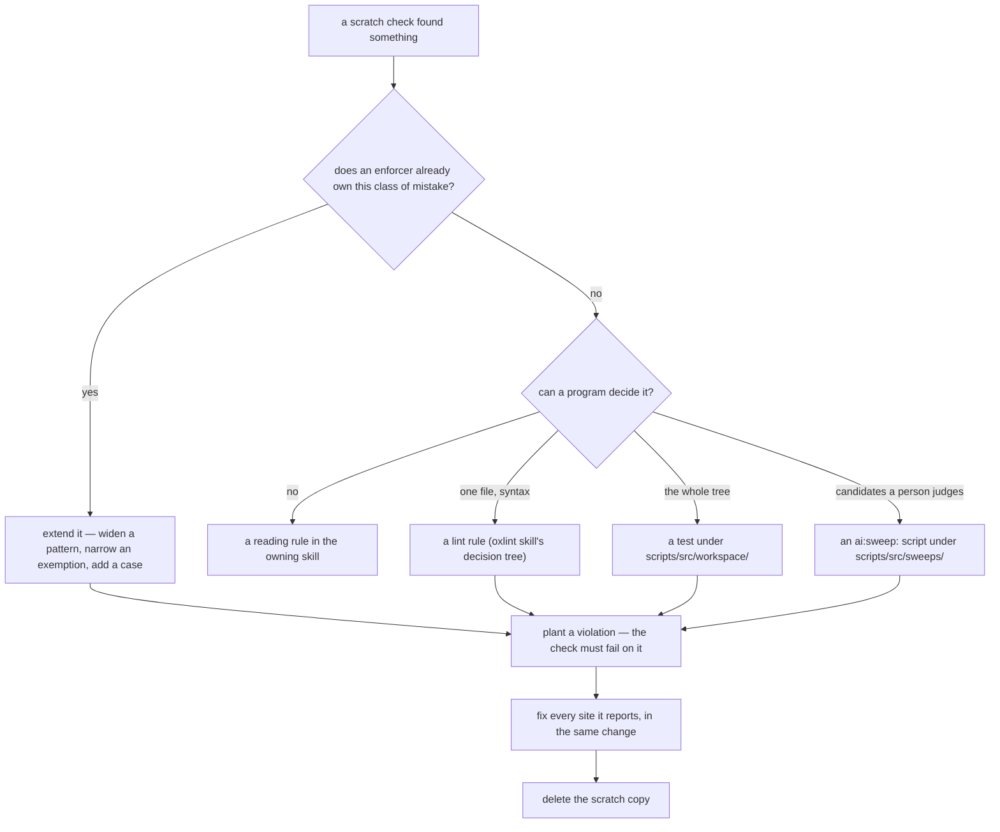

# Scratch Checks

Read when a session writes a throwaway script, grep or probe to check its own work — a duplicate finder, a citation guard, a coverage count — or is about to keep one for next time.

**A check a session had to write is an enforcer the repo is missing.** It exists because nothing in the tree would have failed on what it catches, and a check that lives in a scratchpad dies with the session that wrote it: the next session repeats the mistake with nothing to stop it. So a scratch check that finds something is promoted into the repo in the same change, and the promotion is the moment the enforcer beside it gets simpler rather than a second one appearing next to it.

- **Extend before adding.** Most scratch checks are a case an existing enforcer's exemption or pattern stops short of — the duplicate-prose test exempting every pair inside one skill, the citations test resolving paths but not headings. Widening the existing one keeps one owner per class of mistake; a second enforcer beside it is two definitions of the same failure that drift.
- **Read the enforcer while extending it.** The new case usually makes something in it redundant — a special case the widened pattern now covers, a helper only the old exemption needed — and removing that is part of the promotion, not a follow-up.
- **A test fails; a sweep prints.** A rule that holds everywhere once fixed is a test that fails `pnpm test`. A list of candidates a person has to judge is an `ai:sweep:` script, and it is a test the moment the judgement becomes mechanical.
- **Prove it before trusting it.** A check that cannot fail is not evidence; plant the violation, see the failure, then remove the plant — the same rule a sweep's find recipe follows (the `sweeps` skill, `references/find-recipes.md`).
- **A one-off transformation is not a check.** A script that rewrites files once — a bulk move, a rename — has no lasting question to answer and stays in the scratchpad; what it must not break is what the enforcers above are for.
