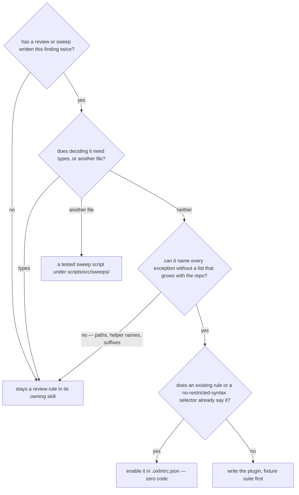

# Authoring a Custom Oxlint JS Plugin

The repo authors its own oxlint rules as **JS plugins** (`jsPlugins` in `.oxlintrc.json`) — for repo-specific conventions no off-the-shelf rule covers. Only viable for **purely syntactic** rules: oxlint JS plugins get no type information, so anything needing the type checker cannot be authored here (see the SKILL's note on why nothing type-aware runs in either linter).

## Settled — do not re-propose

- **A plugin for the file-organization skill's models rule** (an `interface` or `type` outside `models/`). Every one of its exceptions is a roster — path globs for the trees whose files are the type, name suffixes for hook maps and a composable's own options, a directory test for composables — and a roster is the maintenance the tree below rejects. Drafted and dropped 2026-09-12; the rule stays a review and sweep rule.

## What earns a plugin

A plugin's cost is not writing it. It is **what has to change when the repo changes** — a new file, a new helper, a new folder, a renamed function. A rule that stays correct through all of those costs nothing after it lands; a rule that needs an edit to its config or its exemption list to stay correct is a roster, and a roster fails silently the first time nobody makes that edit: the new site is reported as a violation, or worse, exempted by a name that no longer means what it did. So the question is never "can this be decided syntactically" alone — it is whether it can be decided **with no list the repo has to keep in step**.

The gates, in the order the tree asks them:

- **Twice, not once.** One instance is a fix. The same class found in two consecutive units is the `sweeps` skill's signal that the convention cannot survive on being remembered, and it is the only thing that opens this tree.
- **Types or a second file end it here.** A plugin sees one file's syntax and nothing else. A whole-repo question (consumer counts, constant scope, a helper that exists twice) is a tested script under `scripts/src/sweeps/` run as `pnpm ai:sweep:<scan>`; a question about a value's type is a review catch, and the SKILL says why no type-aware rule comes back.
- **The roster gate is the one that fails.** The only lists a plugin may carry are ones the repo cannot outgrow: the **construct's own domain** as a scope (`**/*.vue` for a props rule, `apps/web/server/**` for an emitter rule — stated in the plugin header, never a path list chosen for how much of it is clean), the **mechanism's own definition sites** (the two files that _are_ the alert route, the guards that construct the error), and a **library's vocabulary** (`Promise.all`, the neverthrow primitives). A list of the repo's own helper names, a suffix convention, or a folder test is a roster: it is right on the day it lands and wrong the first time a helper is added without it. A convention whose exceptions can only be stated that way is a judgement rule and stays with review.
- **Stock before custom.** `no-restricted-syntax`, `no-restricted-imports`, `no-restricted-globals` and `no-restricted-properties` each take a selector or a name and a message, and the ESLint config's `restrictedSyntaxes.js` already holds a dozen. A ban an AST selector can spell is configuration, and configuration needs no fixture suite, no re-verification after an `oxlint` bump and no header.

A plugin that passes every gate is still re-read against them when its scope is next touched: an exemption added to make a new site pass is the roster gate failing after the fact, and the answer is the same as it would have been on day one.

## Writing one

- Plugins are **TypeScript** files under `scripts/src/oxlint/` (one rule-set per file), so the root `tsc` typecheck covers them and oxlint loads them directly via Node type-stripping. Author them with `@oxlint/plugins`: `definePlugin`/`defineRule` (their sole purpose is inference — visitor handler params like `AwaitExpression(node)` type themselves, so **never annotate them inline**), and the `ESTree` namespace / `Context`/`Plugin` types for standalone helpers. There is no node-type enum — `node.type === "CallExpression"` literals are the discriminants, checked against `ESTree` so a typo won't compile. `@oxlint/plugins` and `oxlint` are catalogued as a caret pair and bumped together by the dependency-updates sweep — the repo tracks latest rather than pinning, so keep the two entries in step there.
- Reference the `.ts` by path in the root `jsPlugins` array; enable the rule under `rules` (or a scoped `overrides` entry) as `<meta.name>/<rule>`.
- **Every plugin is paired with a fixture suite that drives the real binary** — a rule with no suite is a rule nothing proves still fires. `setupPluginSuite` is the harness that runs one over its fixtures, in a single `beforeAll` pass shared by every fixture in the file. `scripts/src/oxlint/` is the set; each file's header states which convention it enforces, which docs page or skill owns that convention, and which of the three permitted lists its scope is — the construct's domain, the mechanism's sites, or a library's vocabulary.
- **A rule is on for the whole tree unless the construct it reads only exists in part of it**, and the violation list an unscoped run reports is cleared in the change that lands the rule — never scoped to the clean paths as a rollout stage, since nobody comes back to widen it and the rest of the tree reads as covered (the `sweeps` skill). **Scope with `overrides`** only when a rule genuinely applies to part of the tree — e.g. `persistThenNotify.ts` (the `apps/web/content/docs/architecture/persist-then-notify.md` enforcer) is scoped to `apps/web/server/**/*.ts`, because an `EventEmitter.emit` only means "realtime notify" in server mutations; client emitters (the Phaser game bus) are unrelated. `overrides` objects reject unknown keys — no `"//"` comment field; document intent in the plugin file's header instead.
- The plugin runs in oxlint's single root pass, so it's fast enough to stay always-on. **The JS plugin API is alpha and not subject to semver** — re-verify every plugin after an `oxlint` bump (plant a violation and confirm it still fires); a contract change silently drops the rule while CI stays green.
- The plugin file is itself linted by the repo's own oxlint+eslint pass (it lives under `scripts/`), so it must satisfy every repo convention — no `void` operator, sorted `Set`s (`perfectionist/sort-sets`), capitalized comments, comments on their own line.
- Verify a new plugin empirically before wiring it in: run it over the whole repo to measure false positives, and plant a violation in a matching path to confirm it actually fires under the real config (a mis-scoped `files` glob or wrong rule name fails silently to zero hits). A scan config placed outside the repo resolves its `overrides` globs and `ignorePatterns` against its own directory, so it reports every file as unscoped — write the scratch config at the repo root and delete it after.
