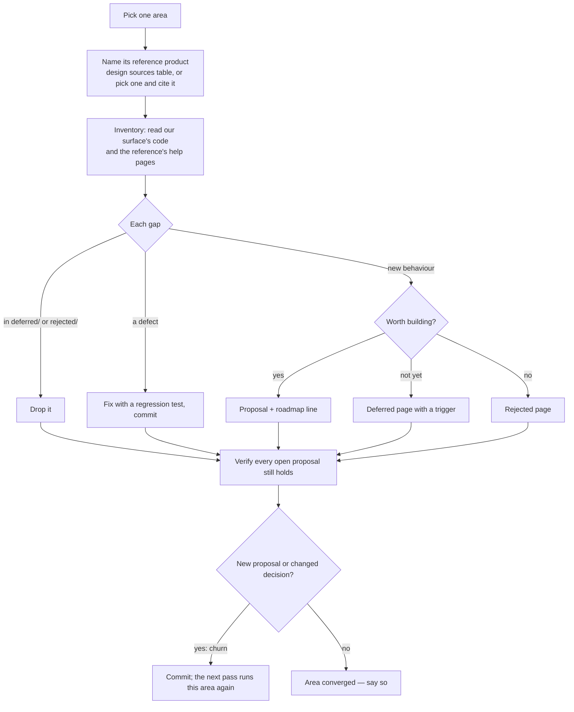

# Product Review

The repeatable pass that turns "what is missing from our products" into proposals, fixes and decisions, run the same way every time so its output can be compared with the last run's. The design philosophy it serves is a finished product: **each pass should find less than the one before, and an area whose pass finds nothing is done.** Churn — a new proposal, a reversed decision — is the measure of how far an area still is from that.

What a proposal, a deferred page and a rejected page look like, and the rule that ideation runs in the main session one area at a time, are the `docs` skill's (`references/area-passes.md`, `references/page-shapes.md`); this skill is the loop that feeds them.

## Settled — do not re-propose

- **Re-arguing a decided idea.** A gap the area's `deferred/` or `rejected/` already holds is dropped, not rewritten — the page's revisit trigger is the only thing that reopens it. A pass that re-proposes a rejected idea is churn the loop created itself.
- **A proposal from memory of how a product works.** The reference product's own help or docs page is opened in the pass and cited in the proposal's `## Sources`; a feature remembered but not read is not written down.
- **Proposing a bug.** A defect found while reading — a schema that rejects what the editor saves, a field the save strips — is fixed in the pass with its regression test, in its own commit. A proposal is for behaviour that does not exist yet.
- **Taking the reference product whole.** A pass takes the lean core of the reference product that makes sense for a single-owner resource, and writes each larger feature it leaves out (smart lists, sharing, AI) as a deferred or rejected page, so the next pass does not find it again as a gap.
- **Fanning the pass out to agents.** Triage needs every idea of an area in one head (`docs`, `references/area-passes.md`), and a delegated read costs more than it saves (`model-delegation`). Research lookups may be delegated; the pass may not.
- **A hand-kept list of which areas were reviewed and when.** Each pass's commit subject names the area and its result, so `git log --grep "product-review"` is the record.

## The loop

## Rules

- **One area per pass, to completion** — every gap in it triaged before the next area starts; the order areas are taken in is the user's, else the one with the thinnest roadmap against the richest reference product.
- **Every area has a reference product**, and a surface is judged against it before it is judged against taste; the table of them is `apps/web/content/docs/architecture/design-sources.md`, and a pick not yet in it travels in the proposal's `## Sources` until the surface ships (`references/reference-products.md`).
- **Inventory from the code, not the docs** — the store, the content schema and the components say what exists; a feature page can be stale (`references/gap-inventory.md`).
- **Every open proposal is re-verified each pass** — still unbuilt, still consistent with the code, sources still resolving (`references/verifying-proposals.md`).
- **A proposal built in the same session** follows the ship lifecycle at once: rewritten as the as-built page, the proposal and its roadmap line deleted (`docs`).
- **The pass reports its churn**: proposals added, decisions changed, bugs fixed, and — when all three are zero — that the area converged (`references/convergence.md`).
- **Starting a pass** uses the prompt in `references/prompts.md`, so every run asks the same questions.

## Reference pages

- `references/reference-products.md` — when an area has no reference product yet, or two products compete for the role.
- `references/gap-inventory.md` — when reading a surface to list what it is missing: what to read, and the questions each surface is asked.
- `references/verifying-proposals.md` — when double-checking the open proposals of an area.
- `references/convergence.md` — when deciding whether an area is done, or whether a change counts as churn.
- `references/prompts.md` — when the user asks to run, rerun or resume a product review.
