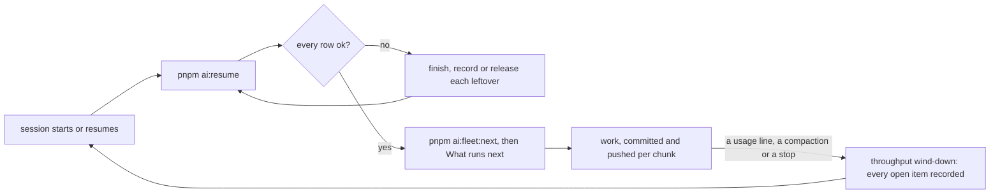

# Resuming — In Sync Before Anything New

A session that ends mid-change — a compaction, a usage lockout, a dead agent, a machine switch — leaves its work in four places: the tree, the queue, the fleet's claims and the processes it started. The next session starts from those, never from memory. The handoffs it reads are the ones the throughput skill's wind-down writes, so the two halves meet: the wind-down records every open item where a resume finds it, and the resume reads it there rather than re-deriving it.

## Settled — do not re-propose

- **New work over leftovers.** A unit started on a dirty tree builds on a half-change no record describes, and the leftover's author context is gone for good once a second change lands on top of it.
- **Discarding an uncommitted change because its author is gone** (`git checkout --`, `git clean`, a hard reset). An uncommitted path is someone's work until its handoff says otherwise, so it is finished or recorded, never thrown away. The one exception is below.
- **Re-deriving a leftover from scratch.** Its handoff already holds the paths, the calls made and the next step. Reading it costs one file, while re-deriving it costs the original session's whole investigation.
- **Waiting on the other machine before syncing this one.** Each machine resumes itself. `ai/queue` and the claims are the state the machines share, and a peer that never answers is covered by the stale-claim takeover.

## The cycle

## Rules

- **`pnpm ai:resume` runs first**, before the backlog is read. It prints one row per check (tree, queue, worktrees, claims, holds, plugins, collector), each `ok` or the leftovers with their action, and exits non-zero while any row needs one. A clean report is the gate to `pnpm ai:fleet:next` and to the engineering-loops page's "What runs next" (`apps/web/content/docs/architecture/engineering-loops.md`).
- **Rows are worked in the order printed.** A missing plugin is installed first, since its mods (the usage reserve, the collision guard) load only in a session started after the install. A dead hold or a worktree is cleared before the tree, so nothing still running holds a path being judged.
- **An uncommitted path is read before it is judged.** Its handoff is, in order:
  - the item that names it on its area's roadmap or proposal page;
  - the follow-ups;
  - a fleet miss;
  - the interrupted agent's transcript, read only for its first prompt and its last assistant texts, never whole: `~/.claude/projects/<project>/<session>/subagents/agent-*.jsonl`.

  A path whose next step is written down and within reach is finished, reviewed and committed like any change. Otherwise its record is completed with what is done and what is next, and it is left for the unit that owns it.

- **`pnpm-lock.yaml` changed only in resolved versions, after a local install, is local drift and is never committed.** The forcing agents are the workspace's `autoDedupe` and pnpm's `verifyDepsBeforeRun`. After a frozen install, the next `pnpm run` refuses until a plain install runs, and that install re-resolves the nightly ranges. A lockfile change that follows a manifest change is a real one, and goes out with that change.
- **A stale claim of this machine's is resumed from its handoff or released.** Hold it again and carry on when the roadmap item says what is next. Otherwise release it with `--miss` naming what is left. A live claim whose hold died is held again or released, never left to go stale.
- **The other machine gets one message, never a wait.** A peer `ListAgents` can reach is told this machine's state and asked to run its own resume. An unreachable one (Remote Control drops on `/login`) is left to its claims, which `pnpm ai:fleet:status` shows. The game data and the peer's exports still travel only as the throughput skill's `references/fleet.md` allows.
- **A collector idle on the usage limit needs nothing.** A run that logs `Idle: the session is limited until …` resumes by itself at that time. A red run or held commits are the first item of "What runs next" (the `review-queue` skill).
- **The report is re-run until it is clean**, and the session says what it finished, recorded and released before it takes anything new.
