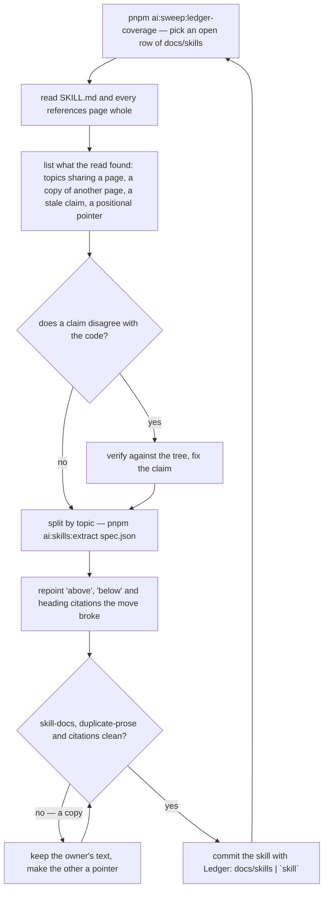

# The Skill Pass

Read when cleaning up a skill — or the whole tree — so every page holds one topic its owner states once, and when a pass is about to carry a skill's `Ledger:` trailer. The rules a pass applies are the rest of this skill; this page is the order they run in and the commands that do each step.

## Read before you move

A pass reads the skill **whole** before it edits anything — `SKILL.md` and every page under `references/`. The split is decided from what the topics are, and the findings that matter most come from the pages rather than the index: a claim the code no longer bears out, two pages stating one rule, a page pointing at a heading that moved. A pass that only restructured `SKILL.md` carries no trailer (`references/skill-coverage.md`).

## Split with the command, never by hand

`pnpm ai:skills:extract <spec.json>` moves each block verbatim — a section with its subsections, or one bullet with its continuation — onto its page, leaves the `keep` line in its place, opens a new page on its title and its `Read when…` line, and indexes it under the spec's `indexHeading`. Retyping a block costs output and invites a paraphrase; the command copies it. The spec is JSON in the scratchpad (`ExtractSpec` in `scripts/src/models/skills/extract/`); a move with `isDropped` deletes a copy instead of moving it, and a move naming a page that exists appends under its `subheading`.

- **Check a page before appending to it.** A block moved onto a page that already states it is a copy inside one page; read the target first and drop what it already says.
- **A section takes its subsections with it.** A `###` pointer under a moved `##` goes too, so a subsection that should stay in `SKILL.md` is moved out before its parent, or restored as an index line after.
- **A block spanning a blank line or a fence is not a bullet to the command.** Cut it as a section, or edit it by hand.

## What the move breaks, and what finds it

- **A positional pointer** — "see below", "the rule above", a bare `("Heading")`, "step 3" — now names nothing. Grep the moved text for them and rewrite each as a page citation; nothing else sees them.
- **A citation of a heading from another skill** fails `scripts/src/workspace/citations.test.ts`. Repoint it at the page.
- **A copy between two pages** fails `scripts/src/workspace/duplicateProse.test.ts`; `pnpm ai:sweep:duplicate-prose` prints it. Two pages of one skill are two owners — only a skill's `SKILL.md` and its own pages share text by design — and a page opener echoing another page's opener is a copy too.
- **An unindexed or triggerless page** is `pnpm ai:sweep:skill-docs`.

## The commands

| Step                               | Command                                                        |
| ---------------------------------- | -------------------------------------------------------------- |
| What is open                       | `pnpm ai:sweep:ledger-coverage`                                |
| Move blocks onto pages             | `pnpm ai:skills:extract <spec.json>`                           |
| Structure: budget, index, triggers | `pnpm ai:sweep:skill-docs`                                     |
| Copies between pages               | `pnpm ai:sweep:duplicate-prose`                                |
| Paths, skills and headings cited   | `pnpm test src/workspace/citations.test.ts --run` (`scripts`)  |
| Names cited in prose               | `pnpm test src/workspace/staleNames.test.ts --run` (`scripts`) |
