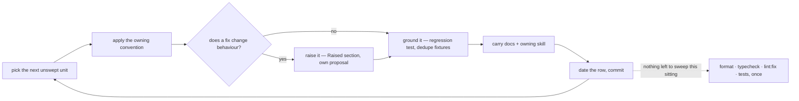
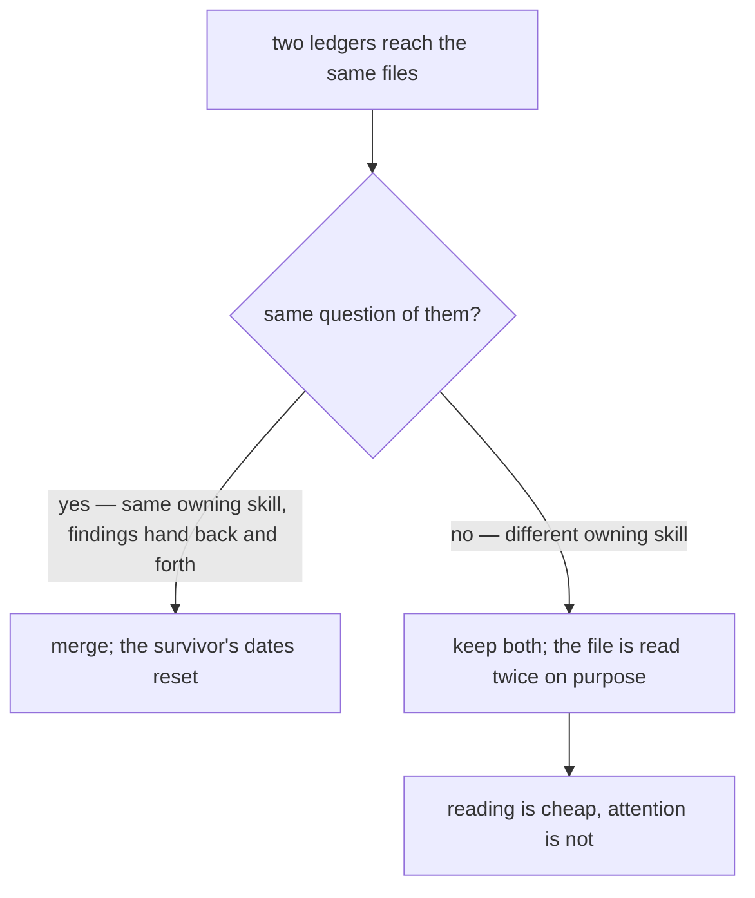

# Sweeps

A **sweep** carries one already-settled convention across a tree too large to finish in one commit. It decides nothing: the convention is owned by a skill or docs page, and the sweep only applies it to code that predates it, changing no behaviour.

Each sweep's progress is a **ledger**: one file in `.agents/ledgers/`, one row in its `README.md` index. A ledger that outgrows a screen, or that two agents want to work at once, becomes a folder of one file per area — the index row still carries the metadata, so the folder holds nothing but coverage. It grows the way source does: split when a unit earns its own home, never to hit a number.

**A sweep is never a proposal.** A proposal designs behaviour that does not exist yet and is deleted when it ships; a sweep changes no behaviour at all. Filing one under `packages/app/content/docs/proposals/` mislabels maintenance as design and puts a never-ending standing sweep in a folder whose contents are all supposed to leave.

## Does it earn a file?

- **More than one sitting or one commit → its own file.** Anything smaller is just the change; a sweep file for it is overhead that then rots.
- **One question per file.** A convention another ledger already asks joins that ledger (see below); one that asks something different opens its own, however far its files overlap. What never merges is two conventions with different **units**, because a coverage table can only be dated against one of them.

- **A unit is what one pass can read.** Reading is what finds duplication and the helper that already exists; a unit too big to read gets grepped instead, and a grep pass that ticks its row records a sweep that never happened. When a pass reaches for grep because the unit is too large, split the row at the directory boundary rather than carrying on — dated rows keep their dates, the rest become several `—` rows.
- **A migration is not a sweep.** Work gated on an external trigger (upstream shipping a feature) is tracked by its blocker table in its own docs page, not by coverage.

## One pass



- **Behaviour-preserving only.** A finding whose fix would change behaviour is raised, never folded in — the pass has to stay revertible as a unit.
- **One unit per commit**, so a pass that turns out wrong reverts cleanly, and the commit message names the unit.
- **Chunked for review** — a unit that would exceed the PR file budget is split at a directory boundary and gets its own coverage line (`coderabbit` skill for the budget).
- **Tests are part of the pass**, not a follow-up: anything the pass exposes gets the regression test it was missing, and repeated fixtures collapse (`testing` skill). A pass that only rewrote what typecheck already proves adds none — that is a result, not a gap.
- **Verification batches once at the end of everything going out**, not per unit and not per file — several units swept in one sitting are one pass, not one each (`context-efficiency`, `package-scripts`). Commits stay per unit regardless; commits are cheap and checks are not.
- **Skipped findings, with the reason, go in the commit message.** The sweep file tracks coverage, not decisions.

## What a ledger holds — and nothing else

**A ledger is progress state, not a document.** Every explanatory line in one is a line the skills and docs already own, paid for twice and drifting from the moment it is written. What earns a place is only what exists nowhere else:

- **The index row** (`.agents/ledgers/README.md`) — mode, rules owner, unit, state. This is the sweep's whole metadata; there is no second metadata block below it.
- **Coverage** — a table, one row per unit, ordered by expected payoff: `| Unit | Swept | Notes |`. `Swept` is the date the pass landed and `—` while it is open, so the row carries when as well as whether; `Notes` scopes the unit or names what the pass produced (a rule written into a skill, an invariant pinned by a test), never explains the convention. A checkbox is one bit and cannot say either.
- **The find recipe** — the greps or commands specific to this convention, as bare patterns. Only where no skill states them.
- **Exclusions** — units deliberately out of scope, one clause of reason, so the next pass does not re-litigate them.
- **Next enforceable** — the part of the convention a lint rule or test could take over.
- **Open findings** — only while one is genuinely open. A closed finding is deleted: its rule is in a skill, its invariant is in a test, and git holds the argument.

**"The current shape is already right" closes a finding — by documenting it, never by leaving it.** A finding that survives several passes is usually not unresolved; it is resolved and unrecorded. Someone keeps rediscovering the same duplication or asymmetry, reasoning about it, concluding the existing shape is correct, and writing that conclusion nowhere — so the ledger keeps it open and the next pass pays for the reasoning again. Three outcomes, and a finding must reach one of them:

| Verdict                            | Where it goes                                                                                                      |
| ---------------------------------- | ------------------------------------------------------------------------------------------------------------------ |
| The code is wrong                  | Fix it; delete the finding                                                                                         |
| The code is right                  | Write the **why** into the owning docs page or skill (a diagram if it is an ordered mechanism); delete the finding |
| Genuinely undecided — needs a call | Stays, with the decision named and the options stated                                                              |

Deleting a "code is right" finding without recording the rationale is the same failure as deleting a docs tombstone: the reasoning dies and the finding gets re-raised. The ledger holds coverage, so the rationale never stays there — it moves to whatever owns the topic.

Anything else — what the convention says, why it matters, how a pass is run — belongs to the owning skill and is not repeated here.

**State lives at the leaf.** The index row never restates how far a sweep has got: no tick counts, no per-area status column. A rolled-up number is a second copy of the truth that drifts, and it turns every pass into a write to a file other passes are also writing.

**Read the leaf, not the tree.** A pass loads `.agents/ledgers/README.md` and the one file it is sweeping.

**Run the pass in the main session, one unit at a time.** A sweep reads a whole tree to change a fraction of it,
and delegation is priced by files read rather than files changed — fanning units out to agents costs a large
multiple of sweeping them here, and an agent that exhausts its budget mid-unit leaves a tree that cannot be
ticked (`model-delegation`, "A reading pass is not delegable work"). It also throws away the pass's own learning:
a carve-out the rule failed to state is found once in a sequential pass and applied to every unit after it, where
parallel agents each re-derive it or miss it. If a sweep is ever delegated anyway, it is still **one agent per
leaf** — two inside one file trample each other. Adding, promoting or retiring a ledger is the only edit to the
index row.

## Every sweep is standing

There is no one-shot mode. A convention applies to the code written **after** the sweep as much as to the code
written before it, so a ledger that could be finished would only be re-opened by the next feature — and a mode
column whose every row says the same thing is noise. A unit's row carries a date rather than an end: it means
the rules held there on that date, nothing more.

A pass resumes from what changed since that date rather than re-reading the unit:

```bash
git log --since=<Last swept date> --name-only --pretty=format: -- <the globs this sweep declares> | sort -u
```

Everything outside that list was swept at the last pass — skip it rather than re-reading it.

A `—` in `Swept` is unswept, and **a fully dated ledger is kept, not deleted**: it is the index that answers
"was this area swept, and when" in one read, which git can only answer by archaeology from someone who already
knows what to look for. Those dates are also what the next convention change is scoped against. Add a coverage
line rather than widening an existing one when a unit turns out too big, and split it into its own file when the
lines stop fitting.

**A new convention joins the ledger that already asks its question** — the one whose owning skill now states it —
and adding it resets that ledger's dates, because a unit swept against a narrower rule set is not swept against
the current one and there is no partially-swept state. Sharing a file set with an existing ledger is not what
decides this; the next section is.

## A ledger is keyed by its question, never by its address

Two ledgers reading the same files is **not** duplication on its own. `browser-boundary`, `ux` and
`vue-components` all read `app/components`, and they are three sweeps because they ask three questions of it.
They merge only when the question is the same: `quality/skills` folded into `docs` because both read
`.agents/skills` against `skill-authoring`, and each pass was handing the other its findings.



The reason is the same one the `code-review` skill states about its own finders: a pass carrying one question
finds what a pass carrying twenty skims past. Passes differ by **question**, not by **address** — so widening a
ledger's rule set to cover more of a file is how a sweep quietly becomes a skim, and an area-keyed "cleanup"
ledger is that mistake at its widest. When a rule set has no ledger, the answer is a new ledger, not a wider row
on an existing one.

Its corollary bounds the count: a ledger is worth opening only for a convention **no enforcer already decides**.
A rule that oxlint or typecheck checks needs no coverage table — it fails on the line that breaks it — so the ledgers
that earn their file are the read-only-detectable ones: a helper that already exists, a name that means the wrong
thing, a guard held on one path and not its sibling.

## Draining beats scheduling

A ledger that only moves when someone sits down to work it moves at the rate someone sits down to work it, which is rarely. It does not have to: ordinary changes already land inside unswept units every day, and that contact is free coverage nobody is collecting.

**A change that edits a file inside an unswept unit sweeps that file first.** The sweep pass goes in its own commit, ahead of the behaviour change, and the behaviour change lands on the swept file. Not folded together — a pass loses its whole value as a revertible unit the moment a behaviour change rides inside it, and the reviewer loses the ability to read either one.

Scope it to the files the change touches, not the unit around them; widening it there is how a one-line fix turns into an afternoon and blows the review budget the change was sized for.

**The row stays `—` until the whole unit is swept.** There is no partially-swept state, and inventing one — a fraction, a file list, a third symbol — puts progress state at file granularity in a table that exists to track units, where it drifts the moment anyone touches those files again. The opportunistic pass shortens the eventual unit pass; it never reports it.

This is what keeps a standing ledger moving. The scheduled pass stops being the only thing that drains it and becomes the sweep-up for whatever ordinary work never happened to reach.

## Shrinking beats re-running

A sweep that is only ever re-run is a treadmill, and the repo already has the better answer for a rule that must hold forever: an enforcer. Each pass asks which part of the convention a custom oxlint plugin, a `no-restricted-syntax` selector or a test could decide, hands that part over, and records what is enforceable next — the sweep's scope then shrinks permanently instead of the same files being re-read every quarter. A standing sweep whose whole scope becomes enforceable is deleted, not maintained.

**The second time a pass writes the same finding, it stops writing findings and writes the enforcer.** One instance is a fix; the same class found twice is evidence the convention cannot survive on being remembered, and a third note costs more than the rule that would have ended it. Where nothing can decide it mechanically, the rule goes to the owning skill in that same pass — never to the ledger, which holds coverage and not conventions.
