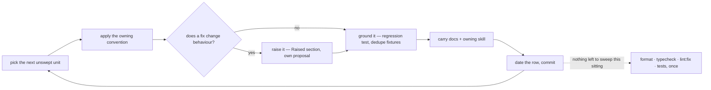

# Sweeps

A **sweep** carries one already-settled convention across a tree too large to finish in one commit. It decides nothing: the convention is owned by a skill or docs page, and the sweep only applies it to code that predates it, changing no behaviour.

Each sweep's progress is a **ledger**: one file in `.agents/ledgers/`, one row in its `README.md` index. A ledger that outgrows a screen, or that two agents want to work at once, becomes a folder of one file per area — the index row still carries the metadata, each area file is a coverage table and nothing else, and everything else the ledger holds moves to the folder's own `README.md` (`references/ledger-files.md`). It grows the way source does: split when a unit earns its own home, never to hit a number.

**A ledger is named after the skill that owns its rules**, where one skill does — `pinia`, `naming`, `trpc`, `testing`. A second name for the same subject makes the ledger and the skill read as two topics, and the index row is where the pairing is stated. A ledger several skills own takes the name of the question instead (`schemas`, `styling`). Areas inside a promoted folder reuse the area names another ledger already established, so "was this area swept, for which question, and when" reads off one set of names.

**A sweep is never a proposal.** A proposal designs behaviour that does not exist yet and is deleted when it ships; a sweep changes no behaviour at all. Filing one under `packages/app/content/docs/proposals/` mislabels maintenance as design and puts a never-ending standing sweep in a folder whose contents are all supposed to leave.

## Settled — do not re-propose

- **Filing a sweep under `packages/app/content/docs/proposals/`.** A proposal designs behaviour that does not exist yet and leaves when it ships; a sweep changes no behaviour and never ends. A ledger is repo state, and lives in `.agents/ledgers/`.
- **A progress column, percentage or tick count on the index row.** A rolled-up number is a second copy of the truth that drifts, and it turns every pass into a write to the one file every other pass is also writing. State lives at the leaf ("One pass").
- **Fanning the units of one sweep out to parallel agents.** A sweep reads a whole tree to change a fraction of it, and delegation is priced by files read rather than files changed; a parallel pass also throws away the carve-out that the first unit teaches every unit after it. Main session, one unit at a time ("One pass").
- **Inheriting a split row's date onto the children.** The parent was split because it could never have been read, so carrying its date down records the skim as coverage. Children reopen at `—` (`references/ledger-files.md`).

## A scan that reports nothing

A find recipe that comes back empty is the same shape as a clean tree, so a broken scan reads as a finished
sweep. Two ways it has actually happened here, both silent:

- **`new RegExp` built from a template literal inside `node -e '...'`.** Single quotes hand the backslash to
  Node intact — the **template literal** is the layer that eats it, so a `\b` written for a word boundary reaches
  `new RegExp` as a **backspace character** and the regex matches nothing. It survives a glance because
  `JSON.stringify` renders a real backspace as `\b` as well, so printing `regex.source` looks right. Use a regex
  **literal** (`/\bfoo\b/u`), `String.raw`, or a plain `.includes` — a literal is unaffected, `/getResult\(/u`
  still means an escaped paren. A quoted heredoc (`<<'PY'`, `<<'JS'`) keeps the shell out of it entirely, which
  is why the longer recipes use one; it removes no JavaScript layer, so the same three fixes still apply inside.
- **A filter on the wrong field.** An author login that differs between two APIs, a path prefix that never
  matches, a `--jq` selector against the wrong payload shape — each returns an empty set and exit 0.

So **prove the scan can fail before believing it passed**: run it against a known violation, or break one on
purpose and confirm it is reported. The rule the `testing` skill applies to a new test applies to a new recipe —
a check that cannot fail is not evidence.

## A scan longer than a grep is a script, not a code block

A find recipe pasted into a ledger is a program with none of a program's guarantees: nothing typechecks it,
nothing lints or formats it, and nothing runs it, so it rots in place and the rot is silent — an unrunnable scan
reports nothing, which is the shape of a swept tree. Two of this repo's ledgers carried `python3` blocks that on
a Windows checkout print a Microsoft Store notice and **exit 0**.

So the line is what the recipe is, not how long it is:

- **A grep stays inline.** One command whose whole logic is its pattern is read at a glance, and it fails loudly
  when it fails at all. The ledger is the right home for it.
- **Anything with control flow moves to `scripts/sweeps/<scanName>/`**, beside the other root scripts — a bracket
  matcher, a tokenizer, a two-pass scan over a corpus. It is then typechecked by the root `tsc`, linted by the
  root ESLint and oxlint, formatted by `oxfmt`, and run by the `scripts` vitest project, all with no
  configuration: the folder is already in every one of those globs. Wire it as `pnpm sweep:<scan-name>` and let
  the ledger's Find recipe be that one line plus why the scan is not a grep.

**The colocated test is the point, not the packaging.** "Prove the scan can fail before believing it passed" is
this skill's rule and it has no way to stay proved while the scan is a code block — each pass either re-does it
by hand or, in practice, does not. As a script, the planted violation is a test case: the scan reports a
module-scope fixture, skips the multi-line arrow, skips the helper file, reads past the `;` inside a string. The
prose that used to explain each trap in the ledger becomes the test that fails when the trap reopens.

**Not `.agents/`.** The tree is the rules an agent reads, and mixing an executable into it makes "is this a rule
or a tool" unanswerable from the path. It was also tried: an `agents` vitest project over `.agents/**/*.test.ts`
existed for the review workflow's scripts and went out with it, taking a third `projects` entry and its
worktree-glob exclusion with it. `scripts/agentDirectories.test.ts` is the shape that stayed — a test **about**
the agent tree, living where the toolchain already looks.

## Does it earn a file?

- **More than one sitting or one commit → its own file.** Anything smaller is just the change; a sweep file for it is overhead that then rots.
- **One question per file.** A convention another ledger already asks joins that ledger (see below); one that asks something different opens its own, however far its files overlap. What never merges is two conventions with different **units**, because a coverage table can only be dated against one of them.

- **A unit is what one pass can read.** Reading is what finds duplication and the helper that already exists; a unit too big to read gets grepped instead, and a grep pass that ticks its row records a sweep that never happened. When a pass reaches for grep because the unit is too large, split the row at the directory boundary rather than carrying on — the children open at `—`, since a row grepped because it was too large is a row nothing read.
- **Split the row the moment it reads as too high a level, before any pass starts.** Two shapes give it away without counting anything: a unit naming several unrelated trees at once, and a unit that is a whole tree rather than a directory inside one. Both are bags, and a bag is swept by skimming — which is how a fully dated ledger still misses things. Count the files the row actually covers, and split until each row is a sitting.
- **A row that could never have been read loses its date in the split.** Inheriting the parent's date onto children the parent never read carries the skim forward as if it were coverage. The date survives only where the whole unit was small enough that the pass really could have read it; everything else reopens at `—`. Why the split happened goes in its commit message, never into the ledger, which carries no history (`references/ledger-files.md`).
- **A migration is not a sweep.** Work gated on an external trigger (upstream shipping a feature) is tracked by its blocker table in its own docs page, not by coverage.

## One pass



- **Behaviour-preserving only.** A finding whose fix would change behaviour is raised, never folded in — the pass has to stay revertible as a unit.
- **One unit per commit**, so a pass that turns out wrong reverts cleanly, and the commit message names the unit.
- **Chunked for review** — a unit that would exceed the PR file budget is split at a directory boundary and gets its own coverage line (`coderabbit` skill for the budget).
- **Tests are part of the pass**, not a follow-up: anything the pass exposes gets the regression test it was missing, and repeated fixtures collapse (`testing` skill). A pass that only rewrote what typecheck already proves adds none — that is a result, not a gap.
- **Verification batches once at the end of everything going out**, not per unit and not per file — several units swept in one sitting are one pass, not one each (`context-efficiency`, `package-scripts`). Commits stay per unit regardless; commits are cheap and checks are not.
- **Skipped findings, with the reason, go in the commit message.** The sweep file tracks coverage, not decisions — and never what a past pass changed, which git holds in full.

## The ledger file — `references/ledger-files.md`

A ledger holds six things and no explanatory prose, and is keyed by the question it asks rather than by the files it reaches. **Writing, splitting, merging, promoting or retiring one**, or deciding whether a new convention joins an existing ledger, is that page.

## Every sweep is standing

There is no one-shot mode. A convention applies to the code written **after** the sweep as much as to the code
written before it, so a ledger that could be finished would only be re-opened by the next feature — and a mode
column whose every row says the same thing is noise. A unit's row carries a date rather than an end: it means
the rules held there on that date, nothing more.

A pass resumes from what changed since that date rather than re-reading the unit:

```bash
git log --since=<Last swept date> --name-only --pretty=format: -- <the globs this sweep declares> | sort -u
```

Everything outside that list was swept at the last pass — skip it rather than re-reading it.

A `—` in `Swept` is unswept, and **a fully dated ledger is kept, not deleted**: it is the index that answers
"was this area swept, and when" in one read, which git can only answer by archaeology from someone who already
knows what to look for. Those dates are also what the next convention change is scoped against. Add a coverage
line rather than widening an existing one when a unit turns out too big, and split it into its own file when the
lines stop fitting.

**A new convention joins the ledger that already asks its question** — the one whose owning skill now states it —
and adding it resets that ledger's dates, because a unit swept against a narrower rule set is not swept against
the current one and there is no partially-swept state. Sharing a file set with an existing ledger is not what
decides this; the next section is.

## Draining beats scheduling

A ledger that only moves when someone sits down to work it moves at the rate someone sits down to work it, which is rarely. It does not have to: ordinary changes already land inside unswept units every day, and that contact is free coverage nobody is collecting.

**A change that edits a file inside an unswept unit sweeps that file first.** The sweep pass goes in its own commit, ahead of the behaviour change, and the behaviour change lands on the swept file. Not folded together — a pass loses its whole value as a revertible unit the moment a behaviour change rides inside it, and the reviewer loses the ability to read either one.

Scope it to the files the change touches, not the unit around them; widening it there is how a one-line fix turns into an afternoon and blows the review budget the change was sized for.

**The row stays `—` until the whole unit is swept.** There is no partially-swept state, and inventing one — a fraction, a file list, a third symbol — puts progress state at file granularity in a table that exists to track units, where it drifts the moment anyone touches those files again. The opportunistic pass shortens the eventual unit pass; it never reports it.

This is what keeps a standing ledger moving. The scheduled pass stops being the only thing that drains it and becomes the sweep-up for whatever ordinary work never happened to reach.

## A finding the owning skill does not cover

The convention a sweep carries is written down somewhere, and a pass reads code the writer of that rule never
saw. So the rule is **evidence, not authority**: a unit that will not fit it is as likely to have found a gap as
to be a violation, and the pass that shrugs and applies the rule anyway propagates the gap across a tree.

Three shapes, all found by applying a rule and watching it produce something nobody would defend:

- **The rule is silent.** It names the cases its author had, and a pass that applies it past them produces
  something nobody would defend — lowering the first letter of a SCREAMING_SNAKE export gives
  `nON_SOURCE_SUFFIXES`. The carve-out goes in beside the rule, with the reason, so the next pass does not
  re-derive it. **Check for an enforcer before writing one**: that name came from `vitest/prefer-lowercase-title`
  rejecting the verbatim one, so the carve-out this pass first reached for — keep the name as it is — was itself
  wrong, and lint said so. What the rule was missing was the whole camelCase, not an exemption.
- **The rule is true but incomplete in the direction that bites.** "`vi.stubEnv` needs no teardown" is correct
  and hides that the same auto-restore makes it useless for a `beforeAll` override. A rule that is right for the
  common case and silently wrong for the neighbouring one is worse than no rule, because it is obeyed.
- **The rule sits in the wrong skill, or in only one of the two it spans.** One owner per topic
  (`skill-authoring`), so the fix is to state it once where its subject lives and **link** from the other — never
  to restate it, and never to leave the second skill silent because the first happens to say it. A pass that
  reaches a rule by following a link from another skill has found the seam where a rule goes missing: check that
  the link runs both ways before moving on.

**The skill edit lands in the same commit as the code it came from.** Not a follow-up, not a note in the ledger —
the ledger holds coverage and never conventions, and a deferred skill edit is one nobody makes. The commit
message says which rule moved and why; that is the record, and git holds it.

Verify before obeying, in both directions: a rule that turns out to be wrong about the repo is fixed rather than
followed, and a scan the rule tells you to run is proved able to fail before its clean result is believed ("A scan
that reports nothing"). The recipe in `.agents/ledgers/testing/README.md` was written against `python3`, which on
a Windows checkout exits 0 having run nothing — the ledger meant to enforce the rule was the thing quietly
exempt from it.

## Shrinking beats re-running

A sweep that is only ever re-run is a treadmill, and the repo already has the better answer for a rule that must hold forever: an enforcer. Each pass asks which part of the convention a custom oxlint plugin, a `no-restricted-syntax` selector or a test could decide, hands that part over, and records what is enforceable next — the sweep's scope then shrinks permanently instead of the same files being re-read every quarter. A standing sweep whose whole scope becomes enforceable is deleted, not maintained.

**A rule handed over lands as a ratchet: on for the swept paths only, then widened to the whole tree once the sites it finds there are cleared.** Switching it on over unswept territory buys disables rather than coverage, and a disable outlives whoever added it.

**The second time a pass writes the same finding, it stops writing findings and writes the enforcer.** One instance is a fix; the same class found twice is evidence the convention cannot survive on being remembered, and a third note costs more than the rule that would have ended it. Where nothing can decide it mechanically, the rule goes to the owning skill in that same pass — never to the ledger, which holds coverage and not conventions. It is written there as the invariant plus whatever enforces it, never as the roster the pass has just finished reading: a swept set is the state a ledger tracks, and in a skill it is a snapshot the next file invalidates (`skill-authoring`).
