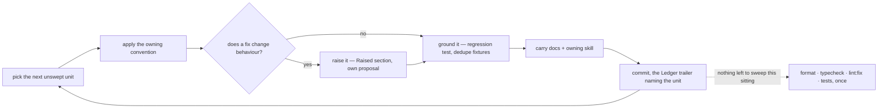

# Sweeps

A **sweep** carries one already-settled convention across a tree too large to finish in one commit. It decides nothing: the convention is owned by a skill or docs page, and the sweep only applies it to code that predates it, changing no behaviour.

Each sweep's progress is a **ledger**: one file in `.agents/ledgers/`, one row in its `README.md` index. A ledger that outgrows a screen, or that two agents want to work at once, becomes a folder of one file per area — the index row still carries the metadata, each area file is a coverage table and nothing else, and everything else the ledger holds moves to the folder's own `README.md` (`references/ledger-files.md`). It grows the way source does: split when a unit earns its own home, never to hit a number.

**A ledger is named after the skill that owns its rules**, where one skill does — `pinia`, `naming`, `trpc`, `testing`. A second name for the same subject makes the ledger and the skill read as two topics, and the index row is where the pairing is stated. A ledger several skills own takes the name of the question instead (`schemas`, `styling`). Areas inside a promoted folder reuse the area names another ledger already established, so "was this area swept, for which question, and when" reads off one set of names.

**A sweep is never a proposal.** A proposal designs behaviour that does not exist yet and is deleted when it ships; a sweep changes no behaviour at all. Filing one under `apps/web/content/docs/proposals/` mislabels maintenance as design and puts a never-ending standing sweep in a folder whose contents are all supposed to leave.

## Settled — do not re-propose

- **Filing a sweep under `apps/web/content/docs/proposals/`.** A proposal designs behaviour that does not exist yet and leaves when it ships; a sweep changes no behaviour and never ends. A ledger is repo state, and lives in `.agents/ledgers/`.
- **A progress column, percentage or tick count on the index row.** A rolled-up number is a second copy of the truth that drifts, and it turns every pass into a write to the one file every other pass is also writing. State lives at the leaf ("One pass").
- **Fanning the units of one sweep out to parallel agents.** A sweep reads a whole tree to change a fraction of it, and delegation is priced by files read rather than files changed; a parallel pass also throws away the carve-out that the first unit teaches every unit after it. Main session, one unit at a time ("One pass").
- **Dating the `Swept` cell by hand in the sweep commit.** It is a second file in every sweep commit, the one every other pass is also writing, and it is the part a pass forgets; the commit's trailer dates the row and `pnpm ai:sweep:ledger-coverage` writes it in ("One pass").
- **Inheriting a split row's date onto the children.** The parent was split because it could never have been read, so carrying its date down records the skim as coverage. Children reopen at `—` (`references/ledger-files.md`).

## A scan that reports nothing

A find recipe that comes back empty is the same shape as a clean tree, so a broken scan reads as a finished
sweep. Both ways it has happened here were silent, and they are `references/find-recipes.md` with the three
fixes for the first.

So **prove the scan can fail before believing it passed**: run it against a known violation, or break one on
purpose and confirm it is reported. The rule the `testing` skill applies to a new test applies to a new recipe —
a check that cannot fail is not evidence.

## The find recipe — `references/find-recipes.md`

A grep stays inline in the ledger; anything with control flow is a script under `scripts/src/sweeps/` run as `pnpm ai:sweep:<scan>` (the rule is the `skill-authoring` skill's), where a colocated test keeps "prove the scan can fail" proved. **Writing one, or moving one out of a code block**, is that page.

## One pass

- **Behaviour-preserving only.** A finding whose fix would change behaviour is raised, never folded in — the pass has to stay revertible as a unit.
- **One unit per commit**, so a pass that turns out wrong reverts cleanly, and the commit's trailer names the unit — `Ledger: <ledger> | <unit>`, the unit cell verbatim (`` Ledger: typescript/messaging | `app/store/message/room` ``) — which is what dates the row: `pnpm ai:sweep:ledger-coverage` writes the trailers' dates into the ledger files at the start and end of a sitting and reports a trailer naming no row. A rule change that invalidates coverage carries `Reopens: <ledger>` instead (`references/ledger-files.md`, "Coverage"). **A unit the pass reads and leaves unchanged has no commit of its own**, so its trailer rides the sitting's next commit — the next unit's, or the ledger commit at the end — never an empty commit, which the porter cannot cherry-pick and drops from every window.
- **Chunked for review** — a unit that would exceed the PR file budget is split at a directory boundary and gets its own coverage line (`coderabbit` skill for the budget; the collector cuts the window, `review-queue` skill).
- **Tests are part of the pass**, not a follow-up: anything the pass exposes gets the regression test it was missing, and repeated fixtures collapse (`testing` skill). A pass that only rewrote what typecheck already proves adds none — that is a result, not a gap.
- **Verification batches once at the end of everything going out**, not per unit and not per file — several units swept in one sitting are one pass, not one each (`running-checks`, `package-scripts`). Commits stay per unit regardless; commits are cheap and checks are not. **The end is the review window filling, never a unit finishing** (`coderabbit` for the budget): a unit is done when its commit lands, and a pass that runs the checks there has bought a green tree for a diff that is about to grow by everything the sitting has left.
- **The moves are their own commit, and the repairs are theirs.** A pass that commits the renames together with the
  size snapshot the build rewrote has put one content change in a commit that was otherwise pure relocation — and
  the collector's express lane, which would have carried the whole thing to `main` without spending a review
  window on it, proves per commit and refuses it on that one file. The repair commit sits right behind the unit it
  repairs (`review-queue` skill), which is where the cut already wanted it.
- **Skipped findings, with the reason, go in the commit message.** The sweep file tracks coverage, not decisions — and never what a past pass changed, which git holds in full.

## The ledger file — `references/ledger-files.md`

A ledger holds six things and no explanatory prose, and is keyed by the question it asks rather than by the files it reaches. **Writing, splitting, merging, promoting or retiring one**, deciding whether a mechanical pass earns a file at all or whether a new convention joins an existing ledger, and sizing a unit to what one pass can read, is that page.

## Every sweep is standing

There is no one-shot mode. A convention applies to the code written **after** the sweep as much as to the code
written before it, so a ledger that could be finished would only be re-opened by the next feature — and a mode
column whose every row says the same thing is noise. A unit's row carries a date rather than an end: it means
the rules held there on that date, nothing more.

A pass resumes from what changed since that date rather than re-reading the unit, over the pathspecs the sweep's
**`Scope`** declares in the ledger index — the convention's domain, never the union of its rows. **The resume
command, and writing or widening a scope**, are `references/standing-resume.md`.

A `—` in `Swept` is unswept, and a fully dated ledger is kept, not deleted — it is the index that answers "was this area swept, and when" in one read (`references/standing-resume.md`). A new convention joins the ledger that already asks its question and resets its dates, since there is no partially-swept state (`references/ledger-files.md`).

## The window is the unit of work — `references/windows-and-convergence.md`

A window is filled; a ledger is not finished. When the ledger being worked runs out of open rows, or its next unit
will not fit in what the budget has left, take an open row from another ledger — and never leave a unit half-read.
**Planning a sitting**, and why a resume that reports nothing is the sweep converging rather than failing, is that
page.

## Draining beats scheduling

A ledger that only moves when someone sits down to work it moves at the rate someone sits down to work it, which is rarely. It does not have to: ordinary changes already land inside unswept units every day, and that contact is free coverage nobody is collecting.

**A change that edits a file inside an unswept unit sweeps that file first.** The sweep pass goes in its own commit, ahead of the behaviour change, and the behaviour change lands on the swept file. Not folded together — a pass loses its whole value as a revertible unit the moment a behaviour change rides inside it, and the reviewer loses the ability to read either one.

Scope it to the files the change touches, not the unit around them; widening it there is how a one-line fix turns into an afternoon and blows the review budget the change was sized for.

**The row stays `—` until the whole unit is swept.** There is no partially-swept state, and inventing one — a fraction, a file list, a third symbol — puts progress state at file granularity in a table that exists to track units, where it drifts the moment anyone touches those files again. The opportunistic pass shortens the eventual unit pass; it never reports it.

This is what keeps a standing ledger moving. The scheduled pass stops being the only thing that drains it and becomes the sweep-up for whatever ordinary work never happened to reach.

## When the rule runs out — `references/rule-gaps.md`

The convention a pass carries is evidence rather than authority: a unit that will not fit it is as likely to have found a gap as to be a violation. **The three shapes a gap takes**, and where the fix lands, are that page.

## Shrinking beats re-running — `references/handing-to-an-enforcer.md`

A sweep that is only ever re-run is a treadmill, and the repo already has the better answer for a rule that must hold forever: an enforcer. Each pass asks which part of the convention a custom oxlint plugin, a `no-restricted-syntax` selector or a test could decide, hands that part over, and records what is enforceable next — the sweep's scope then shrinks permanently instead of the same files being re-read every quarter. A standing sweep whose whole scope becomes enforceable is deleted, not maintained. **Which part earns an enforcer is the `oxlint` skill's decision tree** (`references/custom-js-plugins.md`), and its roster gate is the one a sweep's rule usually fails: a convention whose exceptions can only be stated as a list of paths, helper names or suffixes is a judgement rule, and handing it to a plugin trades a pass that reads the tree for a list that silently drifts from it.

A rule handed over lands on the whole tree with every site it reports fixed in the same change, and the second time a pass writes the same finding it writes the enforcer instead — how, and where a rule nothing can decide mechanically goes, is that page.
