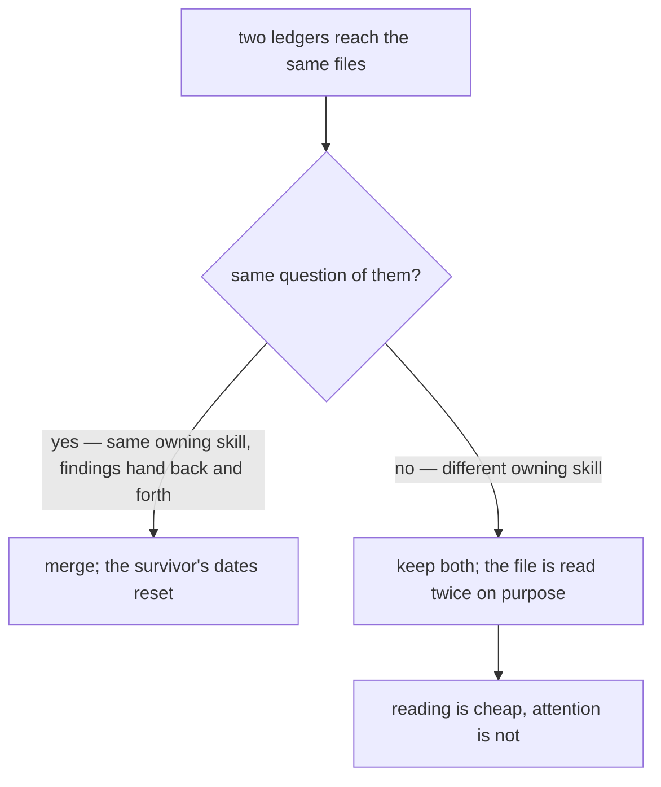

# The ledger file

Read when writing, splitting, merging, promoting or retiring a ledger in `.agents/ledgers/` — what one file may hold, and what decides whether a new convention joins an existing ledger or opens its own. This page holds the whole rule; `SKILL.md` keeps the rules for running a pass.

## What a ledger holds — and nothing else

**A ledger is progress state, not a document.** Every explanatory line in one is a line the skills and docs already own, paid for twice and drifting from the moment it is written. What earns a place is only what exists nowhere else:

- **The index row** (`.agents/ledgers/README.md`) — mode, rules owner, unit, state. This is the sweep's whole metadata; there is no second metadata block below it.
- **Coverage** — a table, one row per unit, ordered by expected payoff: `| Unit | Swept | Notes |`. `Swept` is the date the pass landed and `—` while it is open, so the row carries when as well as whether; `Notes` scopes the unit or names what the pass produced (a rule written into a skill, an invariant pinned by a test), never explains the convention. A checkbox is one bit and cannot say either.
- **The find recipe** — the greps or commands specific to this convention, as bare patterns. Only where no skill states them.
- **Exclusions** — units deliberately out of scope, one clause of reason, so the next pass does not re-litigate them.
- **Next enforceable** — the part of the convention a lint rule or test could take over.
- **Open findings** — only while one is genuinely open. A closed finding is deleted: its rule is in a skill, its invariant is in a test, and git holds the argument.

**Promotion to a folder splits that list, it never shortens it.** Coverage is what an area file holds — a table
and nothing else — and every other item above moves to the folder's own `README.md`, open findings included. A
finding has nowhere to sit on an area file, so a promoted ledger that keeps one on a leaf has put it in the one
place the shape does not allow.

**"The current shape is already right" closes a finding — by documenting it, never by leaving it.** A finding that survives several passes is usually not unresolved; it is resolved and unrecorded. Someone keeps rediscovering the same duplication or asymmetry, reasoning about it, concluding the existing shape is correct, and writing that conclusion nowhere — so the ledger keeps it open and the next pass pays for the reasoning again. Three outcomes, and a finding must reach one of them:

| Verdict                            | Where it goes                                                                                                      |
| ---------------------------------- | ------------------------------------------------------------------------------------------------------------------ |
| The code is wrong                  | Fix it; delete the finding                                                                                         |
| The code is right                  | Write the **why** into the owning docs page or skill (a diagram if it is an ordered mechanism); delete the finding |
| Genuinely undecided — needs a call | Stays, with the decision named and the options stated                                                              |

Deleting a "code is right" finding without recording the rationale is the same failure as deleting a docs tombstone: the reasoning dies and the finding gets re-raised. The ledger holds coverage, so the rationale never stays there — it moves to whatever owns the topic.

Anything else — what the convention says, why it matters, how a pass is run — belongs to the owning skill and is not repeated here.

**State lives at the leaf.** The index row never restates how far a sweep has got: no tick counts, no per-area status column. A rolled-up number is a second copy of the truth that drifts, and it turns every pass into a write to a file other passes are also writing.

**Read the leaf, not the tree.** A pass loads `.agents/ledgers/README.md` and the one file it is sweeping.

**Run the pass in the main session, one unit at a time.** A sweep reads a whole tree to change a fraction of it,
and delegation is priced by files read rather than files changed — fanning units out to agents costs a large
multiple of sweeping them here, and an agent that exhausts its budget mid-unit leaves a tree that cannot be
ticked (`model-delegation`, "A reading pass is not delegable work"). It also throws away the pass's own learning:
a carve-out the rule failed to state is found once in a sequential pass and applied to every unit after it, where
parallel agents each re-derive it or miss it. If a sweep is ever delegated anyway, it is still **one agent per
leaf** — two inside one file trample each other. Adding, promoting or retiring a ledger is the only edit to the
index row.

## A ledger is keyed by its question, never by its address

Two ledgers reading the same files is **not** duplication on its own. `browser-boundary`, `ux` and
`vue-components` all read `app/components`, and they are three sweeps because they ask three questions of it.
They merge only when the question is the same: `quality/skills` folded into `docs` because both read
`.agents/skills` against `skill-authoring`, and each pass was handing the other its findings.

The reason is the same one the `code-review` skill states about its own finders: a pass carrying one question
finds what a pass carrying twenty skims past. Passes differ by **question**, not by **address** — so widening a
ledger's rule set to cover more of a file is how a sweep quietly becomes a skim, and an area-keyed "cleanup"
ledger is that mistake at its widest. When a rule set has no ledger, the answer is a new ledger, not a wider row
on an existing one.

Its corollary bounds the count: a ledger is worth opening only for a convention **no enforcer already decides**.
A rule that oxlint or typecheck checks needs no coverage table — it fails on the line that breaks it — so the ledgers
that earn their file are the read-only-detectable ones: a helper that already exists, a name that means the wrong
thing, a guard held on one path and not its sibling.
