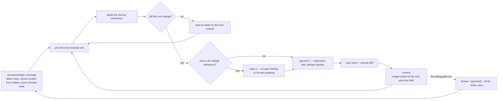

# One Pass

Read when running a sweep pass — picking a unit, committing it, carrying its trailer, and deciding when the checks run. The rules' one-liners are in `SKILL.md`; this page is the loop and every rule inside it.

- **Behaviour-preserving only.** A finding whose fix would change behaviour is raised, never folded in — the pass has to stay revertible as a unit.
- **One unit per commit**, so a pass that turns out wrong reverts cleanly, and the commit's trailer names the unit — `Ledger: <ledger> | <unit>`, the unit cell verbatim (`` Ledger: typescript/messaging | `app/store/message/room` ``) — which is what dates the row: `pnpm ai:sweep:ledger-coverage` writes the trailers' dates into the ledger files at the start and end of a sitting and reports a trailer naming no row. A rule change that invalidates coverage carries `Reopens: <ledger>` instead (`references/ledger-files.md`, "Coverage"). **A unit the pass reads and leaves unchanged has no commit of its own**, so its trailer rides the sitting's next commit — the next unit's, or the ledger commit at the end — never an empty commit, which the porter cannot cherry-pick and drops from every window.
- **Never sized to the review budget.** The collector cuts every window at the cap (`REVIEW_FILE_CAP`, `coderabbit` skill) and repackages a commit that crosses it alone (`review-queue` skill), so a session counts no files against it. A unit is split only when it is too large for one pass to read (`references/ledger-files.md`).
- **Tests are part of the pass**, not a follow-up: anything the pass exposes gets the regression test it was missing, and repeated fixtures collapse (`testing` skill). A pass that only rewrote what typecheck already proves adds none — that is a result, not a gap.
- **Verification batches once at the end of everything going out**, not per unit and not per file — several units swept in one sitting are one pass, not one each (`running-checks`, `package-scripts`). Commits stay per unit regardless; commits are cheap and checks are not. **The end is the sitting going out — the push — never a unit finishing**: a unit is done when its commit lands, and a pass that runs the checks there has bought a green tree for a diff that is about to grow by everything the sitting has left.
- **Area boundaries, another session's files** — `references/windows-and-convergence.md`.
- **A pure relocation may claim the express lane.** A commit that is nothing but a sweep's moves and the imports
  that follow them may carry `Express: <why>` and reach `main` without spending a review window (`review-queue`
  skill); one that bundles a repair is reviewed whole, and one over the cap is repackaged by the collector either way.
- **Skipped findings, with the reason, go in the commit message.** The sweep file tracks coverage, not decisions — and never what a past pass changed, which git holds in full.
