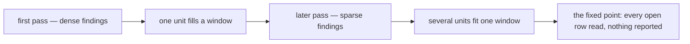

# Sittings and Convergence

Read when planning a sitting — when a pass crosses into another ledger or finishes an area, when a finding lands in a
file another session is editing, and why a resume that reports nothing is the sweep paying rather than failing. The rules a pass applies are in `SKILL.md`.

## The review budget is not the session's to measure

A sitting never sizes itself to a review window. The collector cuts every window to fit under the cap, which the
`coderabbit` skill owns (`review-queue` skill). A session that counted files against the cap would be keeping a second copy of a number the constant
already holds — the copy that goes stale the day the plan changes. The session's bound is the unit: one unit per
commit, every unit read whole.

## `/finishing` runs at every area boundary

When a sitting finishes one area's rows (app shell, messaging, packages, …) and before it starts the next, it runs the audit over that area's commits (`finishing` skill). A rename leaves a docs sentence behind and a repeated finding wants its enforcer, and both are cheapest to catch while the area is still in mind. The audit is not the checks, which still wait for the push.

## A finding in another session's file waits for that session's commit

A tracked file another session has modified and not yet committed is that session's, and a pathspec commit cannot keep the two sessions' hunks apart (`git` skill). The pass leaves it until that session commits it, then edits it like any other file, and never stashes or resets to clear the way. A tracked file only this session has edited goes in with the unit. An untracked file that depends on the other session's other new files stays in the tree for that session to commit, because committing it alone ships half their feature. Reverting a correct change only to stay out of the way loses the change.

## Re-running converges

A resume that reports nothing reads like effort spent for no return, and it is the opposite. What a pass costs to
review is **files changed**, and what spends that is **findings**: a unit reported clean changes no file at all. So
as the density of findings falls, the same review window carries more units, and each cycle reaches further into
the tree than the last.

That is what the coverage dates make visible, and it is why a convention is swept again rather than declared done.
A pass that finds nothing is the sweep having converged **there**, recorded as a date so the next cycle starts from
it instead of re-reading it.

This is not the treadmill `SKILL.md` rejects under "Shrinking beats re-running". What must never repeat is a pass
**re-deriving** a rule a machine could decide; that work is handed to an enforcer and leaves the sweep's scope for
good. A reading pass whose findings thin out each cycle is the opposite shape: each cycle is cheaper than the last,
and it ends.

## A sitting crosses ledgers

A ledger is not finished in a sitting. Every sweep is standing and most ledgers are larger than any one sitting,
so "work this ledger until it is done" is not a plan — and stopping when one ledger's open rows run out spends the
rest of the sitting on nothing.

**A ledger left half-drained is the normal resting state.** When the ledger being worked runs out of open rows,
take an open row from another. Crossing ledgers costs nothing: a row is scoped by its own pathspecs and carries its
own convention.

What may not be split is a **unit**. A row is swept and dated in this sitting or untouched — the same rule that
denies a partially-swept state denies a half-read one, and a unit abandoned mid-read leaves the next sitting unable
to tell what was already looked at.

The handover names where each ledger was left, so the next sitting opens on a row rather than re-deriving scope.
