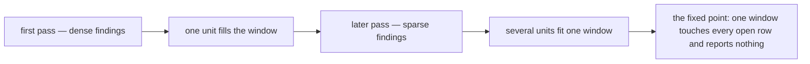

# Windows and Convergence

Read when planning a sitting — how many units one review window carries, when a pass crosses into another
ledger, and why a resume that reports nothing is the sweep paying rather than failing. The rules a pass applies
are in `SKILL.md`; this page is why the window rather than the ledger bounds the work.

## Re-running converges

A resume that reports nothing reads like effort spent for no return, and it is the opposite. A pass is bounded by
the review window, which is a budget of **files changed** — the `coderabbit` skill owns the number, and it is never
restated here. What spends that budget is **findings**, since a unit reported clean changes no file at all: a unit
carrying three fixes fills the window by itself; a unit carrying none costs only its reading and leaves the whole
budget for the next unit. So as the density of findings falls, the number of units one window carries rises, and
the same fixed budget reaches further into the tree every cycle. The cap still binds the window it reaches: units
are added while the files they change stay under it, never because the last few reported nothing.

That is what the coverage dates make visible, and it is why a convention is swept again rather than declared done.
A pass that finds nothing is not the sweep failing to pay — it is the sweep having converged **there**, recorded as
a date so the next cycle starts from it instead of re-reading it.

This is not the treadmill `SKILL.md` rejects under "Shrinking beats re-running". What must never repeat is a pass
**re-deriving** a rule a machine could decide; that work is handed to an enforcer and leaves the sweep's scope for
good. A reading pass whose findings thin out each cycle is the opposite shape: each cycle is cheaper than the last,
and it ends.

## The window is the unit of work

A window is filled; a ledger is not finished. Every sweep is standing and most ledgers are larger than any one
window, so "work this ledger until it is done" is not a plan a window can hold — and stopping when one ledger's
open rows run out spends part of the budget on nothing.

**A ledger left half-drained is the normal resting state.** When the ledger being worked runs out of open rows, or
its next unit is too large to start inside what the budget has left, take an open row from another ledger. Crossing
ledgers mid-window costs nothing: a row is scoped by its own pathspecs and carries its own convention, so the only
thing shared across the two is the file count.

What may not be split is a **unit**. A row is swept and dated in this window or untouched — the same rule that
denies a partially-swept state denies a half-read one, and a unit abandoned mid-read leaves the next window unable
to tell what was already looked at. So the last row a window starts is the last one whose findings still fit under
the cap, from whichever ledger that is.

The handover names where each ledger was left, so the next window opens on a row rather than re-deriving scope.
