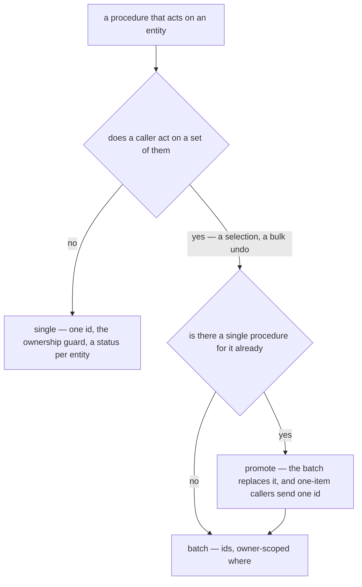

# Procedure Arity — Single First, Batch by Promotion

Read when writing a procedure that acts on an entity, when a surface starts acting on a set of them, or when a
router holds a single and a batch procedure for the same operation.

**A procedure takes one entity until a caller acts on a set.** The single form is the simplest thing that works: it
takes an ownership guard that hands the handler the row (`getOwnerProcedure` sets `ctx.resource`), it fails with a
status that says which entity was wrong, and its caller passes an id rather than an array of one. A batch buys
none of that back until something really sends many. Writing one first for a surface that acts on one item is the
`over-engineering` skill's "mechanism promoted for a single consumer".

**Promotion replaces, never adds.** When a surface does act on a set, such as a selection's toolbar or an undo that
reverses a bulk act, the operation becomes a batch procedure and the single one is deleted. The one-item callers
send one id. A single and a batch for the same operation are two code paths for one behaviour, and they drift in
exactly the ways a batch differs: which rows the guard admits, what the notification says, what a missing row does.

## What a promoted procedure owes

- **The guard moves into the where.** A batch has no `ctx.resource`, so it scopes its own statement to the caller
  and the state the operation needs: `deleteResources` matches the owner's live rows, `restoreResources` the owner's
  binned rows. A row outside that scope is skipped and absent from the result, never an error, since one foreign id
  must not fail the rest of the set.
- **The caller chunks to the cap.** The input caps its ids at `MAX_READ_LIMIT`, and a selection that spans pages
  sends its ids in order, chunk by chunk (`useDeleteResources`, `useRestoreResources`).
- **Its words take a count.** A title or notification the single form wrote for one name takes the count too
  (`ResourceOperationTitleMap`), so a one-item batch reads exactly as the single form did.
- **Its input keeps a file of its own.** Two batch procedures over the same shape still take one input schema each
  (`references/file-placement.md`).

## The resource router as the reference

`resource.deleteResources` and `resource.restoreResources` are batches because the list's selection deletes many
and its toast undoes all of them. The bin's row restore sends one id, and no single restore exists beside it.
`purgeResource` stays single: the bin has no bulk purge, so nothing has promoted it.

**The one exception is a single form that carries what the batch cannot.** Each type's router keeps its own
`deleteResource` beside the batch, because its path names the type: an achievement keys on `survey.deleteResource`,
which a typeless `resource.deleteResources` cannot say. The resource page's delete goes through it for that reason.
Anything that keys on a path is the test: with nothing keyed on the single form's path, it goes.
