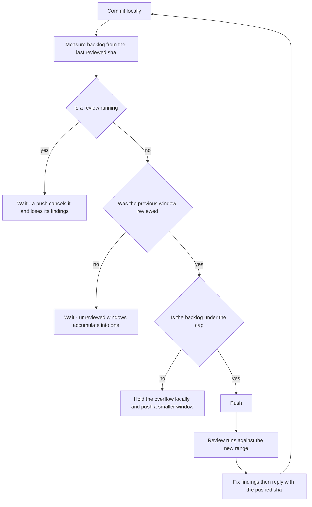

# CodeRabbit Conventions

## Config Is Read From the PR Base Branch

`.coderabbit.yaml` sits at the repo root, and CodeRabbit reads it from the **base branch** of a PR, never the head branch. A config change only takes effect once it is on that branch, so **read the base off the PR rather than assuming it** — feature PRs target `develop`, but the long-lived release PR is `develop` → `main`, and for that one the change must land on `main`:

```bash
gh pr view <pr> --json baseRefName --jq .baseRefName   # the branch whose config applies
git show <base-branch>:.coderabbit.yaml | head -20     # the config CodeRabbit actually applies
```

- Commit config changes **directly to that base branch**, as a standalone commit separate from the work they cover. A config change on the head branch does nothing. Landing anything on a shared branch — by worktree push or by the API call below, which does not look like a push but is one — needs the same explicit go-ahead every push does.
- Editing the base branch does not mean checking it out over your work: `git worktree add <scratch-path> <base-branch>`, commit there, push, then `git worktree remove`. The working tree keeps whatever is in flight, which matters when agents are mid-edit in it. Rebase inside the worktree before pushing — the base branch moves under you (Renovate).
- **On Windows the worktree can fail outright** — checking out this repo under a long scratch path trips `Filename too long` on the deepest `packages/infra` paths and aborts with `Could not reset index file`. For a one-file config edit, skip the checkout entirely and commit through the API, which is atomic and cannot disturb the working tree at all:

  ```bash
  baseBranch=$(gh pr view <pr> --json baseRefName --jq .baseRefName)
  sha=$(gh api "repos/:owner/:repo/contents/.coderabbit.yaml?ref=$baseBranch" --jq .sha)
  gh api -X PUT "repos/:owner/:repo/contents/.coderabbit.yaml" \
    -f message="$(cat message.txt)" -f content="$(base64 -w0 new.yaml)" -f sha="$sha" -f branch="$baseBranch"
  ```

  Both calls take the resolved base, never a hardcoded `main` — the read and the write have to name the same branch, or the PUT lands the edited config on a branch whose `sha` it was not read from and the API rejects it. On a `develop`-base PR a hardcoded pair would instead write config to `main` that the review never reads.

  Validate the yaml parses (§ Generating the list) _before_ the PUT — there is no local commit to amend afterwards.

- The two branches diverging is expected: `develop` can carry a temporary exclusion block while `main` carries only the permanent entries, picking the block up on a release merge and losing it when the block is removed.

CodeRabbit auto-reviews **only PRs targeting the default branch (`main`)** — develop-base PRs are skipped with "Auto reviews are disabled on base/target branches other than the default branch". Trigger those manually by commenting `@coderabbitai review` on the PR.

**Never add `reviews.auto_review.base_branches` to `.coderabbit.yaml`.** Manual triggering on develop-base PRs is deliberate, not a gap waiting to be closed: it keeps control of _when_ a review starts — which is what makes the never-push-into-a-running-review rule below workable — and it stops every intermediate push spending a rate-limit slot. If a PR was not reviewed, comment `@coderabbitai review`; do not change the config. The setting reads like an obvious fix and has been "helpfully" added before.

## Opening a PR Spends a Review Slot

**Creating a PR against the default branch, and every push to one, starts a review** — the slot goes immediately and the next is about an hour out.

So ask first, every time. Agreement on the goal ("get this reviewed") is not permission to spend the slot before the shape is settled — the commit range, the cut point, and the base's `.coderabbit.yaml` all have to be final. Until then push the branch and stop: a branch is free and re-cuttable, a PR is not. Opened one too early? Close it — the slot is already gone and the commits stay reviewable under the PR they belong to.

## Never Push Into an In-Flight Review

**Check CodeRabbit's state before every push to a branch with an open PR.** Pushing while a review is running cancels it and retriggers a fresh one, which costs a rate-limit slot and loses the in-progress review's findings. CodeRabbit is an **incremental** system — it does not re-review commits it has already reviewed — so a cancelled review's comments do not reliably come back on the next run. They are simply gone.

```bash
gh pr checks --json name,state,bucket,description --jq '.[] | select(.name=="CodeRabbit")'
# {"bucket":"pass","description":"Review rate limited","name":"CodeRabbit","state":"SUCCESS"}
```

**Read `bucket` first, then `description`.** `bucket` is gh's normalization across both representations a check can take, so `pending` means a live review whatever CodeRabbit reports underneath — it posts a **commit status** (states limited to `pending`/`success`/`failure`/`error`), while GitHub Actions entries on the same PR are check runs reporting `IN_PROGRESS`/`QUEUED`. Keying on the state string alone means a representation change reads as terminal. `description` then separates a review that finished from one that never started:

| bucket / description                          | meaning                        | push?                         |
| :-------------------------------------------- | :----------------------------- | :---------------------------- |
| `pending` (any description)                   | live review, a push cancels it | **wait**                      |
| `pass` / `Review completed`                   | finished                       | push                          |
| `pass` / `Review rate limited`                | never started, nothing running | **push**                      |
| `pass` / skip comment says `Too many files`   | never started                  | push, but fix the count first |
| `fail`, missing row, or anything unrecognised | unknown                        | **wait**, then look           |

The last row is the default, not an edge case: being wrong about a running review costs its findings and a slot, being wrong about a finished one costs a minute.

Three gates decide a push, and they are not interchangeable — the first is about cancelling a review, the second about accumulating an unreviewed window, the third about overflowing the cap:



**The check answers "is one running", never "has the last push been reviewed".** `Review completed` is the status of whichever review ran most recently, which may have covered a range two pushes back — the check does not name a range at all, so reading it as clearance for the current head is a category error. It is the state's own answer to a different question, and it looks exactly like the answer you wanted.

Reconcile against the range before treating a push as reviewed. Every review body states its own (`Reviewing files that changed … between <sha1> and <sha2>`), so the last reviewed sha is a fact you can read rather than infer:

```bash
gh api "repos/:owner/:repo/pulls/<pr>/reviews?per_page=100" --paginate \
  --jq '.[] | select(.user.login=="coderabbitai[bot]") | select((.body|length) > 0)
        | "\(.submitted_at)  \(.body | capture("between (?<a>[0-9a-f]{40}) and (?<b>[0-9a-f]{40})") | "\(.a[0:9])..\(.b[0:9])")"' | tail -3
git diff --name-only <last-reviewed-sha>..origin/<branch> | wc -l   # the real backlog
```

This matters because the budget is measured **from that sha, not from the last push**. A window that was pushed but never reviewed does not clear — it accumulates, and the next push adds to it. Two pushes of 35 and 80 that each looked compliant are one 115-file window to CodeRabbit, over the cap, and the review is skipped outright rather than truncated. Measure the backlog from the last reviewed sha before every push, and if a previous window is still unreviewed, that is a reason to wait rather than to add to it.

**A rate-limited status does not prove the frontier stalled.** CodeRabbit advances its incremental checkpoint over commits it never posted a review body for: the commit status still reads `Review rate limited`, no range names them, and they count as reviewed anyway. Reading that as an unreviewed window inflates the next backlog by everything it silently covered and stalls pushes to protect a review that is never going to run. The reviewed range is evidence the checkpoint moved, never evidence it did not.

The probe that answers it is the retrigger itself — `@coderabbitai review` replies `Already reviewed` when the checkpoint already covers the head, and starts a review when it does not:

```bash
gh pr comment <pr> --body "@coderabbitai review"
gh api "repos/:owner/:repo/issues/<pr>/comments?per_page=100" --paginate \
  --jq '[.[] | select(.user.login=="coderabbitai[bot]")] | last | .body' | head -20
```

A decline costs nothing, which makes this cheaper than waiting out an hour on an inferred backlog.

**This table says when a push is _safe_, never when it is _authorised_.** The standing rule is unchanged and overrides everything here: commit the coherent change and **never push unless the user asks** — that covers rate-limited pushes, recovery pushes and force-pushes alike. Read the table only once you already have the ask, to decide whether this is the moment.

**Given the ask, `Review rate limited` is not a wait state.** Nothing is running, so there is nothing to lose by pushing, and holding the branch stalls the working tree for an hour to protect a review that does not exist. Under a standing ask ("keep pushing while it's parked"), treat the review as an async thread: keep committing and keep pushing, on the single condition that every push leaves the branch **within the file cap measured from where the review last stopped** (`references/release-pr-cutting.md`). Without that ask, commit and stop — the reviewer's state never turns "not yet asked" into permission.

This applies per push, not per work session — a second push minutes after the first lands while the first push's review is still running. Batch commits and push once when the work is coherent.

Symptoms that a push landed mid-review: a `> [!CAUTION] Failed to replace (edit) comment` / `putComment timed out` comment from `coderabbitai[bot]`, or a review that silently returns far fewer comments than the diff warrants.

## PR File Budget

CodeRabbit caps this repo at **100 files per review** — the Open Source tier's file limit is popularity-scaled and can move, so treat the number as current-best-known; the bot's skip comment on an over-budget PR states the current one. Keep every chunk of work to **~80 changed files measured from the branch point** — work is committed and pushed continuously, so dirty-file counts see nothing:

```bash
# Committed since branching, plus anything not yet committed — as a set, since a file can be in both.
{ git diff --name-only "$(git merge-base <base-branch> HEAD)"; git status --porcelain -uall | cut -c4-; } |
  sort -u | wc -l
```

Count the **union**, not the sum: a file with both committed and working-tree changes is one file to CodeRabbit, and summing it twice cuts the chunk early. Run this before starting a sweep. When the budget is reached, cut the chunk — but do not stop working; see the pipeline below.

**Incremental reviews refresh the budget.** CodeRabbit reviews only the files changed _since its last completed review_ on the PR (the review body states it: "Reviewing files that changed … between `<sha1>` and `<sha2>`"), not the cumulative PR diff. So within one long-lived PR the ~80-file budget applies **per review cycle**: a retrigger or a new push only needs the _newly committed_ files to stay under it. Once a PR has been reviewed, measure the delta rather than the merge-base — `git diff --name-only <last-reviewed-sha>..HEAD | wc -l`. The merge-base count still governs the **first** review of a PR and any full re-review.

### Pipelining — work lands on `develop`, review runs against the `develop` → `main` PR

**There are no per-chunk feature branches.** Work is committed and pushed straight to `develop`, and the single long-lived PR is `develop` → `main`. Because that PR's base is the default branch, **every push to `develop` auto-triggers a review** — no `@coderabbitai review` comment needed, and no PR to open per chunk. Keeping that PR open is what makes the pipeline work.

A review takes an hour of wall-clock the working tree has no reason to spend idle. Reviews are incremental and the budget refreshes per cycle, so that one PR absorbs an arbitrarily large body of work as a series of chunks, with local work running ahead of the reviewed frontier:

1. Commit continuously on `develop`. When the delta since the last reviewed sha approaches ~80 files, that chunk is ready.
2. Push it. The push starts a review.
3. **Keep working locally while it runs.** Commits are free; only pushes trigger reviews. Never push into a running review (see above) — the local commit queue is what absorbs the wait.
4. When the review completes, address its findings, reply to every one, commit the fixes, and push them **together with** the next queued chunk. That single push starts the next cycle.
5. Repeat. Each cycle reviews the fix commits plus one fresh chunk, so review effort tracks the work instead of gating it.

The invariant: a chunk is a **push** boundary, not a work boundary. If step 4's fixes plus the queued chunk exceed the budget, push the fixes with only part of the queue and hold the rest — never split a fix away from the finding it answers.

### Composing the window

A window is a **prefix of the unpushed range**, so what rides in it is decided by commit order, not by authoring order. Push a prefix and hold the rest by naming the cut sha:

```bash
git push origin <cut-sha>:<branch>      # everything after <cut-sha> stays local
```

That makes commit order load-bearing: work authored last but wanted first — review fixes, a config change, anything gating the next cycle — is **prepended to the unpushed range** rather than left at the tip, where it would wait a whole cycle behind the queued chunk. Reordering unpushed commits is free; they exist nowhere else:

```bash
FIX=$(git rev-parse <fix-sha>)
OLD=$(git rev-parse HEAD)
git reset --hard origin/<branch>        # the reviewed frontier
git cherry-pick "$FIX"                  # the fix goes first
git cherry-pick "origin/<branch>..$FIX^"  # the work it was authored on top of
git cherry-pick "$FIX..$OLD"            # anything after it
```

Only when the fix is **independent of the commits it jumps**. One that edits a file a jumped commit rewrote conflicts on replay, and resolving it means rewriting the fix against the older text — there it belongs where it was authored. Cherry-pick cannot replay a merge commit either: drop the merge from the range and redo it at the end.

**The cap is a hard gate on the push itself, not a target to recover from afterwards.** Measure before every push and hold the overflow locally; a push that overshoots is not a setback that costs one review cycle, it is one that can cost every cycle after it. The only way to shrink an over-budget branch is to rewind it, and a force-push desynchronises CodeRabbit's incremental checkpoint from the branch: after a rewind it can measure the next window from a sha whose files it has already reviewed, inflating the count well past the local one, and every later push inherits that baseline. Keeping each push under the cap is therefore the whole discipline: it is what makes the checkpoint advance cleanly and keeps the branch recoverable.

When a push has already overshot, the recovery is to **shorten `develop`, park the remainder on a queue branch, and drain it one window at a time** — `references/release-pr-cutting.md`. Treat it as a last resort with a real cost, not the routine tool.

**Exclusions are rarely the answer, and never for a substantive file.** Over budget is a chunking problem: split the work, or land it in stages so each cycle stays under the cap. Excluding a file that carries real content buys a smaller review, not a better one — the diff still ships, just unread. When to reach for one anyway, and the procedure, live in `references/exclusions.md`.

The budget is a **target to fill, not only a cap**. A single roadmap item is typically 8–15 files, so one-item-per-PR wastes most of a review slot and multiplies review rounds. When planning PRs from a roadmap, batch items until the estimate approaches ~80 files, grouping by what they touch so the coupling stays inside one review: items sharing a schema section, a router, or a settings object belong in the same PR — splitting them creates stacked branches that can't start until their parent merges. Items whose only overlap is additive (a new row on a shared blade) can land in separate PRs with a stated merge order.

## Reading and Answering Findings

- **Nitpicks live only in the review body**, inside the collapsed `🧹 Nitpick comments (M)` block — they are never inline comments. Fetching only the inline endpoint loses them silently.
- **Inline comments can fail to post at all**, and the review says so with a `> [!CAUTION] Inline review comments failed to post` block in its body. The findings are still listed there, in the body's own agent-prompt block, so a run that posted fewer threads than it claims is not a run with fewer findings. This is why the counts below are the ground truth and the thread list never is.
- **The bot's login is `coderabbitai[bot]`, not `coderabbitai`.** A `--jq` filter on the wrong login returns empty and exits 0, so empty output from a filtered query means _"my filter was wrong"_ until proven otherwise — never read it as "there are none".
- **Reconcile before concluding.** Each review body states `Actionable comments posted: N` and `🧹 Nitpick comments (M)`. Both counts are ground truth: fewer inline comments or nitpicks in hand than that means you are missing some — go find them rather than reporting what you happened to fetch.
- **Reply to every finding, including rejected ones** — a silent skip is indistinguishable from an oversight. State the verdict in the first line (`Agreed, fixed in <sha>` / `Not a real issue, no change`) and give the evidence; these threads are the record of why the code looks the way it does.
- **Push the fix commits first, then reply.** A reply citing a sha the remote does not have yet is one CodeRabbit cannot resolve — it answers that it can't find the commit, and the thread's evidence is worthless from then on. Order is: commit → check the review has settled → push → reply with the pushed sha.
- **Verify before accepting.** CodeRabbit reasons from names and prior "learnings" and will confidently assert semantics the code does not have — check the implementation, and when it flags a pattern, grep for the repo's existing convention rather than taking the suggested diff. If a finding is real, check whether its twin exists elsewhere; the scan is per-file and routinely stops one file short.

## Deep Dives

- `references/review-feedback.md` — when fetching a PR's CodeRabbit feedback or replying to a comment (the three endpoints and the reply call).
- `references/release-pr-cutting.md` — when a PR has grown past the file limit and its review is skipped outright.
- `references/exclusions.md` — when deciding whether a file may be excluded from review, generating the exclusion list, or removing the exclusions.
