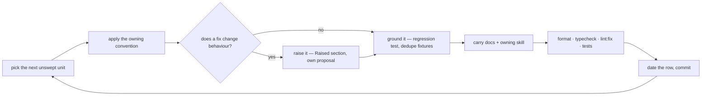

# Sweeps

A **sweep** carries one already-settled convention across a tree too large to finish in one commit. It decides nothing: the convention is owned by a skill or docs page, and the sweep only applies it to code that predates it, changing no behaviour.

Each sweep's progress is a **ledger**: one file in `.claude/ledgers/`, one row in its `README.md` index. A ledger that outgrows a screen, or that two agents want to work at once, becomes a folder of one file per area — the index row still carries the metadata, so the folder holds nothing but coverage. It grows the way source does: split when a unit earns its own home, never to hit a number.

**A sweep is never a proposal.** A proposal designs behaviour that does not exist yet and is deleted when it ships; a sweep changes no behaviour at all. Filing one under `content/docs/proposals/` mislabels maintenance as design and puts a never-ending standing sweep in a folder whose contents are all supposed to leave.

## Does it earn a file?

- **More than one sitting or one commit → its own file.** Anything smaller is just the change; a sweep file for it is overhead that then rots.
- **One convention per file.** Never a combined "cleanup" sweep — two conventions have different units, different modes and different end conditions, so merging them means neither finishes.
- **A migration is not a sweep.** Work gated on an external trigger (upstream shipping a feature) is tracked by its blocker table in its own docs page, not by coverage.

## One pass



- **Behaviour-preserving only.** A finding whose fix would change behaviour is raised, never folded in — the pass has to stay revertible as a unit.
- **One unit per commit**, so a pass that turns out wrong reverts cleanly, and the commit message names the unit.
- **Chunked for review** — a unit that would exceed the PR file budget is split at a directory boundary and gets its own coverage line (`coderabbit` skill for the budget).
- **Tests are part of the pass**, not a follow-up: anything the pass exposes gets the regression test it was missing, and repeated fixtures collapse (`testing` skill).
- **Verification batches once at the end** of the unit, not per file (`package-scripts`).
- **Skipped findings, with the reason, go in the commit message.** The sweep file tracks coverage, not decisions.

## What a ledger holds — and nothing else

**A ledger is progress state, not a document.** Every explanatory line in one is a line the skills and docs already own, paid for twice and drifting from the moment it is written. What earns a place is only what exists nowhere else:

- **The index row** (`.claude/ledgers/README.md`) — mode, rules owner, unit, state. This is the sweep's whole metadata; there is no second metadata block below it.
- **Coverage** — a table, one row per unit, ordered by expected payoff: `| Unit | Swept | Notes |`. `Swept` is the date the pass landed and `—` while it is open, so the row carries when as well as whether; `Notes` scopes the unit or names what the pass produced (a rule written into a skill, an invariant pinned by a test), never explains the convention. A checkbox is one bit and cannot say either.
- **The find recipe** — the greps or commands specific to this convention, as bare patterns. Only where no skill states them.
- **Exclusions** — units deliberately out of scope, one clause of reason, so the next pass does not re-litigate them.
- **Next enforceable** — the part of the convention a lint rule or test could take over.
- **Open findings** — only while one is genuinely open. A closed finding is deleted: its rule is in a skill, its invariant is in a test, and git holds the argument.

Anything else — what the convention says, why it matters, how a pass is run — belongs to the owning skill and is not repeated here.

**State lives at the leaf.** The index row never restates how far a sweep has got: no tick counts, no per-area status column. A rolled-up number is a second copy of the truth that drifts, and it turns every pass into a write to a file other passes are also writing.

**Read the leaf, not the tree.** A pass loads `.claude/ledgers/README.md` and the one file it is sweeping.

**One agent per leaf.** Parallel passes across different area files are fine and encouraged; two agents inside one file are not. Adding, promoting or retiring a ledger is the only edit to the index row.

## Modes

- **One-shot** — the units are enumerable and each is swept once. A `—` in `Swept` is unswept; when the last row carries a date, delete the file or folder and its index row. Never delete one while an open finding still lacks its proposal — the ledger is that finding's only record. Add a coverage line rather than widening an existing one when a unit turns out too big, and split it into its own file when the lines stop fitting.
- **Standing** — the convention applies to code written after the sweep too, so the file carries a date instead of an end. Sweep only what changed since, then bump the date in the same commit:

  ```bash
  git log --since=<Last swept date> --name-only --pretty=format: -- <the globs this sweep declares> | sort -u
  ```

  Everything outside that list was swept at the last pass — skip it rather than re-reading it.

## Shrinking beats re-running

A standing sweep that is only ever re-run is a treadmill, and the repo already has the better answer for a rule that must hold forever: an enforcer. Each pass asks which part of the convention a custom oxlint plugin, a `no-restricted-syntax` selector or a test could decide, hands that part over, and records what is enforceable next — the sweep's scope then shrinks permanently instead of the same files being re-read every quarter. A standing sweep whose whole scope becomes enforceable is deleted, not maintained.
