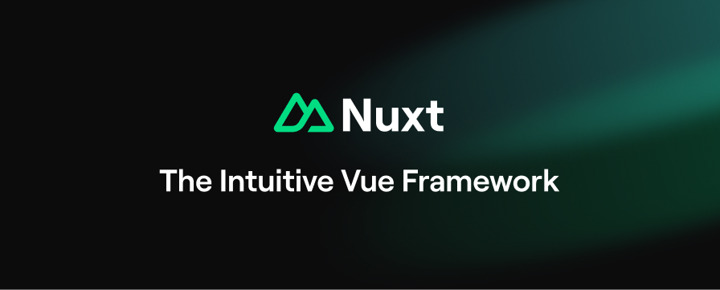

# [Esposter](https://esposter.com)

[![Build Status][badge-ci]][url-ci]
[![Repository Score][badge-score]][url-score]
[![Apache-2.0 licensed][badge-license]][url-license]

### Table of Contents

- 📖 [Documentation](#documentation)
- 🏠 [Local Development](#local-development)
- 🤝 [Community](#community)
- ⚖️ [License](#license)

## <a name="documentation">📖 Documentation</a>

We highly recommend you take a look at the [documentation](https://esposter.com/docs/) to level up.

### Frontend

<table>
  <thead>
    <tr>
      <th width="2000" colspan="2">
        
      </th>
    </tr>
  </thead>
  <tbody>
    <tr>
      <td width="80" align="center" valign="top">
        <br />
        <a href="https://nuxt.com">
          
        </a>
      </td>
      <td valign="top">
        <h3>Nuxt</h3>
        <p>
          The Intuitive Web Framework, based on Vue. We highly recommend you take a look at <a href="https://nuxt.com">the Nuxt documentation</a> to level up.
        </p>
      </td>
    </tr>
    <tr>
      <td width="80" align="center" valign="top">
        <br />
        <a href="https://vuejs.org">
          
        </a>
      </td>
      <td valign="top">
        <h3>Vue</h3>
        <p>
          🖖 Vue.js is a progressive, incrementally-adoptable JavaScript framework for building UI on the web. We highly recommend you take a look at <a href="https://vuejs.org">the Vue documentation</a> to level up.
        </p>
      </td>
    </tr>
    <tr>
      <td width="80" align="center" valign="top">
        <br />
        <a href="https://next.vuetifyjs.com">
          
        </a>
      </td>
      <td valign="top">
        <h3>Vuetify</h3>
        <p>
          🐉 Material Component Framework for Vue. We highly recommend you take a look at <a href="https://vuetifyjs.com">the Vuetify documentation</a> to level up.
        </p>
      </td>
    </tr>
    <tr>
      <td width="80" align="center" valign="top">
        <br />
        <a href="https://pinia.vuejs.org">
          
        </a>
      </td>
      <td valign="top">
        <h3>Pinia</h3>
        <p>
          🍍 Intuitive, type safe, light and flexible Store for Vue using the composition api with DevTools support. We highly recommend you take a look at <a href="https://pinia.vuejs.org">the Pinia documentation</a> to level up.
        </p>
      </td>
    </tr>
  </tbody>
</table>

### Backend

<table>
  <thead>
    <tr>
      <th width="2000" colspan="2">
      </th>
    </tr>
  </thead>
  <tbody>
    <tr>
      <td width="80" align="center" valign="top">
        <br />
        <a href="https://trpc.io">
          
        </a>
      </td>
      <td>
        <h3>tRPC</h3>
        <p>
          🧙‍♀️ Move Fast and Break Nothing. End-to-end typesafe APIs made easy. We highly recommend you take a look at <a href="https://trpc.io">the tRPC documentation</a> to level up.
        </p>
      </td>
    </tr>
    <tr>
      <td width="80" align="center" valign="top">
        <br />
        <a href="https://zod.dev">
          
        </a>
      </td>
      <td>
        <h3>Zod</h3>
        <p>
          TypeScript-first schema validation with static type inference. We highly recommend you take a look at <a href="https://zod.dev">the Zod documentation</a> to level up.
        </p>
      </td>
    </tr>
    <tr>
      <td width="80" align="center" valign="top">
        <br />
        <a href="https://orm.drizzle.team">
          
        </a>
      </td>
      <td valign="top">
        <h3>Drizzle ORM</h3>
        <p>
          TypeScript ORM that feels like writing SQL. We highly recommend you take a look at <a href="https://orm.drizzle.team">the Drizzle ORM documentation</a> to level up.
        </p>
      </td>
    </tr>
    <tr>
      <td width="80" align="center" valign="top">
        <br />
        <a href="https://www.postgresql.org">
          
        </a>
      </td>
      <td valign="top">
        <h3>PostgreSQL</h3>
        <p>
          PostgreSQL is a powerful, open source object-relational database system with over 35 years of active development that has earned it a strong reputation for reliability, feature robustness, and performance. We highly recommend you take a look at <a href="https://www.postgresql.org/docs">the PostgreSQL documentation</a> to level up.
        </p>
      </td>
    </tr>
  </tbody>
</table>

### Hosting & Domain Providers

<table>
  <thead>
    <tr>
      <th width="2000" colspan="2">
      </th>
    </tr>
  </thead>
  <tbody>
    <tr>
      <td width="80" align="center" valign="top">
        <br />
        <a href="https://railway.app">
          
        </a>
      </td>
      <td>
        <h3>Railway</h3>
        <p>
          Infrastructure, Instantly. We highly recommend you take a look at <a href="https://railway.app">the Railway documentation</a> to level up.
        </p>
      </td>
    </tr>
    <tr>
      <td width="80" align="center" valign="top">
        <br />
        <a href="https://www.namecheap.com">
          
        </a>
      </td>
      <td valign="top">
        <h3>Namecheap</h3>
        <p>
          ICANN-accredited domain name registrar providing domain name registration and web hosting. We highly recommend you take a look at <a href="https://www.namecheap.com">the Namecheap documentation</a> to level up.
        </p>
      </td>
    </tr>
  </tbody>
</table>

### VSCode Extensions

| Name                       | Link                                                                           |
| -------------------------- | ------------------------------------------------------------------------------ |
| Vue - Official (Volar)     | https://marketplace.visualstudio.com/items?itemName=Vue.volar                  |
| ESLint                     | https://marketplace.visualstudio.com/items?itemName=dbaeumer.vscode-eslint     |
| Oxfmt - Code formatter     | https://marketplace.visualstudio.com/items?itemName=oxc.oxc-vscode             |
| GitLens — Git supercharged | https://marketplace.visualstudio.com/items?itemName=eamodio.gitlens            |
| Powershell                 | https://marketplace.visualstudio.com/items?itemName=ms-vscode.PowerShell       |
| Material Icon Theme        | https://marketplace.visualstudio.com/items?itemName=PKief.material-icon-theme  |
| Better Comments            | https://marketplace.visualstudio.com/items?itemName=aaron-bond.better-comments |

## <a name="local-development">🏠 Local Development</a>

### Git configuration to enable symlinks

The projects make use of symlinks in the git project. On Windows, this may not work as expected without extra configuration. To configure git to create symlinks on windows, you need to enable the Windows "Developer Mode" setting, and also set the `core.symlinks` git feature using either of the following commands:

```bash
# Global setting
git config --global core.symlinks true

# Local setting
git config core.symlinks true
```

After applying this setting, you may need to reset your local branch to ensure the files get rewritten as symlinks. Note that this step is destructive and you will want to push any changes you have made prior to resetting your branch.

```bash
git reset --hard
```

### Installing Dependencies

1. Install Node Modules:

```bash
pnpm i
```

2. Install [PostgreSQL + PgAdmin](https://www.postgresql.org/download).

3. Add `.env` file according to `.env.example` in `packages/app` directory.

Checkout the [deployment documentation](https://nuxt.com/docs/getting-started/deployment) for more information.

### Development Server

1. Build the packages to be used by the application:

```bash
pnpm build:packages
```

2. Change to the app directory:

```bash
cd packages/app
```

3. Start the development server on <http://localhost:3000>

```bash
pnpm dev
```

### Production

Build the application for production:

```bash
pnpm build
```

Locally preview production build:

```bash
pnpm preview
```

### Architecture

Esposter is a lerna + pnpm workspaces monorepo.
Packages are used directly by the nuxt application via `workspace:*`.

## <a name="packages">📦 Packages</a>

| Package                                                | Description                                                                     | Published |
| ------------------------------------------------------ | ------------------------------------------------------------------------------- | :-------: |
| [`packages/app`](packages/app)                         | Main Nuxt 4 web application — frontend, server routes, tRPC API                 |     —     |
| [`packages/azure-functions`](packages/azure-functions) | Serverless Azure Functions backend — push notifications, webhooks, EventGrid    |     —     |
| [`packages/azure-mock`](packages/azure-mock)           | Mock Azure service classes for local dev and testing                            |     ✓     |
| [`packages/configuration`](packages/configuration)     | Shared ESLint, TSConfig, and Rolldown build configurations                      |     —     |
| [`packages/db`](packages/db)                           | Database connection utilities for Drizzle ORM, Azure Table, Blob, and WebPubSub |     —     |
| [`packages/db-mock`](packages/db-mock)                 | In-memory PGlite database factory for unit and integration tests                |     —     |
| [`packages/db-schema`](packages/db-schema)             | Drizzle ORM schemas and migrations (PostgreSQL source of truth)                 |     —     |
| [`packages/parse-tmx`](packages/parse-tmx)             | Parser for Tiled Map Editor `.tmx` files                                        |     ✓     |
| [`packages/shared`](packages/shared)                   | Shared TypeScript types, utilities, and error classes                           |     ✓     |
| [`packages/vue-phaserjs`](packages/vue-phaserjs)       | Phaser 4 game engine integration for Vue 3                                      |     ✓     |
| [`packages/xml2js`](packages/xml2js)                   | TypeScript rewrite of xml2js — XML ↔ JSON conversion                            |     ✓     |

## <a name="community">🤝 Community</a>

We welcome contributions from everyone and are committed to maintaining a friendly, safe, and welcoming community. Please see our [Code of Conduct](CODE_OF_CONDUCT.md) and [Security Policy](SECURITY.md) for more information.

## <a name="license">⚖️ License</a>

This project is licensed under the [Apache-2.0 license](https://github.com/Esposter/Esposter/blob/main/LICENSE).

[badge-ci]: https://github.com/Esposter/Esposter/actions/workflows/CI.yaml/badge.svg?event=push&branch=main
[url-ci]: https://github.com/Esposter/Esposter/actions/workflows/CI.yaml?query=event%3Apush+branch%3Amain
[badge-license]: https://img.shields.io/github/license/Esposter/Esposter.svg?color=blue
[url-license]: https://github.com/Esposter/Esposter/blob/main/LICENSE
[badge-score]: https://img.shields.io/badge/score-91%2F100-33c854
[url-score]: https://github.com/Esposter/Esposter/blob/main/SCORE.md
[url-npm]: https://www.npmjs.com/package/Esposter/v/latest
