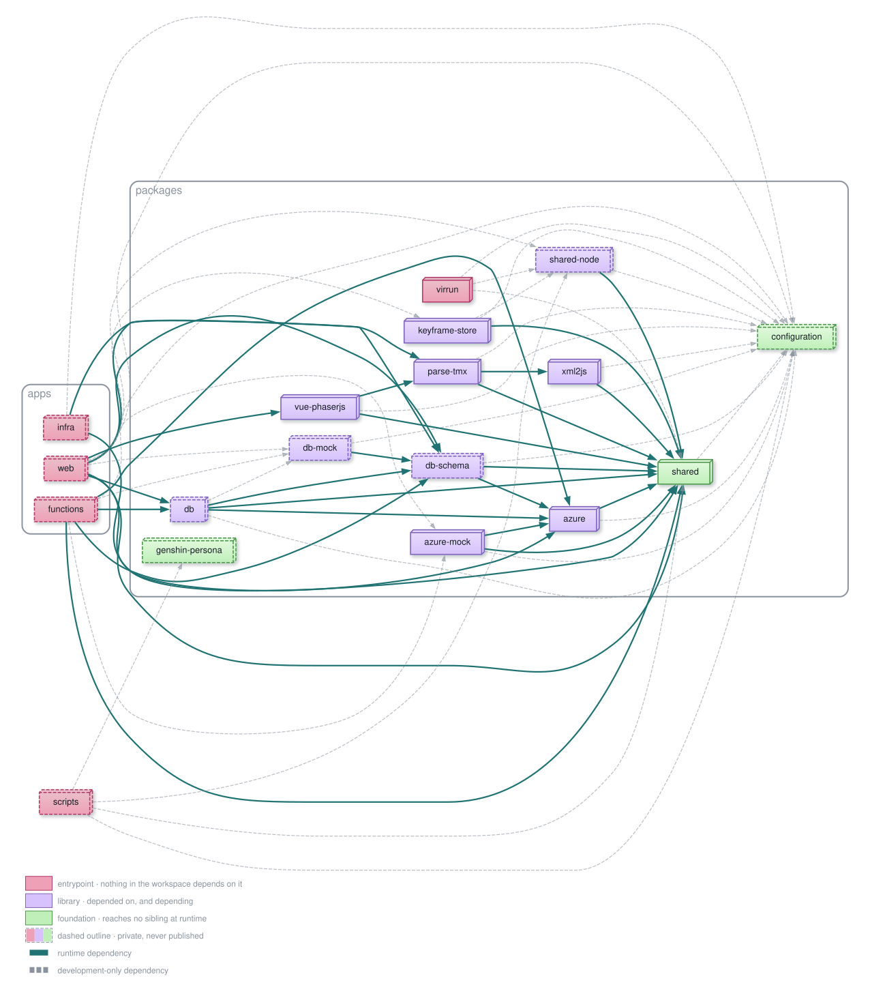
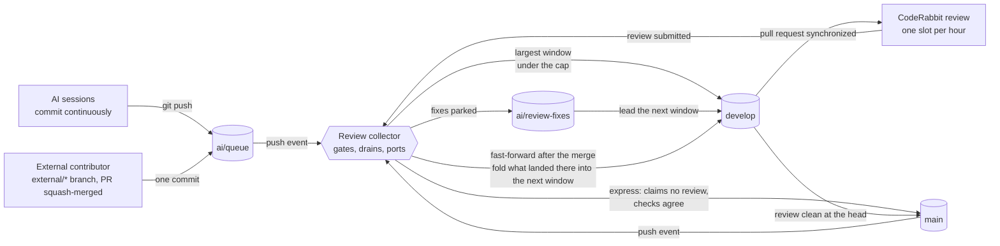

# [Esposter](https://esposter.com)

[![Build Status][badge-ci]][url-ci]
[![Repository Score][badge-score]][url-score]
[![Apache-2.0 licensed][badge-license]][url-license]

## Table of Contents

- 📖 [Documentation](#documentation)
- 🏠 [Local Development](#local-development)
- 🧱 [Architecture](#architecture)
- 📦 [Packages](#packages)
- 🔌 [Claude Code Plugins](#claude-code-plugins)
- 🤝 [Community](#community)
- ⚖️ [License](#license)

## <a name="documentation">📖 Documentation</a>

We highly recommend you take a look at the [documentation](https://esposter.com/docs) to level up.

### Frontend

<table>
  <thead>
    <tr>
      <th width="2000" colspan="2">
        
      </th>
    </tr>
  </thead>
  <tbody>
    <tr>
      <td width="80" align="center" valign="top">
        <br />
        <a href="https://nuxt.com">
          
        </a>
      </td>
      <td valign="top">
        <h3>Nuxt</h3>
        <p>
          The Intuitive Web Framework, based on Vue.
        </p>
      </td>
    </tr>
    <tr>
      <td width="80" align="center" valign="top">
        <br />
        <a href="https://vuejs.org">
          
        </a>
      </td>
      <td valign="top">
        <h3>Vue</h3>
        <p>
          🖖 Vue.js is a progressive, incrementally-adoptable JavaScript framework for building UI on the web.
        </p>
      </td>
    </tr>
    <tr>
      <td width="80" align="center" valign="top">
        <br />
        <a href="https://next.vuetifyjs.com">
          
        </a>
      </td>
      <td valign="top">
        <h3>Vuetify</h3>
        <p>
          🐉 Material Component Framework for Vue.
        </p>
      </td>
    </tr>
    <tr>
      <td width="80" align="center" valign="top">
        <br />
        <a href="https://pinia.vuejs.org">
          
        </a>
      </td>
      <td valign="top">
        <h3>Pinia</h3>
        <p>
          🍍 Intuitive, type safe, light and flexible Store for Vue using the composition api with DevTools support.
        </p>
      </td>
    </tr>
  </tbody>
</table>

### Backend

<table>
  <thead>
    <tr>
      <th width="2000" colspan="2">
      </th>
    </tr>
  </thead>
  <tbody>
    <tr>
      <td width="80" align="center" valign="top">
        <br />
        <a href="https://trpc.io">
          
        </a>
      </td>
      <td>
        <h3>tRPC</h3>
        <p>
          🧙‍♀️ Move Fast and Break Nothing. End-to-end typesafe APIs made easy.
        </p>
      </td>
    </tr>
    <tr>
      <td width="80" align="center" valign="top">
        <br />
        <a href="https://zod.dev">
          
        </a>
      </td>
      <td>
        <h3>Zod</h3>
        <p>
          TypeScript-first schema validation with static type inference.
        </p>
      </td>
    </tr>
    <tr>
      <td width="80" align="center" valign="top">
        <br />
        <a href="https://orm.drizzle.team">
          
        </a>
      </td>
      <td valign="top">
        <h3>Drizzle ORM</h3>
        <p>
          TypeScript ORM that feels like writing SQL.
        </p>
      </td>
    </tr>
    <tr>
      <td width="80" align="center" valign="top">
        <br />
        <a href="https://www.postgresql.org">
          
        </a>
      </td>
      <td valign="top">
        <h3>PostgreSQL</h3>
        <p>
          PostgreSQL is a powerful, open source object-relational database system with over 35 years of active development that has earned it a strong reputation for reliability, feature robustness, and performance.
        </p>
      </td>
    </tr>
  </tbody>
</table>

### Infrastructure

<table>
  <thead>
    <tr>
      <th width="2000" colspan="2">
      </th>
    </tr>
  </thead>
  <tbody>
    <tr>
      <td width="80" align="center" valign="top">
        <br />
        <a href="https://www.pulumi.com">
          
        </a>
      </td>
      <td valign="top">
        <h3>Pulumi</h3>
        <p>
          Infrastructure as Code in any programming language.
        </p>
      </td>
    </tr>
  </tbody>
</table>

### Hosting & Domain Providers

<table>
  <thead>
    <tr>
      <th width="2000" colspan="2">
      </th>
    </tr>
  </thead>
  <tbody>
    <tr>
      <td width="80" align="center" valign="top">
        <br />
        <a href="https://railway.app">
          
        </a>
      </td>
      <td>
        <h3>Railway</h3>
        <p>
          Infrastructure, Instantly.
        </p>
      </td>
    </tr>
    <tr>
      <td width="80" align="center" valign="top">
        <br />
        <a href="https://www.namecheap.com">
          
        </a>
      </td>
      <td valign="top">
        <h3>Namecheap</h3>
        <p>
          ICANN-accredited domain name registrar providing domain name registration and web hosting.
        </p>
      </td>
    </tr>
  </tbody>
</table>

### VSCode Extensions

| Name                       | Link                                                                                    |
| -------------------------- | --------------------------------------------------------------------------------------- |
| Better Comments            | https://marketplace.visualstudio.com/items?itemName=aaron-bond.better-comments          |
| UnoCSS                     | https://marketplace.visualstudio.com/items?itemName=antfu.unocss                        |
| ESLint                     | https://marketplace.visualstudio.com/items?itemName=dbaeumer.vscode-eslint              |
| GitLens — Git supercharged | https://marketplace.visualstudio.com/items?itemName=eamodio.gitlens                     |
| GitHub Actions             | https://marketplace.visualstudio.com/items?itemName=GitHub.vscode-github-actions        |
| Azure Functions            | https://marketplace.visualstudio.com/items?itemName=ms-azuretools.vscode-azurefunctions |
| Powershell                 | https://marketplace.visualstudio.com/items?itemName=ms-vscode.PowerShell                |
| Oxfmt - Code formatter     | https://marketplace.visualstudio.com/items?itemName=oxc.oxc-vscode                      |
| Material Icon Theme        | https://marketplace.visualstudio.com/items?itemName=PKief.material-icon-theme           |
| Vue - Official (Volar)     | https://marketplace.visualstudio.com/items?itemName=Vue.volar                           |

## <a name="local-development">🏠 Local Development</a>

### Git configuration to enable symlinks

The projects make use of symlinks in the git project. On Windows, this may not work as expected without extra configuration. To configure git to create symlinks on windows, you need to enable the Windows "Developer Mode" setting, and also set the `core.symlinks` git feature using either of the following commands:

```bash
# Global setting
git config --global core.symlinks true

# Local setting
git config core.symlinks true
```

After applying this setting, you may need to reset your local branch to ensure the files get rewritten as symlinks. Note that this step is destructive and you will want to push any changes you have made prior to resetting your branch.

```bash
git reset --hard
```

### Installing Dependencies

1. Install Node Modules:

```bash
pnpm i
```

2. Install [PostgreSQL + PgAdmin](https://www.postgresql.org/download).

3. Add `.env` file according to `.env.example` in `apps/web` directory.

Checkout the [deployment documentation](https://nuxt.com/docs/getting-started/deployment) for more information.

### Development Server

1. Build the packages to be used by the application:

```bash
pnpm build:packages
```

2. Change to the app directory:

```bash
cd apps/web
```

3. Start the development server on <http://localhost:3000>

```bash
pnpm dev
```

### Production

Build the application for production:

```bash
pnpm build
```

Locally preview production build:

```bash
pnpm preview
```

## <a name="architecture">🧱 Architecture</a>

Esposter is a pnpm workspaces monorepo. See [monorepo tooling](https://github.com/Esposter/Esposter/blob/main/apps/web/content/docs/architecture/monorepo-tooling.md) for workspace script orchestration and publishing boundaries.
Packages are used directly by the nuxt application via `workspace:*`.

### Workspace Graph

[](https://github.com/Esposter/Esposter/blob/main/dependency-graph.svg)

Each node's hue and tint are the role its edges give it, darkest at what the repo ships and lightest at what
the rest of it stands on; the key is drawn into the image.
Regenerate it from the repo root with:

```bash
pnpm graph:gen
```

### Review Collector

Three branches, each written by exactly one actor, turn a stream of AI-authored commits into reviewed releases
without anyone waiting on anyone. Sessions push to `ai/queue` as fast as they commit. The review collector — a
GitHub Actions workflow fired by every `ai/queue` push and every CodeRabbit review — drains the open findings,
ports the largest window under CodeRabbit's file cap onto `develop`, and replies on each thread with the pushed
sha. A review that comes back clean merges `develop` to `main` itself, and the push to `main` runs the same
collector, which fast-forwards `develop` back onto it. A window is budgeted in **files** and spent on
**findings**, so a commit that claims nothing in it needs a reviewer carries that claim as a trailer, and the
collector cuts it straight to `main` once the checks pass on it — rather than letting a folder sweep occupy a
window it will return nothing from. An external contributor's pull request enters at the same door: opened
against `ai/queue` — never `main`, whose only pull request is the release, since any other spends the slot on
arrival — and squash-merged onto the queue by a maintainer, where the collector cuts it like any session commit.
The design and its fine print live in
[the review collector docs](https://github.com/Esposter/Esposter/tree/main/apps/web/content/docs/infra/review-collector).


```mermaid
flowchart LR
  S[AI sessions<br/>commit continuously] -->|git push| Q[(ai/queue)]
  Q -->|push event| C{{Review collector<br/>gates, drains, ports}}
  C -->|largest window<br/>under the cap| D[(develop)]
  C -->|express: claims no review,<br/>checks agree| M
  D -->|pull request synchronized| R[CodeRabbit review<br/>one slot per hour]
  R -->|review submitted| C
  C -->|fixes parked| F[(ai/review-fixes)]
  F -->|lead the next window| D
  D -->|review clean at the head| M[(main)]
  P[External contributor<br/>external/* branch, PR squash-merged] -->|one commit| Q
  M -->|push event| C
  C -->|fast-forward after the merge<br/>fold what landed there into the next window| D
```

## <a name="packages">📦 Packages</a>

| Package                                                                                                         | Description                                                                                         | Published |
| --------------------------------------------------------------------------------------------------------------- | --------------------------------------------------------------------------------------------------- | :-------: |
| [`apps/functions`](https://github.com/Esposter/Esposter/tree/main/apps/functions)                               | Serverless Azure Functions backend — push notifications, webhooks, EventGrid                        |     —     |
| [`apps/infra`](https://github.com/Esposter/Esposter/tree/main/apps/infra)                                       | Pulumi infrastructure code and migration tools for Azure resources                                  |     —     |
| [`apps/web`](https://github.com/Esposter/Esposter/tree/main/apps/web)                                           | Main Nuxt web application — frontend, server routes, tRPC API                                       |     —     |
| [`packages/agent-console-server`](https://github.com/Esposter/Esposter/tree/main/packages/agent-console-server) | Agent console host — Claude Code sessions over a token-gated loopback WebSocket                     |     ✓     |
| [`packages/azure`](https://github.com/Esposter/Esposter/tree/main/packages/azure)                               | Azure wire conventions — OData filter clauses, entity key casing, service limits                    |     ✓     |
| [`packages/azure-mock`](https://github.com/Esposter/Esposter/tree/main/packages/azure-mock)                     | Mock Azure service classes for local dev and testing                                                |     ✓     |
| [`packages/configuration`](https://github.com/Esposter/Esposter/tree/main/packages/configuration)               | Shared ESLint, TSConfig, and tsdown build configurations                                            |     —     |
| [`packages/db`](https://github.com/Esposter/Esposter/tree/main/packages/db)                                     | Database connection utilities for Drizzle ORM, Azure Table, Blob, and WebPubSub                     |     —     |
| [`packages/db-mock`](https://github.com/Esposter/Esposter/tree/main/packages/db-mock)                           | In-memory PGlite database factory for unit and integration tests                                    |     —     |
| [`packages/db-schema`](https://github.com/Esposter/Esposter/tree/main/packages/db-schema)                       | Drizzle ORM schemas and migrations (PostgreSQL source of truth)                                     |     —     |
| [`packages/genshin-persona`](https://github.com/Esposter/Esposter/tree/main/packages/genshin-persona)           | Claude Code plugin — a Genshin character picked by birthday, replies spoken in its own cloned voice |     —     |
| [`packages/keyframe-store`](https://github.com/Esposter/Esposter/tree/main/packages/keyframe-store)             | Content-addressed version store — zstd keyframes and deltas over any backend                        |     ✓     |
| [`packages/parse-tmx`](https://github.com/Esposter/Esposter/tree/main/packages/parse-tmx)                       | Parser for Tiled Map Editor `.tmx` files                                                            |     ✓     |
| [`packages/shared`](https://github.com/Esposter/Esposter/tree/main/packages/shared)                             | Shared TypeScript types, utilities, and error classes                                               |     ✓     |
| [`packages/shared-node`](https://github.com/Esposter/Esposter/tree/main/packages/shared-node)                   | Node-only shared tooling — benchmark reporting for vitest bench runs                                |     —     |
| [`packages/virrun`](https://github.com/Esposter/Esposter/tree/main/packages/virrun)                             | Ephemeral, in-memory virtual runner — runs a repo's real toolchain isolated                         |     ✓     |
| [`packages/vue-phaserjs`](https://github.com/Esposter/Esposter/tree/main/packages/vue-phaserjs)                 | Phaser game engine integration for Vue                                                              |     ✓     |
| [`packages/xml2js`](https://github.com/Esposter/Esposter/tree/main/packages/xml2js)                             | TypeScript rewrite of xml2js — XML ↔ JSON conversion                                                |     ✓     |
| [`scripts`](https://github.com/Esposter/Esposter/tree/main/scripts)                                             | The repository's own tooling — workspace graph, dependency report, sweep scans                      |     —     |

## <a name="claude-code-plugins">🔌 Claude Code Plugins</a>

This repository is also a Claude Code plugin marketplace named `esposter`, declared in [`.claude-plugin/marketplace.json`](https://github.com/Esposter/Esposter/blob/main/.claude-plugin/marketplace.json). Anyone adds it by the repository's GitHub name and installs a plugin by its marketplace name:

```bash
claude plugin marketplace add Esposter/Esposter
claude plugin install genshin-persona@esposter
```

| Plugin                                                                                       | What it does                                                                                                                                                                     |
| :------------------------------------------------------------------------------------------- | :------------------------------------------------------------------------------------------------------------------------------------------------------------------------------- |
| [`genshin-persona`](https://github.com/Esposter/Esposter/tree/main/packages/genshin-persona) | Speaks as the Genshin Impact character whose birthday is nearest to today, in prose only, and reads each reply aloud, a sentence at a time, in the character's own cloned voice. |

A plugin here is an ordinary workspace package, so it is formatted, linted, tested and dependency-bumped with everything else, and a merge to `main` is its release: an installed copy follows the marketplace on the next plugin update. How that is built, and what it deliberately does not do, is on the [Claude interface](https://esposter.com/docs/infra/claude-interface) page.

## <a name="community">🤝 Community</a>

We welcome contributions from everyone and are committed to maintaining a friendly, safe, and welcoming community. Please see our [Code of Conduct](CODE_OF_CONDUCT.md) and [Security Policy](SECURITY.md) for more information.

## <a name="license">⚖️ License</a>

This project is licensed under the [Apache-2.0 license](https://github.com/Esposter/Esposter/blob/main/LICENSE).

[badge-ci]: https://github.com/Esposter/Esposter/actions/workflows/CI.yaml/badge.svg?event=push&branch=main
[url-ci]: https://github.com/Esposter/Esposter/actions/workflows/CI.yaml?query=event%3Apush+branch%3Amain
[badge-license]: https://img.shields.io/github/license/Esposter/Esposter.svg?color=blue
[url-license]: https://github.com/Esposter/Esposter/blob/main/LICENSE
[badge-score]: https://img.shields.io/badge/score-95%2F100-33c854
[url-score]: https://github.com/Esposter/Esposter/blob/main/SCORE.md
[url-npm]: https://www.npmjs.com/package/Esposter/v/latest
