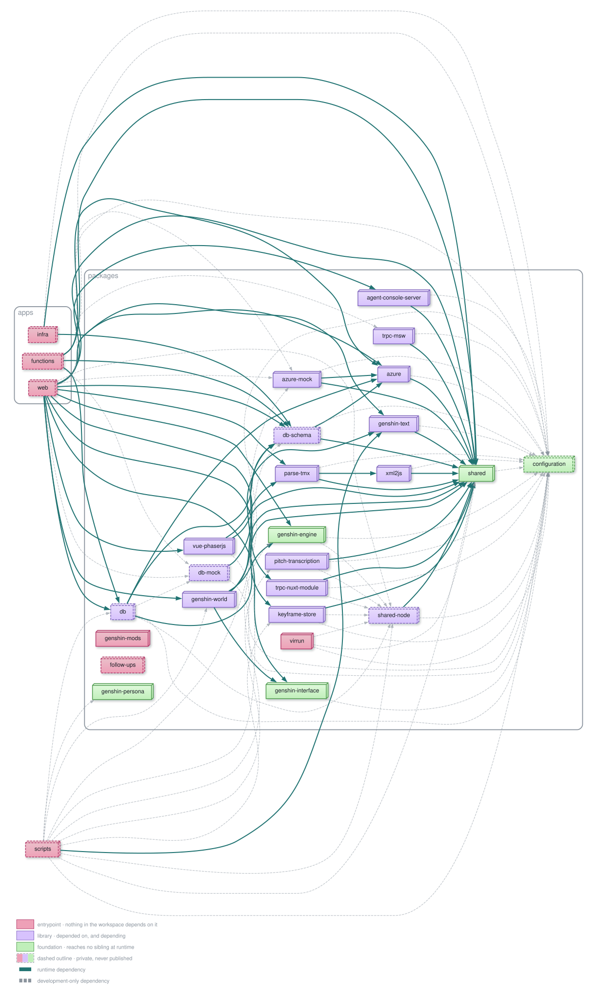
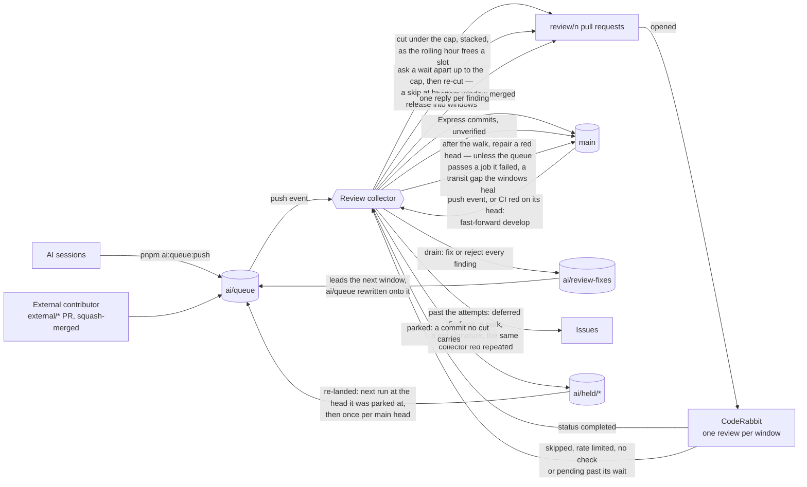

# [Esposter](https://esposter.com)

[![Build Status][badge-ci]][url-ci]
[![Repository Score][badge-score]][url-score]
[![Apache-2.0 licensed][badge-license]][url-license]

## Table of Contents

- 📖 [Documentation](#documentation)
- 🏠 [Local Development](#local-development)
- 🧱 [Architecture](#architecture)
- 📦 [Packages](#packages)
- 🔌 [Claude Code Plugins](#claude-code-plugins)
- 🤝 [Community](#community)
- ⚖️ [License](#license)

## <a name="documentation">📖 Documentation</a>

We highly recommend you take a look at the [documentation](https://esposter.com/docs) to level up.

### Frontend

<table>
  <thead>
    <tr>
      <th width="2000" colspan="2">
        
      </th>
    </tr>
  </thead>
  <tbody>
    <tr>
      <td width="80" align="center" valign="top">
        <br />
        <a href="https://nuxt.com">
          
        </a>
      </td>
      <td valign="top">
        <h3>Nuxt</h3>
        <p>
          The Intuitive Web Framework, based on Vue.
        </p>
      </td>
    </tr>
    <tr>
      <td width="80" align="center" valign="top">
        <br />
        <a href="https://vuejs.org">
          
        </a>
      </td>
      <td valign="top">
        <h3>Vue</h3>
        <p>
          🖖 Vue.js is a progressive, incrementally-adoptable JavaScript framework for building UI on the web.
        </p>
      </td>
    </tr>
    <tr>
      <td width="80" align="center" valign="top">
        <br />
        <a href="https://0.vuetifyjs.com">
          
        </a>
      </td>
      <td valign="top">
        <h3>Vuetify 0</h3>
        <p>
          🐉 Headless building blocks for Vue, under the app's own UI library.
        </p>
      </td>
    </tr>
    <tr>
      <td width="80" align="center" valign="top">
        <br />
        <a href="https://pinia.vuejs.org">
          
        </a>
      </td>
      <td valign="top">
        <h3>Pinia</h3>
        <p>
          🍍 Intuitive, type safe, light and flexible Store for Vue using the composition api with DevTools support.
        </p>
      </td>
    </tr>
  </tbody>
</table>

### Backend

<table>
  <thead>
    <tr>
      <th width="2000" colspan="2">
      </th>
    </tr>
  </thead>
  <tbody>
    <tr>
      <td width="80" align="center" valign="top">
        <br />
        <a href="https://trpc.io">
          
        </a>
      </td>
      <td>
        <h3>tRPC</h3>
        <p>
          🧙‍♀️ Move Fast and Break Nothing. End-to-end typesafe APIs made easy.
        </p>
      </td>
    </tr>
    <tr>
      <td width="80" align="center" valign="top">
        <br />
        <a href="https://zod.dev">
          
        </a>
      </td>
      <td>
        <h3>Zod</h3>
        <p>
          TypeScript-first schema validation with static type inference.
        </p>
      </td>
    </tr>
    <tr>
      <td width="80" align="center" valign="top">
        <br />
        <a href="https://orm.drizzle.team">
          
        </a>
      </td>
      <td valign="top">
        <h3>Drizzle ORM</h3>
        <p>
          TypeScript ORM that feels like writing SQL.
        </p>
      </td>
    </tr>
    <tr>
      <td width="80" align="center" valign="top">
        <br />
        <a href="https://www.postgresql.org">
          
        </a>
      </td>
      <td valign="top">
        <h3>PostgreSQL</h3>
        <p>
          PostgreSQL is a powerful, open source object-relational database system with over 35 years of active development that has earned it a strong reputation for reliability, feature robustness, and performance.
        </p>
      </td>
    </tr>
  </tbody>
</table>

### Infrastructure

<table>
  <thead>
    <tr>
      <th width="2000" colspan="2">
      </th>
    </tr>
  </thead>
  <tbody>
    <tr>
      <td width="80" align="center" valign="top">
        <br />
        <a href="https://www.pulumi.com">
          
        </a>
      </td>
      <td valign="top">
        <h3>Pulumi</h3>
        <p>
          Infrastructure as Code in any programming language.
        </p>
      </td>
    </tr>
  </tbody>
</table>

### Hosting & Domain Providers

<table>
  <thead>
    <tr>
      <th width="2000" colspan="2">
      </th>
    </tr>
  </thead>
  <tbody>
    <tr>
      <td width="80" align="center" valign="top">
        <br />
        <a href="https://railway.app">
          
        </a>
      </td>
      <td>
        <h3>Railway</h3>
        <p>
          Infrastructure, Instantly.
        </p>
      </td>
    </tr>
    <tr>
      <td width="80" align="center" valign="top">
        <br />
        <a href="https://www.namecheap.com">
          
        </a>
      </td>
      <td valign="top">
        <h3>Namecheap</h3>
        <p>
          ICANN-accredited domain name registrar providing domain name registration and web hosting.
        </p>
      </td>
    </tr>
  </tbody>
</table>

### VSCode Extensions

| Name                       | Link                                                                                    |
| -------------------------- | --------------------------------------------------------------------------------------- |
| Better Comments            | https://marketplace.visualstudio.com/items?itemName=aaron-bond.better-comments          |
| UnoCSS                     | https://marketplace.visualstudio.com/items?itemName=antfu.unocss                        |
| ESLint                     | https://marketplace.visualstudio.com/items?itemName=dbaeumer.vscode-eslint              |
| GitLens — Git supercharged | https://marketplace.visualstudio.com/items?itemName=eamodio.gitlens                     |
| GitHub Actions             | https://marketplace.visualstudio.com/items?itemName=GitHub.vscode-github-actions        |
| Azure Functions            | https://marketplace.visualstudio.com/items?itemName=ms-azuretools.vscode-azurefunctions |
| Powershell                 | https://marketplace.visualstudio.com/items?itemName=ms-vscode.PowerShell                |
| Oxfmt - Code formatter     | https://marketplace.visualstudio.com/items?itemName=oxc.oxc-vscode                      |
| Material Icon Theme        | https://marketplace.visualstudio.com/items?itemName=PKief.material-icon-theme           |
| Vue - Official (Volar)     | https://marketplace.visualstudio.com/items?itemName=Vue.volar                           |

## <a name="local-development">🏠 Local Development</a>

### Git configuration to enable symlinks

The projects make use of symlinks in the git project. On Windows, this may not work as expected without extra configuration. To configure git to create symlinks on windows, you need to enable the Windows "Developer Mode" setting, and also set the `core.symlinks` git feature using either of the following commands:

```bash
# Global setting
git config --global core.symlinks true

# Local setting
git config core.symlinks true
```

After applying this setting, you may need to reset your local branch to ensure the files get rewritten as symlinks. Note that this step is destructive and you will want to push any changes you have made prior to resetting your branch.

```bash
git reset --hard
```

### Installing Dependencies

1. Install the global [Vite+](https://viteplus.dev/guide/) CLI, then the node and pnpm versions the repository pins:

```bash
vp env install
```

2. Install Node Modules:

```bash
pnpm i
```

3. Install [PostgreSQL + PgAdmin](https://www.postgresql.org/download).

4. Add `.env` file according to `.env.example` in `apps/web` directory.

Checkout the [deployment documentation](https://nuxt.com/docs/getting-started/deployment) for more information.

### Development Server

1. Build the packages to be used by the application:

```bash
vp run build:packages
```

2. Change to the app directory:

```bash
cd apps/web
```

3. Start the development server on <http://localhost:3000>

```bash
pnpm dev
```

### Production

Build the application for production:

```bash
pnpm build
```

Locally preview production build:

```bash
pnpm preview
```

## <a name="architecture">🧱 Architecture</a>

Esposter is a pnpm workspaces monorepo. See [monorepo tooling](https://github.com/Esposter/Esposter/blob/main/apps/web/content/docs/architecture/monorepo-tooling.md) for workspace script orchestration and publishing boundaries.
Packages are used directly by the nuxt application via `workspace:*`.

### Workspace Graph

[](https://github.com/Esposter/Esposter/blob/main/dependency-graph.svg)

Each node's hue and tint are the role its edges give it, darkest at what the repo ships and lightest at what
the rest of it stands on; the key is drawn into the image.
Regenerate it from the repo root with:

```bash
pnpm graph:gen
```

### Review Collector

AI sessions commit faster than any reviewer reads, and nothing between a commit and a reviewed release waits on a
person. Each session pushes the one permanent `ai/queue` branch with `pnpm ai:queue:push`. The review collector — a
GitHub Actions workflow fired by queue pushes, CodeRabbit's status, reviews and comments, a window merging, and a red
`main` — cuts the queue into windows, each a `review/<n>` pull request under the plan's file cap, stacked so the bottom
one is based on `main` and each later one on the window below. A window opens as soon as the rolling hour frees one of
the plan's hourly reviews, however many are already open. CodeRabbit reviews each window once, on creation, and the
bottom window merges as soon as its review completes, whatever it found. A drain session holding no credential then
fixes or rejects every finding onto `ai/review-fixes`; a finding still open past the drain's attempts gets a `Deferred`
reply and one issue lists them, and the walk goes on. The fixes lead the next window — cut over several when they alone
pass the cap, a fix alone over it parked — `ai/queue` is rewritten onto them, and the collector replies once per finding
— a bot reply to that reply is never drained again unless it carries a new suggestion. A review the bot skips or a rate
limit refused past its stated deadline, a bottom window with no check, or one whose check stays pending past
`PENDING_CHECK_WAIT_MS`, is asked for a wait apart up to the ask cap (`REVIEW_ASK_WAITS_MS`) and then cut again — a
skipped window's replacement at half its cap while it stands where that window did, and a release from `develop` a
person opened into windows cut from its commits — and a window off the stack's chain of bases is closed and cut again. A
commit no window can carry past its attempts is parked on `ai/held/<short-sha>` with an issue, and re-landed by the
collector itself, on the next run at the `main` head it was parked at and then once at every later one. A commit
carrying an `Express:` trailer — its claim that nothing in it needs a reviewer — goes straight to `main` unverified, and
is parked instead once no cut applies it past its attempts — counted by its patch, which the queue's rewrites keep — or
at once when nothing in flight can move `main`. A red `main` is repaired after the walk and the openings — unless the
queue already passes a job it failed, a transit gap its windows heal, which spends nothing — each part of an attempt on
its own clock and the attempts counted per failure signature, with an issue once its attempts run out and a wake for
when the oldest of them age out. Every session runs under a wall clock, a session that never starts is retried five
minutes later, a run that fails or is killed is woken five minutes later, and a hold that lifts on a clock schedules its
own wake, so no stage needs a person to restart it. The one red left unwoken is the same step failing on the same line
in the newest runs, which a rerun would only meet again: it gets one issue, and the next push or event runs the cycle as
usual. Its pace is the review budget's, not its own: each of the plan's hourly reviews (`REVIEWS_PER_HOUR`) carries one
window under the cap, so a backlog of hundreds of queue commits takes hours to drain. What still needs a person is
billing — a CodeRabbit plan or usage credits that refuse every review, under which windows keep being cut smaller, and
the Claude Code subscription every session runs on; the tokens — the collector's `gh` login, which `gh auth logout` on
its machine stops and only a person refreshes, and the Claude Code token only a person mints; a window or a release from
`develop` a person closes without merging, which pauses the collector until it is reopened; and a commit no resolver can
land past its caps, which stays on its held branch, its issue carrying the steps that land it by hand. Every issue the
collector opens is labelled `ready-for-agent`, for a session to take up like any other. An external contributor's pull
request enters at the same door: opened from an `external/*` branch against `ai/queue` — never `main`, where it would
spend one of the plan's hourly reviews on arrival — and squash-merged onto the queue by a maintainer, where the
collector cuts it like any session commit.
The design, the plan's figures and the fine print live in
[the review collector docs](https://github.com/Esposter/Esposter/tree/main/apps/web/content/docs/infra/review-collector).


```mermaid
flowchart LR
  S[AI sessions] -->|pnpm ai:queue:push| Q[(ai/queue)]
  P[External contributor<br/>external/* PR, squash-merged] --> Q
  Q -->|push event| C{{Review collector}}
  C -->|cut under the cap, stacked,<br/>as the rolling hour frees a slot| W[review/n pull requests]
  W -->|opened| R[CodeRabbit<br/>one review per window]
  R -->|status completed| C
  R -->|skipped, rate limited, no check<br/>or pending past its wait| C
  C -->|ask a wait apart up to the cap, then re-cut —<br/>a skip at half the cap, a release into windows| W
  C -->|bottom window merged| M[(main)]
  C -->|drain: fix or reject every finding| F[(ai/review-fixes)]
  F -->|leads the next window,<br/>ai/queue rewritten onto it| Q
  C -->|one reply per finding| W
  C -->|past the attempts: deferred findings, a park,<br/>a red signature, the same collector red repeated| I[Issues]
  C -->|parked: a commit no cut carries| H[(ai/held/*)]
  H -->|re-landed: next run at the head it was parked at,<br/>then once per main head| Q
  C -->|Express commits, unverified| M
  M -->|push event, or CI red on its head:<br/>fast-forward develop| C
  C -->|after the walk, repair a red head — unless the queue<br/>passes a job it failed, a transit gap the windows heal| M
```

## <a name="packages">📦 Packages</a>

> [!WARNING]
> The published packages are built for this repository first. Use them at your own risk: their APIs may change in any release, without a deprecation period, in pursuit of better performance and simpler code.

| Package                                                                                                         | Description                                                                                                                                                                | Published |
| --------------------------------------------------------------------------------------------------------------- | -------------------------------------------------------------------------------------------------------------------------------------------------------------------------- | :-------: |
| [`apps/functions`](https://github.com/Esposter/Esposter/tree/main/apps/functions)                               | Serverless Azure Functions backend — push notifications, webhooks, EventGrid                                                                                               |     —     |
| [`apps/infra`](https://github.com/Esposter/Esposter/tree/main/apps/infra)                                       | Pulumi infrastructure code and migration tools for Azure resources                                                                                                         |     —     |
| [`apps/web`](https://github.com/Esposter/Esposter/tree/main/apps/web)                                           | Main Nuxt web application — frontend, server routes, tRPC API                                                                                                              |     —     |
| [`packages/agent-console-server`](https://github.com/Esposter/Esposter/tree/main/packages/agent-console-server) | Agent console host — Claude Code sessions over a token-gated loopback WebSocket                                                                                            |     ✓     |
| [`packages/azure`](https://github.com/Esposter/Esposter/tree/main/packages/azure)                               | Azure wire conventions — OData filter clauses, entity key casing, service limits                                                                                           |     ✓     |
| [`packages/azure-mock`](https://github.com/Esposter/Esposter/tree/main/packages/azure-mock)                     | Mock Azure service classes for local dev and testing                                                                                                                       |     ✓     |
| [`packages/configuration`](https://github.com/Esposter/Esposter/tree/main/packages/configuration)               | Shared ESLint, TSConfig, and tsdown build configurations                                                                                                                   |     —     |
| [`packages/db`](https://github.com/Esposter/Esposter/tree/main/packages/db)                                     | Database connection utilities for Drizzle ORM, Azure Table, Blob, and WebPubSub                                                                                            |     —     |
| [`packages/db-mock`](https://github.com/Esposter/Esposter/tree/main/packages/db-mock)                           | In-memory PGlite database factory for unit and integration tests                                                                                                           |     —     |
| [`packages/db-schema`](https://github.com/Esposter/Esposter/tree/main/packages/db-schema)                       | Drizzle ORM schemas and migrations (PostgreSQL source of truth)                                                                                                            |     —     |
| [`packages/follow-ups`](https://github.com/Esposter/Esposter/tree/main/packages/follow-ups)                     | Claude Code plugin — a session's unfinished follow-ups written into a TodoList and drained until none is left                                                              |     —     |
| [`packages/genshin-engine`](https://github.com/Esposter/Esposter/tree/main/packages/genshin-engine)             | Anime-style open-world engine for three.js WebGPU — toon materials, outlines, post-processing, world kits and music                                                        |     ✓     |
| [`packages/genshin-interface`](https://github.com/Esposter/Esposter/tree/main/packages/genshin-interface)       | Genshin's 2D interface — the screen root, its units and pointer, and the pieces the game's screens share                                                                   |     ✓     |
| [`packages/genshin-mods`](https://github.com/Esposter/Esposter/tree/main/packages/genshin-mods)                 | Claude Code plugin — six mods under one band: next steps, cache and usage with a one-click handoff, recording mode, a goal meter, a collision guard and a delegation guard |     ✓     |
| [`packages/genshin-persona`](https://github.com/Esposter/Esposter/tree/main/packages/genshin-persona)           | Claude Code plugin — a Genshin character picked by birthday, replies spoken in its own cloned voice                                                                        |     ✓     |
| [`packages/genshin-text`](https://github.com/Esposter/Esposter/tree/main/packages/genshin-text)                 | The game's own text in its fifteen languages — the language registry, a locale matcher, and the game's strings by text id                                                  |     ✓     |
| [`packages/genshin-world`](https://github.com/Esposter/Esposter/tree/main/packages/genshin-world)               | Genshin's world on the engine — the region catalogue, each region's data, the TresJS components and the interface screens                                                  |     ✓     |
| [`packages/keyframe-store`](https://github.com/Esposter/Esposter/tree/main/packages/keyframe-store)             | Content-addressed version store — zstd keyframes and deltas over any backend                                                                                               |     ✓     |
| [`packages/parse-tmx`](https://github.com/Esposter/Esposter/tree/main/packages/parse-tmx)                       | Parser for Tiled Map Editor `.tmx` files                                                                                                                                   |     ✓     |
| [`packages/pitch-transcription`](https://github.com/Esposter/Esposter/tree/main/packages/pitch-transcription)   | The notes in a recording — Basic Pitch on the current TensorFlow.js, its readings turned into notes, bends and MIDI                                                        |     ✓     |
| [`packages/shared`](https://github.com/Esposter/Esposter/tree/main/packages/shared)                             | Shared TypeScript types, utilities, and error classes                                                                                                                      |     ✓     |
| [`packages/shared-node`](https://github.com/Esposter/Esposter/tree/main/packages/shared-node)                   | Node-only shared tooling — benchmark reporting for vitest bench runs                                                                                                       |     —     |
| [`packages/trpc-msw`](https://github.com/Esposter/Esposter/tree/main/packages/trpc-msw)                         | tRPC for Mock Service Worker — every transport answered by tRPC's own handlers                                                                                             |     ✓     |
| [`packages/trpc-nuxt-module`](https://github.com/Esposter/Esposter/tree/main/packages/trpc-nuxt-module)         | tRPC for Nuxt — a module registering the router's HTTP and WebSocket handlers, with composables over `useAsyncData`                                                        |     ✓     |
| [`packages/virrun`](https://github.com/Esposter/Esposter/tree/main/packages/virrun)                             | Ephemeral, in-memory virtual runner — runs a repo's real toolchain isolated                                                                                                |     ✓     |
| [`packages/vue-phaserjs`](https://github.com/Esposter/Esposter/tree/main/packages/vue-phaserjs)                 | Phaser game engine integration for Vue                                                                                                                                     |     ✓     |
| [`packages/xml2js`](https://github.com/Esposter/Esposter/tree/main/packages/xml2js)                             | TypeScript rewrite of xml2js — XML ↔ JSON conversion                                                                                                                       |     ✓     |
| [`scripts`](https://github.com/Esposter/Esposter/tree/main/scripts)                                             | The repository's own tooling — workspace graph, dependency report, sweep scans                                                                                             |     —     |

## <a name="claude-code-plugins">🔌 Claude Code Plugins</a>

This repository is also a Claude Code plugin marketplace named `esposter`, declared in [`.claude-plugin/marketplace.json`](https://github.com/Esposter/Esposter/blob/main/.claude-plugin/marketplace.json). Anyone adds it by the repository's GitHub name and installs a plugin by its marketplace name:

```bash
claude plugin marketplace add Esposter/Esposter
claude plugin install genshin-persona@esposter
claude plugin install genshin-mods@esposter
```

| Plugin                                                                                       | What it does                                                                                                                                                                                                                                                                                                                                                                                          |
| :------------------------------------------------------------------------------------------- | :---------------------------------------------------------------------------------------------------------------------------------------------------------------------------------------------------------------------------------------------------------------------------------------------------------------------------------------------------------------------------------------------------- |
| [`genshin-mods`](https://github.com/Esposter/Esposter/tree/main/packages/genshin-mods)       | Six mods: five under one band above the prompt, waypoints (the next steps, one press each), resin (cache, context, limits and cost, with warm, compact and a one-click handoff), veil (recording mode), commission (a goal's task list and clock) and ward (a question before editing a file another session just changed), and a delegation guard that nudges a run of lookups toward a haiku agent. |
| [`genshin-persona`](https://github.com/Esposter/Esposter/tree/main/packages/genshin-persona) | Speaks as the Genshin Impact character whose birthday is nearest to today, in prose only, and reads each reply aloud, a sentence at a time, in the character's own cloned voice.                                                                                                                                                                                                                      |

A plugin here is an ordinary workspace package, so it is formatted, linted, tested and dependency-bumped with everything else, and a merge to `main` is its release: an installed copy follows the marketplace on the next plugin update. How that is built, and what it deliberately does not do, is on the [Claude interface](https://esposter.com/docs/infra/claude-interface) page.

## <a name="community">🤝 Community</a>

We welcome contributions from everyone and are committed to maintaining a friendly, safe, and welcoming community. Please see our [Code of Conduct](CODE_OF_CONDUCT.md) and [Security Policy](SECURITY.md) for more information.

## <a name="license">⚖️ License</a>

This project is licensed under the [Apache-2.0 license](https://github.com/Esposter/Esposter/blob/main/LICENSE).

[badge-ci]: https://github.com/Esposter/Esposter/actions/workflows/CI.yaml/badge.svg?event=push&branch=main
[url-ci]: https://github.com/Esposter/Esposter/actions/workflows/CI.yaml?query=event%3Apush+branch%3Amain
[badge-license]: https://img.shields.io/github/license/Esposter/Esposter.svg?color=blue
[url-license]: https://github.com/Esposter/Esposter/blob/main/LICENSE
[badge-score]: https://img.shields.io/badge/score-94%2F100-33c854
[url-score]: https://github.com/Esposter/Esposter/blob/main/SCORE.md
[url-npm]: https://www.npmjs.com/package/Esposter/v/latest
