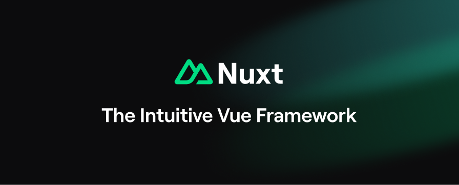

# [Esposter](https://esposter.com)

## Frontend

<table>
  <thead>
    <tr>
      <th width="2000" colspan="2">
        
      </th>
    </tr>
  </thead>
  <tbody>
    <tr>
      <td width="80" align="center" valign="top">
        <br />
        <a href="https://nuxt.com">
          
        </a>
      </td>
      <td valign="top">
        <h3>Nuxt 3</h3>
        <p>
          The Intuitive Web Framework, based on Vue 3. We highly recommend you take a look at <a href="https://nuxt.com">the Nuxt documentation</a> to level up.
        </p>
      </td>
    </tr>
    <tr>
      <td width="80" align="center" valign="top">
        <br />
        <a href="https://vuejs.org">
          
        </a>
      </td>
      <td valign="top">
        <h3>Vue 3</h3>
        <p>
          🖖 Vue.js is a progressive, incrementally-adoptable JavaScript framework for building UI on the web. We highly recommend you take a look at <a href="https://vuejs.org">the Vue 3 documentation</a> to level up.
        </p>
      </td>
    </tr>
    <tr>
      <td width="80" align="center" valign="top">
        <br />
        <a href="https://next.vuetifyjs.com">
          
        </a>
      </td>
      <td valign="top">
        <h3>Vuetify 3</h3>
        <p>
          🐉 Material Component Framework for Vue. We highly recommend you take a look at <a href="https://next.vuetifyjs.com">the Vuetify 3 documentation</a> to level up.
        </p>
      </td>
    </tr>
    <tr>
      <td width="80" align="center" valign="top">
        <br />
        <a href="https://pinia.vuejs.org">
          
        </a>
      </td>
      <td valign="top">
        <h3>Pinia</h3>
        <p>
          🍍 Intuitive, type safe, light and flexible Store for Vue using the composition api with DevTools support. We highly recommend you take a look at <a href="https://pinia.vuejs.org">the Pinia documentation</a> to level up.
        </p>
      </td>
    </tr>
  </tbody>
</table>

## Backend

<table>
  <thead>
    <tr>
      <th width="2000" colspan="2">
      </th>
    </tr>
  </thead>
  <tbody>
    <tr>
      <td width="80" align="center" valign="top">
        <br />
        <a href="https://trpc.io">
          
        </a>
      </td>
      <td>
        <h3>tRPC</h3>
        <p>
          🧙‍♀️ Move Fast and Break Nothing. End-to-end typesafe APIs made easy. We highly recommend you take a look at <a href="https://trpc.io">the tRPC documentation</a> to level up.
        </p>
      </td>
    </tr>
    <tr>
      <td width="80" align="center" valign="top">
        <br />
        <a href="https://zod.dev">
          
        </a>
      </td>
      <td>
        <h3>Zod</h3>
        <p>
          TypeScript-first schema validation with static type inference. We highly recommend you take a look at <a href="https://zod.dev">the Zod documentation</a> to level up.
        </p>
      </td>
    </tr>
    <tr>
      <td width="80" align="center" valign="top">
        <br />
        <a href="https://orm.drizzle.team">
          
        </a>
      </td>
      <td valign="top">
        <h3>Drizzle ORM</h3>
        <p>
          TypeScript ORM that feels like writing SQL. We highly recommend you take a look at <a href="https://orm.drizzle.team">the Drizzle ORM documentation</a> to level up.
        </p>
      </td>
    </tr>
    <tr>
      <td width="80" align="center" valign="top">
        <br />
        <a href="https://www.postgresql.org">
          
        </a>
      </td>
      <td valign="top">
        <h3>PostgreSQL</h3>
        <p>
          PostgreSQL is a powerful, open source object-relational database system with over 35 years of active development that has earned it a strong reputation for reliability, feature robustness, and performance. We highly recommend you take a look at <a href="https://www.postgresql.org/docs">the PostgreSQL documentation</a> to level up.
        </p>
      </td>
    </tr>
  </tbody>
</table>

## Hosting & Domain Providers

<table>
  <thead>
    <tr>
      <th width="2000" colspan="2">
      </th>
    </tr>
  </thead>
  <tbody>
    <tr>
      <td width="80" align="center" valign="top">
        <br />
        <a href="https://railway.app">
          
        </a>
      </td>
      <td>
        <h3>Railway</h3>
        <p>
          Infrastructure, Instantly. We highly recommend you take a look at <a href="https://railway.app">the Railway documentation</a> to level up.
        </p>
      </td>
    </tr>
    <tr>
      <td width="80" align="center" valign="top">
        <br />
        <a href="https://www.namecheap.com">
          
        </a>
      </td>
      <td valign="top">
        <h3>Namecheap</h3>
        <p>
          ICANN-accredited domain name registrar providing domain name registration and web hosting. We highly recommend you take a look at <a href="https://www.namecheap.com">the Namecheap documentation</a> to level up.
        </p>
      </td>
    </tr>
  </tbody>
</table>

## VSCode Extensions

[Vue Language Features (Volar)](https://marketplace.visualstudio.com/items?itemName=Vue.volar)
[](vscode:extension/Vue.volar)

[TypeScript Vue Plugin (Volar)](https://marketplace.visualstudio.com/items?itemName=Vue.vscode-typescript-vue-plugin)
[](vscode:extension/Vue.vscode-typescript-vue-plugin)

[ESLint](https://marketplace.visualstudio.com/items?itemName=dbaeumer.vscode-eslint)
[](vscode:extension/dbaeumer.vscode-eslint)

[Prettier - Code formatter](https://marketplace.visualstudio.com/items?itemName=esbenp.prettier-vscode)
[](vscode:extension/esbenp.prettier-vscode)

[GitLens — Git supercharged](https://marketplace.visualstudio.com/items?itemName=eamodio.gitlens)
[](vscode:extension/eamodio.gitlens)

[Import Cost](https://marketplace.visualstudio.com/items?itemName=wix.vscode-import-cost)
[](vscode:extension/wix.vscode-import-cost)

## Setup

1. Install the js dependencies:

```bash
# yarn
yarn install

# npm
npm install

# pnpm
pnpm install
```

2. Install PostgreSQL + PgAdmin on https://www.postgresql.org/download

3. Add `.env` file according to `.env.example`

## Development Server

Start the development server on <http://localhost:3000>

```bash
pnpm run dev
```

## Production

Build the application for production:

```bash
pnpm run build
```

Locally preview production build:

```bash
pnpm run preview
```

Checkout the [deployment documentation](https://nuxt.com/docs/getting-started/deployment) for more information.
