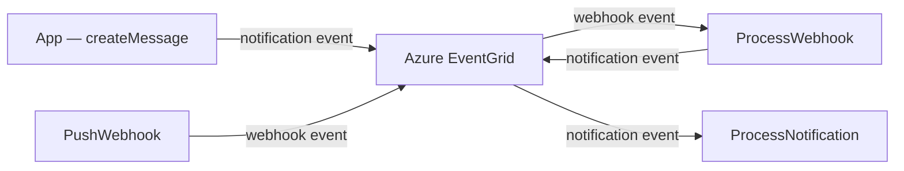

# @esposter/functions

[![Apache-2.0 licensed][badge-license]][url-license]

Serverless Azure Functions backend for Esposter. Handles asynchronous workloads triggered by Azure EventGrid events, Service Bus queues, and timers — notification delivery, webhook delivery, scheduled message jobs, and resource purging.

## Table of Contents

- 📖 [Documentation](#documentation)
- ⚖️ [License](#license)

---

## <a name="documentation">📖 Documentation</a>

We highly recommend you take a look at the [documentation](https://esposter.com/docs) to level up.

### Architecture

Most functions are triggered by **Azure EventGrid** events published by the main app; the rest run on Service Bus queues or timers. `PushWebhook` is the one publicly routed HTTP trigger. Each function handles one async concern:

| Function                      | Trigger                              | Description                                                                 |
| ----------------------------- | ------------------------------------ | --------------------------------------------------------------------------- |
| `ProcessNotification`         | EventGrid                            | Delivers every notification — resolves recipients, writes bell rows, pushes |
| `ProcessWebhook`              | EventGrid                            | Posts the message a pushed webhook carried into its room, then notifies     |
| `PushWebhook`                 | HTTP (`POST webhooks/{id}/{token}`)  | Accepts inbound webhook pushes, validating the token from the url           |
| `ProcessBlobDeletion`         | EventGrid                            | Deletes blobs durably once their owning row is gone                         |
| `ReconcileStorageLedgerEntry` | EventGrid (storage system topic)     | Charges a user's storage counter the blob's real size on `BlobCreated`      |
| `ReplayDeadLetterEvent`       | EventGrid                            | Replays dead-lettered events it can route, quarantining the rest            |
| `ProcessScheduledMessageJob`  | Service Bus (`ScheduledMessageJobs`) | Delivers `/schedule` and `/remind` messages at their due time               |
| `SendTodoReminder`            | Service Bus (`TodoReminders`)        | Publishes a `TodoReminder` notification when a TodoList item comes due      |
| `PurgeDeletedResources`       | Timer                                | Purges recycle-bin resources past their retention window                    |

### Flow

The two paths that chain through EventGrid — a message the app creates, and one a webhook pushes in. The Service Bus and timer triggers in the table above are entered on their own schedules, not from this chain.



### Commands

Run from `apps/functions/`:

```bash
pnpm build        # compile to dist/
pnpm test         # vitest watch mode (coverage is run from the repo root)
pnpm lint:fix     # auto-fix lint
pnpm typecheck    # type check
```

## <a name="license">⚖️ License</a>

This project is licensed under the [Apache-2.0 license](https://github.com/Esposter/Esposter/blob/main/LICENSE).

[badge-license]: https://img.shields.io/github/license/Esposter/Esposter.svg?color=blue
[url-license]: https://github.com/Esposter/Esposter/blob/main/LICENSE
