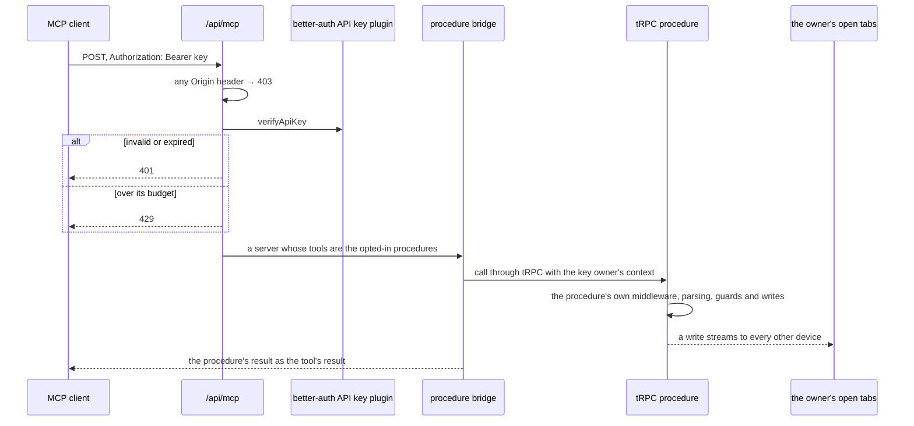

# Agent Access

A Claude Code session, or any other MCP client, reaches Esposter through one endpoint. Every read and write in the app is already a tRPC procedure that describes itself the way [write once](/docs/architecture/write-once) asks, which is everything an agent's tool needs, so the endpoint serves procedures rather than tools of its own. Exposing an operation to an agent is one line on its procedure, and nothing on this page changes when one is added.

## Opting a procedure in

The tRPC root declares a meta type with one optional key, and a procedure that should be a tool says so:

```ts
readThings: standardAuthedProcedure
  .meta({ mcp: { description: "What an agent reads this for, and when to call it" } })
  .input(readThingsInputSchema)
  .query<Thing[]>(async ({ ctx, input }) => { … }),
```

- **The description is the only new thing.** An agent chooses a tool by what it is told the tool is for, and a procedure has no other place to say it. Written for the agent: when to call it, and what its fields mean where their names do not say.
- **Its input is one object.** An MCP tool's input schema must be one, so every procedure that opts in is a query or a mutation with exactly one object input. `getMcpTools.test.ts` walks the router and fails on one that is not.
- **A procedure shaped for the browser may be the wrong shape for an agent.** The answer is a procedure shaped for the agent, never a branch in the bridge: a whole-list save at a content version is a poor tool for adding one todo, so the TodoList has its own follow-up procedures ([TodoList agent follow-ups](/docs/resource/todolist-agent-follow-ups)).

## The endpoint

`POST /api/mcp` serves the Model Context Protocol over its Streamable HTTP transport, stateless: each request builds a server, answers one JSON-RPC message with a JSON response, and closes. The server never pushes a message unprompted, so the router's 405 to any other method is the answer the transport allows.



- **`Origin` is refused.** The transport requires the server to validate it, so no web page can drive the endpoint from a reader's browser. Its callers are command-line clients, which send none, so a request carrying one is answered 403 before its key is read.
- **The key owner is the caller.** The route reads the key's owner and builds the tRPC context with a session payload for them, `getSessionPayload`, which the rate-limited middleware takes instead of reading one from the cookie. The session is never stored and authenticates nothing: its id is the key's own device, `agent-<key id>`, so the owner's open tabs take the agent's writes as another device's and show them live.
- **A tool is its procedure.** Its name is the procedure's path with the dots turned to underscores, since a tool name takes no dot in every client; its input schema is the procedure's input as JSON Schema; and calling it calls the procedure through tRPC's own call path, so its middleware, parsing, guards and rate limit all run as they do for the browser. A rejection is the tool's result, flagged as an error, so the agent reads why its call failed; a name that is no tool is a protocol error.
- **The raw arguments reach tRPC.** The bridge uses the SDK's low-level server rather than `McpServer`, which parses a tool's arguments with its schema and hands on the parsed output. tRPC would then parse that output a second time, which holds only while every input's transforms are idempotent.

## The credential

An **API key** from better-auth's own plugin, `@better-auth/api-key`, never a token table of ours: key storage and verification are security-shaped, which the [dependency admission](/docs/architecture/dependency-admission) stop list keeps in a library.

- **Stored hashed**, shown once when it is created, and listed afterwards by its name and first characters.
- **Created, listed and deleted under API keys in the user settings**, through the plugin's client. Deleting one is how a leaked key is revoked; the agent using it is refused from its next call.
- **Named**, since a key is told apart from the owner's others only by its name in that list.
- **Rate-limited per key** by the plugin, with the standard limiter's budget and window rather than the plugin's default of ten a day, since a drain calls a tool per step. Its calls also spend from the owner's own standard budget in the procedure's middleware, as any signed-in call does.
- **Never a session.** `enableSessionForAPIKeys` stays off, so a key opens nothing in the app's ordinary tRPC route. It is verified only by the MCP endpoint and reaches only the procedures that opt in there.
- **Its table is ours.** The plugin's model is `auth.apiKeys` in `@esposter/db-schema`, pointed at its export as every core auth model is, and the adapter's schema check suite runs with the plugin, so a field the plugin adds fails a test rather than a sign-in.

## Dependencies

- `@modelcontextprotocol/sdk` serves the transport and the protocol. It tracks an outside spec, so it is kept and bumped, never absorbed.
- `@better-auth/api-key` owns the keys. It is better-auth's own plugin, versioned with it.

## Key files

| File                                                                | Role                                                                     |
| ------------------------------------------------------------------- | ------------------------------------------------------------------------ |
| `apps/web/server/api/mcp.post.ts`                                   | the endpoint: `Origin`, the key, the owner's context, the transport      |
| `apps/web/server/services/mcp/createMcpServer.ts`                   | the bridge: lists the opted-in procedures and calls one through tRPC     |
| `apps/web/server/services/mcp/getMcpTools.ts`                       | walks the router for the procedures whose meta opts in                   |
| `apps/web/server/services/mcp/getMcpTools.test.ts`                  | the invariant: one object input on every procedure that opts in          |
| `apps/web/server/models/trpc/Meta.ts`                               | the meta type every procedure may opt into MCP with                      |
| `apps/web/server/trpc/context.ts`                                   | carries a session the route already authenticated                        |
| `apps/web/server/trpc/middleware/getRateLimitedMiddleware.ts`       | takes that session before reading one from the cookie                    |
| `apps/web/server/services/auth/getAgentSessionPayload.ts`           | the key owner's session payload, on the key's own device                 |
| `apps/web/server/services/auth/apiKeyPlugin.ts`                     | the API key plugin's options, shared with the adapter's test             |
| `apps/web/server/services/auth/drizzleAdapterConfiguration.test.ts` | runs better-auth's schema check with the plugin, covering `auth.apiKeys` |
| `packages/db-schema/src/schema/auth/apiKeysInAuth.ts`               | the plugin's table                                                       |
| `apps/web/app/components/User/ApiKeysCard/Index.vue`                | the API keys section of the user settings                                |

## Sources

- [Model Context Protocol — transports](https://modelcontextprotocol.io/specification/2025-06-18/basic/transports) — one endpoint path taking POST, a GET that may answer 405, optional sessions, and the requirement to validate `Origin`.
- [Better Auth — API key plugin](https://www.better-auth.com/docs/plugins/api-key) — hashed keys shown once, per-key rate limits, `verifyApiKey`, and sessions for keys as an opt-in left off here.
