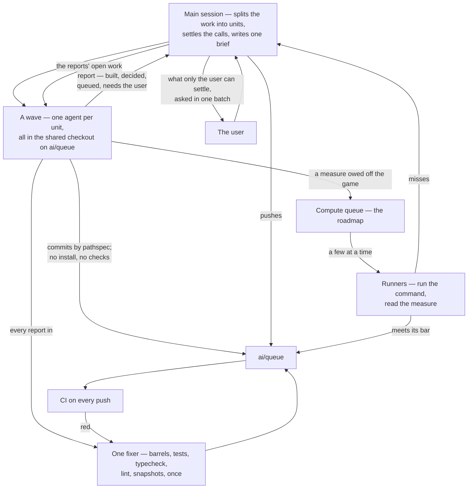

# Agent batches

A batch is how the repository builds many units of work at once, such as a whole area's proposals. The main session does the thinking: it splits the work into units, settles their design calls, writes one brief every agent reads, and reads every report. The agents do the writing, all at the same time, in the one shared checkout. Checks run once for the whole batch, never per agent, and anything that takes a long run waits in a queue for a runner instead of holding an agent.

## The flow

## Why it runs this way

- **One checkout, never a worktree per agent.** A worktree is a full install, and a wave of them fills the machine's memory and disk before any work is written. Every agent works in the shared checkout on `ai/queue` and commits only its own paths. A file several units need, such as an index page, a constants file or a sibling's proposal, is edited by whichever agent needs it. It re-reads the file just before each edit and changes only its own lines, the same way two sessions share a checkout ([review queue](/docs/infra/review-collector)).
- **No checks inside the wave.** Installs, tests and typechecks on many agents at once cost more than the work they guard, and most of what they catch is the same fix across units. When every report is in, one agent runs the batch's checks once and fixes what they find: it regenerates the barrels and runs the touched packages' tests and typecheck, lint and the bundle snapshots. CI on the push is the backstop.
- **Calls are settled before the wave, or by the agent that owns them.** A unit whose design needs judgement goes to an Opus agent trusted to decide inside it, writing each decision into its page. A unit with every call made goes to a Haiku agent. Only taste, money, licensing and the user's eyes and ears come back as questions, and they are asked in one batch.
- **Logic now, measures later.** Rules, state, navigation and shortcuts are built in the wave, as close to the game as public sources allow. A value that must be measured off the game gets a provisional constant and a [compute queue](/docs/genshin/roadmap) item. The item gives the exact command, its inputs and outputs, and the measure with its bar. A runner on the cheapest model takes it, and a miss comes back to the main session as a call, never as a second run with a guessed value.
- **No loop runs it.** Each agent's completion is the event that drives the next step: a report is read, its branch of work lands, its open work becomes the next wave's units. Nothing is scheduled and nothing polls.

## How a batch stops

A wave ends when every report is in and the fixer has run. The next wave is built only from what the reports left open. The batch converges when a wave's reports leave only items for the compute queue and questions for the user.

## Key files

| File                                                            | What it owns                                                        |
| :-------------------------------------------------------------- | :------------------------------------------------------------------ |
| `.agents/skills/llm-delegation/references/running-agents.md`    | the batch rules an agent prompt carries: shared checkout, no checks |
| `.agents/skills/llm-delegation/references/delegation-prompt.md` | what every agent's prompt holds                                     |
| `.agents/skills/genshin-parity/references/compute-queue.md`     | a queue item, and how a runner takes one                            |
| `apps/web/content/docs/genshin/roadmap.md`                      | the compute queue itself, under its own heading                     |
