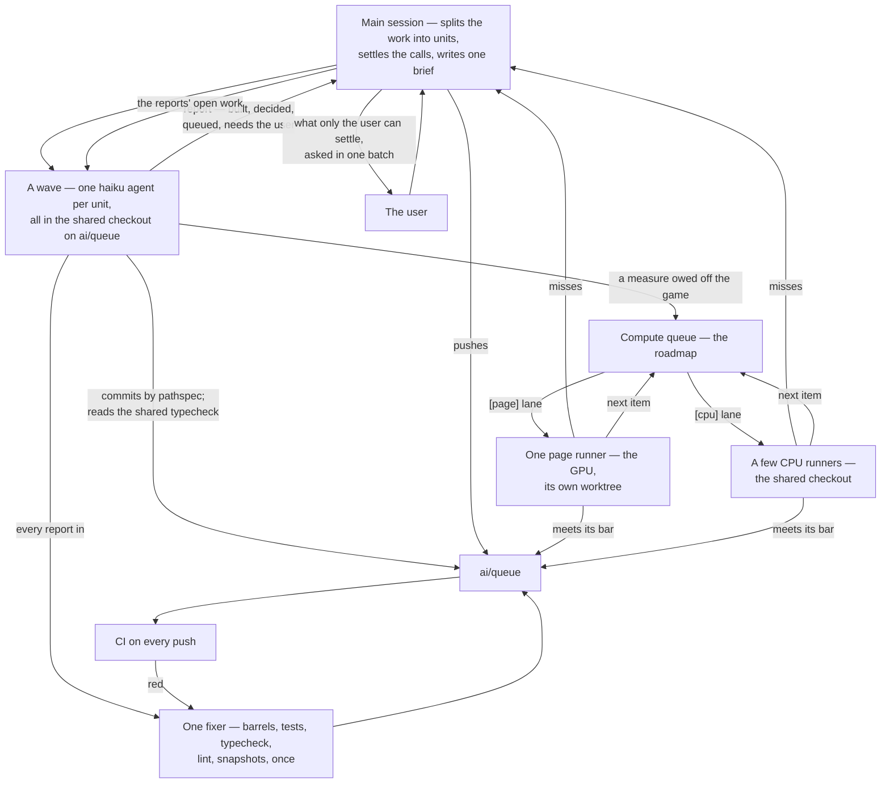

# Agent batches

A batch is how the repository builds many units of work at once, such as a whole area's proposals. The main session does the thinking: it splits the work into units, settles their design calls, writes one brief every agent reads, and reads every report. The agents do the writing, all at the same time, in the one shared checkout. Checks run once for the whole batch, never per agent, and anything that takes a long run waits in a queue for a runner instead of holding an agent.

## The flow

## Why it runs this way

- **One checkout, never a worktree per agent.** A worktree is a full install, and a wave of them fills the machine's memory and disk before any work is written. Every agent works in the shared checkout on `ai/queue` and commits only its own paths. A file several units need, such as an index page, a constants file or a sibling's proposal, is edited by whichever agent needs it. It re-reads the file just before each edit and changes only its own lines, the same way two sessions share a checkout ([review queue](/docs/infra/review-collector)).
- **Every check runs once, for every agent.** A dozen agents each typechecking a package before each commit run the same check a dozen times over a tree that changes under all of them. So the main session starts one typecheck watcher per package the wave edits, an incremental pass of seconds on the tsgo-backed compiler, and every agent reads its latest pass instead of running its own. An agent lints and tests only the files it touched, and builds only to regenerate a package's barrel after adding or removing a module file. The parity page and every sibling read a package's source, and the user's `nuxt dev` rebuilds every package itself. Such a build never cleans (`tsdown --no-clean`), so a build that fails on another agent's half-written file leaves the last good `dist` in place. Nothing runs against the app itself: its suite and typecheck take minutes. When every report is in, one fixer runs the full checks once, and CI on the push is the backstop. Searches read only what git tracks, and long runs go to whichever of the cores, the GPU or its video engine does them cheapest (the `throughput` skill's `references/machine-efficiency.md`).
- **Haiku builds every unit, its calls settled first.** The main session writes each unit's calls into its prompt, and a Haiku agent builds it, settling any further call that the existing code or a public source answers and writing it into the page. A screen matched to the game, a fix whose cause is found, a queue run and the fixer are all Haiku's. An Opus agent never implements; it writes a spec or a proposal too large for the main session. Only taste, money, licensing and the user's eyes and ears come back as questions, and they are asked in one batch.
- **Logic now, measures later.** Rules, state, navigation and shortcuts are built in the wave, as close to the game as public sources allow. A value that must be measured off the game gets a provisional constant and a [compute queue](/docs/genshin/roadmap) item. The item gives the exact command, its inputs and outputs, and the measure with its bar. A runner on the cheapest model takes it, and a miss comes back to the main session as a call, never as a second run with a guessed value.
- **Every resource busy, none thrashing.** While the batch is open the main session keeps three things working at once: the agents on their units, the GPU on the queue's page lane, and the cores on its CPU lane. The page lane has one runner, in one reused runner worktree, so the wave's edits never reload the page under a run; the CPU lane runs a few runners in the shared checkout. Before each run a runner reads the free memory and waits under about 4 GB, since a machine that swaps slows every run more than one that waits ([the compute queue](/docs/genshin/roadmap)).
- **No loop runs it.** Each agent's completion is the event that drives the next step: a report is read, its work lands, its open work becomes the next wave's units, and an item it queued starts a runner if its lane has none. A runner loops through its lane by itself until the lane is empty. Nothing is scheduled and nothing polls.

## How a batch stops

A wave ends when every report is in and the fixer has run. The next wave is built only from what the reports left open. The batch converges when a wave's reports leave only items for the compute queue and questions for the user.

## Key files

| File                                                            | What it owns                                                                  |
| :-------------------------------------------------------------- | :---------------------------------------------------------------------------- |
| `.agents/skills/llm-delegation/references/running-agents.md`    | the batch rules an agent prompt carries: shared checkout, package checks only |
| `.agents/skills/llm-delegation/references/delegation-prompt.md` | what every agent's prompt holds                                               |
| `.agents/skills/throughput/references/machine-efficiency.md`    | every check once, searches, long runs, the GPU: the recipes                   |
| `.agents/skills/genshin-parity/references/compute-queue.md`     | a queue item, and how a runner takes one                                      |
| `apps/web/content/docs/genshin/roadmap.md`                      | the compute queue itself, under its own heading                               |
