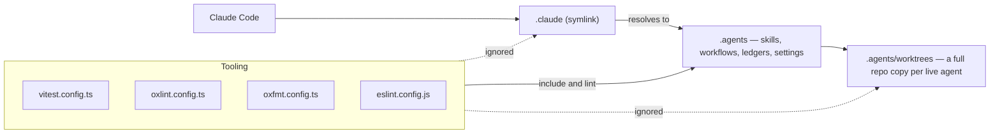
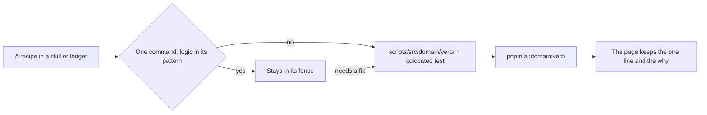

# Agent configuration

Coding agents read a tree of repo-specific configuration: skills that state conventions, workflow scripts, sweep ledgers, and the permission allowlist. That tree is stored **once**, at `.agents/`, under a vendor-neutral name. `.claude` is a symlink pointing at it, so Claude Code — the agent this repo is driven by day to day — resolves `.claude/skills` and `.claude/settings.local.json` without a second copy of anything. The same idea already governs the instruction file: `AGENTS.md` is the real file, and `CLAUDE.md` and `GEMINI.md` are symlinks to it.

The direction matters. The vendor-neutral path owns the bytes and every tool configuration is written against it; the vendor path is the alias. Adding a second agent means adding a second symlink, never moving files or teaching the toolchain a new root.

## Every tool reads the real path

Globbers follow directory symlinks. A repo-wide walk that treated `.claude` as an ordinary directory would therefore enumerate the entire agent tree a second time under a second name — and, worse, would do so through the worktrees directory, where each entry is a full copy of the monorepo. So the alias is ignored everywhere and the real path is what tools are pointed at.

`AGENT_DIRECTORY`, `AGENT_ALIAS_DIRECTORY` and `AGENT_WORKTREES_DIRECTORY` in `@esposter/configuration` are the single source for all three paths, so anything that can import interpolates them instead of repeating a literal. The rest cannot reach them — `.gitignore` has no imports, and `oxlint.config.ts` and `oxfmt.config.ts` are loaded by their tool before any workspace package is built (the CI format job installs the root project alone) — so they repeat the literal and `scripts/src/workspace/agentDirectories.test.ts` pins every copy to its constant. A copy has been silently un-excluded before by an unrelated edit widening a glob, and nothing else would have noticed.

Which literal a tool needs follows from how far it walks, so the two exclusions are not interchangeable:

| Exclusion           | Needed by          | Not needed by                                                                                                                                                    |
| ------------------- | ------------------ | ---------------------------------------------------------------------------------------------------------------------------------------------------------------- |
| `.claude` alias     | oxlint             | oxfmt and VS Code search, neither of which follows a directory symlink; git, which stores it                                                                     |
| `.agents/worktrees` | oxlint, oxfmt, git | Vitest and TypeDoc, whose globs are rooted at the workspace members; the root TypeScript program, which compiles the root config files and descends into nothing |

ESLint states neither. The shared config bridges `oxlint.config.ts`'s `ignorePatterns` into flat-config global `ignores` through `eslint-plugin-oxlint`, so one list governs both linters and the root `eslint.config.js` only ignores the workspace members, each of which lints itself.

Only the agent harness's machine-local `.git/info/exclude` hides live worktrees from git on the machine that made them. No clone, CI runner, or non-git tool ever reads that file, which is why `.gitignore` carries the exclusion too and each tool states it in its own configuration.

One vendor path sits beside the tree rather than inside it: `.claude-plugin/marketplace.json`, which makes the repository a Claude Code plugin marketplace. The tool reads that file at that exact root path and no other, so it cannot be moved under `.agents/` or aliased; it names the plugins the repository ships, each a workspace package ([persona plugin](/docs/infra/claude-interface/persona-plugin)), and holds nothing an agent reads.

The plugin commands write `.agents/settings.json` rather than a local sibling, because that is where the enable they are toggling lives: `claude plugin disable` flips the checked-in `true` to `false` and `enable` flips it back, so either leaves a tracked file modified and a session that commits by pathspec without reading `git status` ships it to every clone. There is no untracked escape hatch — `.agents/settings.local.json` is checked in too, holding permissions and nothing else (`claude-permissions`).

## An agent's programs live in `scripts/`, not in `.agents/`

A recipe pasted into a skill page or a ledger rots silently, for the reasons `.agents/skills/skill-authoring/references/embedded-recipes.md` gives. So a recipe that is more than one command has its entrypoint at `scripts/src/<domain>/<verb>/index.ts` and its functions under `scripts/src/services/<domain>/<verb>/` with a colocated test, where the repository's own toolchain already reaches it: no runner, project or config entry is added to make that work.

The tree stays free of executables for one reason — it is the rules an agent reads, and a path inside it should never have to be asked whether it is a rule or a tool. A check **about** the agent tree is an ordinary `scripts` test, which is why `scripts/src/workspace/agentDirectories.test.ts` sits with the other workspace invariants rather than beside the thing it checks.

Those scripts are named **`ai:<domain>:`**`<verb>`, and the prefix is decided by audience rather than by what the script does: `ai:sweep:*` carries the sweep scans, `ai:coderabbit:*` the review tooling, while `graph:gen`, `outdated:dependencies` and `update:node` — what a person runs by hand — keep their plain names. The prefix guards nothing; it tells whoever opens the manifest which entries were not written for them.

## Configuration there, documentation in public

Documentation is **public by default**. Everything explanatory lives in `apps/web/content/docs`, ships with the app, and is readable at `/docs` on the deployed site — it is written for a person in a browser, and hiding it in a dotfolder is what stops it being read. See [monorepo tooling](/docs/architecture/monorepo-tooling) for how that package is built and published.

`.agents/` holds only what a machine consumes:

| Lives in `.agents/`                                  | Lives in the docs                                  |
| ---------------------------------------------------- | -------------------------------------------------- |
| Skills — conventions written as agent instructions   | The decision a convention encodes, and its why     |
| The `ai:`-prefixed scripts' invocations              | What a script is for and when to reach for it      |
| Sweep ledgers — per-unit progress state              | The convention a sweep is carrying across the repo |
| Harness settings and the permission allowlist        | Nothing — it is pure tool configuration            |
| Issue tracker, triage label, and domain-doc pointers | Nothing — command recipes for one toolchain        |

The test is whether a human would ever want to read it on the website. If the answer is yes, it is documentation and belongs under `content/docs`; a skill then links to that page instead of restating it, so one topic keeps one owner.

## Vendored skills

A third-party skill the repository depends on — Vuetify 0's, for the [UI library](/docs/architecture/ui-library) — is copied into `.agents/skills/` by the skills installer, run through `pnpm dlx`, and committed, so every checkout and every cloud session has it without an install step. The installer records what it copied in `skills-lock.json` at the repository root, and that record is what the installer's "update" command refreshes from.

A vendored skill is a dependency, not ours: its frontmatter, prose and citations are its publisher's. So every scan over the agent tree — the skill-docs checks, the citation and stale-name tests, the prose sweeps and the skills ledger — reads the lock file and leaves the skills it names out, the way it leaves `node_modules` out. The exclusion is derived from the installer's own record, so installing or removing a skill needs no edit anywhere else. Where a vendored skill's advice and the repository's conventions meet, the repository's skill names it and says which wins, as the `ui-library` skill does.

## The engineering skills look for `docs/agents/`

The installed Matt Pocock engineering skills — `triage`, `to-tickets`, `to-spec`, `wayfinder`, `grill-with-docs`,
`improve-codebase-architecture` — were scaffolded to read their configuration from `docs/agents/*.md`, and several
say so literally: one of them tells the user to re-run `/setup-matt-pocock-skills` when `docs/agents/issue-tracker.md`
is missing. **It is not missing; it is at `.agents/issue-tracker.md`**, because this repo has no root `docs/` folder
at all — `apps/web/content/docs` is the public docs site, and a second root-level `docs/` would read as a rival
to it.

`AGENTS.md` names the real paths, so a skill that reads the instruction file first finds them. Re-running the setup
skill is what to avoid: it writes a fresh copy under `docs/agents/`, leaving two sources of truth and creating the
root `docs/` folder this layout exists to avoid. Point the skill at `.agents/` instead.

## Key files

| Path                                                    | Role                                                                                                                                     |
| ------------------------------------------------------- | ---------------------------------------------------------------------------------------------------------------------------------------- |
| `.agents`                                               | The agent tree — skills, workflows, ledgers, harness settings                                                                            |
| `.agents/settings.json`                                 | Checked-in harness settings — the marketplace a checkout declares for itself, the plugin it enables, and the auto-update that re-pins it |
| `scripts/src/services/sweeps/readVendoredSkillNames.ts` | Reads the lock file's skill names, which `readSweepFilePaths` and the skills ledger leave out                                            |
| `skills-lock.json`                                      | The skills installer's record of the vendored skills, which every agent-tree scan leaves out                                             |
| `.claude`                                               | Symlink alias to `.agents` so Claude Code resolves its own paths                                                                         |
| `.claude-plugin/marketplace.json`                       | The repository as a Claude Code plugin marketplace — the one vendor path the tool fixes at root                                          |
| `AGENTS.md`                                             | Repo instruction file — `CLAUDE.md` and `GEMINI.md` are symlinks to it                                                                   |
| `packages/configuration/src/constants.ts`               | `AGENT_DIRECTORY`, `AGENT_ALIAS_DIRECTORY` and `AGENT_WORKTREES_DIRECTORY`                                                               |
| `scripts/src/workspace/agentDirectories.test.ts`        | Pins both exclusions in the configs that cannot import the constants                                                                     |
| `scripts/src/workspace/citations.test.ts`               | Fails on a cited repo path or skill name in the docs, the tree or a README that resolves nowhere                                         |
| `scripts/src/workspace/skillDocs.test.ts`               | Fails on every `ai:sweep:skill-docs` finding but the budget                                                                              |
| `scripts/src/workspace/staleNames.test.ts`              | Fails on a backticked code name in the same trees that neither the tree nor a dependency holds                                           |
