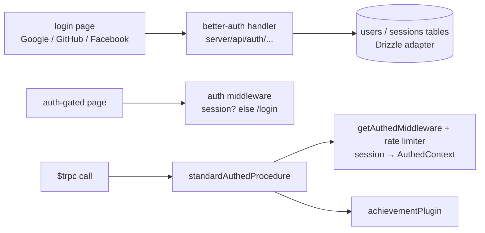

# Auth

Authentication is OAuth-only through [better-auth](https://better-auth.com) with the Drizzle adapter — Google, GitHub, and Facebook — mounted at the catch-all `server/api/auth/[...].ts`. Sessions are cookie-based; the Vue client reads them through `authClient.useSession` (better-auth's Vue plugin with the server's inferred additional fields, so `user.biography` is typed end-to-end).

## How it works

- **Route gating** — `definePageMeta({ middleware: "auth" })` redirects signed-out visitors to `/login`; the login page itself uses the inverse `guest` middleware. Everything else is public by default.
- **Procedure gating** — `standardAuthedProcedure` = `publicProcedure` + `getAuthedMiddleware(RateLimiterType.Standard)` (session check + rate limiting in one middleware, yielding `AuthedContext` with `getSessionPayload`) + the [achievement plugin](/docs/achievements/unlock-pipeline). `standardRateLimitedProcedure` is the unauthenticated sibling for public reads. Room-scoped RBAC procedures build on top (see [esbabbler RBAC](/docs/esbabbler/rbac)).
- **Users table** — better-auth owns the `users`/`sessions` schema; Esposter adds `biography` via `additionalFields`, validated by the Drizzle-derived Zod schema. better-auth's own endpoints share the standard rate-limiter budget.
- **One query per session read** — `advanced.database.joins` is on, and the adapter comes from `@better-auth/drizzle-adapter/relations-v2` because only that entrypoint resolves a join through our v2 relations. It derives the relation key from the schema table key, so `sessions` and `accounts` name their relation to a user `users`, not the singular `user` every other table uses — rename either one and better-auth silently drops back to a second round trip per read, or throws where drizzle cannot find the relation.
- **Device identity** — `getDeviceId`/`checkIsSameDevice` fingerprint requests (push-subscription scoping), and `generateToken` mints the shared-secret tokens used by webhook delivery.
- **Session lifetime is the account holder's to end** — every active session is listed and revocable at `/user/settings`, with its push subscriptions and live connections going with it. The session rows are read from our own table because better-auth's `listSessions` is freshness-gated, while the revokes go through better-auth. See [session and device management](/docs/users/session-device-management).

## Key files

Paths relative to `packages/app`.

| File                                                | Role                               |
| --------------------------------------------------- | ---------------------------------- |
| `server/auth.ts`                                    | better-auth configuration          |
| `server/api/auth/[...].ts`                          | the mounted auth handler           |
| `app/services/auth/authClient.ts`                   | typed Vue session client           |
| `app/middleware/auth.ts`, `app/middleware/guest.ts` | route gating                       |
| `server/trpc/middleware/getAuthedMiddleware.ts`     | session + rate-limit middleware    |
| `server/trpc/procedure/standardAuthedProcedure.ts`  | the standard authed chain          |
| `server/services/auth/`                             | device id + webhook token services |

## Notes

- OAuth-only is deliberate — see [users rejected: password auth](/docs/users/rejected/password-auth).
- Anonymous users are first-class where products support it (games persist to localStorage; the feed is readable rate-limited) — auth gates writing and personal state, not browsing.
