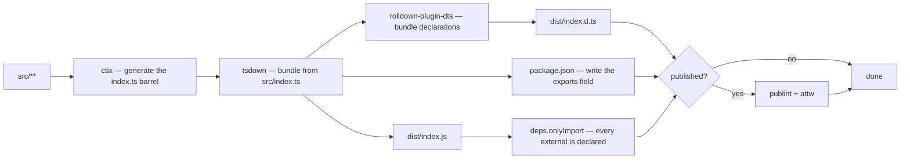
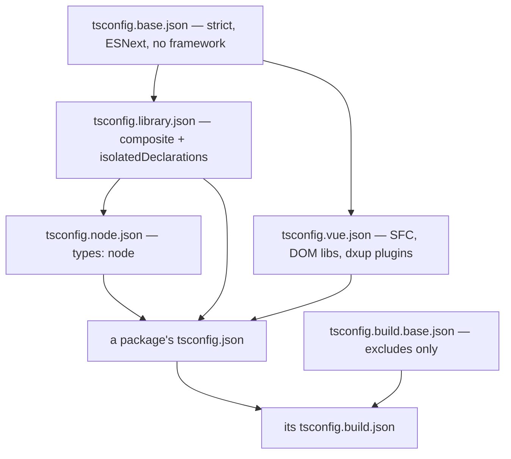

# Build Pipeline

How `src/` becomes `dist/` for every workspace package, and what an individual package therefore never has to decide. Workspace orchestration — which scripts run where, how CI fans them out — is [monorepo tooling](/docs/architecture/monorepo-tooling); this page is what happens inside one package's `build`. It is the record of the decisions; the operating rules for each mechanism — what a config states, what fails and why — are the `build` skill's reference pages (`.agents/skills/build/`), and each section below names the one that holds its rule.

## One bundler

Every package builds with **tsdown**, which is Rolldown plus the things a library build needs on top of it: declaration bundling, a generated `exports` field, and the publishability gates below. A build script is bare `tsdown` — the config file is found by name, never named on the command line — and the barrel it bundles is generated by the build itself.

There is no second build path. tsdown compiles the package that ships `.vue` files itself — SFC compilation and declaration emit both — rather than reaching Rolldown through Vite beside a separate `vue-tsc` pass, so a component cannot compile one way for the build and another way for its tests.



The barrel is generated on every build and never committed, which is why CI caches the generated `src/**/index.ts` files alongside `dist`. It is deliberately not guarded by a hash of the source list, and `export:gen` regenerates it without a build for the typecheck that follows a new file: `.agents/skills/build/references/barrels.md`.

## The shared configuration package

`@esposter/configuration` owns every build input. A package's config is a factory call plus what is genuinely its own, and the factories compose with `mergeConfig` rather than by spreading — a spread replaces a whole key, so a config adding one `deps` field would silently drop everything the base set there.

| Factory                         | For                                                                                                           |
| ------------------------------- | ------------------------------------------------------------------------------------------------------------- |
| `getTsdownConfiguration`        | The base — `platform: "neutral"`                                                                              |
| `getTsdownConfigurationNode`    | The base plus `platform: "node"`                                                                              |
| `getTsdownConfigurationVue`     | The base plus SFC compilation and `dts.vue`                                                                   |
| `getVuePlugins`                 | The SFC plugin pair, shared with the Vitest run                                                               |
| `getVitestConfiguration`        | The Vitest config every member's tests run on; the app takes its `test` options alone                         |
| `getBenchmarkTestConfiguration` | Just the bench wiring, spread by `getVitestConfiguration` over the member's own test options                  |
| `getVueTestConfiguration`       | Every worker's Vue with the Options API compiled out, as the app ships it; spread by `getVitestConfiguration` |

Which package calls which factory is a question the repo answers — read the `tsdown.config.ts` files rather than a table that goes stale.

## Bundled or externalized

A library externalizes exactly what its consumer installs, and tsdown's defaults already say so: `dependencies`, `peerDependencies` (a demand rather than a delivery — the singleton case, `vue` and `pinia` above all), `optionalDependencies` (the one entry that may simply not be there) and anything `peerDependenciesMeta` names are external; `devDependencies` are bundled when the source imports them; a published workspace sibling is a normal dependency and stays external. Bundling a dependency instead is not a saving — it defeats the consumer's deduplication, strands the package on a vendored copy, and splits the types that dependency owns into two copies that no longer recognise each other.

Two kinds of package depart from that shape, each in its own `tsdown.config.ts`: the **self-contained bundles** — programs something runs directly, with no package manager on the other side — vendor what they use, with the list derived from the manifest rather than typed; and `@esposter/configuration` externalizes everything, being private and reachable only by build tooling every member already has. Which three things a program keeps external regardless, why only the deploy artifact minifies (compression on, mangling off), how what was vendored is written back into the manifest as the review gate, and why the Functions app keeps the `main` field the host loads by are the opt-outs page: `.agents/skills/build/references/opt-outs.md`.

Two invariants cut across every package:

- **`sideEffects` is declared everywhere**, because absence reads as _unknown_ and keeps everything. One package answers `true` — the one whose entry exists to run rather than to export, where tree-shaking would silently remove every handler registration and leave an app that deploys and never fires. `scripts/src/workspace/sideEffects.test.ts` holds the derivable part: `.agents/skills/build/references/side-effects.md`.
- **Every externals entry matches subpaths.** A bare name never matches `drizzle-orm/pg-core`, so `getPackagePatterns` widens each name to a prefix pattern, and a name handed to `deps` verbatim misses exactly those imports.

## Every bundle's externals are gated

`deps.onlyImport` fails a build whose emitted chunks leave external anything the package's own manifest does not name, on for every package, published or not. For a published package it is an installability promise — a private sibling resolves on every machine in the workspace and on no stranger's. For any package it is the only thing that notices a specifier which resolved to nothing, since Rolldown treats an unresolvable `#src/…` as external and the error otherwise lands in a consumer at runtime, a phase and a package away from the typo. What the gate cannot see — a private sibling legitimately declared in `dependencies` — is `scripts/src/workspace/publishedDependencies.test.ts`'s. The failures and their reading are `.agents/skills/build/references/gates.md`.

## The published surface is gated further

A published package owes an installable promise to a stranger, and two more options hold it to that promise, switched on by the absence of `private` in the manifest:

| Gate      | Fails the build when                                             |
| --------- | ---------------------------------------------------------------- |
| `publint` | a manifest entry names a file that is not in the tarball         |
| `attw`    | the declarations fail under a resolution mode a consumer may use |

A private package gets neither, and emits no declarations either: its `dist` is only ever reached by something that _runs_ it, while everything that types against a workspace package reads its source. That saving is real — a package whose types cannot satisfy `isolatedDeclarations` falls back to a full TypeScript program, and for the Drizzle schema that was minutes of work — and it left the invariant that declarations are emitted only where `isolatedDeclarations` holds.

## A package's own source is a subpath import

Through **Node subpath imports** declared in its own manifest — `#src/*` mapped to `./src/*.ts` — rather than a `paths` alias. The decision is about a package being consumed by something other than itself: a `paths` entry belongs to whichever tsconfig drives the current compilation, so a sibling bundling a package from source would re-anchor its `@/` into the bundling package, while a `#` specifier resolves against the nearest `package.json`, which is always the importing file's own. It is also a real resolution feature every tool here implements, declared once where the package declares everything else, and private by specification. That anchoring is what makes source exports possible at all.

`apps/web` is the leaf of the graph — nothing bundles it, publishes it or resolves into it — so it keeps Nuxt's own generated `@/` and `~/` aliases, and there is no hand-written `paths` entry anywhere in the repo. An `.oxlintrc.json` override enforces the split everywhere but the app. The spelling rules — the `.ts` in the target, a second key per file kind, why an array target fails under Vitest, a directory needing its `/index` — are `.agents/skills/build/references/source-exports.md`.

## Which unlocks source exports

Because a `#` specifier resolves the same way no matter who is compiling, every package publishes a second view of itself: its own source. Every generated entry carries two arms:

```json
{
  "exports": { ".": { "source": "./src/index.ts", "default": "./dist/index.js" } },
  "publishConfig": { "exports": { ".": "./dist/index.js" } }
}
```

A tool that opts into the `source` condition — the tsconfig base, the shared Vitest configuration, and the Nuxt and Nitro tsconfigs the app generates — resolves TypeScript source, so no rebuild stands between an edit and a sibling's tests seeing it and a fresh clone typechecks without building anything. Everything else, Node's own loader above all, falls through to `dist`; npm never sees a source arm at all.

Three consequences shape the rest of the pipeline. **The `default` arm is load-bearing**, because two things hand a package straight to Node's loader, which cannot read TypeScript source, and the workarounds cost more than the feature. **The app opts in for types and for nothing that runs**, so its bundles and its own Vitest project stay on the `dist` side — which is what `watch:packages` is still for. And **a build that vendors a sibling vendors its source**, which is why `isolatedDeclarations` is off in a package that vendors one of the packages that cannot satisfy it. Each is argued in full, with what breaks and where it surfaces, in `.agents/skills/build/references/source-exports.md`.

## The output directory is wiped on every build

tsdown cleans `outDir` before each build. Every emitted chunk carries a content hash, so without that a changed build would write new files beside the old ones and a size measurement of `dist` would stop meaning anything. This is what makes the committed size snapshots (`*/src/index.test.ts`) a real signal — a jump in one means something genuinely started being bundled.

## TypeScript configuration layers

The presets are `@esposter/configuration`'s, extended by path, and the root carries no framework assumption: Vue-specific options sit in a leaf, so a Node-only package inherits neither `jsx` nor a DOM lib set.



The build preset contributes excludes and nothing else, so a build program shares the platform its source was typechecked against; which packages turn `isolatedDeclarations` off and why is `.agents/skills/build/references/tsconfig-presets.md`.

## Declarations see the entrypoints, not the tsconfig

The declaration build seeds its program from the entry files and follows imports, so an ambient `.d.ts` nothing imports is absent from it and every symbol it declares collapses to `any` while every other check passes. The Vue factory loads the tsconfig's full file list instead, and the `index.d.ts` size snapshot in each published package is what makes a collapse visible — it makes the file _smaller_: `.agents/skills/build/references/declarations.md`.

## The bootstrap package

`@esposter/configuration` is built by the same factories it exports, so its own relative imports carry a `.ts` extension rather than `#src/` — it is the one config that has to reach TypeScript source before any build has run — while its `default` arm still points at `dist`, which is what every other package's config resolves it through.

## Key files

| File                                                   | Role                                            |
| ------------------------------------------------------ | ----------------------------------------------- |
| `packages/configuration/src/getTsdownConfiguration.ts` | The base every config composes onto             |
| `packages/configuration/src/getPackagePatterns.ts`     | Turns package names into subpath-aware patterns |
| `packages/configuration/src/readPackageManifest.ts`    | Reads the manifest every derivation starts from |
| `packages/configuration/tsconfig.base.json`            | Root of the preset chain                        |
| `packages/configuration/tsconfig.build.base.json`      | The build excludes, shared by every package     |
| `packages/configuration/.ctirc-ts`                     | Barrel generation config                        |
