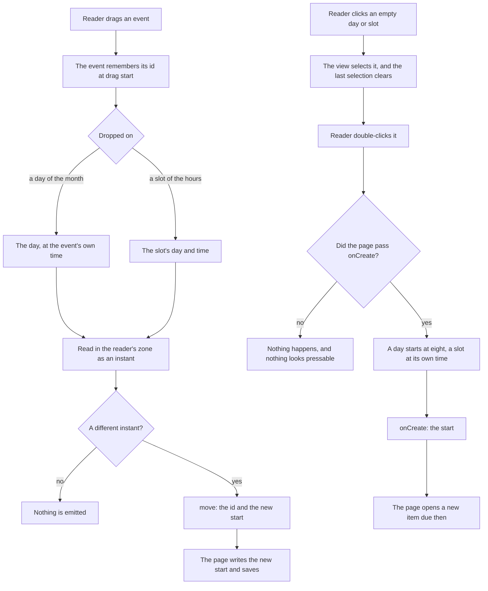

# Calendar

Three library components cover every date the app asks a reader for or shows them in time. `UiCalendar` is one month of days, the grid a reader picks a day from. `UiDateField` is a field holding a day, or a day and a time, that opens that grid in a popover. `UiEventCalendar` lays events out in time — a day, a work week or a week of hours, or a month of days — and is what a todo list's Calendar blade draws. All three replace libraries the app used to carry: a date picker for fields and a full calendar library for the blade, each themed from outside and neither drawn in the library's look.

The look and the tokens are the [design language](/docs/proposals/refactors/ui-library/design-language)'s, and the keyboard contracts they share with the rest of the library the [UI library](/docs/architecture/ui-library#keyboard-contracts)'s; this page is what is particular to time.

## Days are plain dates

A day on a calendar has no time zone: the 25th is the 25th wherever the reader is. So the grid walks `Temporal.PlainDate` values from the platform's own Temporal, and a time zone enters only at the edges, where a field or an event holds an instant:

- **A date field** holds a `Date`, the instant a form stores. It reads that instant as a day and a time in the reader's own zone, and writes the day or time a reader picks back as the instant it names there.
- **An event** starts at an instant. The event calendar files it under the day it starts on in the reader's zone, which only the browser knows, so the views render on the client alone behind a skeleton — a server render would file an evening event under the wrong day for half the world.
- **A rendered date** is still a `<NuxtTime>` ([date and time display](/docs/architecture/date-time-display)). A plain date has no instant of its own, so it is handed over as its ISO date with the UTC zone, which renders exactly the day it names.

Vuetify 0 ships a date adapter rather than a date picker, and that adapter is written against a Temporal polyfill of its own — a second copy of Temporal in the bundle beside the platform's, for arithmetic a plain date already does. The components use the platform's instead. Where the platform has none — Safari, and so every browser on iOS, until Temporal is [Baseline](https://webstatus.dev/features/temporal) — `temporal-polyfill` installs it before the app loads.

Weeks start on Monday, ISO 8601's first day. The reader's locale could say otherwise, but only the browser knows it, and a grid the server rendered with Sunday first would be redrawn under the reader's pointer.

## The event calendar follows Outlook

Outlook is the reference product: the most complete calendar a reader already knows, and the one whose arrangement the blade copies. Google Calendar is the second source, for the single-key shortcuts Outlook has no equivalent of. What each gave:

| From            | What the event calendar takes                                                                                                               |
| :-------------- | :------------------------------------------------------------------------------------------------------------------------------------------ |
| Outlook         | Four views in its order, shortest first: Day, Work week, Week and Month, switched from a segmented control and by Ctrl+Alt+1 to 4           |
| Outlook         | The navigator: the month around the day shown, beside the views on a wide screen, marking each day that holds an event                      |
| Outlook         | Today, the previous and next view, and the previous and next year, in the header over the title                                             |
| Outlook         | The working day, eight to five, and the work week, Monday to Friday: the hours open scrolled to its start, and what is outside it is shaded |
| Outlook         | The current time as a line across today, and events already past faded                                                                      |
| Outlook         | A day of the month listing its first events and a count of the rest, which opens the day, as a day's number does                            |
| Outlook         | A click on an empty day or slot selects it, a double click creates there, and a drag moves an event to another day or slot                  |
| Outlook         | A peek on hover: the event's title and its notes, without opening it                                                                        |
| Google Calendar | T for today, J for the next view and K for the previous                                                                                     |

Every shortcut is a registered command ([command palette](/docs/architecture/command-palette)), listed in the shortcuts dialog and bound only while a calendar is mounted.

### The views are one ruled grid

Both kinds of view are drawn as a grid of cells on the frame's panel, every line drawn by exactly one cell:

- **The month** is six weeks under a row of weekdays. Each day draws the line after it and the line under it, except where the frame's own edge already runs — the last day of a week and the last week — so no edge is ever drawn twice.
- **The hours** are one grid too: a gutter as wide as its longest hour, then a column per day, each column drawing the line down its start. The headings are a row of that same grid rather than a table of their own, held over the hours as they scroll, so a heading always sits over its column whether or not the hours show a scrollbar. Each heading stacks the weekday over the date, which still fits a week on a phone. A slot draws a line over itself — the hour's in the divider, the half hour's fainter — except the first, which starts on the headings' line.
- **Today** carries the accent's indicator bar, the mark a tab list puts on the current tab: along the top of its day in the month, and along the bottom of its heading in the hours, where the heading's number is filled in the accent as the month's is. The current time is a line in the accent across today's column.
- **Pointing, selecting and focusing** tint a cell as a list's rows are tinted. A hovered day or slot takes the light tint; a clicked one is selected, filled in the accent and ringed in it, as a data table's selected row is filled and edged. Keyboard focus on a day's number or one of its events tints the whole day, so a reader tabbing through sees which day they are on. The shading of weekends, days of another month and hours outside the working day is drawn under those tints rather than instead of them.
- **Stepping** to another month or week fades the new days in over the old, as the navigator turns its page.
- **An event** is a block of the accent with a solid edge down its start. In the hours it fills the hour it is drawn in, its title over its time; in a day of the month it is a line with its time before its title, and on a phone, where a day is too narrow for both, the time is read out but not drawn.

Selection is only a pointer's today: the days and slots are not yet tab stops, so a keyboard neither selects nor creates from one ([event calendar keyboard](/docs/proposals/refactors/ui-library/event-calendar-keyboard)).

### What is left out

- **Resizing an event by a drag.** An event here is a todo's due date, a moment rather than a span, so it is drawn an hour tall and has no end to drag.
- **The all-day row and multi-day events.** Nothing the app shows spans days yet; a todo is due at one time.
- **An agenda or list view.** The todo list's Items blade is that list, sortable and searchable, one tab away.
- **Several calendars overlaid in colours.** Every event on a blade is one list's, and a calendar across every list is deferred ([global calendar](/docs/resource/deferred/global-calendar)).
- **Recurrence, reminders and invitations.** A todo has none of them; the due-date reminders a todo list sends are [their own feature](/docs/resource/todolist-due-reminders).
- **Week numbers.** An Outlook setting that is off by default, and nothing in the app is planned by week number.

## How a gesture reaches the page

The event calendar owns no events. It is handed them as data, and what a reader does to one is handed back to the page, which writes it wherever the events live — a todo list's content, for the Calendar blade.

Creating is a prop rather than an emit, as a data table's open is, so a calendar nothing can be created on never draws its days as something to press. A click on an event emits `open`, which the Calendar blade answers with the todo's edit dialog — the keyboard's way to change a due date, since a drag has no keyboard equivalent.

## The date field

A date field is a trigger drawn as a select's, holding the date or the placeholder, that opens the calendar in a popover. Choosing a day closes it; a field that takes a time keeps it open for the time field under the calendar, and Done closes it. A day picked on the earliest allowed moment's own day lands on that moment rather than before it, which is what the scheduled-message dialogs need of a time a minute from now. A field that may be empty draws a button beside it that empties it.

## Key files

| File                                                      | Role                                                                                          |
| :-------------------------------------------------------- | :-------------------------------------------------------------------------------------------- |
| `apps/web/app/components/Ui/Calendar.vue`                 | The date grid: six weeks of plain days, one tab stop, walked by the WAI-ARIA grid's keys      |
| `apps/web/app/components/Ui/DateField.vue`                | A day or a moment in the reader's zone, picked from the grid in a popover                     |
| `apps/web/app/components/Ui/EventCalendar/Index.vue`      | The event calendar: views, navigator, header, shortcuts, and the move and create gestures     |
| `apps/web/app/components/Ui/EventCalendar/MonthView.vue`  | The month: weekday headings over six weeks of days, and which day is selected                 |
| `apps/web/app/components/Ui/EventCalendar/MonthDay.vue`   | One day of the month: its lines, today's bar, hover, selection, and its first events          |
| `apps/web/app/components/Ui/EventCalendar/TimeView.vue`   | The hours as one grid: the sticky headings, the gutter, and which slot is selected            |
| `apps/web/app/components/Ui/EventCalendar/TimeColumn.vue` | One day of hours: the slots, events placed at their time, the current-time line               |
| `apps/web/app/components/Ui/EventCalendar/Event.vue`      | One event, a line in a day of the month or a block in the hours, its notes in a peek on hover |
| `apps/web/app/models/ui/UiCalendarView.ts`                | The views, in Outlook's order                                                                 |
| `apps/web/app/util/date/getStartOfWeek.ts`                | Monday of a day's week, which every grid starts its rows on                                   |
| `apps/web/app/components/Resource/TodoList/Calendar.vue`  | The todo list's Calendar blade: todos by due date, moved by a drag, created by a double click |
