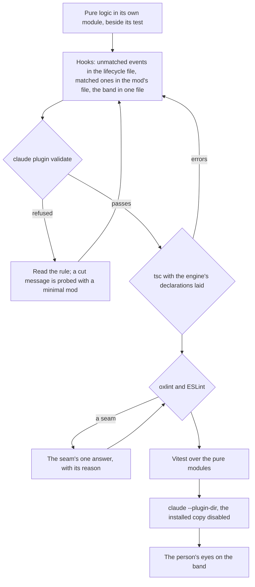
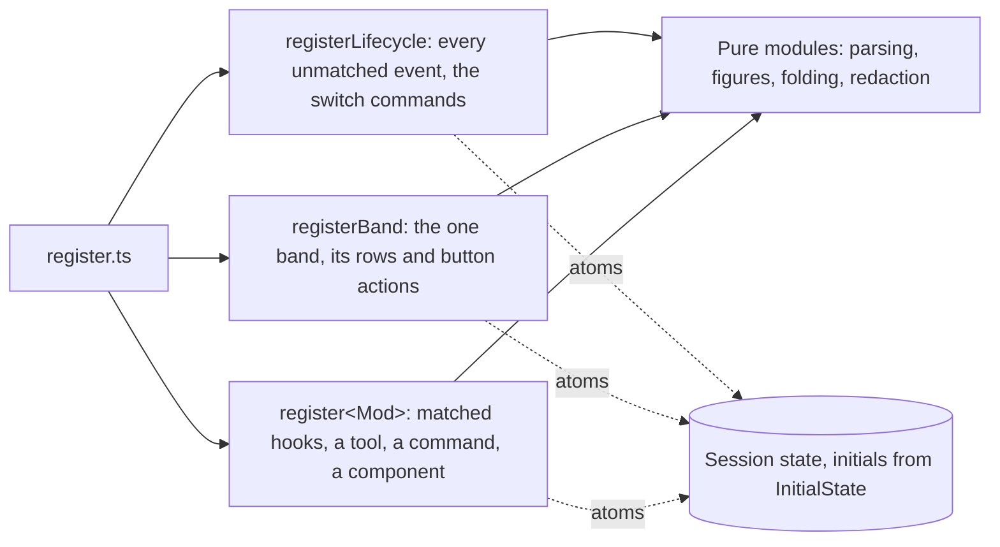

# Claude Code mods

A **mod** is a Claude Code plugin whose hooks are a TypeScript module the engine runs in-process: `hooks/hooks.json` names the module under `modules`, and the module exports `register(on)`. A hook receives `$`, the engine's interface (`$.ui`, `$.session`, `$.model`, `$.fs` and the rest), the event's input, and `next`, which runs the rest of the chain. The repository's mods are [genshin mods](/docs/infra/claude-interface/genshin-mods)' five and the [persona plugin](/docs/infra/claude-interface/persona-plugin)'s surfaces, and the `claude-mods` skill holds the rules below as one line each.

The engine reads a module's source before it runs anything, and refuses a module that breaks one of its rules. Almost none of those rules are in its documentation; each was found by `claude plugin validate` refusing a first draft. This page records every one, with the shape it forces, so the next mod is written that shape from the start.

## The engine's rules

| Rule                                                                                                          | What breaking it looks like                                                                                                                   | The shape here                                                                                                                                                                                             |
| :------------------------------------------------------------------------------------------------------------ | :-------------------------------------------------------------------------------------------------------------------------------------------- | :--------------------------------------------------------------------------------------------------------------------------------------------------------------------------------------------------------- |
| A module imports only its own files, by relative path, plus types and the state library from `claude-code`    | `cannot import "#src/…"`: a module imports its own files by relative path                                                                     | Relative specifiers in the mod trees alone, which `oxlint.config.ts` allows there and nowhere else; a subpath import is the error there instead                                                            |
| An event with no matcher is hooked once per plugin                                                            | `on("session.start") is registered twice without a matcher`                                                                                   | One `registerLifecycle` file hooks session start and end, prompt submit and turn start and end for every mod; a mod's own hooks are the matched ones (a tool, a command, a component)                      |
| A function that receives `on` returns nothing                                                                 | `the value of registerX(on) is kept`                                                                                                          | Every `register<Name>(on)` returns `void`; nothing a mod does is handed back to the caller                                                                                                                 |
| `$` is followed only into functions declared in the same file                                                 | `$ is passed to "x", imported from "./x"`                                                                                                     | Every function that takes `$` sits beside the hook that calls it; logic without `$` is a pure module of its own. A button's action is a closure over `$`, never `$` passed across an import                |
| A state reference is traced only to an atom made in the same file, its plugin and key string literals         | `the state library's update takes a source the scan can read`                                                                                 | Each file makes the atoms it uses, every initial read from one `InitialState` constant; a set of switches is one record, since a loop cannot name a key                                                    |
| The state contract names every key inside the literal `interface PluginState { "<plugin>": { … } }`           | `<plugin>.<key> is not declared`                                                                                                              | The members are written inline in `types/index.d.ts`; the value types beside them are exported, and the initials are typed `PluginState["<plugin>"]`                                                       |
| A registration's `.catch` handler is a top-level function of the same file, its name bound nowhere else in it | `the .catch handler "x" is not a function declared at the top of this file`, or `is declared more than once` when a parameter shares its name | The handler is a module-level `const` beside the registrations, named for what it answers                                                                                                                  |
| A module has no Node and no DOM                                                                               | An import of `node:*` is refused; a DOM global is undefined                                                                                   | Anything Node does (game data, audio, sockets) runs in the plugin's own node scripts through `$.process.run`. `Temporal`, `Intl`, `structuredClone` and `RegExp.escape` are there                          |
| A `/clear` or a resume carries on under a new session id with no `session.start`                              | Nothing: the old conversation's rows and state stay on screen                                                                                 | `session.end` with reason `clear` or `resume` resets what belonged to the conversation; the session start is once per process                                                                              |
| `$.ui.status` pins a notice beside the engine's own, drawn with a warning mark; it is not the status line     | `⚠ <plugin>: <text>` under the prompt                                                                                                         | Nothing pinned that is not a notice. The status line is a settings command a plugin cannot set, so a standing word goes among the footer's mode labels (`SessionMode`), and anything larger in the band    |
| The element table's constructors are plain functions, `children` a prop                                       | Nothing: JSX is optional                                                                                                                      | Every file is `.ts`, trees built as `Box({ children: [...] })`. `.tsx` is a Tiled tileset in this repository, and a JSX compiler setting would be the one package-level tsconfig difference                |
| The engine's declarations exist only beside a mod it has loaded                                               | `Cannot find module 'claude-code'` from `tsc`                                                                                                 | The engine's types folder beside the manifest is gitignored and the package has no `typecheck` script; a local typecheck copies the declarations the built-in "plugin-authoring" skill names into it first |

`claude plugin validate` cuts a refusal's text short, `--json` included. When the cut falls before the rule, the fastest reading is a minimal mod in the scratchpad that does only the questioned thing, validated on its own.

## Where the repository's lint meets the engine

The engine's slots are typed by the engine, and a few of the repository's rules read them as their own patterns. Each seam has one answer:

- **A timer, a button's press:** the slot returns `void`, so an async action floats. One local wrapper per file carries the `no-floating-promises` disable, naming the slot, and every action it wraps resolves each of its outcomes rather than rejecting.
- **A registration's `.catch`:** the promise-chain ban fires on it. It is the engine's handler for a hook that rejected, not a promise, and the disable says so.
- **`$.clock.every`:** `unicorn/no-array-method-this-argument` reads it as `Array.prototype.every`; the disable names the engine's clock.
- **`JSON.parse`:** the shared reviver is in a package a mod cannot import, so a mod's own record of numbers and ids parses plainly, with the reason on the disable.
- **An interpolated string constant:** `isolatedDeclarations` asks for a type and `no-inferrable-types` refuses one, so the constant is annotated `: string` and the lint disable names the declaration emit that demands it.
- **A literal's order:** perfectionist sorts object and `Map` literals, so nothing in a mod lets a literal's order carry meaning. A list whose order matters is an array, and a pass over a map is written so the order it runs in changes nothing.

## The authoring loop

Validation comes before the typecheck because it is the engine's own reading and costs a second; a module the engine refuses is restructured, and a restructure moves more than any type error does.

## The file shape it adds up to

## Key files

| File                                                      | Role                                                                    |
| :-------------------------------------------------------- | :---------------------------------------------------------------------- |
| `packages/genshin-mods/src/register.ts`                   | The module the engine loads, calling each register file once            |
| `packages/genshin-mods/src/services/registerLifecycle.ts` | Every event the engine takes one unmatched hook for, and the switches   |
| `packages/genshin-mods/src/services/band/registerBand.ts` | The one band above the prompt, its rows and its button actions          |
| `packages/genshin-mods/src/services/InitialState.ts`      | Every state value's initial, read by each file's atoms                  |
| `packages/genshin-mods/types/index.d.ts`                  | The state contract the engine validates the keys against                |
| `packages/genshin-persona/mod/register.ts`                | A second mod's shape: a plugin's existing node scripts run as commands  |
| `oxlint.config.ts`                                        | The mod trees' import rule: relative specifiers, never a subpath import |
| `.agents/skills/claude-mods/SKILL.md`                     | The rules above, one line each, for a session writing a mod             |

## Notes

- The mods API is labelled early access. A new engine release can add a rule; `claude plugin validate` on every mod after an update is where it shows, and a new rule is a row in the table above in the same change that answers it.
- A shared checkout with several sessions makes a write-back of another session's fix run land on files mid-edit. A mod's draft is small and re-derivable from its feature page, so it is committed as soon as it validates rather than kept across a long run of edits.
