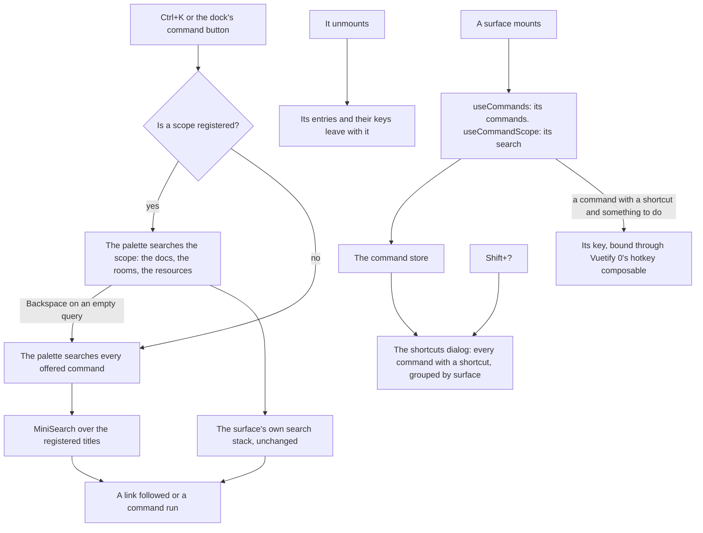

# Command Palette

Ctrl+K opens one palette on every page. It offers what the page in front of the reader can reach or do, by name, and the shortcuts dialog lists every key that works there. Both read one registry of commands, so a key the dialog lists always does something and the palette never offers what the page cannot do.

## How it works

- **A command is data.** A `UiCommand` has a title, a group — the surface that registered it — an icon or a picture, and somewhere to go, something to run, or neither. One with somewhere to go is drawn as a real link, which a reader can open in a second tab. One with neither is a key its surface handles itself, such as the composer's Enter: the shortcuts dialog lists it, and nothing binds or offers it.
- **A surface registers for as long as it is mounted.** `useCommands` adds a surface's commands to the store and binds each shortcut through Vuetify 0's hotkey composable until the surface unmounts, so the shortcuts dialog never lists a key that does nothing and the palette only offers what the page can do. A sequence, such as the resource explorer's G then A, is a shortcut like any other. The composable only warns on a shortcut it cannot parse and binds nothing, so a key its syntax reserves is spelled by its alias — `slash` for `/` — and `useCommands.test.ts` binds every shortcut written in source and fails on one that does not bind. A shortcut never fires while a field has focus, where its keys are typing. A command whose surface has a state it only applies in — a sheet's cell commands while cells are selected — is registered only while that state holds.
- **The app's own commands are the dock's.** Home, every product, the reader's bookmarked and recent pages and the entries of the dock's theme, style and account menus are registered app-wide, and those menus read the same lists, so the two never disagree. A condition such as being signed in is part of the list, so it is re-read whenever the palette shows it. Choices among several — the design styles, the theme modes — are listed whole under their heading, the chosen one marked.
- **A surface's search is a scope, not a second palette.** The docs, the room list and the resource explorer's home page keep their search stacks as the [search standard](/docs/architecture/search) describes, and hand the palette their query and what it finds through `useCommandScope`. The palette opens in the scope of the surface in front, and Backspace on an empty query steps out to the whole app. Ctrl+K keeps its meaning on their pages, and everything else is one keystroke further.
- **App-wide search is on the client.** The titles are in memory, so the palette searches them with MiniSearch, the search standard's client branch, and keeps each group together under its heading.
- **The palette binds its own key**, through `useCommandPaletteShortcut`, in a field too, since no typing holds Ctrl, and does not offer itself; its registry entry only lists the key.
- **Both are the library's dialogs.** The palette and the shortcuts dialog open in the top layer through `UiDialog`, high on the screen so a list changing length never moves the field. The palette's list is `UiCommandList`, whose keyboard contract is the library's ([keyboard contracts](/docs/architecture/ui-library#keyboard-contracts)). A shortcut is drawn as `UiShortcut`'s raised key caps.

## The surfaces

| Surface                      | What it registers                                                                                                                  |
| :--------------------------- | :--------------------------------------------------------------------------------------------------------------------------------- |
| The app                      | Home, the products, the reader's places, the theme, style and account menus' entries, and the palette's and dialog's keys          |
| The message composer         | Its own keys: sending, a new line, slash commands, mentions, editing the last message                                              |
| The docs                     | A scope over the docs' sections                                                                                                    |
| The room list                | A scope over the reader's rooms, read a page at a time                                                                             |
| The resource explorer's home | Searching resources, going to every resource and opening notifications as G chords, and a scope over resources, services and pages |
| A sheet                      | Its cell commands, while cells are selected                                                                                        |

## Key files

| File                                                       | Role                                                                                          |
| :--------------------------------------------------------- | :-------------------------------------------------------------------------------------------- |
| `apps/web/app/models/ui/UiCommand.ts`                      | One command: a title, a group, a mark, and somewhere to go or something to run                |
| `apps/web/app/models/ui/UiCommandScope.ts`                 | A surface's search, handed to the palette                                                     |
| `apps/web/app/store/ui/command.ts`                         | The registered commands and scopes, and whether the palette and the shortcuts dialog are open |
| `apps/web/app/composables/ui/useCommands.ts`               | Registers a surface's commands and binds their shortcuts while it is mounted                  |
| `apps/web/app/composables/ui/useCommandScope.ts`           | Hands a surface's search to the palette while it is mounted                                   |
| `apps/web/app/composables/ui/useCommandPaletteShortcut.ts` | The palette's own key, bound in a field too                                                   |
| `apps/web/app/components/App/CommandPalette.vue`           | The palette, and the app's own commands                                                       |
| `apps/web/app/components/App/ShortcutsDialog.vue`          | Every registered shortcut, grouped by surface                                                 |
| `apps/web/app/components/Ui/CommandList.vue`               | The search field over the commands it finds                                                   |

## Sources

- [Hotkey](https://0.vuetifyjs.com/composables/system/use-hotkey), Vuetify 0: the hotkey composable every shortcut binds through, sequences included.
- [MiniSearch](https://lucaong.github.io/minisearch/): the client index the app-wide palette searches.
