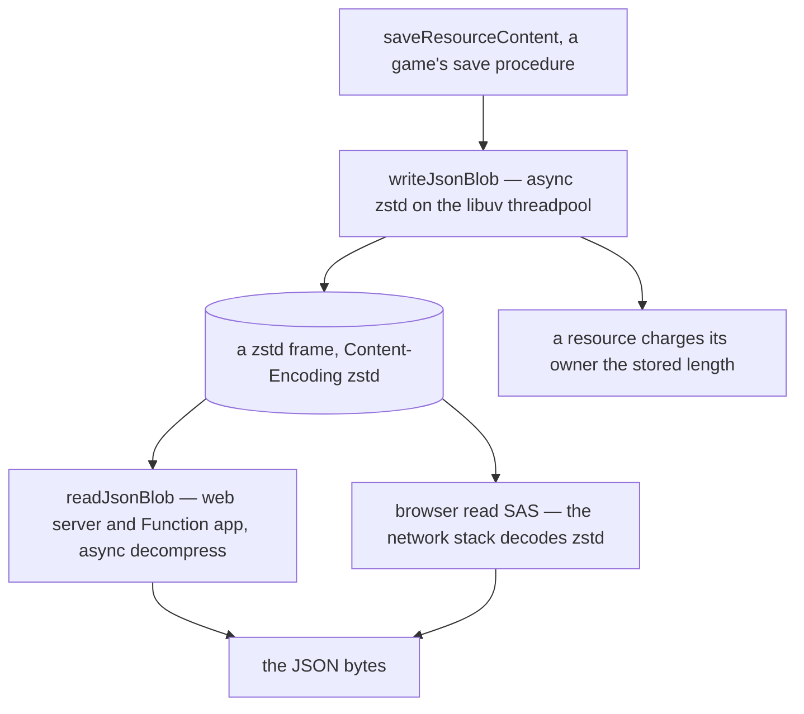

# Compressed JSON blobs

**The app never stores a plain JSON blob.** Every JSON document it keeps in Blob Storage is written by `writeJsonBlob` and read back by `readJsonBlob`, both in `@esposter/db`. That covers a resource's working copy (`{id}/content.json`), for every resource type, and each game's per-user save (`{userId}/save.json` for Clicker and Dungeons). Because every document goes through one path, a change to that path, whether a better level, a new codec parameter or a different header, reaches every document at once. There is no plain upload or download helper left to reach for instead.

The stored form is a **standalone zstd frame, with the blob's `Content-Encoding` set to `zstd`**. JSON repeats the same keys and shapes on every line, so it compresses several times over, even with a random id on every row. Nothing about the document itself changes. A resource's `contentHash`, its `contentSize` and every schema still describe the JSON. Only the bytes at rest change.

## The writer and the reader

- **`writeJsonBlob(containerClient, blobName, serializedJson)`** compresses the document and uploads it with `Content-Encoding: zstd` and `Content-Type: application/json`, then returns the stored length.
- **`readJsonBlob(containerClient, blobName)`** downloads and decompresses the blob, and reads a 404 as undefined, meaning nothing has been saved yet. Every other failure surfaces rather than passing for an empty document.
- **A browser reading through a SAS needs neither.** Blob Storage serves a blob's stored `Content-Encoding` on every read, and the network stack decodes it before `fetch` returns the body. A large resource's read therefore still receives the JSON bytes that it hashes, parses and keeps as its delta baseline ([large documents](/docs/architecture/large-documents)).

The staged upload of a large save stays gzip. The browser's `CompressionStream` has no zstd, and the server re-serializes what it validates rather than storing the upload ([compression](/docs/architecture/compression)).

## Decisions

**zstd, because both readers can decode it.** The [compression standard](/docs/architecture/compression) picks zstd wherever the repo chooses the bytes. Here the browser is a counterparty, and zstd is in its codec set: every current engine decodes `Content-Encoding: zstd` natively, and the repo targets current engines only. So there is no gzip fallback and no browser-side decoder to ship.

**The window is pinned at 8 MB.** RFC 9659 forbids an HTTP zstd encoder from producing a frame that needs a window larger than 8 MB. The writer therefore sets `ZSTD_c_windowLog` to `MAX_CONTENT_ENCODING_WINDOW_LOG` explicitly. This is part of the stored format, not a tunable. No dictionary is used, because a browser decoding a `Content-Encoding` has none.

**Level 1, `JSON_BLOB_COMPRESSION_LEVEL`.** A JSON blob is rewritten on every save, so its level is chosen for speed. That makes it a different decision from `DEFAULT_COMPRESSION_LEVEL`, the level the version store spends once per retained version. On Sheet-shaped rows, the fastest level also produced the smallest frame of the levels tried. The committed `packages/db/src/services/azure/container/writeJsonBlob.bench.md` records the speed side of that comparison.

**What each number describes.** A resource's `contentHash` stays the hash of the JSON, because a client compares its own bytes against it. Its `contentSize` stays the JSON's length, because it sizes the transport and the server's cost to parse. The storage charge is the compressed length, because the ledger counts stored bytes and a blob's `BlobCreated` event reports the stored length. So the quota meter drops by the ratio, and the reconcile still agrees with the charge ([storage quotas](/docs/resource/storage-quotas)).

**Latest shape only.** Every reader assumes the frame, and there is no plain-JSON branch ([persisted data — latest shape only](/docs/architecture/persisted-data-latest-shape-only)). A resource's content is the owner's data and must never reset, and a game save would reset to a fresh game on a read it cannot parse. So the blobs written before the change were rewritten once, in dev and in production, by a one-off script that was deleted after both runs. Nothing plain is left for a reader to meet.

## What it costs in compute

A save gains one compression, and every server read gains one decompression. Neither runs on the event loop: `node:zlib`'s asynchronous calls run on the libuv threadpool, so they take CPU but no request waits behind them.

- **The compression** at level 1 runs faster than the save's own `JSON.stringify` and SHA-256 over the same bytes. A typical document costs well under a millisecond, and one at `MAX_RESOURCE_CONTENT_SIZE` a small fraction of the seconds its validation already takes.
- **The decompression** is faster still, and it replaces a download several times larger.
- **The browser** decodes in its network stack, not on the page's main thread, and a large Sheet crosses the wire at a fraction of its size.

## Failure semantics

- **The compression fails:** the save throws before anything is uploaded. A resource save unwinds the way a failed upload already does: the version bump rolls back with its transaction, and a cleared binding stays cleared.
- **The quota:** a rewritten content blob raises a `BlobCreated` event with its new length, and the reconcile moves the owner's counter by the difference, so the one-off rewrite charged nothing separately.
- **A read that fails:** a game's load surfaces the error rather than answering with a fresh game, so no autosave can overwrite the save it could not read. Only a save that no longer parses resets.

## Key files

| File                                                                 | Role                                                    |
| -------------------------------------------------------------------- | ------------------------------------------------------- |
| `packages/db/src/services/azure/container/writeJsonBlob.ts`          | async compress and upload with `Content-Encoding: zstd` |
| `packages/db/src/services/azure/container/readJsonBlob.ts`           | download and async decompress, a 404 read as undefined  |
| `packages/db/src/services/azure/container/constants.ts`              | `JSON_BLOB_COMPRESSION_LEVEL` and the RFC 9659 window   |
| `apps/web/server/services/resource/saveResourceContent.ts`           | writes a resource's content, charges the stored length  |
| `apps/web/server/services/resource/readSerializedResourceContent.ts` | the web server's content reads                          |
| `apps/web/server/services/resource/readResourceContentDelta.ts`      | the delta commit's dictionary                           |
| `apps/functions/src/handlers/sendTodoReminderHandler.ts`             | the reminder's re-check of a TodoList's content         |
| `apps/web/server/trpc/procedure/blobState/`                          | every game's save and load                              |

## Sources

- [Zstandard](https://github.com/facebook/zstd) (Meta): the benchmark table showing zstd's fastest levels compress at hundreds of MB/s and decompress at over a GB/s per core.
- [RFC 9659 — Window Sizing for Zstandard Content Encoding](https://www.rfc-editor.org/rfc/rfc9659.html) (IETF): an HTTP zstd encoder must not need a window larger than 8 MB, which is the pinned window log.
- [zstd content-encoding](https://caniuse.com/zstd) (Can I use): native decoding in every current engine, which the no-fallback decision rests on.
- [Zlib: threadpool usage and performance considerations](https://nodejs.org/api/zlib.html#threadpool-usage-and-performance-considerations) (Node.js): every zlib API except the explicitly synchronous ones runs on the libuv threadpool.
