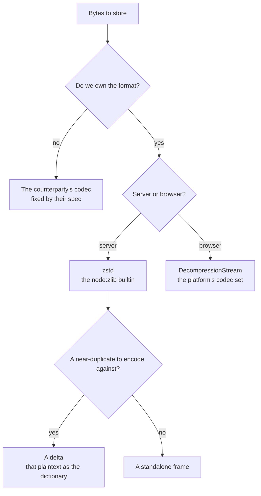

# Compression

**Whenever we choose the bytes, we choose zstd.** There is no per-site codec decision to make, no level to negotiate at the call site, and no compression dependency to install: `node:zlib` ships the codec in the runtime `.node-version` pins, so compressing is a builtin call. A pull request that reaches for gzip, deflate, brotli, `pako` or `fflate` to store bytes only this repo reads is answering a question that is already settled.

The reason is not that zstd wins the ratio-versus-speed table, though it does at every level worth picking. It is that zstd is the only member of that family with a **dictionary** mode, and a dictionary is what makes a near-duplicate cheap: hand the encoder the previous version's plaintext and the new version compresses to the edit between them, with no diff format, no patch grammar and no knowledge of the document's schema. That single capability is the whole basis of the [resource version store](/docs/resource/resource-version-store), where it moves a retained version from a full copy to a few hundred bytes — one to two orders of magnitude off the storage a history costs, with the committed benchmark beside `packages/keyframe-store/src/createKeyframeStore.bench.ts` as the record of what each shape of edit actually pays. The compression level, the window sizing and the keyframe-versus-delta decision belong to that package's README, which is the reference for the object format.

## Where the codec is not ours to pick

Four call sites use something other than zstd, and none of them is a choice we are free to revisit — each is reading or writing a format whose codec another party already fixed. They are listed because the reason differs per row, which is exactly what a hand-maintained table has to carry:

| Call site                                                     | Codec                  | Why it cannot be zstd                                                            |
| ------------------------------------------------------------- | ---------------------- | -------------------------------------------------------------------------------- |
| `packages/parse-tmx/src/services/getDecompressedBytes.ts`     | gzip / deflate         | The bytes were written by the Tiled map editor, and its TMX spec names the codec |
| `apps/web/app/services/emailEditor/exportPersonalizedHtml.ts` | deflate, via `zipSync` | A ZIP archive a person downloads and opens in their file manager                 |
| `packages/db-mock/scripts/generateSnapshot.ts`                | gzip                   | `dumpDataDir` is PGlite's own API and offers its own option set                  |
| `apps/web/app/services/resource/saveStagedResourceContent.ts` | gzip                   | The browser writes it, and `CompressionStream` offers no zstd                    |

The test for a new site is therefore not "which codec is best" but **"does anything outside this repository have to understand these bytes?"** If nothing does, it is zstd. If something does, the counterparty's format is the answer and the row above gains a sibling.

## What the rule buys the build

Compressing on the server through a node builtin, and decompressing in the browser through the platform's own `DecompressionStream`, means **no bundler polyfill exists anywhere in the repo, and none is needed**. Two historical configurations injected a `node:zlib` shim; both are gone, and the build now refuses to let one back in by accident: `getTsdownConfiguration` sets `platform: "neutral"`, so a package reaching for a node builtin fails its own build. A package that genuinely compresses server-side says so by calling `getTsdownConfigurationNode` instead — `keyframe-store` and `db` are the ones that do, and `parse-tmx` stays neutral precisely because the browser gives it the decoder.

## Key Files

| File                                                            | Role                                                                       |
| --------------------------------------------------------------- | -------------------------------------------------------------------------- |
| `packages/keyframe-store/src/services/encodeObject.ts`          | a retained version, compressed as a keyframe or a delta                    |
| `packages/keyframe-store/src/services/decodeObject.ts`          | the matching decode, with the base plaintext as the dictionary             |
| `packages/db/src/services/resource/writeResourceContentBlob.ts` | the working copy, a standalone frame served as `Content-Encoding: zstd`    |
| `packages/parse-tmx/src/services/getDecompressedBytes.ts`       | the browser-side decode of a foreign format, through `DecompressionStream` |
| `packages/configuration/src/getTsdownConfiguration.ts`          | the neutral platform default that keeps node builtins out of a bundle      |

## Notes

- **Transport compression is not application code.** What travels over HTTP is negotiated as `Content-Encoding` between the client and whatever serves the response, so nothing in `nitro.ts` or `vite.ts` configures a compressor and nothing should start to. This standard is about bytes we put into storage, which outlive any request. The one place the two meet is a resource's working copy: it is stored compressed with the blob's `Content-Encoding` set, so Blob Storage serves the stored frame as the transport encoding and the browser decodes it natively. That makes its window an HTTP constraint as well as a storage one, pinned at RFC 9659's 8 MB ([compressed content at rest](/docs/resource/compressed-content-at-rest)).
- **A stored frame's parameters are part of its format, not a tunable.** Once bytes are written, the decoder has to be able to admit them, which is why `keyframe-store` records the window it encoded with rather than letting a reader guess. Anything else adopting zstd for durable bytes inherits that obligation: a compression setting that a later deploy can change is a setting that has to travel with the object.
