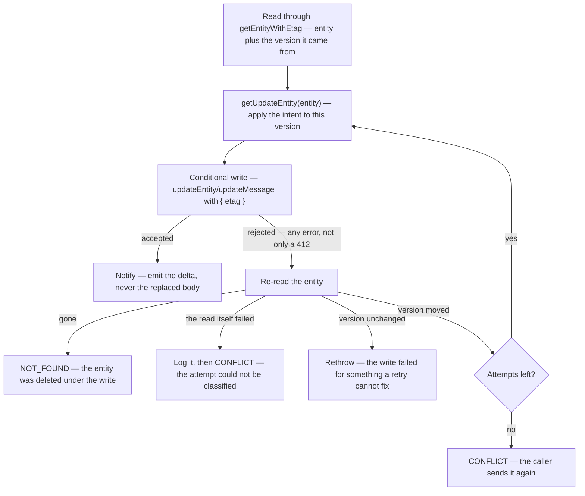

# Conditional Writes

A procedure that reads an entity, computes something from it, and writes the result back is not one operation — it is two, with a gap in between that another caller can write into. Azure Table stores an entity as a single blob, so the write carries the whole version the procedure read. Two of them running at once both compute from that same version, and the later write echoes back a body that never saw the earlier change.

Nothing surfaces. There is no error, no log, and the caller whose write landed first was already told it succeeded. The change is simply gone, and the only witness is a user who watches their edit revert.

So: **a write derived from what the procedure just read is conditional on the version it read.** This is [Persist Then Notify](/docs/architecture/persist-then-notify)'s persist phase under concurrency — the guard/persist/notify ordering is unchanged, the persist step just carries the version it depends on.

## Which writes this covers

A write is a read-modify-write whenever the value it stores could not have been computed without first reading the entity:

| Write                              | Why it qualifies                                                                                                        |
| ---------------------------------- | ----------------------------------------------------------------------------------------------------------------------- |
| A map or array rewritten wholesale | `votePoll` stores the whole votes map; `deleteFile` stores the whole surviving `files` array                            |
| Any `"Replace"`                    | Merge cannot unset a property, so clearing one (`deleteLinkPreviewResponse`, `unpinMessage`) has to write the full body |
| A counter or accumulator           | The new value is the old value plus one                                                                                 |

A `"Merge"` of fields taken straight from the caller's input is **not** one — `updateMessage` writing the text the user typed, or `pinMessage` setting `isPinned: true`, depends on nothing it read.

The `"Replace"` row is the one that gets missed, and it is the worst of the three: the write carries every property, so replaying it from a stale read reverts _all_ concurrent changes to that entity, not just the field the procedure meant to touch.

## The lifecycle

The loop back to `getUpdateEntity` is the whole design: **the retry re-applies the intent, it does not replay the body.** "Record this vote", "drop this file", "clear this field" are all still valid after losing a race — only the body computed against the version that moved is stale. Writing that body again is the bug the conditional write exists to prevent.

`updateEntityConditionally` (`server/services/azure/table/`) owns this loop. A caller supplies `getUpdateEntity`, which receives the **fresh** entity on every attempt, and `writeEntity`, which decides the mode and whether the write stamps message metadata. Do not hand-roll the loop per procedure.

## Rules that fall out of it

- **Read through `getEntityWithEtag`, not `getEntity`.** The latter exists to drop the etag. Where a shared procedure already performs the read — as `getMessageProcedure` does — the etag rides on the procedure context beside the entity, so the round trip is paid once and every procedure built on it gets the option.
- **An absent entity and a failed read are different facts.** `getEntityWithEtag` returns its not-found sentinel for the service's own 404 and nothing else (`checkIsNotFound`); every other fault propagates. Collapsing them is how a throttled re-read gets reported to a voter as `NOT_FOUND` for the message they are looking straight at. A re-read that fails leaves the attempt unclassified, which is what `CONFLICT` already means here — so it is logged with its real cause and the caller is told to send it again.
- **Retries are bounded.** A fixed small number of attempts, never until it lands, or one hot row spins a request a user is waiting on.
- **Exhaustion is an outcome the call chooses.** Anything a user is waiting on throws `CONFLICT`, so they can send it again rather than being shown success over a change that never landed. Fire-and-forget telemetry drops it instead.
- **Only a lost race retries.** The re-read is what tells a stale version from a broken write, without a status code to read. An unchanged version means retrying cannot help, so that error propagates as itself — otherwise a transient fault degrades into `CONFLICT` and names the wrong cause.
- **Notify with the delta.** The subscription payload stays the fields that changed, so a client merges one property instead of adopting a whole entity it may hold newer state for.
- **Derive follow-up work from the attempt that won.** `deleteFile` captures the removed file's name inside `getUpdateEntity`, so the blobs it publishes for deletion belong to the file it actually removed.

## The same hazard where the version is not an etag

The hazard an etag answers is general: **a write derived from a view that another writer can invalidate before it lands.** There are two ways to be safe from it, and they are not the same mechanism.

**Serialize**, so no stale view can exist. `FOR UPDATE` takes the row and makes competing transactions wait, so the second one reads after the first has committed rather than beside it. Nothing is compared and nothing is rejected — the read and the write are simply not interleaved. This is what the storage ledger's reconcile uses to stop two events computing their deltas from the same `countedBytes`.

**Or carry a version token**, where waiting is impossible because the competing writer is not a transaction you can block — it is another process, or an event that has already been delivered. Then the write states which version it depends on and is rejected if that has moved.

| Where                                          | How it is made safe                | What that stops                                        |
| ---------------------------------------------- | ---------------------------------- | ------------------------------------------------------ |
| Postgres read-modify-write                     | serialized — `FOR UPDATE`          | two transactions computing from one value concurrently |
| Azure Table read-modify-write                  | token — the entity `etag`          | a body computed against a version that has since moved |
| An event handler writing what an event reports | token — the event's ordering value | an older event delivered after a newer one             |

The last row is the one that gets missed, because a handler can pass every idempotency check and still be wrong. **Idempotent is not order-independent.** Idempotency asks "does running this twice differ from running it once" — a redelivery computing a zero delta answers yes and is genuinely safe. Ordering asks a question idempotency never poses: _does an older event arriving after a newer one leave the wrong state behind?_ Replaying the stale event is a well-behaved no-op by every idempotency measure and still overwrites the current value with a superseded one.

Event Grid guarantees at-least-once delivery and **no ordering at all** ([dead-letter handling](/docs/infra/eventgrid-dead-letter) covers the delivery half). So a handler whose write depends on _when_ its event happened needs the event to say so:

- **`Microsoft.Storage.BlobCreated` carries `sequencer`** — Storage's per-blob ordering value, and the only thing in the payload that says which write happened last. It is an opaque hex string compared lexicographically after left-padding to a common length, never parsed as a number: it is far wider than a double, so two distinct sequencers round to one value and the comparison silently starts answering false. `checkIsNewerSequencer` in `packages/db/src/services/storage/` owns that comparison.
- **The token is stored beside the value it ordered**, so the next event has something to compare against — `storageLedger.sequencer` beside `countedBytes` ([storage quotas](/docs/platform/storage-quotas)).
- **A writer with no position passes no token and clears none, but it does not wait for one either.** The server's own provisional charge writes bytes without a sequencer. Clearing the stored one would leave the next stale event comparing against nothing and being applied, so the token it cannot rank against is the token it leaves alone. Making it _yield_ to that token is the tempting third rule and the wrong one: the blob it measures is rewritten under one name on every save, so an untokened writer that stood down after the first event never wrote again ([storage quotas](/docs/platform/storage-quotas) has what that cost). An unordered writer that cannot know it is not overwriting a newer measurement is instead made to be the one whose figure the next tokened write measures over.

A handler that writes nothing derived from its event's moment — one that deletes by name, or sets a flag — needs none of this. The question to answer per handler is whether two events for the same subject can carry _different_ values for what it writes; if they can, order decides which is right.

### Testing delivery order

The delivery order is an argument, so the test is the two calls in the wrong order — no mock of Event Grid required. Assert the newest value survives **and** that the stale event still reports having found its subject, or a caller that retries on a miss will retry forever on a correctly-dropped event.

## Testing it

`MockTableClient` honours the condition — a mismatched etag throws a `412`, and every write re-etags — so the loop is fully testable. What it does not reproduce is the interleaving: every mock Azure client resolves in the same microtask drain, so two concurrent procedures run to completion one after the other and **a bare `Promise.all` passes against the unconditional bug**. Hold the first write open and release it only after the second has landed. A green concurrency test that never actually overlapped is worse than no test — it reports the hazard as covered.
