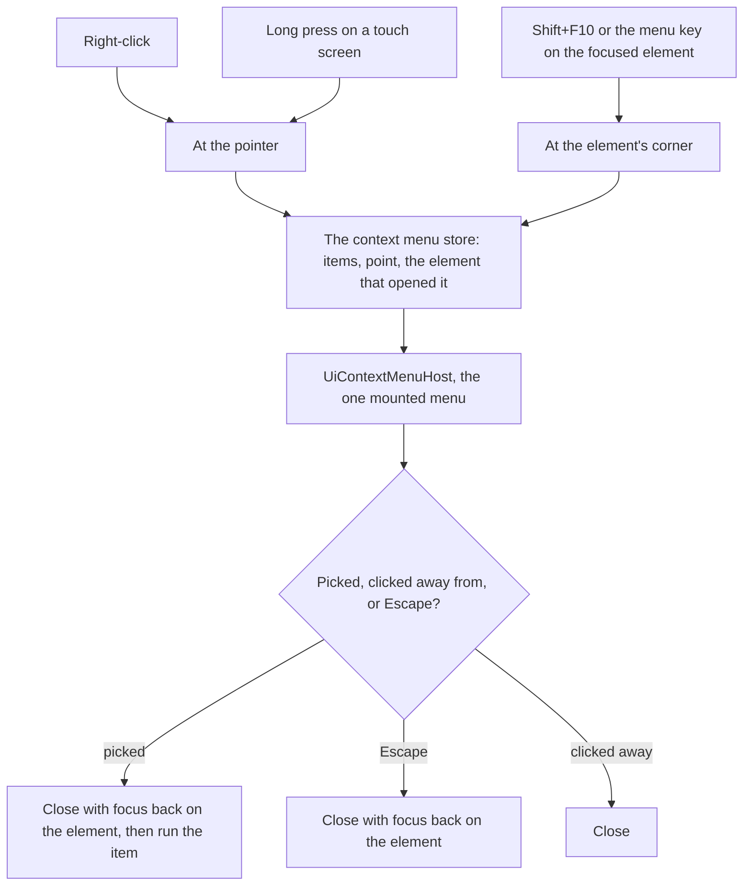

# Context Menus

A thing on screen with actions of its own opens them at a right-click, a long press or the keyboard, through one menu. Vuetify 0 has no context menu, so this one is the [UI library](/docs/architecture/ui-library)'s own: the library's menu, opened at a point rather than under a trigger.

## How it works

- **A target declares its items, and nothing else.** `useContextMenu` hands out the props an element binds, keyed by what it is, with the same `Item` list its overflow button shows, so the two never disagree. The store holds what is open, where and over what, as the [singleton dialogs](/docs/architecture/singleton-dialogs) standard does for dialogs, and `UiContextMenuHost` in `App.vue` is the one menu: a list of thousands of rows mounts one.
- **Three ways in.** A right-click opens at the pointer. A long press on a touch screen opens at the finger, is cancelled by a finger that moves on to scroll, and swallows the click its lifting raises, through a listener added for that one click rather than a prop the element carries. Some browsers raise no click after a long press, so the next press or key on the element, from any pointer, drops a swallow still waiting. Shift+F10 or the menu key opens at the focused element's corner.
- **The browser's menu stays where ours adds nothing.** Only an element that declares items prevents it, so a target binds the props only where it has items, as a post's card does for its author alone. Holding Shift, or right-clicking in a field, still gives the browser's menu, with its copy, paste and spell-check, and over plain text and links the browser's menu is the one there is.
- **It is the library's menu.** It keeps `UiMenu`'s keyboard contract through `useMenu`, focus landing on its first item as it opens, and takes the same items: an icon, a title, a group that opens after a separator, and a destructive item in the error colour. A pick closes the menu and hands focus back to the element it opened over before the item runs, so an item that opens a dialog keeps the focus the dialog takes.
- **A manual popover, closed by its own rules.** An auto popover's light dismiss lands after a second right-click has already moved the menu, and would shut the menu that click opened. The host closes on Escape, Tab, a pick or a click away, and a second right-click while it is open moves it to the new point, onto its new first item. Nothing moves as it opens, since it is opened constantly.
- **A target whose items cost too much to build per row hands on the point instead.** A message's items are built by the options bar that mounts over the one active message, so a right-click on a message records the point in the message store, and the bar mounts over it and opens the menu with the overflow menu's sections. The quick reactions stay on the bar itself, one move away.
- **A new surface joins with the items its overflow button already has.** Anything that gains an overflow menu of its own gains the context menu with it, from the same list.

## The surfaces

| Surface               | Its items                                                                                                                                                                                                                              |
| :-------------------- | :------------------------------------------------------------------------------------------------------------------------------------------------------------------------------------------------------------------------------------- |
| A message             | The overflow menu's sections: its updates, its actions, deleting                                                                                                                                                                       |
| A resource row        | The row's overflow menu: open in a new tab, copy link, blueprint, rename, delete                                                                                                                                                       |
| A place on the dock   | Open in a new tab, and bookmarking it or removing the bookmark when signed in                                                                                                                                                          |
| A post or a comment   | Its author's overflow menu: edit, delete                                                                                                                                                                                               |
| A resource's title    | The page's overflow menu: every command but the one shown beside it                                                                                                                                                                    |
| A resource on Home    | Open in new tab, copy link, and adding it to or removing it from the favorites                                                                                                                                                         |
| A deleted resource    | The row's overflow menu: restore, delete forever                                                                                                                                                                                       |
| A sheet column        | The column's commands, as its header and its overflow button open them                                                                                                                                                                 |
| A friend              | The row's overflow menu: remove the friend, block them                                                                                                                                                                                 |
| A room in the sidebar | Invite people, where the reader may manage invites; room settings, where the reader may change them                                                                                                                                    |
| A room category       | The category header's overflow menu, since the header row takes the call site's attributes                                                                                                                                             |
| A direct message      | Close conversation, as the row's close button does                                                                                                                                                                                     |
| A member              | Profile, then Message or Add friend, Copy user ID, and the moderation the reader may take: notes, warn, timeout, kick, soft ban, ban; the profile's overflow menu holds the same list past the profile and the friend button beside it |
| A reaction            | View Reactions, since the tooltip naming who reacted cannot be clicked through                                                                                                                                                         |

## Key files

| File                                              | Role                                                                  |
| :------------------------------------------------ | :-------------------------------------------------------------------- |
| `apps/web/app/components/Ui/ContextMenu/Host.vue` | The one context menu                                                  |
| `apps/web/app/composables/ui/useContextMenu.ts`   | The props that give an element a context menu, and the long press     |
| `apps/web/app/composables/ui/useMenu.ts`          | The menu's keyboard contract, shared by `UiMenu` and the context menu |
| `apps/web/app/store/ui/contextMenu.ts`            | What the context menu shows, where, and over what                     |
| `apps/web/app/models/shared/Item.ts`              | One action, shared by a thing's overflow button and its context menu  |

## Sources

- [The context menu event](https://developer.mozilla.org/en-US/docs/Web/API/Element/contextmenu_event), MDN: the event a right-click and the menu key raise, and the default it prevents.
- [The menu role](https://developer.mozilla.org/en-US/docs/Web/Accessibility/ARIA/Reference/Roles/menu_role), MDN: the keyboard contract the menu keeps, and focus returning to what opened it.
