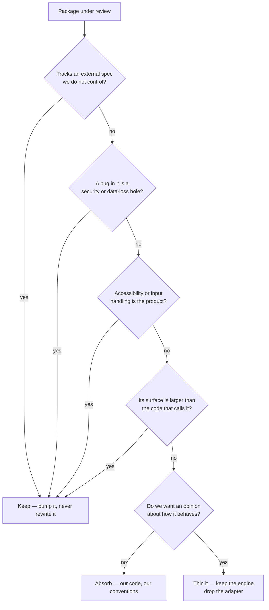
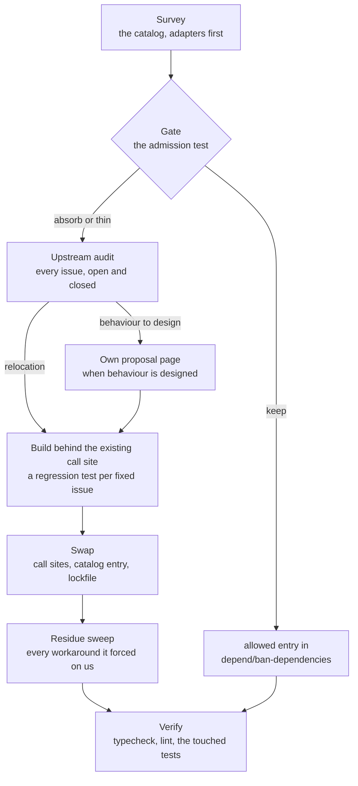
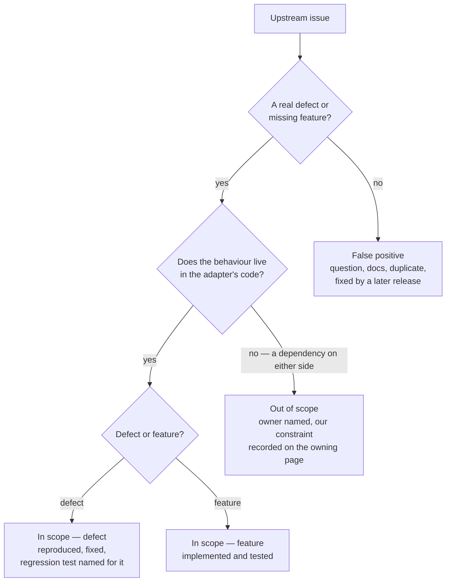

# Dependency Admission

Every version in the workspace lives in one place — the `catalog` block of `pnpm-workspace.yaml`, with `catalogMode: strict` so no package may pin its own. That single file makes the whole dependency surface readable in one sitting, which is what makes an initiative like this possible at all: the question "what are we paying for" has one answer, not fourteen.

This page owns the **rule** for what a third-party package must earn, and the **gap analysis** that applies it once. It is deliberately not a list of rewrites. Most of the catalog passes the test, several entries that look absorbable are the ones we most want to keep, and the honest output of the analysis is a short backlog rather than a long one — which lives on the roadmap of the area whose component carries the dependency, never here. When an item is big enough to need a design, it graduates to its own proposal page — this page never grows into the spec.

## What actually costs us

The instinct is that dependencies cost bytes. They mostly do not — the bundler drops what nothing imports, and the packages that dominate installed size are the engines we would never write: the game engine, the PDF renderer, the diagram renderer, the survey builder. Weight is a symptom worth reading, not the charge.

Three costs are real:

- **A behaviour we cannot change.** A library that owns DOM, keyboard handling and CSS decides the product's interaction model. When our answer to "make it behave the way the reference product does" is "the library doesn't do that", the library has taken a product decision away from us. This is the cost that matters, and it is the one the emoji work removed.
- **A version we do not control.** A wrapper is pinned behind the thing it wraps, so every upgrade of the underlying library waits for a maintainer who is not us. The PDF component is what that looks like when we refuse to wait — an `overrides` entry forcing its full viewer onto a renderer major it never declared ([pdf viewer consolidation](/docs/architecture/rejected/pdf-viewer-consolidation)). It works, but nothing except our own reading verifies that it does, and each renderer bump is us accepting that library's compatibility testing as our own. Two of the page-builder plugins arrive at the same cost from the other direction, imported through `@ts-expect-error no d.ts file`.
- **A second way to do something we already do.** Three PDF packages render pages in one component. Two of them exist because neither did the whole job, so a reader has to learn which one answers a question — and the fuller of the two brings its own headless component library and a crypto package to do it.

Bytes, imports and call sites are the evidence; those three are the charge. A package that is large, old and imported once but costs us none of the three stays.

## The admission test

The same gate decides a package we are considering adding and a package already in the catalog. It is a chain of refusals — a package is absorbed only when it survives every one of them, which is rare by design.

The last branch is what carries the initiative. A package we have no opinion about is absorbed because it is small and we would rather own the twenty lines than the version range. A package we _do_ have an opinion about is not deleted — its engine is kept and the layer that decided the behaviour is replaced by ours. Those are different jobs with different risks, and conflating them is how a dependency cut turns into a rewrite.

### Adapters

An **adapter** is a package whose every runtime dependency and peer is already in the catalog, and whose own code does nothing but connect them — a test mock joining two libraries, a framework module joining a library to the framework's request and fetch primitives, a component wrapping an engine's view for the UI framework. It is the thin branch by construction: both engines stay, and what goes is the connection, which is small because the engines on either side already did the work.

An adapter is the cheapest item this page finds and the one that costs the most per line, because it sits on the seam between two things we upgrade independently. It is pinned behind both, it re-implements whatever it cannot reach through their public APIs, and the workarounds it forces land in our code rather than its own — a type shim for a declaration it inlined, a build entry it needed once, a test-only branch in production code because it could not serve what the real transport sends. The signal is mechanical — its manifest's dependencies against the catalog — so the survey below reads every entry for it rather than waiting for a symptom.

## The precedent

The emoji picker is the shape every absorption on this page should take. What was removed was a package that owned the dataset, the search behaviour and the failure mode all at once, and threw on a query made of punctuation. What replaced it was not a rewrite of any of that. Two data packages generated from the Unicode spec were kept, a general-purpose search engine was kept, and what we wrote was the part that was always ours: which fields are boosted, that an exact shortcode outranks a longer match, that a room's own emoji lead the results, and that a query matching nothing renders the empty state.

The rule that generalises: **keep the data and the hard algorithm, take back the layer that decided behaviour.** Absorbing the dataset would have meant tracking Unicode releases forever, and absorbing the ranking would have meant writing BM25. Neither was the reason the picker was wrong.

The first adapter absorbed is [trpc-msw](/docs/trpc-msw), and it is the shape an adapter's absorption takes. `msw-trpc` joined the request interceptor to the RPC framework by re-implementing the framework's wire format, so everything the framework's own handlers already did — batching, the error formatter, non-JSON input, subscriptions — was either missing or a hand-kept copy. The replacement keeps both engines and writes only the connection: a router built from registered resolvers, handed to the framework's own handlers. Its docs page carries the upstream triage every absorption owes.

The second is [trpc-nuxt-module](/docs/trpc-nuxt-module), the shape an absorption takes when the adapter is a framework integration. `trpc-nuxt` left the handler routes, the WebSocket bridge, the plugin and a `build.transpile` entry to every app that used it, because a library cannot register itself; the replacement is a Nuxt module that does, over tRPC's own fetch and WebSocket adapters, so the app keeps only the link chain that is genuinely its own. It also showed the audit's limit: an issue can be fixed upstream by a neighbour rather than the adapter — the middleware-read body hang no longer reproduces on the h3 the workspace installs — and the verdict says so rather than claiming a regression test that cannot fail on the code it replaces.

## The stop list

Four kinds of package are never absorbed, whatever their size or call-site count. These exist so the initiative cannot talk itself into the expensive mistake later:

- **Spec-tracking.** Anything whose correctness is defined by a document that changes without us — PDF, OOXML, Unicode, XML, SQL dialects, the cloud REST surfaces. Absorbing one converts a version bump into a standing obligation.
- **Security-shaped.** Anything where a bug is a hole rather than a glitch — HTML sanitisation, auth, push encryption, rate limiting, the cloud SDKs. A hand-rolled version is not smaller, it is unaudited.
- **Accessibility-shaped.** Anything whose real surface is focus management, ARIA and keyboard semantics — the component framework, the rich text and code editors. Our own version reliably ships worse here, because the part we would reimplement is the part we would not think to test.
- **Engines.** Anything implementing a large algorithm as its product — the game, 3D, diagram, page-builder and survey runtimes. The plugins around an engine are a separate question from the engine.

## Gap analysis

Applying the gate across the catalog. Only entries with a verdict worth recording appear — everything absent from these tables passed the gate as an ordinary keep, and `pnpm-workspace.yaml` is the list.

A `@types/x` entry is read against the package it types rather than against a call site of its own: one whose runtime package now ships its own declarations is residue, and one whose major trails the package it types is describing an API we no longer install.

### Thin — keep the engine, drop the adapter

The wrapper here is a component file we could write, and its cost is the version lock rather than the styling. Ordered by what the thinning buys.

| Cluster              | Finding                                                                                                                                                                                                                                                         |
| -------------------- | --------------------------------------------------------------------------------------------------------------------------------------------------------------------------------------------------------------------------------------------------------------- |
| 3D visual            | A declarative renderer, its helper library and its Nuxt module serve one decorative component on one page, on top of the 3D engine already shipped for the globe                                                                                                |
| Charts               | The chart wrapper is a thin component over the chart engine, and our own component already sits in front of it                                                                                                                                                  |
| Page-builder plugins | Around a dozen single-purpose plugins around the page builder, several unmaintained and two imported through `@ts-expect-error`. The large ones — the webpage preset, the image editor, the exporter — are engines; the small ones register a block and a trait |

### Keep — the ones that look absorbable and are not

Recording these matters as much as the backlog, because each is a candidate someone will re-propose:

- **The full PDF viewer**, beside the thumbnail embed and the renderer both are built on. Three packages for one component reads like the clearest duplication in the catalog, and it is the one entry where the reading is backwards: what the viewer sells is virtual scrolling, in-document search, a table of contents, printing, forms and ARIA, which the stop list refuses at two separate gates. The `overrides` entry holding it above the renderer major it declares is the cheaper side of that trade, not a reason to take the expensive one (see [PDF viewer consolidation](/docs/architecture/rejected/pdf-viewer-consolidation), rejected).
- **The deep-equality helper**, used across many components. It is a few dozen lines that already handle the cases a hand-rolled version forgets, and rewriting it buys nothing but the chance to get `NaN` wrong.
- **The default-merge helper**, used by every chart resolver. The framework already depends on it, so keeping it costs nothing and replacing it is pure risk.
- **The worker-backed timers**, behind the recording indicator and the interval composable. Their whole value is surviving background-tab throttling, and the failure mode of a naive replacement is silent drift that no test notices.
- **The file-picker ponyfill**, behind import, export and attachment selection. Its value is the fallback path for browsers without the File System Access API, which is exactly the part a replacement would skip.
- **The spreadsheet reader and writer.** Two packages for one feature reads like duplication, but the format is a specification and this is the stop list's first rule.
- **The deep omit**, behind the clicker's save trigger. What it produces is compared against the previous snapshot to decide whether to save, so a replacement that treats a class instance or a nested array even slightly differently either saves on every tick or stops saving, and neither announces itself.
- **The indent-stripping template tag**, behind a request body, the query logger and the virtual runner's command help. The tag is a few lines; the part that is not is escape handling, and getting it wrong corrupts a payload rather than a message.
- **The reactive-streams library**, imported by one component for one operator and one type. It is the grid engine's own dependency and the observables that component filters are the engine's, so the import costs nothing installed; replacing `filter` with a guard in each subscriber saves no line and leaves the subscription type to be rebuilt from the engine's return types.
- **The typed event emitter**, behind the game's app-wide event bus. The game engine ships the same emitter, but untyped; importing it directly is what types every event against the bus's map, and it is already installed as the engine's own dependency.
- **The upstream XML converter's declarations**, in our port of it. The port's public option types are the upstream package's own, inlined into its `dist`; owning them is dozens of interface lines written to replace four manifest lines, and the upstream shapes are the parity target anyway.
- **The code viewer's component**, over the code editor it wraps. The thin version is an editor view mounted by hand plus a compartment reconfigured when the language loads or the theme flips — more lines than the two manifest entries it deletes, for a component that renders one read-only preview.
- **The progress aggregate**, behind block upload. Counting settled blocks ourselves is small, but the counter needs a per-promise continuation and our conventions route those through `Result`, which makes this a rewrite of the upload path rather than a swap. It goes with whatever next touches that path.

## What the analysis left open

The two thinnings the gate did not settle are roadmap items, each on the area whose component carries the dependency: the 3D visual on the about page ([users roadmap](/docs/user/roadmap)) and the page-builder plugin belt ([resource roadmap](/docs/resource/roadmap)). The media viewer was the first item off that list, and the shape the rest should follow: the lightbox library owned what opening an attachment does, could not grow the video half of it, and what replaced it is a dialog over the two elements the message row already renders — no engine kept, because there was none to keep. It is described in [file & media](/docs/esbabbler/file-media).

The chart wrapper is deliberately not an item. It is a cheap thinning that buys little, which makes it something to fold into whichever change next touches that component rather than a task of its own. The code viewer is not one either: its thinning costs more lines than it deletes, which puts it on the keep list above.

## Executing an absorption

An **absorption** is the whole move from a catalog entry to code of our own, and it runs in named stages. The gate is the point of the first half — most items never reach a proposal, and one that does is a case where behaviour is being _designed_ rather than merely relocated. The upstream audit and the residue sweep are the point of the second, because they are the two stages that decide whether the absorption is _complete_ rather than merely compiling.

- **Upstream audit.** The package's issue tracker is read whole, open and closed, before anything is written. The tracker is where every bug the replacement could reintroduce is already written down, and where the workarounds in our own code are explained; an absorption that skips it rebuilds the package's known bugs along with its features. Every issue gets one verdict from the triage below, and the verdicts are recorded on the replacement's own docs page, each linked to its issue — that page is where the next reader of a stranded upstream link finds out what became of it.
- **Residue sweep.** An adapter's cost is mostly in our code rather than its own, so deleting it is not finished at its last import. Every `@TODO` citing its tracker, every type shim for a declaration it shipped, every build or pre-bundle entry that named it, every test-only branch in production code that existed to accommodate it is deleted or given its real reason — in the commit that deletes the catalog entry, because the next reader has no way to tell a stranded workaround from a live one.

Two rules bind the whole pipeline. **The catalog entry is deleted in the same commit that removes its last import** — a dependency kept "until we are sure" is a dependency nobody removes, and the lockfile is the record of what we actually stopped paying for. And **a thinning is built behind the call site it will replace**, so the swap is one import change and the revert is one import change. A rewrite landing as a big-bang replacement of a working feature is how this initiative would earn a bad reputation. The `dependency-absorption` skill owns how each stage is run.

### The standard an absorption meets

A small utility we have no opinion about lands in `packages/shared` and is done when its call sites are. An adapter is different: it is a seam generic over two engines, so it is absorbed as **a workspace package of its own**, publishable, and held to a higher bar than the package it replaces — **feature parity or better, with every issue in its scope closed**. Parity is measured against the upstream package's surface, not against what our app happens to call: a replacement that drops the half we do not use is a fork with gaps, and the next consumer — ours or anyone's — finds them one at a time. Parity stops at what the engines themselves still stand behind: a shape an engine has deprecated is never ported, because the replacement carries only the latest shapes and no debt the upstream package was carrying for its own older users.

### Triage

Each upstream issue is reproduced or read against the source before it is given a verdict, and a verdict without its evidence is not one. The order matters: the first question is whose code the behaviour lives in, because an issue filed against the adapter is often the adapter being blamed for a dependency on either side of it.

- **In scope — defect.** Reproduced against the upstream package first, so the regression test is known to fail on the code it replaces, then fixed. The test names the issue.
- **In scope — feature.** Implemented and tested, whether or not our app calls it — that is what parity means.
- **Out of scope.** The behaviour lives in a dependency on either side — the framework, the security middleware, the engine. The verdict names that owner, and whatever constraint it leaves us is recorded on the page that owns our side of it. One issue can split: the part in the adapter's code is fixed, and the part in its neighbour is out of scope.
- **False positive.** A usage question, a documentation gap, a duplicate, or a defect a later upstream release already fixed. The verdict says which, and links the evidence — the answering comment, the duplicate, the release.

## Handing the standing part to the enforcer

The recurring half of this work is already automated and should stay that way. `depend/ban-dependencies` runs over every `package.json` in the repo and fails lint on a dependency with a native or simpler replacement, with an explicit `allowed` list for the ones we have decided to keep anyway. That is the mechanism that stops the catalog re-growing, and it is why this page is a one-time analysis rather than a standing sweep.

So the follow-through from any decision here is an `allowed` entry carrying the reason, or nothing at all. A package we consciously keep against the enforcer's advice belongs on that list; a package we absorb disappears from it. Neither is a docs edit.

## Key files

| File                                              | Role                                                                      |
| ------------------------------------------------- | ------------------------------------------------------------------------- |
| `pnpm-workspace.yaml`                             | The catalog — every version in the workspace, under `catalogMode: strict` |
| `packages/configuration/eslint/plugins/depend.js` | `depend/ban-dependencies` and its `allowed` escape hatch                  |
| `packages/shared/src`                             | Where an absorbed utility lands                                           |
| `apps/web/app/services/message/emoji`             | The precedent — data and search engine kept, behaviour taken back         |
