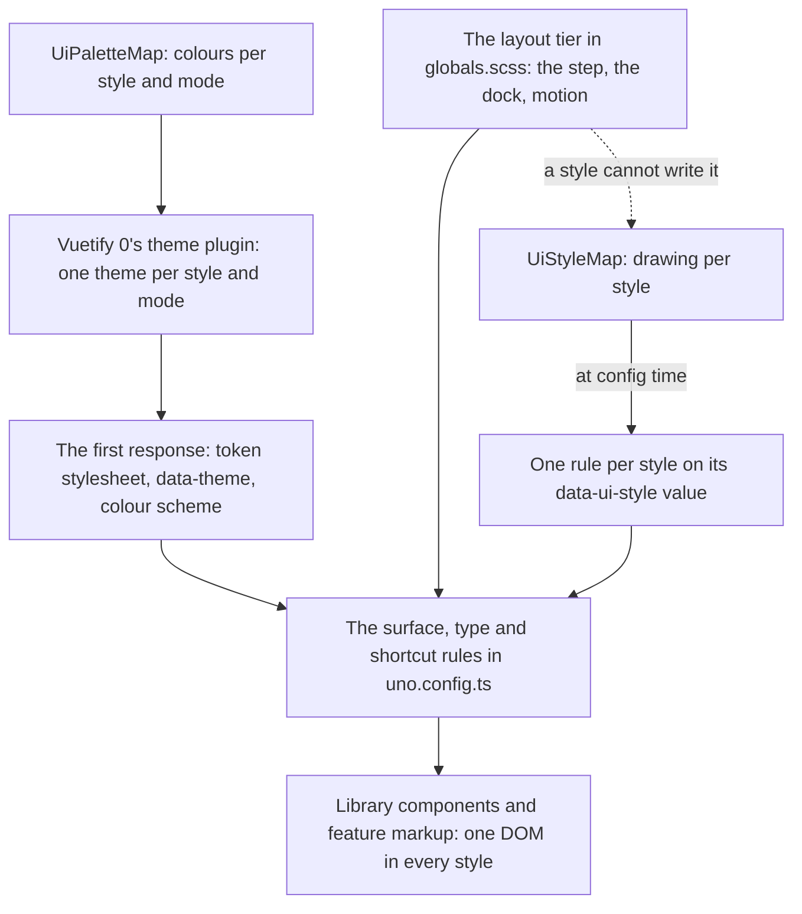
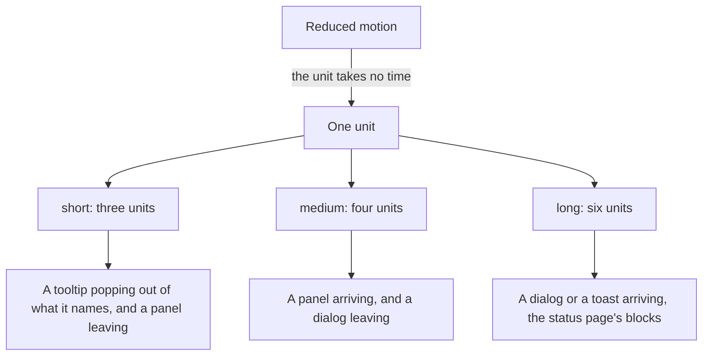
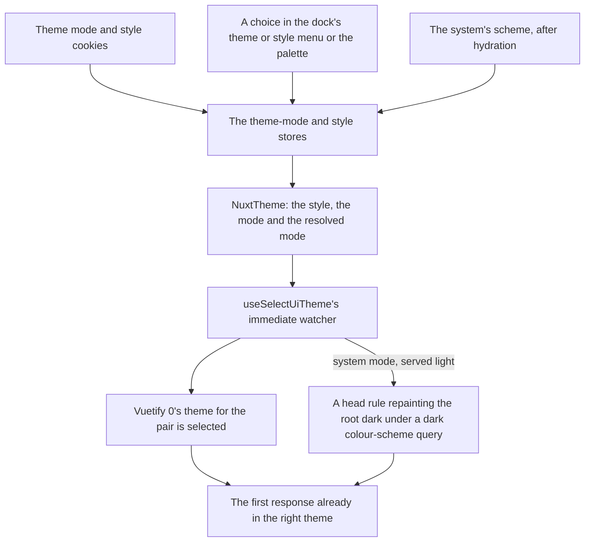

# Design Language

Every interface in the app is drawn from one set of tokens through one set of rules, so the hundredth screen looks like the first without anyone copying one. A component holds no colour, no face and no edge of its own: it wears a surface rule, a type rule and the tokens, and the tokens decide what those look like. The components that wear them are the [UI library](/docs/architecture/ui-library)'s; this page is how anything, a library component or a feature's own markup, is drawn.

## The palette

- **The palette is `UiPaletteMap`**, keyed by design style, then by the resolved mode, then by `UiToken`: the colours an interface is drawn in — two surfaces (background and panel), the border between them, text and its muted form, one accent, and error, info, success and warning. Voxel's dark palette is dusk, the agent console's; its light one is dawn, authored beside it rather than computed from it. Every palette uses the same token names, so nothing that reads a token knows which theme is selected.
- **Every foreground token meets WCAG AA on every surface token in every palette.** A test computes the contrast ratio of each pair, including standard's translucent field and tonal fills composed over every surface, and holds it at the AA threshold.
- **Vuetify 0's theme plugin writes the tokens.** It renders one rule per theme, each token a custom property such as "--ui-accent" keyed on the root's "data-theme" attribute, and the root's colour scheme from the selected theme. Its Unhead adapter puts all of it in the first HTML response, so a page never paints in the wrong theme before hydration; the default adapter writes adopted stylesheets, which exist only in the browser.
- **UnoCSS's colours are the tokens.** Each token is a theme colour whose value is its custom property, so `bg-panel` or `text-muted` follows the selected theme at runtime. There are no other colour names: a colour a template writes is a token, or the heading colour.
- **The palette lives in `apps/web/configuration/`**, beside the style map and the breakpoint scale, because the UnoCSS config reads them and loads before any `@/` alias resolves. It imports its enums relatively, as the other configuration files do.

The agent console stays in voxel's dusk whichever style and theme the app is in. Its root is a theme scope pinned to both ([themes and scopes](#themes-and-scopes)), so its panels read the same tokens as every other page with dusk's values. Its voxel world keeps a palette of its own, `AgentConsolePaletteMap`: the materials — wood, skin, stone and the rest — beside the dusk tokens its interface-coloured props are painted in, since a vertex colour is a value rather than a custom property.

### Colour rules

- **Emphasis is colour first.** What matters is in the accent or the text colour, and what recedes is in the muted token, never a grey picked for the one place.
- **A status is paired with a mark.** An error is the error colour and a mark or a word, never the colour alone, so it reads for a reader who cannot tell red from green: `UiAlert` and `UiToast` draw their status's own mark, and a status is a `UiStatus`, one of the four status tokens spelled as their values, so a store's severity passes straight through.
- **A link is in the info colour**, underlined on hover.

## Design styles

The look is a design style: a named set of everything that decides how the interface is drawn, beside the light and dark the palette switches. There are two: standard, the neutral look most shipped products settled on and the default, and voxel, the agent console's look, which the console and the games pin. The pages a reader spends a long session in — a room's messages, a sheet, the docs — want a calm look, where voxel on every screen reads as a game and tires quickly; the console and the games want voxel, so both stay, a switch apart.

- **A style is a bundle, not a set of knobs.** Radix Themes exposes radius, scaling and panel background as independent props on its theme; here they travel together, because a style's parts only make sense together — a pixel face on rounded corners is neither style.
- **Two tiers.** The layout tier — `--ui-step`, the dock's breadth, the motion timings and where a dialog or a panel arrives from — is the same in every style, so a region that fits in one fits in all of them. The style tier is every `UiStyleToken`: the corner radius, the border width, the shadows each surface is drawn with, the hover and pressed treatment, the focus ring's width, the faces, sizes and heading weight, the heading colour and the dialog scrim. None of its values takes room in the layout: an edge is a shadow, drawn outside the box or inset into it, never a border that would push the content.
- **A style is a column of `UiStyleMap`**, which is `satisfies Record<UiStyle, Record<UiStyleToken, string>>`, so a token without a value in every style fails the typecheck. A value may read the palette's tokens and the step, and nothing a style can hold is a padding, a gap or a height.
- **The tokens are static CSS.** `uno.config.ts` writes each style's column as one rule on its `data-ui-style` value, in the `uno-theme` layer, and the surface, type, button, bar, tab and block rules read the custom properties rather than any style's values. The resolved-config test snapshots both, so a rule that goes back to writing a value shows in the diff.
- **The style is a cookie**, read on the server and held in the style store as the readable-text setting is, so the first response already renders the reader's style and a signed-out reader has one. A reader with no cookie, or one no style answers to, gets the default, standard (`DEFAULT_UI_STYLE` in `configuration/UiStyleMap.ts`), which the theme plugin also starts in. The account menu and the palette list every style under a "Style" heading, the chosen one marked, and the theme modes the same way under "Theme": a choice among several shows all of them, so a reader learns what exists before picking.
- **A region can pin a style.** `UiThemeScope` takes a mode and, optionally, a style; without one it draws in the nearest style. The style is positional, so it is the library's one provide and inject: `useUiStyle` answers the nearest scope's style, or the reader's, which `NuxtTheme` provides around the app and the status page; a component mounted on its own draws in the default.
- **Icons follow the style.** `UiIconMap` holds a row per style, every meaning in each, and `UiIcon` resolves its meaning through `useUiStyle` ([icons](/docs/architecture/ui-library#icons)).
- **The root and every theme scope carry the style.** A custom property that reads another is resolved where it is declared, so a frame's shadow declared only on the root would carry the root theme's edge colour into a scope in another theme. `NuxtTheme` puts the reader's style on the root, where the status page gets it too, and `UiThemeScope` its own on itself, so each scope declares the style's tokens again against its own palette.

### What each style draws

The surfaces keep their roles in both: a frame holds content, a lifted frame floats over the page, a raised surface is pressed, a field takes input. The layout — every length in steps, every control height — is the same in both, so the table is only drawing.

| Part             | Voxel                                                           | Standard                                                                                                           |
| :--------------- | :-------------------------------------------------------------- | :----------------------------------------------------------------------------------------------------------------- |
| Palette          | Dusk and dawn                                                   | Radix's slate for the neutrals and Vue's green as the one accent, dark and light                                   |
| Corners          | None; the frame's ring leaves each corner notched               | Two radii: a control's (a button, a field, a row) and a larger container's (a frame, a popover, a dialog)          |
| Frame            | A ring outside each side, a lit line along the top              | No edge: the panel, a tone above the background, as Material's surface containers are                              |
| Lifted           | Ringed as a frame                                               | A tone further, a wide soft shadow and a faint ring: a popover's panel, a dialog, a toast, a tooltip               |
| Raised           | Lit top and left, shaded bottom and right                       | Tonal: the accent mixed low with the accent as its text; accent stays filled and quiet stays clear                 |
| Field            | The panel colour, square                                        | The panel tone on the control's corner, no edge; tinted in the accent while focused and in the error while invalid |
| Search           | Square, as every voxel corner is                                | A pill: every search field and the button drawn as the field it opens                                              |
| Active indicator | A tab's line, a half step thick                                 | A line two hairlines thick in the accent under the selected tab                                                    |
| Row              | A mark's column, the title and the row's shortcut on one line   | The same, its state layer tinted in the accent at a lower strength than voxel's                                    |
| Divider          | The border colour                                               | A step fainter than the border, since it is the only line left                                                     |
| Hover            | Brightness up a notch; a row or a quiet button tinted in accent | A state layer of the content's own colour; a row or a quiet button tinted in the accent                            |
| Focus ring       | A solid outline a step wide                                     | The same outline at half the width, following the corner; a field is tinted instead                                |
| Type             | VT323 for everything, headings in the accent                    | Inter for the interface, JetBrains Mono for code, headings in the text colour and heavier                          |
| Icons            | Pixelarticons, Material where it has no glyph                   | Lucide, which Nuxt UI and shadcn both ship by default                                                              |
| Scrim            | A dither of the background colour                               | The background, translucent                                                                                        |
| Progress, meter  | Separate blocks, filled one at a time                           | One rounded track in the same step-thick box, its fill eased to the exact reading                                  |
| Spinner          | The terminal's star, a frame at a time                          | A ring turning in the accent over the same element                                                                 |
| Skeleton         | A lighter band stepping across the block                        | A lighter band easing across it                                                                                    |

- **Standard draws in tones, not lines.** A hairline around every surface makes every frame, field, button and menu the same outlined box, so nothing leads and the page reads as a wireframe. Material 3 tells surfaces apart by tone rather than by line, so standard takes Material's way of drawing — surface containers, state layers, a container rounding more than the controls inside it — and keeps the app's density.
- **The standard column is taken, not invented**: the token vocabulary from Nuxt UI (a background, an elevated fill, a border), the role of each step of Radix's neutral scale (app background, panel, lifted panel, divider, border, then low- and high-contrast text), the tones and state layers from Material 3, and the quiet chrome around the content from Linear's refresh. The accent is Vue's green: in dark the bright one Vue's docs lead with, and in light its hue darkened as far as passing on its own tonal fill, since Radix's green reads as bland beside it.
- **A drawing that differs by more than a value is keyed in the library, never in a feature.** The spinner and the skeleton carry the nearest style on their own element through `useUiStyle` and key their scoped style on it, and the loading bar's and the meter's row do the same through the `ui-blocks` shortcut, so a region pinned to voxel inside a standard page still draws voxel's blocks. The row carries its reading as `--ui-blocks-value` and its colour as `--ui-blocks-fill`, which the meter's levels set, so voxel's filled blocks and standard's track read the one value. The DOM and the roles are the same in both.
- **The icon's box is the layout's.** Every icon is `size-6` in both styles: a pixel icon needs it to land on whole pixels, and a Lucide icon in the same box keeps a row of controls lined up.

### What keeps a switch safe

A style is only worth having if switching it can never move or break anything, so each guarantee is held by something that fails:

- **A style cannot write the layout tier.** `UiStyleMap`'s type holds only style tokens, so a style that sets a padding does not typecheck.
- **Every style is complete.** The style map, the palette and the icon map are each `satisfies Record<UiStyle, …>`, so a new token, colour or meaning without a value in every style fails the typecheck, and the palette test runs over every style and mode.
- **One DOM in every style.** Every library component test runs once per style through `setupUiStyle`, so a contract that holds in one style and breaks in the other fails.
- **Features never branch on a style.** oxlint refuses `useUiStyle` outside the library's folders, in an override beside the one that holds the Vuetify 0 boundary, and a source scan in `app/templates.test.ts` refuses the style attribute and its selector anywhere else but `NuxtTheme` and the document chrome, since oxlint reads neither a template's attributes nor a style block. The same scan refuses, outside the library, an edge or a line drawn in steps rather than the style's border width, and anywhere but the icon map, voxel's face or icon set named by hand, so nothing a feature writes draws voxel in the standard style. What a feature needs to differ, the library draws.
- **Checked by eye in each style.** A change handed over for the eye check is looked at in both styles and both modes, switched from the command palette's Style command.

### Rejected

- **Material 3 as specified.** Pill buttons, rows twelve steps tall and a radius of seven steps on containers are sized for touch-first Android, and at the app's density they halve what a room's message list or a sheet shows on one screen. Standard takes Material's surfaces and state layers and leaves its sizes.
- **Keeping the hairlines and adding tone.** A line and a tone that say the same thing are two edges on one surface, which is the weight the tonal drawing takes out.
- **A focus ring around a field.** An outline around a filled field reads as a second edge; the field's tint marks it instead, and the ring stays for everything a keyboard reader moves between.
- **A line along a field: Material's resting line and its active indicator.** A muted hairline along a square bottom that thickens in the accent on focus reads as inset styling on a drawing that is otherwise tones alone — a select showing a feed's sort looks underlined. A field is a tone, and a focused or invalid one a stronger tone.
- **Drawing Vuetify's components for the tonal look.** The library already owns the behaviour and its tests; what a look needs is a drawing, and a drawing is tokens and rules.
- **Voxel as the app's only look.** It is the right look for the agent console and the games, but on every page it reads as a game. A second style costs a column of values rather than a rewrite, and with two styles live a leak shows the day it is written.
- **Adopting Nuxt UI.** It is the reference for the standard style's values, not its implementation. It is built on Tailwind CSS, where every template here is UnoCSS attributify; on Reka UI, a second headless layer beside Vuetify 0; and its components would replace the library's, each with a keyboard contract already tested. What it gets right — the semantic token vocabulary, one radius, the neutral scale — is taken as values.
- **A style as a prop on each component**, as a styled library's variants are. Every call site would then know the style, and a feature could pick one per button. A style is the document's, or a scope's.
- **A style as a palette alone.** Colours cannot take the notches off a frame or the pixel face off a heading. The palette is one row of a style, not the style.

## The layout tier

Everything sits on one step, `--ui-step`, a quarter rem: the width of voxel's frame edge, called a voxel. Padding, gaps, the focus ring's offset and every control's height are whole numbers of steps — one control height of eight steps that a button, a field and a select's trigger share, so a row of them lines up — and a component never states a length the grid cannot express. The step, the dock's breadth (`--dock-size`) and the motion timings sit in `globals.scss` on the root, the same in every style.

## Surfaces

Every surface is a UnoCSS rule in `uno.config.ts`, not a component. A Vuetify 0 part renders its own element and only takes classes, so a select's trigger is raised and its list is lifted with no wrapper component around either. Each surface's drawing is the style's: a rule sets the colour its role takes and reads the style's radius and shadow for everything else. Voxel's drawing is the one described here.

- **`ui-frame`** — a region: the panel colour inside a one-step ring, which leaves each corner cut out.
- **`ui-raised`** — something pressed: the edge colour with its upper sides lit and its lower sides in shadow. `UiButton` and the select's trigger wear it.
- **`ui-field`** — what takes input or sits set into its surface — a text field, a select's trigger, a chip, a track, a key cap: the panel tone on the control's corner, with no edge and no shade, so it stands out on the page and sits flush in a frame. Its padding is the call site's. A field is never drawn as an inset well: a darker or shaded tone reads as inset styling beside the tonal drawing. The browser's own inset edge on `input`, `textarea` and `select` is removed by the reset, so a field is its tone alone and a surface rule or a utility on the element still wins.
- **`ui-lifted`** — a frame that floats over the page: a popover's panel, a dialog, a toast, a tooltip. Voxel rings it as a frame; standard draws it a tone further from the background than a frame, with a wide soft shadow and a faint ring.
- **`ui-popover`** — the top-layer element a menu, a select or suggestions open in, emptied of the browser's own popover look and padded two steps, so the lifted frame inside it never overlaps what it hangs off. Through `anchor-size()` it is at least as wide as that.
- **`ui-pill`** — the shape a search field takes, on the surface it shapes: the palette's field, and the button drawn as the field it opens. Voxel's pill is square, as every voxel corner is.
- **`ui-card`** — a thing a reader picks among others as a whole — a post, a type to create, a type's count, a recent resource: a frame, padded, taking the style's hover as a button does. A card stays a card: drawn as rows, such a set reads as a menu blended into the page.
- **`ui-row`** — one row of a list that goes nowhere, such as an activity entry or a session: the layout a row has, with nothing that says it can be pressed.
- **`ui-item`** — one row of a list, one control height tall and laid out on one line: the mark's column, the title and whatever ends the row, as `UiItemContent` draws them. It is tinted while hovered and more while highlighted, selected, current or focused; the tint marks a focused row, so it draws no ring as well. Every row leads with a mark, so a list's titles start on one line and each reads at a glance: `Item` and `UiCommand` take an icon, a picture or a meaning, and the typecheck refuses one with none. A select's options lead with a mark too (`UiSelectItem`), it marks the chosen one at the row's end, and its trigger is drawn as the field it is and shows the chosen option's mark and title, or, holding several, their titles, and past three how many.
- **`ui-block`** — one voxel block, a step thick, of a bar that fills a block at a time, in the edge colour and lit in the row's fill colour once filled: the loading bar's and the meter's, whose marks set that colour from its scoped style. Standard hides the blocks through the block opacity token and `ui-blocks` draws the row as its track instead.
- **`ui-bar`** — a bar over what it heads, on a line of the style's border width in the divider colour along its bottom: a dialog's title bar, an editor's menu bar, a row of tabs.
- **`ui-guide`** — a guide line down the start edge of what it holds, a navigation's nested list or a thread, drawn as a divider.
- **`ui-tab-list`** and **`ui-tab`** — a row of tabs on that line, and a tab drawing its own stretch of the line in the accent while it is selected or the current page's link. Shortcuts, so `UiTabs` and `UiTabLinks` wear one look.
- **`ui-button`** — something pressed, one control height, its content centred with a step above and below anything taller than an icon, and an icon button square: `ui-raised` with the style's hover and pressed treatment and a disabled state, which the select's trigger wears as well, filled by its variant or while pressed, keyed on `data-variant`, `aria-pressed` and, for a toggle group's choice, `aria-checked`. A quiet one is clear on whatever it sits on and tinted in the accent while hovered, rather than a flat box in the panel colour, which would make a toolbar a row of boxes; a button over a picture, where clear would not read, takes the raised default instead. A quiet toggle, such as an editor's bold, fills while pressed, which needs a rule of its own, since the quiet variant and the pressed fill are the same specificity and the variant comes later. A field-toned toggle pressed — a reaction — takes a light tint of the info colour, a tenth of `--ui-info` over the panel, rather than the accent's fill, which reads too heavy beside the count many of them sit next to. A shortcut rather than a component's scoped style, so `UiButton` and `UiButtonLink` wear one look.

A list row, a tab and a table cell are flat: no surface, only a tint when hovered, selected or focused.

**A utility cannot recolour a surface.** The surfaces are rules generated after the colour utilities in the same layer, so a `bg-*` written on a `ui-raised` element loses to it. A state that recolours a surface is a data attribute the component's scoped style reads, as an earned achievement's badge is, or a variant inside a shortcut, as `ui-button`'s are.

## Type

Four sizes, each a style token: the body, a section heading, a page title and a landing page's display. Voxel draws all four in one pixel face, VT323, each a whole number of steps; standard in Inter, its headings heavier, with JetBrains Mono for code.

- **Tokens and rules.** The faces are `--ui-font-body`, `--ui-font-heading` and `--ui-font-mono`, the sizes `--ui-text-body`, `--ui-text-heading`, `--ui-text-title` and `--ui-text-display`, and the heading's weight and colour `--ui-weight-heading` and `--ui-heading-color`, all the design style's. Four rules in `uno.config.ts` wear them: `ui-body`, `ui-heading`, `ui-title` and `ui-display`. A title that is none of the four, as a frame's or a dialog's, takes the heading colour through `text-heading-color`.
- **A page's root wears `ui-body`**, so everything under it that sets no type of its own reads it, and each heading wears one of the other three. Voxel's heading is in the accent as well as larger, so hierarchy survives a reader who scales the text.
- **One weight in voxel.** The face has one, and its heading weight says so, so a heading element's own bold is never synthesised over it.
- **The body, headings and code each have a face token**, so the readable-text setting swaps the body's alone for the system's sans-serif face and no component knows about it. Code reads the mono face, which in voxel is the pixel face whatever the body reads in.
- **Readable text is a cookie, as the theme is**, not a row of the reader's settings: the first response renders the choice with no flash of the other face, and a reader who is signed out, as most docs readers are, has it too. The root carries an attribute while it is on, and one rule in `globals.scss` swaps the voxel style's body face under it, on the root and on every voxel scope. It is off by default, and toggled from the account menu and the palette, which read one list and offer it only while voxel is selected; its cookie stays, so switching back restores it.
- **Loaded on every page.** Every style's faces are global families of the fonts module (`configuration/fonts.ts`), since the module's scan finds the faces a stylesheet names and not one named through a custom property.

## State

Vuetify 0 marks state on the element as attributes — selected, disabled, open, checked, highlighted — so each row below is a selector on an attribute rather than a prop threaded through the component.

| State         | What changes                                                                                                      |
| :------------ | :---------------------------------------------------------------------------------------------------------------- |
| Hover         | The style's hover on a raised surface — brightness in voxel, a state layer in standard — and a tint on a flat one |
| Pressed       | The style's pressed layer; a toggle while pressed fills in the accent                                             |
| Focus-visible | The document's focus ring, or a field's tint in its place                                                         |
| Selected      | A stronger tint, and a mark where the control has one                                                             |
| Disabled      | The disabled opacity and the default cursor; never hidden, so the reader sees it exists                           |
| Loading       | The control keeps its size, and its label gives way to the spinner                                                |
| Invalid       | The field tinted in the error colour, and the message under it                                                    |

## Motion

Every timing is eased, never stepped: one decelerating curve, so a change starts moving at once and settles into place. Motion says where something came from rather than decorating what is done often.

- **A duration is a whole number of units**, as a length is of steps. `--ui-motion-short`, `--ui-motion-medium` and `--ui-motion-long` in `globals.scss` are each a duration and `--ui-motion-easing`, Material's emphasised curve, so a transition names one token. Anything leaving takes a size shorter than it took arriving, as Material's motion has it.
- **Never stepped.** Stepping a transition a frame at a time to read as pixel art makes a tooltip or a dialog arrive in two to four visible jumps, which read as dropped frames and make each one feel slow, so the pixel look lives in the shapes and never in the timing. Voxel's skeleton band is the one stepped loop, since an eased shimmer is what it avoids; standard eases it, as its own look does.
- **Reduced motion is one line.** Under the preference the unit takes no time, so every timing that reads it is instant and nothing is restated per component. The status page keeps a rule of its own, since its blocks' stagger would still hold them back.
- **A dialog drops into place**, eight steps from above, its scrim fading in with it, and rises back out. The library's dialog is the browser's, so it moves between its open and closed states from `@starting-style`, and stays in the top layer until it has gone through `allow-discrete` on `display` and `overlay`. `--ui-dialog-from` is where it comes from: a sheet rises from the bottom on a narrow screen and steps in from the right on a wide one.
- **A panel steps out of what opened it**: `UiPopover` from its trigger, and from the dock's edge on the dock, which sets `--ui-popover-from` by breakpoint as it sets where a tooltip opens. **A tooltip** pops out of what it names in the short timing. **A toast** steps in from the edge of its corner, and only moves on arriving: each source takes its own toast away, so a leaving toast would need every source behind one transition group, while its arrival is `@starting-style`, which every toast gets whoever mounts it.
- **Nothing moves on a menu, a select, suggestions or the context menu.** They are opened constantly, and suggestions redraw on every keystroke, so motion would only slow each pick down. Nothing loops but a spinner, a skeleton's band and the working line.
- **A default a utility must override is inherited, never set on the element.** `globals.scss` is unlayered, so a custom property it sets on a class beats every UnoCSS utility, which sits in a layer. `--ui-dialog-from` and `--ui-popover-from` are set on the root instead, and a sheet or the dock sets its own on itself, which wins over an inherited value.

## The document chrome

These are properties of the document rather than of any component, so they are set once and reach every page:

- **Scrollbars** thin, with the thumb in the border colour on the background colour, through the standard scrollbar properties on the root, which every scroll container inherits.
- **Selection** in the accent colour, with the background colour for its text.
- **The caret** and **native controls** — a checkbox, a range, a progress bar — in the accent colour.
- **The page's ground and ink**: the body in the background colour, the text colour and the body face.
- **The focus ring** on every focus-visible element: a solid accent outline just outside the element, as wide as the style's focus width. A field is the exception: an outline around a filled field reads as a second edge, so a focused `ui-field` — and a select's trigger, drawn as one — takes the accent's tint over its fill instead, as a focused row does, and an invalid one the error's. A field the library wraps around an editable of its own, as the rich text editor is, takes the tint while that editable has focus. Where a tint stands in for the ring, the ring is made transparent rather than removed, because forced colours drop the tint and paint a transparent outline in, which leaves a keyboard reader a mark there.
- **The colour scheme** on the root, from the selected theme, so the browser's own form controls pick the right half.

They sit in a cascade layer of their own, declared before every other layer in `layers.css`, so a component that draws its own focus or selection wins over the chrome without an override. Below it, UnoCSS's own reset puts every element at a known zero, and the utilities follow it.

### Themes and scopes

`UiThemeScope` renders Vuetify 0's theme element for its style and mode, whose theme attribute gives every token beneath it that palette's values, carries the style attribute so the style's tokens resolve against it, and sets the colour scheme to match, so the browser's own controls follow. The document chrome declares its inherited colours — the scrollbar, the caret and the native controls' accent — on every theme scope as well as on the root, because an inherited value is resolved where it is declared.

## Selecting the theme

The theme-mode store holds the reader's mode — system, light or dark — as a cookie, and resolves system through whether the system asks for dark. `NuxtTheme` hands the style, the mode and the resolved mode to `useSelectUiTheme`, whose immediate watcher is the one place the selection is written, so every path that changes either — the cookie on each request, the system preference settling after hydration, a choice in the account menu — lands there. It is immediate because the server render has to select the right theme too: the adapter's own server-side watcher then patches the head entry before it is serialised. The server cannot read the system's scheme, so a system reader's first response selects light, and a style element in the head swaps in the style's dark palette under a dark colour-scheme media query; the first paint is right with nothing sent to the server, and the mounted media query then selects dark for real. Only an explicit choice of light or dark travels, in the cookie the app already sets.

## Key files

| File                                              | Role                                                                                      |
| :------------------------------------------------ | :---------------------------------------------------------------------------------------- |
| `apps/web/configuration/UiPaletteMap.ts`          | Each style's dark and light palettes, one entry per token                                 |
| `apps/web/configuration/UiPaletteMap.test.ts`     | Every foreground token against every surface token in every palette, at the WCAG AA ratio |
| `apps/web/app/models/ui/UiToken.ts`               | The token names                                                                           |
| `apps/web/app/models/ui/UiStatus.ts`              | A status, spelled as its token                                                            |
| `apps/web/app/models/ui/UiStyle.ts`               | The design styles                                                                         |
| `apps/web/app/models/ui/UiStyleToken.ts`          | The style tier's token names                                                              |
| `apps/web/configuration/UiStyleMap.ts`            | Each style's value for every style token, and the default style                           |
| `apps/web/app/store/ui/style.ts`                  | The reader's design style, kept in a cookie                                               |
| `apps/web/app/composables/ui/useUiStyle.ts`       | The nearest scope's style, or the reader's                                                |
| `apps/web/app/store/ui/themeMode.ts`              | The reader's theme mode and its resolution                                                |
| `apps/web/app/store/ui/readableText.ts`           | Whether body text is in the system's face, kept in a cookie                               |
| `apps/web/app/composables/ui/useSelectUiTheme.ts` | Selects a style in a mode, and paints a system reader's first response dark               |
| `apps/web/app/plugins/ui.ts`                      | Vuetify 0's theme plugin, one theme per style and mode, through the Unhead adapter        |
| `apps/web/app/components/Nuxt/Theme.vue`          | Puts the style on the root and keeps the system's scheme in step                          |
| `apps/web/app/components/Ui/ThemeScope.vue`       | A region drawn in another mode or style                                                   |
| `apps/web/uno.config.ts`                          | One theme colour per token; each style's rule; the surfaces, type rules and shortcuts     |
| `apps/web/uno.config.test.ts`                     | The resolved rules and style rules, snapshotted                                           |
| `apps/web/app/assets/css/globals.scss`            | The document chrome, the layout tier's step and motion tokens, and the dialogs' drop      |
| `apps/web/app/assets/css/layers.css`              | Declares the chrome's layer first                                                         |
| `apps/web/configuration/fonts.ts`                 | Every style's faces as global font families                                               |
| `apps/web/app/templates.test.ts`                  | Refuses a style branch, a hand-drawn edge or voxel's face outside the library             |

## Sources

Each value here is chosen against a design system — Material 3's colour roles, states, shape and motion, Nuxt UI, Radix, Linear — listed with the contrast and forced-colours references on [design sources](/docs/architecture/design-sources). Below are the sources particular to this page.

- [Theming](https://0.vuetifyjs.com/guide/features/theming), Vuetify 0: themes as custom properties, and the Unhead adapter that renders them into the first response.
- [Styling](https://0.vuetifyjs.com/guide/fundamentals/styling), Vuetify 0: the state attributes each state row is a selector on.
- [Success criterion 1.4.3](https://www.w3.org/TR/WCAG22/#contrast-minimum), WCAG 2.2: the AA threshold the palette test holds each pair to.
