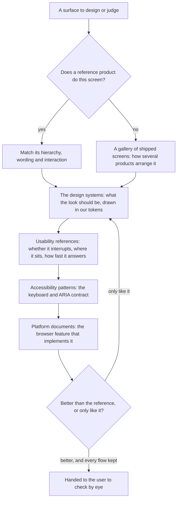

# Design Sources

Nothing in the app's interface is designed from memory. A surface is laid out after looking at how the best shipped product arranges the same screen, drawn in tokens whose values come from a design system that explains why they work, and given the keyboard contract a published accessibility pattern describes. This page is the one list of those sources, with what each one gave the app, so an idea that shaped a surface is never lost when the surface is rewritten.

The rules that use these sources live elsewhere: where an action goes is the `ux` skill's, the design pass every unit of the UI library walks is the `ui-library` skill's, and the look itself is the [UI library](/docs/architecture/ui-library) page's. This page only says where to look, and in what order.

## The order they are consulted in

The last gate is the design pass's own question. Matching the reference product is the floor; a departure from it has to say how it is better, and it is argued in the commit body with the source it came from.

## Reference products

Each product area follows one product that already solved its domain, so its arrangement, its copy and its behaviour are taken rather than reinvented. A screenshot of the reference product handed over in a conversation is the specification for that surface (the `ux` skill).

| Area                                                                  | Reference product                                                                                   | What it gave                                                                                                                                                                                                                          |
| :-------------------------------------------------------------------- | :-------------------------------------------------------------------------------------------------- | :------------------------------------------------------------------------------------------------------------------------------------------------------------------------------------------------------------------------------------ |
| [Esbabbler](/docs/esbabbler)                                          | [Discord](https://discord.com/), then Slack                                                         | Room settings' information architecture, roles, invites, custom emoji, threads, push to talk, webhooks, mention badges, the composer's create menu                                                                                    |
| [Calls](/docs/esbabbler/calls)                                        | [Google Meet](https://meet.google.com/)                                                             | Share-link calls, fullscreen of the whole call view during a screen share, picture in picture                                                                                                                                         |
| [Clicker](/docs/clicker)                                              | [Cookie Clicker](https://orteil.dashnet.org/cookieclicker/)                                         | The store's rows: a price green while affordable and red while not, the count owned beside it                                                                                                                                         |
| [Resource explorer](/docs/resource/explorer)                          | [The Azure portal](https://portal.azure.com/)                                                       | The explorer's blades, the breadcrumb trail as "where did I come from", the guarded delete that asks for the resource's name                                                                                                          |
| [Calendar](/docs/architecture/calendar)                               | [Outlook](https://outlook.live.com/calendar/), then [Google Calendar](https://calendar.google.com/) | Outlook's four views in its order and its view shortcuts, the month navigator, the shaded working day, the current-time line, a double click to create and a drag to move; Google Calendar's single keys for today, next and previous |
| [Sheets](/docs/resource/sheet)                                        | Excel and Google Sheets                                                                             | Clipboard semantics: a copy lands as a table wherever it is pasted                                                                                                                                                                    |
| [Agent console](/docs/infra/claude-interface/agent-console)           | The Claude desktop app's Code tab, and T3 Code                                                      | One conversation column with the composer pinned under it, folding a tool call and toggling it on a click anywhere on it                                                                                                              |
| [Voxel world](/docs/infra/claude-interface/agent-console/voxel-world) | Minecraft and Roblox                                                                                | Movement, sprinting, sneaking, chunks, skins and proximity prompts; the page lists its own game and graphics sources                                                                                                                  |

## Design systems

These are where the look comes from: the palette's structure, the surfaces, the type, the motion and the density. A value in the tokens is chosen against one of them, never picked by eye alone.

| Source                                                                                                                                                                        | What it gave                                                                                                                                                           |
| :---------------------------------------------------------------------------------------------------------------------------------------------------------------------------- | :--------------------------------------------------------------------------------------------------------------------------------------------------------------------- |
| [Material 3](https://m3.material.io/)                                                                                                                                         | The system Vuetify 4 implements, so the reference for every page Vuetify still draws: its type roles, spacing grid, and when a surface earns elevation or a tonal fill |
| [Material 3's color roles](https://m3.material.io/styles/color/roles)                                                                                                         | Surface containers told apart by tone rather than by line: standard's frame, lifted panel and filled field                                                             |
| [Material 3's states](https://m3.material.io/foundations/interaction/states/overview)                                                                                         | The state layer, one translucent overlay of the content's colour per state: standard's hover and pressed fills and its tonal button                                    |
| [Material 3's shape](https://m3.material.io/styles/shape/corner-radius-scale)                                                                                                 | A container rounding more than the controls inside it: standard's container and control radii, and the pill a search field takes                                       |
| [Material 3's easing and duration](https://m3.material.io/styles/motion/easing-and-duration/tokens-specs)                                                                     | The one decelerating curve every transition uses, and how long a change of each size takes                                                                             |
| [Vuetify's components](https://vuetifyjs.com/en/components/all/) and [wireframes](https://vuetifyjs.com/en/getting-started/wireframes/)                                       | The intended variants and densities of a Vuetify component, and the app-level layouts it is built to render                                                            |
| [Pixelarticons](https://pixelarticons.com/)                                                                                                                                   | The library's icon set, drawn on a 24-unit pixel grid to sit on a voxel surface                                                                                        |
| [Design Tokens Format Module 2025.10](https://www.designtokens.org/tr/drafts/format/)                                                                                         | The split of primitive and semantic tokens that the layout tier and the design style's tier follow                                                                     |
| [Radix Themes, theme overview](https://www.radix-ui.com/themes/docs/theme/overview)                                                                                           | Radius, scaling and panel background as theme-level settings: the precedent for a design style above the palette                                                       |
| [Nuxt UI's CSS variables](https://ui.nuxt.com/docs/getting-started/theme/css-variables) and [design system](https://ui.nuxt.com/docs/getting-started/theme/design-system)     | The standard style's token vocabulary — a background, an elevated fill, a border, one radius — and its neutral scale                                                   |
| [Radix Colors, understanding the scale](https://www.radix-ui.com/colors/docs/palette-composition/understanding-the-scale)                                                     | Which step of a neutral scale is a background, a component, a border and a text colour: the standard palettes' slate                                                   |
| [Linear's design refresh](https://linear.app/now/behind-the-latest-design-refresh) and [how Linear redesigned its UI](https://linear.app/now/how-we-redesigned-the-linear-ui) | Quieter chrome so the content leads, and a theme generated from a few inputs: the standard style's density and Inter face                                              |
| [Lucide](https://lucide.dev/)                                                                                                                                                 | The standard style's icon set, the one Nuxt UI and shadcn ship                                                                                                         |
| The agent console                                                                                                                                                             | The voxel look itself: the dusk palette, the pixel face, the notched frame, raised buttons and sunk fields, generalised into the library's tokens and surfaces         |

## Galleries of shipped screens

- **[Mobbin](https://mobbin.com/)** — a library of real app and web screens and flows, for how several products arrange the same thing when no one reference product owns it.

## Usability

| Source                                                                                                               | What it gave                                                                                                                                                                                                                                                                                                                              |
| :------------------------------------------------------------------------------------------------------------------- | :---------------------------------------------------------------------------------------------------------------------------------------------------------------------------------------------------------------------------------------------------------------------------------------------------------------------------------------- |
| [NN/g, modal and nonmodal dialogs](https://www.nngroup.com/articles/modal-nonmodal-dialog/)                          | A modal only for what must interrupt; anything else is a popover or a panel beside the content                                                                                                                                                                                                                                            |
| [NN/g, confirmation dialogs](https://www.nngroup.com/articles/confirmation-dialog/)                                  | A confirmation only before what cannot be undone, and its answer named by the act rather than "OK"                                                                                                                                                                                                                                        |
| [Apple's Human Interface Guidelines on motion](https://developer.apple.com/design/human-interface-guidelines/motion) | Motion says where something came from or went, never decorates a frequent action, and never carries a meaning alone                                                                                                                                                                                                                       |
| [Laws of UX](https://lawsofux.com/)                                                                                  | The Doherty threshold (feedback within 400ms), [Fitts's law](https://lawsofux.com/fittss-law/) for target size and placement, [Hick's law](https://lawsofux.com/hicks-law/) for how many choices a menu offers, and the [aesthetic-usability effect](https://lawsofux.com/aesthetic-usability-effect/) for why the look is worth the work |
| [Firefox's address bar ranking](https://firefox-source-docs.mozilla.org/browser/urlbar/ranking.html)                 | Frecency, which ranks the dock's recent pages and the command palette's places                                                                                                                                                                                                                                                            |

## Accessibility

- **[WAI-ARIA Authoring Practices](https://www.w3.org/WAI/ARIA/apg/)** — the keyboard contract of every library component: the [menu button](https://www.w3.org/WAI/ARIA/apg/patterns/menubar/), [listbox](https://www.w3.org/WAI/ARIA/apg/patterns/listbox/), [combobox](https://www.w3.org/WAI/ARIA/apg/patterns/combobox/), [modal dialog](https://www.w3.org/WAI/ARIA/apg/patterns/dialog-modal/), [grid](https://www.w3.org/WAI/ARIA/apg/patterns/grid/), [date picker dialog](https://www.w3.org/WAI/ARIA/apg/patterns/dialog-modal/examples/datepicker-dialog/), [breadcrumb](https://www.w3.org/WAI/ARIA/apg/patterns/breadcrumb/) and [disclosure navigation](https://www.w3.org/WAI/ARIA/apg/patterns/disclosure/examples/disclosure-navigation/) patterns.
- **[WCAG 2.2 contrast minimum](https://www.w3.org/WAI/WCAG22/Understanding/contrast-minimum.html)** — the ratio every foreground token is tested against on every surface token.
- **MDN on [forced colours](https://developer.mozilla.org/en-US/docs/Web/CSS/@media/forced-colors), [reduced motion](https://developer.mozilla.org/en-US/docs/Web/CSS/@media/prefers-reduced-motion) and [colour scheme](https://developer.mozilla.org/en-US/docs/Web/CSS/@media/prefers-color-scheme)** — why a shadow-drawn edge also carries a transparent border, why the motion tokens are the one reader of the preference, and how the theme follows the system.
- **[Game accessibility guidelines](https://gameaccessibilityguidelines.com/full-list/)** — the voxel world's controls and camera.

## Platform

- **The top layer** — [the Popover API](https://developer.mozilla.org/en-US/docs/Web/API/Popover_API), [the top layer](https://developer.mozilla.org/en-US/docs/Glossary/Top_layer) and [anchor positioning](https://developer.mozilla.org/en-US/docs/Web/CSS/Reference/Properties/position-anchor), which every menu, select, tooltip and dialog is built on, and [Chrome's entry and exit animations](https://developer.chrome.com/blog/entry-exit-animations), for how they arrive and leave.
- **The document's chrome** — [scrollbar colour](https://developer.mozilla.org/en-US/docs/Web/CSS/scrollbar-color), [easing functions](https://developer.mozilla.org/en-US/docs/Web/CSS/transition-timing-function) and the [context menu event](https://developer.mozilla.org/en-US/docs/Web/API/Element/contextmenu_event).
- **The headless layer** — Vuetify 0's [building frameworks](https://0.vuetifyjs.com/guide/fundamentals/building-frameworks), [styling](https://0.vuetifyjs.com/guide/fundamentals/styling), [theming](https://0.vuetifyjs.com/guide/features/theming) and [testing](https://0.vuetifyjs.com/guide/tooling/testing) guides: behaviour and ARIA in the primitive, the look in our wrapper, state reaching the style as data attributes.
- **Dates** — [Temporal](https://developer.mozilla.org/en-US/docs/Web/JavaScript/Reference/Global_Objects/Temporal), whose plain dates every calendar walks so a time zone never moves a day.
- **The icon engine** — UnoCSS's [icons preset](https://unocss.dev/presets/icons), which turns a whole icon class into one masked SVG rule.

## Notes

- **A proposal lists the sources it draws on in its own Sources section**, and they join this page when it ships, since this page names only what a shipped surface took from somewhere. A source weighed and not taken stays with the decision that weighed it, as Reka UI does in the [UI library proposal](/docs/proposals/refactors/ui-library).
- **A new source is added the day a surface takes something from it**, with the one line saying what it gave. A link without that line is a bookmark, and it is not kept.

## Key files

| File                                                    | Role                                                                            |
| :------------------------------------------------------ | :------------------------------------------------------------------------------ |
| `.agents/skills/ux/references/visual-design-sources.md` | How an agent uses the reference product and the design systems while laying out |
| `.agents/skills/ui-library/references/design-pass.md`   | The questions every unit is asked, the last of which is this page's final gate  |
