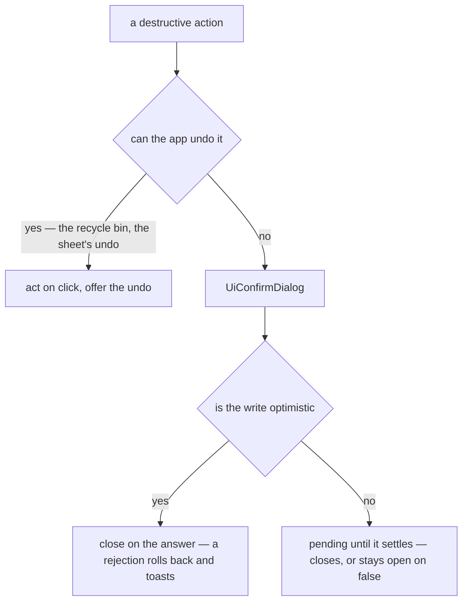

# Destructive Confirmation

A destructive action the app cannot undo confirms through one shape of dialog: `UiConfirmDialog`, the UI library's alert dialog ([UI library](/docs/architecture/ui-library)). One the app can undo acts at once and puts the way back on screen instead: deleting a resource moves it to the [recycle bin](/docs/resource/recycle-bin) and its toast restores it, and deleting a sheet's row, column or selection is a command the toolbar's Undo reverses. A confirmation before a reversible act trains the reader to dismiss confirmations, and the real ones pay for it.

The dialog shows what the action is about in its default slot, then Cancel and one answer in the danger variant, named by `confirmLabel` (`Delete`, `Leave`, `Revoke`). It opens onto Cancel, so a stray Enter never destroys anything. The answer is the `confirm` prop, a function the dialog calls and owns the outcome of through `useDialogAnswer`, so no caller decides when it closes:

- **Awaited**, the default: the answer is pending and the dialog locked until the function settles. It closes then, unless the function resolved `false`, which keeps it open with the answer ready to try again. Deleting a room, a room emoji or a dashboard visual waits for the server this way.
- **Optimistic**, with `isOptimistic`: the dialog calls the function and closes at once, because an [optimistic](/docs/architecture/client-data) write has already changed the list, and a rejection is answered by the write's rollback and error toast. The dialog calls the function first and closes second, since closing a singleton dialog clears the target its handler reads.



Feature code never hand-rolls a dialog + confirm-button flow; if a delete confirmation needs something the shared component lacks, the capability is added to the shared component so every caller can opt in.

## The type-the-name guard

High-stakes deletes add the Azure-portal-style guard by passing `confirmName`, as the recycle bin's purge does:

```vue
<UiConfirmDialog
  v-model="isOpen"
  :confirm="() => emit('purge', resource)"
  confirm-label="Delete forever"
  :confirm-name="resource.name"
  is-optimistic
  title="Delete forever"
>
  Permanently deleting this resource destroys its contents. This cannot be undone.
</UiConfirmDialog>
```

The component renders the name in a field's code block with the library's copy button beside it — copying the name is part of the shared base, not something a caller adds — followed by an autofocused text field labelled `Type '<name>' to confirm`, and keeps the answer disabled until the input matches exactly. The typed value resets whenever the dialog closes, so a reopened dialog always starts locked.

## Quoting what the action is about

A confirmation that names one message, post or comment shows it, so the reader sees what goes rather than recalling it. A message renders through its own component in preview mode inside a `ui-frame` box; a post or comment renders through `PostPreview`, set off by a guide down its start edge (`ui-guide`) rather than a frame. Either way it reads as a quotation of content lifted out of somewhere else, never as another card nested in the dialog's surface.

## Choosing the tier

| Tier                        | When                                                                                                 | Example consumers                                                                  |
| --------------------------- | ---------------------------------------------------------------------------------------------------- | ---------------------------------------------------------------------------------- |
| No confirm, an undo         | Anything the app can reverse — the recycle bin, the sheet's command history                          | Resource delete (row, selection, page), sheet row, column and selection delete     |
| Plain confirm (no guard)    | Routine, low-blast-radius deletes — a single message, draft, ban, webhook, role, or dashboard visual | Message/draft delete, ban removal, role delete, dashboard visual delete            |
| `confirmName` = entity name | Irreversible container-level deletes where losing the wrong one is expensive                         | Recycle-bin purge, edit-form entity delete, room delete (the owner types the name) |

## Key files

| File                                                                 | Role                                                                                                |
| -------------------------------------------------------------------- | --------------------------------------------------------------------------------------------------- |
| `app/components/Ui/ConfirmDialog.vue`                                | The shared dialog — Cancel first, the danger answer, the awaited `confirm`, the `confirmName` guard |
| `app/composables/ui/useDialogAnswer.ts`                              | How every dialog that answers a write closes — at once when optimistic, on success when awaited     |
| `app/components/Styled/EditFormDialog/ConfirmDeleteDialogButton.vue` | Edit-form entity delete — passes the entity name as `confirmName`                                   |
| `app/components/Resource/RecycleBin/PurgeDialog.vue`                 | The one resource delete that is real, guarded by the resource's name                                |

## Notes

- A sheet's deletes leave no toast, because its undo reverses the latest command, which by the time a toast is clicked need not be the delete. The resource Restore toast is single-use for the same reason, spent once the restore lands.
- The edit-form delete always passes `confirmName`, deriving its title and its prose from the entity being edited, so an editor cannot ship a container-level delete without the guard — which tier a delete takes is decided once by the table above, never by a caller's choice.
- No destructive button deletes on click unless the app can undo it, and then the undo is on screen at once — the toast's Restore or the toolbar's Undo. Every other one opens this dialog first. A button keeps its own look by opening the dialog itself: the dashboard-visual delete is a `UiIconButton` whose click sets the dialog's model, and the edit-form delete is a `UiIconButton` beside its dialog in the same way.
- List-item deletes mount the dialog once per list and target it through a dialog store — see [Singleton dialogs](/docs/architecture/singleton-dialogs).
- `StyledEditFormDialogConfirmCloseDialogButton` (save/discard/cancel on dirty close) is a three-action decision dialog, not a destructive confirmation — it composes the [dialog shell](/docs/architecture/dialog-shell) directly, carrying discard in `prepend-confirm`, and stays outside this component on purpose.
