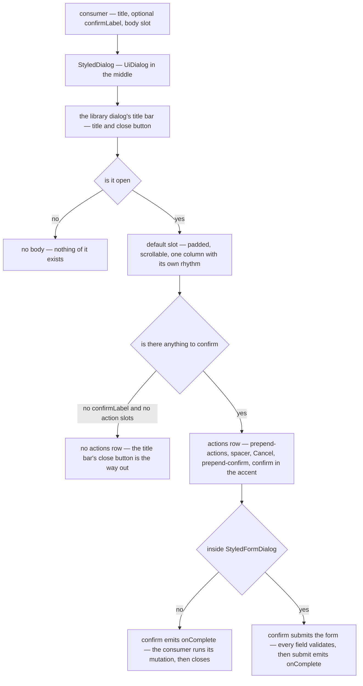

# Dialog Shell

`StyledDialog` is the shell every dialog with an actions row composes, with one documented exception below. It is the UI library's dialog (`UiDialog`) in the middle of the page, with its title bar and close button, a padded scrollable body and an actions row of library buttons, so the contract is its `title`, what confirming does (`confirmLabel`) and bare body content in the default slot. Only the title and the body are really required: a dialog with nothing to confirm omits `confirmLabel` and loses the actions row with it. Two optional slots sit alongside — `#prepend-actions` for the row's leading edge, and `#prepend-confirm` for a third decision in the trailing group. What a call site passes goes to the dialog element, which it sizes (`w="[min(64rem,96vw)]"`). Nothing else in the app hand-rolls a dialog and confirm-button pair.

The body mounts with each open and goes with each close. The library's dialog is the browser's own, which stays mounted while shut, so this is what keeps a closed dialog's viewer, query or form state from existing, and what makes every open start from what its model says.

Two shells build on it. `StyledFormDialog` wraps the base around a `UiForm` with a generated form id, so its confirm button is the form's submit: it stands disabled while the form has a failing field, pending while the submit is out, and disabled on whatever else the consumer passes as `isConfirmDisabled`. `StyledEditFormDialog` is the editor-shaped sibling rather than a third layer: it is the library's dialog high on the page, or over the whole page when the reader asks, with a header of its own — the item's kind over its name, which follows the name field as the reader types, then the validity mark, Save as the one labelled accent button, and delete, full-screen and close as quiet icon buttons, because an editor's actions live at the top where the form below can scroll past them. A delete is a [destructive confirmation](/docs/architecture/destructive-confirmation), never this shell.

## How one dialog renders

## The rules the shell enforces

**Body content is the default slot.** The shell's props are the library's words — a title, a confirm label, whether the confirm may be pressed — and never a prop bag passed through to the dialog underneath, so a message is always children, landing in the scroll container and the column rhythm the shell sets for every dialog.

**The actions row belongs to the shell.** Cancel is the shell's and closes the dialog. A third choice — discard, skip, "export anyway" — is a decision the same weight as the other two, so it goes in `#prepend-confirm` and sits between them: the whole trailing group reads cancel → alternative → confirm, and every decision the dialog offers is under the pointer at once. `#prepend-actions` is the other edge and is not for decisions: it carries what annotates the row rather than answers it — a `3/10 options` counter, a hint — kept away from the buttons so it is not clicked as one.

**The confirm button comes from the shell, not from the caller.** It is the library's button in the accent, the dialog's one action, and says what it does in `confirmLabel`. A destructive answer is not drawn here at all: it is the danger button of a [destructive confirmation](/docs/architecture/destructive-confirmation).

**Confirming is asynchronous and the consumer closes the dialog.** `confirm` emits an `onComplete` callback rather than closing on click, so a failed mutation leaves the dialog open with the user's draft intact. `StyledFormDialog` extends the same callback with an `isSuccessful` flag and keeps its submit button pending until it is called.

## Dialogs with nothing to confirm

A dialog that only shows something, a reference sheet, composes the same shell. Omitting `confirmLabel` drops the whole actions row, cancel included: there is no pending change for cancel to abandon, and a read-only dialog forced to carry one button it never wanted is a dialog that re-rolls the frame to get rid of it. The title bar's close button is its dismissal.

The command palette, the keyboard shortcuts dialog and the settings dialogs are not on this shell. They have no actions row to give, so they are the library's own dialog directly ([command palette](/docs/architecture/command-palette)).

## When a dialog may keep its own shell

`MessageModelMessageForwardRoomDialog` is the one dialog with an actions row that does not compose `StyledDialog`, and that is settled rather than pending. What it needs is a pinned **footer** — a message preview and a rich-text editor stacked full-width above a full-width send button, between the scroll block and the actions row.

Nothing else in the app wants that region, and a slot earning its existence from a single consumer is the flag the `file-organization` skill rules out: the shell would grow a concept every other dialog has to read past. The bar for adding one is a second consumer, not a first — so if another dialog needs the same region, the footer becomes a slot and this dialog composes the shell like the rest.

## Key files

| File                                                                | Role                                                                                   |
| ------------------------------------------------------------------- | -------------------------------------------------------------------------------------- |
| `app/components/Styled/Dialog.vue`                                  | The shell — the library dialog, the body mounted while open, the actions row           |
| `app/components/Styled/FormDialog.vue`                              | Adds the `UiForm`, submit wiring, validity and pending state to the shell              |
| `app/components/Styled/EditFormDialog/Index.vue`                    | Editor-shaped dialog — its own header, full-screen placement, dirty-close confirmation |
| `app/components/Styled/EditFormDialog/ConfirmCloseDialogButton.vue` | Save / discard / cancel on a dirty close, composed on the shell with `prepend-confirm` |
| `app/components/Ui/Dialog.vue`                                      | The library dialog underneath, whose Escape asks the model rather than closing itself  |
