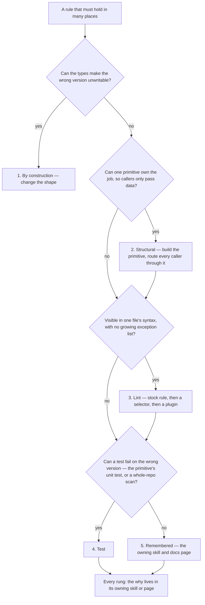

# Enforcement Ladder

A convention that holds only while someone remembers it is a bug with a delay. Every rule this codebase keeps is placed on the highest rung that can carry it, and each rung down costs more for as long as the rule exists. The ladder is how "we should always do X" becomes something the build proves, so the codebase keeps getting better without anyone re-reading every file.

## The rungs

| Rung               | What holds the rule                                                                     | What it costs forever                                                           |
| :----------------- | :-------------------------------------------------------------------------------------- | :------------------------------------------------------------------------------ |
| 1. By construction | The wrong version does not typecheck or cannot be expressed                             | Nothing                                                                         |
| 2. Structural      | One primitive does the job, and every caller goes through it                            | One review of the primitive                                                     |
| 3. Lint            | A stock rule, a `no-restricted-syntax` selector, or a custom oxlint plugin fails it     | Nothing per file: one pass covers the whole monorepo, and new files are covered |
| 4. Test            | A test of the primitive itself, or a sweep script under `scripts/src/sweeps/`, fails it | Upkeep: fixtures and assertions move with the code they pin                     |
| 5. Remembered      | A rule in the owning skill and the owning docs page, read by review and sweeps          | Every reader, on every change, forever                                          |

Lint sits above a test because it needs nothing when the repo changes: a new file is linted the moment it exists, where a test covers only the paths someone wrote it for. A test sits above prose because it fails on its own, where prose is only as good as the last person who read it.

## Choosing a rung

The rungs stack rather than replace each other. A primitive is usually backed by a lint rule that bans the old way of doing its job, and by a unit test on the primitive itself; what lint and tests cannot state — why the rule exists, and which shapes are its honest exceptions — is written once, in the skill or page that owns it, so a disable comment has something to name.

## What keeps the ladder honest

- **A missing check is a finding about the design.** When a bug is one call site missing its guard, the fix is the shape that makes the guard unforgettable, landed in the same change.
- **No roster.** A lint rule whose exceptions are a list of paths, helper names or suffixes goes wrong the first time the repo grows without an edit to it, so a rule that can only be stated that way stays on a lower rung.
- **A finding written twice is handed to an enforcer.** A review or a sweep that reports the same class of problem in two places has shown the rule cannot survive on being remembered.
- **An enforcer goes with what it guarded.** Deleting a shape deletes its lint rule or test in the same change, since each one costs time on every CI run.

## A worked example

[Nested interactions](/docs/architecture/nested-interactions) climbed the ladder in one change. A link in a todo's notes opened a new tab and the todo's dialog, because each clickable row relied on `@click.stop` walls someone had to remember around each control — rung 5, and a wall can never reach a link inside rendered HTML. The fix is structural: one guard, `checkIsNestedInteraction`, asked by the table row and the drag-aware click composable, so every control inside is covered without being named. Lint bans the bare `@click.stop` wall so the old way cannot come back, and unit tests pin the guard and the table's wiring. Only the why is prose.

## Key files

| File                                                         | Role                                                          |
| :----------------------------------------------------------- | :------------------------------------------------------------ |
| `.agents/skills/invariants/SKILL.md`                         | The ladder as the rule a session follows                      |
| `.agents/skills/oxlint/references/custom-js-plugins.md`      | When a lint rule earns a custom plugin, and the roster gate   |
| `.agents/skills/sweeps/references/handing-to-an-enforcer.md` | Turning a repeated finding into an enforcer                   |
| `packages/configuration/eslint/`                             | The `no-restricted-syntax` lists, each with its fixture suite |
| `scripts/src/oxlint/`                                        | The custom oxlint plugins                                     |
| `scripts/src/sweeps/`                                        | Whole-repo scans for what one file's syntax cannot decide     |
