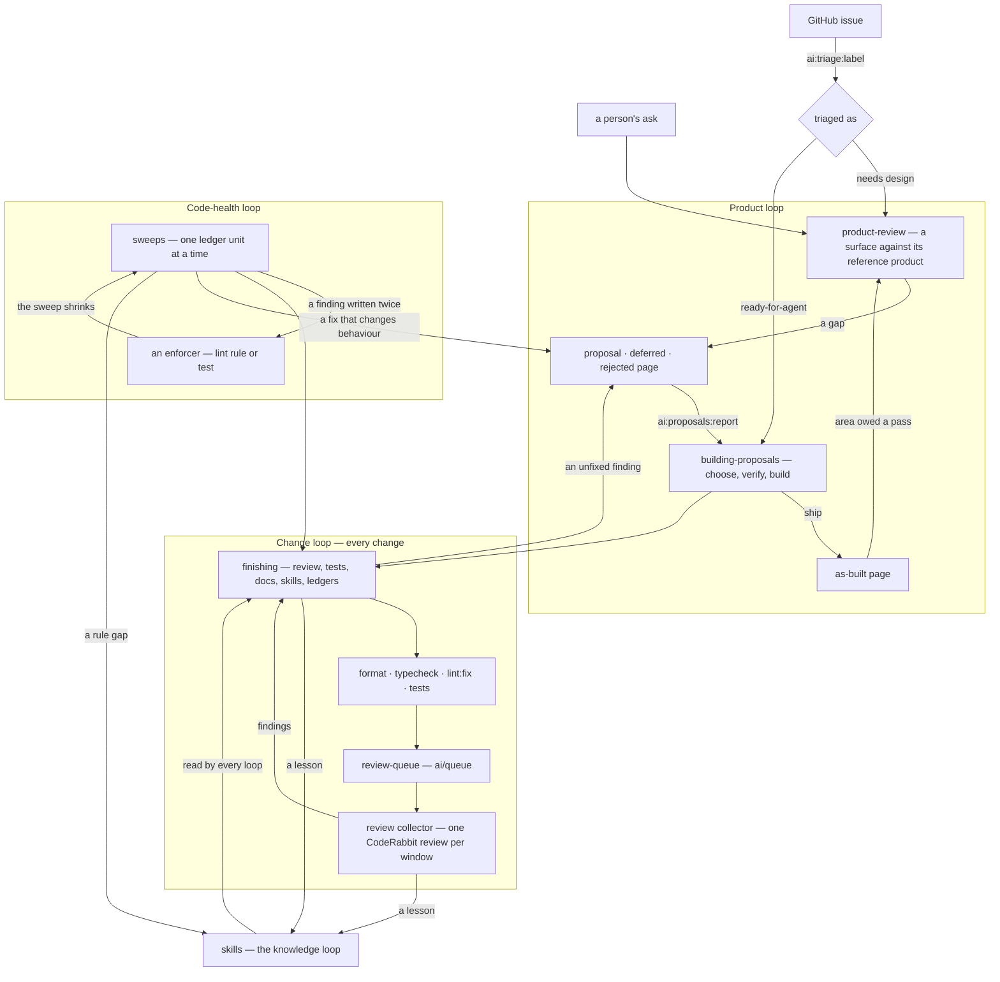

# Engineering loops

Every piece of work in Esposter enters one of the loops below, and every loop ends by handing something to another: a product review writes the proposals a build empties, a build ships the surface the next review judges, every change goes through the same finishing audit and the same review queue, a sweep that writes one finding twice hands it to an enforcer, and every loop's lessons go into the skills every loop reads. None of the loops is scheduled. Each is started by a person's ask or by the event another loop produced, and each has a stop rule, so the whole thing converges instead of churning: **each pass of a loop should find less than the one before**.

This page is the map. Each loop is owned by the skill or page it names, and its rules live there; the one rule stated here is the order in the last section, which belongs to no single loop.

## The loops

- **The product loop** decides what the products should do and builds it. The product review holds each surface against its reference product and triages every gap into a [proposal](/docs/proposals), a deferred or a rejected page (`product-review` skill). A build takes the cheapest valuable proposal, re-verifies it, builds it and ships it as an as-built page (`building-proposals` skill). The ship moves the surface the last review judged, so the area is owed a pass. `pnpm ai:proposals:report` computes both halves from the tree and git: the size of each open proposal, and which areas are owed a pass.
- **The change loop** is what every change goes through, whatever loop it came from. The finishing audit asks what the change owes beyond its code: both review lanes, tests, docs and diagrams, skills, ledgers and enforcers (`finishing` skill, and "Finishing a change" in `CLAUDE.md`). The session commits to one queue branch, and the [review collector](/docs/infra/review-collector) cuts that queue into review windows and merges each release once its single review is done. A finding that review raises comes back into the loop as a change of its own.
- **The code-health loop** covers simplifying, refactoring and optimizing code that already works. A sweep carries one settled convention across old code, one ledger unit per commit (`sweeps` skill). The quality ledger and the runtime-efficiency ledger are sweeps too. A finding a sweep writes twice becomes an enforcer, so the sweep shrinks rather than repeats. A fix that would change behaviour leaves the sweep and becomes a proposal.
- **The knowledge loop** keeps the other loops from repeating themselves. A convention a session discovers or corrects goes into the skill that owns it (`skill-authoring` skill). A regression a review re-finds is added to its append-only list of causes, and each round's meta pass asks what the round's own evidence says about the review's instructions (`code-review` skill). The skill sweep re-reads the whole skill tree until a pass finds nothing (`skill-sweep` skill).
- **Issues** reach the loops through triage. `pnpm ai:triage:label` gives an issue one of the tracker's roles. A `ready-for-agent` issue is built like a proposal and closed when it ships; an issue that needs a design decision is read by the next product-review pass of its area.

## Where work enters

| The work                                                   | Enters at                                                                                              |
| ---------------------------------------------------------- | ------------------------------------------------------------------------------------------------------ |
| What is missing from a product, or whether an area is done | `product-review` skill                                                                                 |
| What to build next, or the low-hanging fruit               | `building-proposals` skill and `pnpm ai:proposals:report`                                              |
| A feature asked for with no proposal                       | `building-proposals` skill: the written-record check, then the build                                   |
| A defect                                                   | fixed in the change that finds it, with a regression test that fails without the fix (`testing` skill) |
| Simplifying or cleaning up code in hand                    | `code-review` skill, quality lane                                                                      |
| A refactor too large for one change                        | a plan under `proposals/refactors/`, built by `building-proposals`                                     |
| A settled convention that old code predates                | `sweeps` skill, one ledger per convention                                                              |
| Making something faster or cheaper                         | `runtime-efficiency` skill for where the work runs, `bench` skill for measuring it                     |
| A convention learned or corrected                          | `skill-authoring` skill                                                                                |
| A review finding from CodeRabbit                           | `coderabbit` and `review-queue` skills                                                                 |
| A dependency update                                        | `dependency-updates` skill                                                                             |
| A GitHub issue                                             | `pnpm ai:triage:label`, then the loop its role names                                                   |

## How each loop stops

Every loop has a stop rule that its owner states. Together, they are what makes the system converge:

- **Product review** stops for an area once a full pass finds nothing new and changes no decision. It starts again only when something moves under that area: a ship, a changed reference product, a deferred page's trigger firing, or a reported gap.
- **A build** stops when the proposal has shipped. The build loop as a whole is empty when `pnpm ai:proposals:report` lists no open proposal.
- **A code review** stops at a round whose confirmed findings are all minor.
- **A sweep** stops when a resume reports nothing, and an enforcer can take it over entirely.
- **The skill sweep** stops when a full pass over the tree finds nothing.

A loop that finds as much on one pass as it did on the last is not converging. The fix for that is in its owner's questions, not another pass.

## What runs next when nothing is asked

A session that finishes a unit of work does not stop to ask whether to go on. It takes up the first of these that exists, runs it to its own stop rule, commits and pushes it, and reads the list again, until the list is empty or the user redirects it. Each one is read off a command rather than a list someone keeps:

1. **Something red.** A failing collector run or a held commit (`review-queue` skill), since every later piece of work lands on top of it. A review's findings are not on this list: the collector drains them into the next window itself.
2. **An area owed a product-review pass**, as `pnpm ai:proposals:report` lists it, so the specs match the shipped surface before anything is built from them.
3. **The cheapest valuable proposal** that the same report lists (`building-proposals` skill).
4. **An open ledger row**, as `pnpm ai:sweep:ledger-coverage` dates them (`sweeps` skill); the skills' own rows are the skill sweep.

No step on this list waits for approval, since each one ends in a queue push, which spends nothing and is reviewed by the collector's one release review. What still asks first is whatever spends something outside the queue: opening a pull request, pushing `develop` or `main`, a paid service, or a destructive change to shared infrastructure.

## Key files

| File                                         | Role                                                                 |
| -------------------------------------------- | -------------------------------------------------------------------- |
| `.agents/skills/product-review/SKILL.md`     | the product review: gaps into proposals, deferred and rejected pages |
| `.agents/skills/building-proposals/SKILL.md` | the build: choosing, verifying, building and shipping a proposal     |
| `.agents/skills/finishing/SKILL.md`          | the audit every change passes before it is done                      |
| `.agents/skills/code-review/SKILL.md`        | the two review lanes, the stop rule and the meta pass                |
| `.agents/skills/sweeps/SKILL.md`             | sweeps, ledgers and handing a repeated finding to an enforcer        |
| `.agents/skills/review-queue/SKILL.md`       | the session's side of the review collector                           |
| `.agents/skills/skill-authoring/SKILL.md`    | where a lesson goes, and how a skill is kept                         |
| `scripts/src/proposals/report/index.ts`      | sizes every open proposal and lists the areas owed a pass            |
| `scripts/src/sweeps/ledgerCoverage/index.ts` | dates every ledger row from commit trailers                          |
| `scripts/src/triage/index.ts`                | labels an issue with its triage role                                 |
