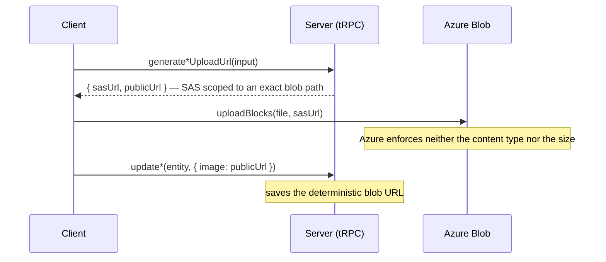
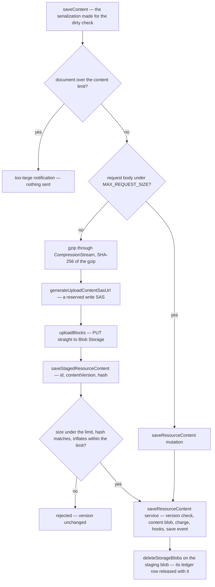

# File Uploads

All binary uploads use a two-step SAS flow: the server issues a short-lived SAS (shared access signature) URL scoped to an exact blob path, and the client uploads directly to Azure Blob Storage. tRPC never carries binary bodies — `octetInputParser` (tRPC's raw-body mode) cannot pass any input alongside the binary stream (no `roomId` or other context) and its size limit falls through to the general tRPC body limit (`MAX_REQUEST_SIZE`) rather than a dedicated file limit. Azure Blob's SAS scoping is strictly better.

## Pattern



Client helper: `uploadBlocks(file, sasUrl)` in `app/services/azure/container/uploadBlocks.ts` — chunks into 4 MB blocks, uploads in parallel, commits the block list.

**The commit is what sets the blob's own headers.** Put Block ignores blob headers, so only the Put Block List call at the end decides what the blob is stored as, and it carries two different content types: `Content-Type` describes that request's XML body, `x-ms-blob-content-type` describes the bytes just committed. Sending the first as the second stored every blob this app uploaded as `application/xml`; `commitBlockList` now takes the file's type explicitly, and omits the blob header entirely when the browser could not type the file.

**The content type a write SAS carries is not a constraint on the upload.** `contentType` on `generateWriteSasUrl` sets the SAS's `rsct` — a _response_ header override applied when the url is read — so it neither restricts what may be PUT nor what the blob is stored as. The mime check on the procedures that mint a write target therefore bounds an honest client only, exactly like the size check below, and the stored content type stays the client's own claim. Read paths that need to be sure what they are serving override it at read time from something trustworthy: the persisted `FileEntity.mimetype` for attachments, the filename extension for resource assets, a fixed type for thumbnails.

## Upload procedures

| Procedure                                          | Router                                                     | Blob path                            | Size limit                                       | Auth         |
| -------------------------------------------------- | ---------------------------------------------------------- | ------------------------------------ | ------------------------------------------------ | ------------ |
| `generateUploadFileSasEntities({ files, roomId })` | `message`                                                  | `{roomId}/{fileId}\|{filename}`      | `MAX_FILE_REQUEST_SIZE`, narrowed per room       | member       |
| `generateUploadFileSasEntities({ files, id })`     | any [FileAssets](/docs/resource/resource-file-assets) type | `{id}/files/{fileId}\|{filename}`    | `MAX_FILE_REQUEST_SIZE` + personal storage quota | owner        |
| `generateUploadContentSasUrl({ id, size })`        | every resource type                                        | `{id}/stagedContent.json.gz`         | `MAX_RESOURCE_CONTENT_SIZE` + personal quota     | owner        |
| `generateProfileImageUploadUrl()`                  | `user`                                                     | `{userId}/ProfileImage`              | client-side only (`useValidateFile`)             | authed       |
| `generateProfileImageUploadUrl({ roomId })`        | `room`                                                     | `rooms/{roomId}/ProfileImage/{uuid}` | client-side only (`useValidateFile`)             | `ManageRoom` |

A blob name is the upload's id joined to the client's filename by `ID_SEPARATOR` (`getBlobName`), which is what lets a download restore the original name from the path alone; the room profile image appends a fresh uuid per upload instead, so a re-upload never lands on a prior name.

The two file-batch procedures check more than size. The message one refuses a file whose mime category is not in the room's `allowedMimeCategories` as well as one over the room's `maxFileSizeBytes` (itself capped by `MAX_FILE_REQUEST_SIZE`), and its batch is bounded by `MAX_READ_LIMIT`. The resource one mints every write target through `generateReservedUploadFileSasEntities`, which takes the hold on the owner's personal quota in the same call, and bounds its batch by `MAX_UNRECONCILED_STORAGE_LEDGER_ENTRIES` — the in-flight hold cap, not the generic read limit, because a batch above it could never pass the reserve however long the client waited ([storage quotas](/docs/resource/storage-quotas)). Room attachments are outside that quota: a room's files belong to the room.

An image attachment also gets a **sibling thumbnail write target**. `generateUploadFileSasEntities(…, { withThumbnail: true })` returns a second SAS for `{prefix}/{id}.thumb` so the client uploads a downscaled preview alongside the original, and `message.generateDownloadThumbnailSasUrls` is the matching read. Only images are minted one, but every delete path names the thumbnail unconditionally — a no-op for other types, and no blob left behind.

Message attachments land in `AzureContainer.MessageAssets`; resource asset files in `AzureContainer.ResourceAssets`; profile images (user + room) in `AzureContainer.PublicUserAssets`. The separate attachments container lets a lifecycle policy tier old attachments without touching hot, small profile images (see [Azure services](/docs/architecture/azure-services)).

Reads differ per domain: message attachments fetch download SAS urls per batch of attachments (`message.generateDownloadFileSasUrls`) and cache them per room in the download store until `READ_SAS_DURATION_MS` runs out. **A page read is not enough to keep that cache alive** — it only mints urls for files it does not already hold, so a room left open longer than the SAS duration would render every attachment broken and fail every download until reload. The download store therefore sweeps its own cache every `READ_SAS_REFRESH_INTERVAL_MS` and re-mints whatever is inside that margin of expiry; the same margin is what a page read counts as already expired, so no url is ever handed to the renderer that could die while on screen. A tick that finds nothing aging out issues no query, which is what makes the sweep affordable. Two properties keep it from becoming the failure it exists to prevent: it re-mints in batches of `MAX_READ_LIMIT` because the room that scrolled past that many attachments is exactly the long-open room being swept, and the whole tick swallows its own rejection — nothing retries a background timer, so an unhandled one would take the page down with it while the user has lost nothing yet. **Swallowing is not enough on its own**, which is why the sweep's reads are marked `isBackground`. The sweep runs for whatever room is open, which may be one the user has just been banned or removed from, and an unmarked read's `FORBIDDEN` reaches `errorLink` inside the link chain — before the rejection can reach the handler that would have swallowed it — where it would redirect to the login page. `errorLink` never redirects a read carrying that mark, and alerts no `FORBIDDEN` at all, so the swept room neither alerts nor navigates: anything the user did not trigger must not be able to move them. Resource assets instead embed a stable app url built client-side after the upload and served through `/api/resource-assets` ([resource file assets](/docs/resource/resource-file-assets)) — resource types have no download procedure, and nothing about them expires.

## Resource content

A resource's content is JSON, not a file, and nearly every save carries it inline as the `saveResourceContent` mutation's input. A document can outgrow one request body, though: a Sheet imported from a multi-megabyte CSV parses fine in the browser, and the security module's request size limiter answers an oversized POST with a 413 **before it reads the body**, which the browser, still uploading, sees as a reset connection with no status at all. So a large save takes the same SAS flow as an attachment, with a commit that reads what was uploaded.

`saveContent` in the resource store already serializes the document for its dirty check, and that serialization chooses the transport:

| The save                                                 | Transport                                                  |
| -------------------------------------------------------- | ---------------------------------------------------------- |
| a request body under `MAX_REQUEST_SIZE`                  | inline — the `saveResourceContent` mutation                |
| a larger body, with the document under the content limit | staged — gzip, PUT to Blob Storage, commit by reference    |
| a document over `MAX_RESOURCE_CONTENT_SIZE`              | refused on the client with a notification; nothing is sent |

**The body is measured as the transformer writes it**, not as the document's own JSON. A class registered with the transformer — a Sheet's rows among them — goes over the wire as an escaped JSON string with an entry of its own in the metadata, so a Sheet's request body runs well past its JSON. `getRequestBodyByteLength` measures the envelope the limiter will see, and only once the JSON alone is under the limit, since the body is never smaller.



The staged save runs inside the one queued call the resource's saves share (`executeSaveContentMutation`, keyed by the resource id), so the SAS query, the PUT and the commit are one unit of the queue, and the `contentVersion` is read when that unit starts, as the inline path reads it when it sends.

**The commit measures the real bytes**, which is what an attachment's declared size cannot do. `readStagedResourceContent` checks the blob's length before it allocates the download, compares the SHA-256 of the bytes with the one the client sent, and gunzips with `maxOutputLength` at the content limit, so an archive that inflates past it stops there rather than filling the heap. The gzip of a document under the limit is smaller than the document, so the one constant bounds both. The document then reaches the `saveResourceContent` service with the same version check the inline mutation runs (`getUpdateContentVersion`), so content over the limit never becomes a resource's document, whoever sent it.

**The staging blob is one fixed name per resource** (`getStagingContentBlobName`), a sibling of the content blob under the resource's `{id}/` directory. That is what lets the design need no cleanup of its own: an abandoned upload leaves at most one orphan, which the next large save overwrites and purge takes with the rest of the directory. It is also what settles two devices saving one large resource: a commit whose hash does not match what it downloads was overwritten by the other device, and is rejected. A committed save deletes the staging blob through `deleteStorageBlobs`, which releases its ledger row in the same call, so the owner is charged for the content blob alone ([storage quotas](/docs/resource/storage-quotas)).

`readResourceContent` returns a large document the ordinary way — a response passes no size limiter.

### Failure and retry

| Failure                                          | Outcome                                                                                                     |
| ------------------------------------------------ | ----------------------------------------------------------------------------------------------------------- |
| the SAS is refused — the owner is out of storage | the save fails with the quota message, as any upload does; nothing was written                              |
| the PUT fails                                    | the save fails; the hold expires on its own; a partial blob is overwritten by the next large save           |
| the commit is rejected on size or hash           | the version is unchanged and the save shows as failed; the next save re-stages from the current document    |
| the commit loses the version check               | the stale-content flow, identical to an inline save's                                                       |
| the commit lands and the staging delete fails    | the save stands; the blob and its charge stay until the next large save or purge, and the failure is logged |

## Sweeping orphans: never delete a blob younger than its write SAS

A blob whose owning row is updated to a new upload leaves the old one behind, so the update sweeps the entity's blob prefix and publishes everything that is not the url it was just handed ([persist then notify](/docs/architecture/persist-then-notify)). "Not the current url" is not on its own a safe test for staleness: upload names are per-upload unique, so a blob a second editor uploaded seconds ago — and has not saved yet — also fails it, and sweeping it points that editor's save at a blob that no longer exists.

**Every prefix sweep therefore filters on age, keeping only blobs created before `now - WRITE_SAS_DURATION_MS`** (`listBlobNames(client, prefix, { createdBefore, isDeep })`). The write SAS that authorized an upload expires after `WRITE_SAS_DURATION_MS`, so no upload can still be in flight past that age, while a blob older than it is either the previous version or an abandoned upload — an orphan either way. This applies to any sweep that infers staleness from the current row rather than from a name it stored, and it is why the sweep is a filtered listing rather than a plain "delete everything else". **Nothing is exempt from the filter** — least of all the version the row itself just stopped pointing at, since a save carries whatever url its form loaded with ([blob lifecycle ownership](/docs/architecture/blob-lifecycle)).

The composer's own revert — an upload the user threw away before sending — is the one delete no entity backs, and it is authorized by the grant token minted with the write SAS rather than by membership ([blob lifecycle ownership](/docs/architecture/blob-lifecycle)).

## Batch input is validated all-or-nothing

Client-side validation of a multi-item input (a multi-file drop, a bulk paste, a multi-select action) **rejects the whole batch on the first invalid item, and the alert names that item**. Never filter the batch down to its valid members: the user would be left holding a set they never chose, with the dropped item easy to miss before they commit. `useValidateFile(file, maxSize)` takes the whole `File` for exactly this reason — it needs the name for the message.

## Size constants

```ts
// shared/services/app/constants.ts
export const MAX_REQUEST_SIZE = 2_000_000; // tRPC body limit — nuxt-security's documented default
export const MAX_FILE_REQUEST_SIZE = 10 * MEGABYTE; // SAS max blob size (file uploads)
// shared/services/resource/constants.ts
export const MAX_RESOURCE_CONTENT_SIZE = 100_000_000; // a resource's document — Google Sheets' ceiling
```

`MAX_REQUEST_SIZE` applies to all tRPC requests; the security module's request size limiter is wired to it, and a body that can outgrow it is committed by reference rather than carried under a raised limit ([raised request body limit](/docs/resource/rejected/raised-request-body-limit)). `MAX_RESOURCE_CONTENT_SIZE` is how large a document a resource may be, and also the cap every content schema's free-form strings and lists take — no string or list can outgrow the document holding it. At that ceiling a staged commit holds the gzip, the inflated text, the parsed document and its re-serialization at once: measured on a Sheet just under the ceiling, the server's resident memory rises by about half a gigabyte and the commit's synchronous parse and validation run for seconds. `MAX_FILE_REQUEST_SIZE` is **not** enforced by Azure: a write SAS carries a content type, an expiry and a permission set, but no length constraint. It is checked against the size the client declares when it asks for the SAS, and the composer checks the real file before uploading — so it bounds an honest client and nothing else. That check only exists on the two procedures that take a file input at all: the profile-image procedures take none and simply mint a write SAS, so their only bound is `useValidateFile`'s default on the client. A client that declares a small size and then writes a large blob succeeds until the SAS expires, and the persisted `FileEntity.size` is the declared number rather than the blob's. Nothing downstream may assume an attachment is within `MAX_FILE_REQUEST_SIZE` or a room's `maxFileSizeBytes`. Closing this would require the upload to pass through a server that sees the bytes, or a post-commit size check that also revokes the SAS — neither exists today.

## Notes

- **Naming**: both the user and room upload procedures are named `generateProfileImageUploadUrl`; the router context (`user.` vs `room.`) disambiguates — consistent with procedures being named by action, not by the entity they touch.

## Sources

- [Request Size Limiter](https://nuxt-security.vercel.app/middleware/request-size-limiter) (nuxt-security) — the documented 2,000,000-byte default for a request body, which is `MAX_REQUEST_SIZE`, and the limiter a staged save never trips.
- [Public networking specs and limits](https://docs.railway.com/networking/public-networking/specs-and-limits) (Railway) — the host sets no body size limit of its own, only a five-minute window for a body to finish uploading, so the security module's limit is the only one in the request path.
- [Size limits in Google Drive](https://support.google.com/drive/answer/37603) (Google) — a spreadsheet up to 100 MB, the reference product's ceiling `MAX_RESOURCE_CONTENT_SIZE` takes.
- [Valet Key pattern](https://learn.microsoft.com/en-us/azure/architecture/patterns/valet-key) (Microsoft Azure Architecture Center) — the key cannot bound the size written, so the application checks the size once the upload completes, which is what the staged commit's checks do.
- [Claim-Check pattern](https://learn.microsoft.com/en-us/azure/architecture/patterns/claim-check) (Microsoft Azure Architecture Center) — a content hash on the reference, a named owner of payload deletion (the commit), and the per-message choice between inline and external.
