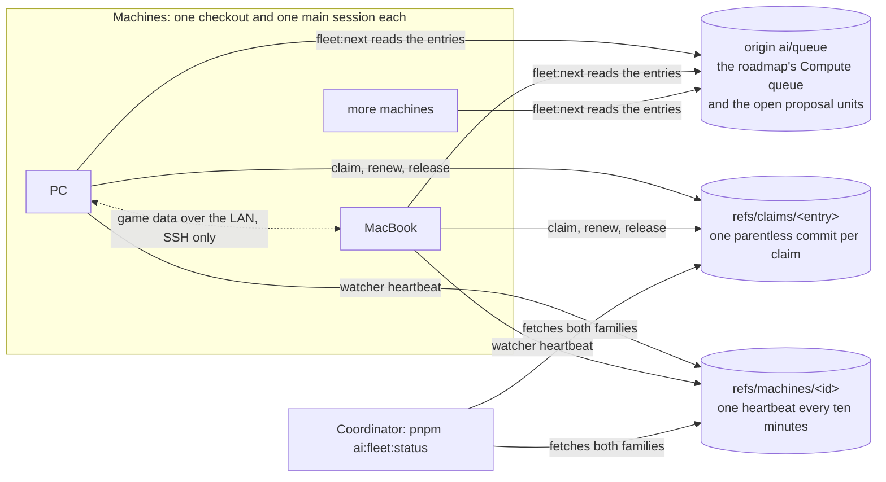

# Fleet

Machines pull work; nothing pushes it to them. Each machine keeps a profile saying what it is and which areas it is lent, each unit of work names the capabilities it needs, and a claim is a git ref on origin saying which machine works a unit. The coordinator writes the entries and settles the calls it is asked for. It never assigns work by message, never reads a report from each machine, and never names a machine in a rule, so adding a machine costs the coordinator nothing. The rules an agent follows are in the throughput skill's `references/fleet.md`; this page explains how the pieces fit and what the fleet holds now.

## How the pieces fit

Git is the only coordination. A claim is created by pushing a parentless commit to a ref that does not yet exist, so origin refuses every second create and exactly one machine wins. A renewal and a stale takeover are pushes with an explicit lease, so a machine never overwrites a commit it has not read. The queue branch `ai/queue` is never touched by a claim, so claiming starts no CI run.

## Machines

A machine's profile is `~/.esposter/machine.json`, written by `pnpm ai:fleet:profile`:

- `id`, the name the machine's claims and heartbeat carry. A new profile takes the hostname.
- `areas`, the areas the user lent the machine for. A new profile is lent `["*"]`, every area. What an area it did not lend means for an agent is the throughput skill's (`.agents/skills/throughput/references/fleet.md`).
- `capabilities`, read off the machine each run: its operating system, `game-install` when the game's asset blocks are present under the game folder, `game-exports` when the parity exports exist, and `media-engine` on macOS and on Windows when FFmpeg lists Direct3D acceleration. `parity-page` is not detected, so the user sets it by hand, and a capability the user set is kept.

The game folder is the one holding `GenshinImpact_Data`, set by the `GENSHIN_GAME_DIRECTORY` variable and defaulting to `C:\Program Files\Genshin Impact\Genshin Impact game`. The tooling and the profile read the same folder. The MacBook holds the game at `~/Esposter/genshin-parity/game`, so its `GENSHIN_GAME_DIRECTORY` names that folder.

The profile's `id` and `areas` are never overwritten once the user has set them.

## Entries

An entry is one unit of work a machine may take, from two sources, read in this order:

- **The compute queue.** Each open item under the roadmap's **Compute queue** heading (`apps/web/content/docs/genshin/roadmap.md`) has an id in braces and its needs after `needs`, such as `needs game-install, game-exports`. Its written paths are its touch set. An item under **Waiting** is not offered.
- **The open proposal units** under `apps/web/content/docs/proposals/<area>/`, the same units `pnpm ai:proposals:report` reads. A proposal's area is its folder, and its touch set is its Key files table plus the `touches` globs its frontmatter names. Its `needs` and `waiting` are its frontmatter's `needs` and `waiting`, empty when the page names none; a unit with a `waiting` blocker is not offered, and `pnpm ai:fleet:status` lists it with the blocker.

`pnpm ai:fleet:next` returns the first entry that meets every condition: the machine has its needs, the entry's area is lent, the entry is not waiting, no live claim holds the entry, and its touch set overlaps no live claim's. A claim is stale, and so does not hold, once it has gone unrenewed for thirty minutes. A runner passes its lane with `--lane <lane>` (`page` or `cpu`), so it never takes another lane's item, and `--kind queue` or `--kind unit` picks between roadmap items and proposal units. A queue line with no `{id}` is skipped, with one warning on stderr naming how many. Nothing takeable means the machine prints nothing and stays idle.

## Claims

- **A claim is a ref.** `pnpm ai:fleet:claim <id>` pushes a parentless commit of the empty tree to `refs/claims/<id>`, its message `{ machine, worker, entry, claimedAt, renewedAt, load }`. Exit 0 means the worker won. Exit 1 names the holder, as `machine/worker`, when the ref already exists.
- **Claims are per worker.** A holder is `machine/worker`, and the throughput skill's fleet reference says how each command takes the worker's id. A worker adopts only its own claim, so a live claim held by another worker on the same machine is taken as held, and each release stops only its own hold. A push that origin refuses is told apart from a network failure by asking origin again: the ref being there means a held claim, and an unreachable origin is an error.
- **A holder renews it.** `pnpm ai:fleet:hold <id>` claims the entry, then renews every ten minutes with a new commit leased from the claim the remote holds at that moment, carrying the latest load line. At each renewal it stops when the ref is gone, when the claim is a miss, or when another machine or worker holds it. `pnpm ai:fleet:release` also deletes that worker's hold file under `~/.esposter/holds/`, which the hold polls every five seconds, so a local release ends it at once. It runs in the background for as long as the runner works the entry.
- **A stale claim is taken over.** A claim unrenewed for thirty minutes is replaced with the same explicit lease, from the stale commit, so two machines taking the same stale claim cannot both land.
- **A miss stays.** `pnpm ai:fleet:release <id> --miss "<text>"` writes the miss into the claim. A missed claim is never stale, so the entry waits for the coordinator's call, and its paths stay held for the same reason.
- **A finished entry is released.** The landing commit deletes the entry's line from the roadmap, and `pnpm ai:fleet:release <id>` then deletes the ref, which ends the hold.

## Load

The watcher (`pnpm ai:machine:watch`, under Monitor) pushes `refs/machines/<id>` every ten minutes, a parentless commit whose message is `{ machine, at, cpu, gpu, freeMemory }` from its latest minute's readings. A failed push prints one line and never stops the watcher. `pnpm ai:fleet:status` fetches every claim and heartbeat with pruning, then prints each machine's last sample and age, and each claim's holder, age and state. It is the coordinator's whole view, and it reads a fixed number of refs regardless of how many machines there are.

## Game data crosses the local network only

Exports and recordings move over SSH on the local network, authenticated and encrypted, and a machine off the network never holds the game exports, so it takes only the entries that need no game data. The design, including which folders are copied, is in the throughput skill's `references/fleet.md`.

## Game data over the LAN

A machine's first route to the game data is the game itself: download it from HoYoverse's official CDN, then run the `genshin:assets` extraction locally. That works on any machine, on or off the LAN. `pnpm ai:fleet:data` is the faster route between machines whose owners allow SSH, because it copies the extracted files instead of re-extracting them.

- **One-time setup on the peer:** the command always connects to the peer, whether it pulls from it or pushes to it, so the peer enables Remote Login (on a Mac, System Settings, General, Sharing, Remote Login). Then on the machine running the command run `ssh-keygen -t ed25519 -f ~/.ssh/<name>` for a dedicated key, and append its public key to the peer's `~/.ssh/authorized_keys`. The receiving machine, where the files land, is the peer for a push and the machine running the command for a pull.
- **The peer row** goes in `~/.esposter/peers.json`: `host`, `user`, `identityFile` (the dedicated key, never the commit-signing key), `repository` (the peer's checkout) and `parityDirectory` (its `~/Esposter/genshin-parity`).
- **Commands:** `pnpm ai:fleet:data manifest` prints each directory's digest as JSON. `pull <peer>` and `push <peer>` compare the two manifests, list only the directories whose digests differ, and stream the files the receiver lacks through one tar pipe over ssh. `--dry-run` counts without copying, `--folders` overrides the default folders, `--source <dir>` puts a local folder in place of the local parity directory (what a push copies from, where a pull lands), and `--into <subfolder>` puts a subfolder of the peer's parity directory in place of it (where a push lands, what a pull copies from).
- **Magnitude:** the manifest walk over this PC's six copied folders takes about 3.6 minutes (median of three, 202 to 238 s) and peaks at about 480 MiB of resident memory, with the folders written by another session during the walk. Its JSON is about 36 MiB across roughly 250,000 directories. Nothing is listed for a directory whose digest matches, so an unchanged copy costs one manifest per side.
- **What is never copied:** `frames` and `tmp`. Deleting on the receiver is out of scope, so a copy only adds or replaces files.

## Machines now

- **The PC** runs Windows 10 with an AMD RDNA 3 GPU and about 32 GB of memory. It holds the game install and the exports, and its profile is lent every area.
- **A MacBook Air** runs macOS on an Apple M1 with 4 performance and 4 efficiency cores, 16 GB of memory and 568 GiB free. It is lent the Genshin area only, so it takes the compute queue's Genshin items and no other work.

## Key files

| File                                                  | Role                                                                                                      |
| :---------------------------------------------------- | :-------------------------------------------------------------------------------------------------------- |
| `scripts/src/fleet/profile/index.ts`                  | Writes the machine's profile from what it detects, keeping the id and areas the user set                  |
| `scripts/src/fleet/claim/index.ts`                    | Claims an entry as a ref on origin, exit 0 when won and exit 1 naming the holder                          |
| `scripts/src/fleet/hold/index.ts`                     | Claims an entry, then renews the claim every ten minutes until it is released                             |
| `scripts/src/fleet/release/index.ts`                  | Deletes an entry's claim, or with a miss keeps it as the holder's final word                              |
| `scripts/src/fleet/next/index.ts`                     | Claims the first entry this worker may take and prints its id and worker                                  |
| `scripts/src/fleet/status/index.ts`                   | Fetches every claim and heartbeat and prints the machines and the claims                                  |
| `scripts/src/fleet/data/index.ts`                     | The `ai:fleet:data` command: manifest, files, pull and push over ssh                                      |
| `scripts/src/services/fleet/selectTakeableEntries.ts` | Selects the entries a machine may take from its profile and the live claims                               |
| `scripts/src/services/fleet/claimFleetEntry.ts`       | Wins a claim with a plain push, adopts its own, or takes over a stale one with an explicit lease          |
| `scripts/src/services/fleet/pushFleetRef.ts`          | Points a fleet ref at a commit under a lease, and tells a refusal by a held ref from a network failure    |
| `scripts/src/services/fleet/parseComputeQueue.ts`     | Reads the compute queue's open items, with their ids, needs and written paths, from the roadmap           |
| `scripts/src/services/machine/watchMachine.ts`        | Samples the machine each minute and pushes its heartbeat every ten minutes                                |
| `scripts/src/services/queue/pushQueue.ts`             | Pushes `ai/queue`, retrying a refused push with exponential backoff and full jitter, up to eight attempts |
| `apps/web/content/docs/genshin/roadmap.md`            | The compute queue, whose items the fleet takes                                                            |
