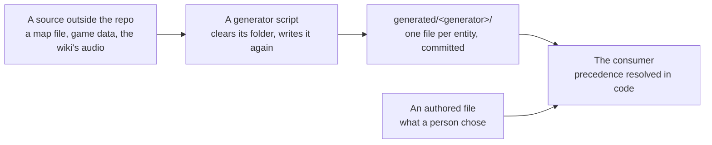

# Generated artifacts

Some files in this repository are written by a script from a source outside it — a map editor's file, the game's data, the community wiki's audio. They are code the repository depends on and did not author, and the standard here is one rule about where such a file lives and one about what it may share a file with.

## Where one lives

**Under a `generated/` folder in the package that consumes it, in a sub-folder named for the generator, one file per entity.** The folder name is the whole marker: no per-file header, no `.generated` suffix, no comment saying who wrote it. A reader who sees `generated/` in the path knows the file is an output, and a reader who does not sees an authored file.

| Generator                     | Writes                                                                                                                       | Consumer                   |
| :---------------------------- | :--------------------------------------------------------------------------------------------------------------------------- | :------------------------- |
| `pnpm tiled:gen`              | `apps/web/shared/generated/tiled/` — enums and typed properties per map                                                      | the dungeons game          |
| `pnpm phaser:gen`             | `apps/web/shared/generated/phaser/` — the asset key enum and manifest                                                        | the dungeons game          |
| `pnpm zstd:gen`               | `apps/web/app/generated/zstd/zstd.wasm` — the browser's zstd encoder, from pinned upstream source                            | delta content saves        |
| `pnpm flow-map:gen`           | `apps/web/app/generated/flowMap/flowMap.mmd` — which page links to which, one flowchart                                      | the UI library's docs page |
| `pnpm ai:voice-match --write` | `packages/genshin-persona/src/generated/PersonaReferenceMap.ts` — the reference line and its likeness per character, one map | the persona plugin         |

Within `apps/web`, a file only the client reads through a query suffix — the flow map's `?raw` — sits under `app/generated/` rather than `shared/generated/`: the server build leaves everything under `shared/` for Nitro to bundle, and Nitro cannot load a path carrying a query.

One file per entity because that is how a consumer usually reads them — a session that needs one map's types loads one module — and because a re-run then changes only the entities whose numbers moved, so the diff a review reads is the change itself rather than a rewrite of one table.

**The exception is a set the consumer reads whole.** The persona plugin's reference map is a hundred-odd one-line entries read in one import by the hook and by the runner's own check; a re-run still changes one line per character that moved, so the review reads the same diff, and the rule's other reason — a consumer that loads one entity's module as it loads one card — buys nothing at this size and would cost a file-system read per entity. A generated set stays one file per entity until its consumer reads all of it at once, and then it is one file — at the `generated/` root rather than inside a folder named for the generator, since a folder standing over a single file names only what the file already names. The sub-folder comes back the moment a second generator writes into the same package.

**Committed, because the consumer must not need the generator's inputs.** The reference map is read on every spoken reply, by a plugin copy installed on a machine with no encoder and no engine of the repository's; the tiled types are what the game is type-checked against. A generated file that only existed after a local run would make every consumer's build depend on a source the repository does not hold.

## What one never does

**It is never edited by hand.** A wrong value is a wrong generator or a wrong input, and the fix goes there and is re-run — an edit in the output is overwritten by the next run without a trace. Each generator treats its folder as the run's whole output: it clears the folder and writes it again, so an entity the source no longer holds leaves no stale file behind. A generator whose entities cost minutes each to measure may read the previous run's records first and write an unchanged entity's back rather than measure it again — the folder is still cleared and still the run's whole output, and a `--fresh` flag measures everything — but the choice is per entity and by name, never a diff of the folder against itself.

**An authored file never holds a generated value, and a generated file never holds an authored one.** The persona card is the person's — how the character speaks, in our words, and the reference line someone listened to and chose; the measured reference the selection computes for the same character is an entry of the generated map beside it. When both exist the precedence is resolved in code, never by copying one value into the other's file:

The plugin reads a character's reference through one function: the card's where the ear wrote one, else the generated map's, else a rule. Deleting a card's reference restores the measurement; regenerating the measurement never touches a card.

## Formatting and lint

A generated `.ts` is source and is formatted as source — the generator emits the formatter's own shape so that `pnpm format` leaves it alone, and a generator whose output the formatter rewrites is fixed at the generator. A generated `.json` holding numeric arrays is on the formatter's ignore list, since one number per line would turn a few hundred records into hundreds of thousands of lines for nothing a reader gains.

## Review

A regenerated folder is the emptiest thing a reviewer can read: hundreds of files carrying numbers a script derived, with the one thing worth judging — the generator — in the same window or an earlier one. So `generated/**` is on CodeRabbit's path filters beside the test snapshots and the migrations, and the commit that carries a regeneration claims the [express lane](/docs/infra/review-collector/express-lane) with an `Express:` trailer, reaching `main` on the checks alone instead of spending a window's file budget. The generator's own change is a separate commit that is reviewed in full.

## Key files

| File                                                              | Role                                          |
| :---------------------------------------------------------------- | :-------------------------------------------- |
| `apps/web/scripts/tiled/index.ts`                                 | The map generator                             |
| `apps/web/scripts/phaser/index.ts`                                | The asset generator                           |
| `apps/web/scripts/flowMap/index.ts`                               | The flow map generator                        |
| `scripts/src/voiceMatch/index.ts`                                 | Rewrites the plugin's reference map whole     |
| `packages/genshin-persona/src/services/readPersonaModule.ts`      | Loads one character's card by path            |
| `packages/genshin-persona/src/services/readCharacterReference.ts` | The authored reference over the generated one |
| `oxfmt.config.ts`                                                 | The formatter's ignore list                   |
| `.coderabbit.yaml`                                                | The review's ignore list                      |
