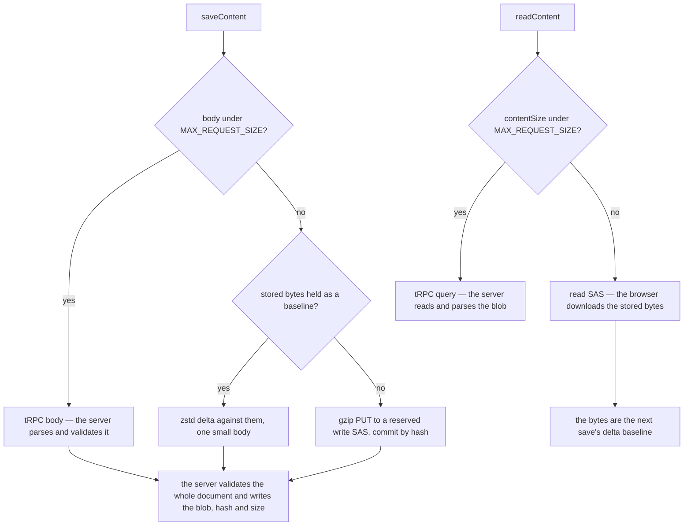

# Large documents

**The server carries a document only while one request body can hold it, and interprets it only where it has to.** Anything larger moves between the browser and Blob Storage through a short-lived signed url (a SAS, shared access signature) the server issues after checking ownership. The server signs, and Azure moves the bytes. This is the valet key pattern, and it is what keeps a large document from costing the server's memory, event loop and bandwidth on every read and every save. That matters most on a host billed per replica, where each of those is paid for all month whether or not a large document is ever opened.

The threshold is one number, `MAX_REQUEST_SIZE`: the body limit the security module enforces on every request. The same number decides both directions, measured the way each direction can measure it.

- **A save** measures its own body as the transformer will write it — never the content's JSON, which is smaller — and above the limit sends a delta against bytes the server confirmed storing, or stages the whole document in Blob Storage and commits it by hash.
- **A read** measures the stored blob by `resources.contentSize`, which every save writes with the blob, and above the limit asks for a read SAS and downloads the blob itself.

## Where the server still holds the document, and why

**Validation on write.** A document the server stores is one it has parsed with the type's content schema, because every server-side reader — a dashboard's dataset, a blueprint capture, a revision — trusts the blob it reads. So a staged or delta save still costs the server one decompress, one parse and one validation of the whole document. It is bounded by `MAX_RESOURCE_CONTENT_SIZE`, and at that ceiling it blocks the instance's event loop for a matter of seconds. The committed benches beside `apps/web/server/services/resource/readStagedResourceContent.ts` are the record. Moving that step off the event loop is written up as [commit off the event loop](/docs/architecture/deferred/commit-off-event-loop), with the trigger that would earn it.

**Server-side readers.** A dataset read for a dashboard, a blueprint capture or a revision interprets content on the server. Its whole job is to compute something from the document, so no signed url can stand in for it.

**Real-time sync.** Every save emits the parsed document it just validated on `resourceEventEmitter`, and `onSaveResourceContent` streams it whole to the owner's other devices with that resource open ([resource](/docs/architecture/resource)). So a device subscribed to a large document still receives it through the server on each save from another device, at any size. Only TodoList subscribes today. A type whose documents outgrow one request body would have the subscription send the new `contentVersion` alone past `MAX_REQUEST_SIZE`, and the device read the blob through a read SAS like any other large read.

Nowhere else does the server hold a large document: carrying one from the browser to storage, or back, is never a reason to.

## A write that changes nothing stores nothing

Every stored copy is content-addressed or rewritten in place: `{id}/content.json` is overwritten, and a retained version deduplicates identical bytes and stores a near-duplicate as a delta ([resource version store](/docs/resource/resource-version-store)). That saving only exists if an unchanged document serializes to the same bytes. So **a write must not mint identity it did not need.** A random id or a fresh timestamp on an item whose values did not change makes a byte-identical document look new, and every history entry pays for all of it again. A Sheet import is the case that proved it: every import built each row new, with a new UUID and new timestamps, so re-importing the same file stored every row id again. `reconcileDataSource` now hands the replaced sheet's identities to the imported one — a column by the header it came from, a row by its position — so the same file imports to the same bytes, and a changed file costs its changed rows.

## Reusing it

A resource type gets all of this without writing anything. Every type's content moves through the resource store's `readContent` and `saveContent` and the procedures `createResourceProcedures` builds, so a new type is large-document safe the moment it is registered. The one thing a type owns is the rule above: a write that regenerates identity has to carry the previous identity over, the way `reconcileDataSource` does for a Sheet.

A large blob outside resource content composes the same pieces rather than a second framework:

| Need                            | Piece                                                                          |
| ------------------------------- | ------------------------------------------------------------------------------ |
| a write the owner's quota holds | `generateReservedWriteSasUrl` on the server, `uploadFileToSas` in the browser  |
| a read the server authorizes    | `generateReadSasUrl` from `@esposter/db`, fetched through `requestBlobStorage` |
| the size a body will cross at   | `getRequestBodyByteLength`                                                     |
| a hash both ends agree on       | `getSha256Hex` in the browser, `node:crypto` on the server                     |
| a history that costs its edits  | the `keyframe-store` package                                                   |

No generic transport abstraction sits above them, because resource content is the only document shape that grows past one body today. A second shape is what would earn one, and it would be shaped by the two it serves.

## Notes

- A browser reads Blob Storage cross-origin, so the storage accounts' CORS rules allow `GET` beside the uploads' `PUT`. An infrastructure deploy that dropped it would fail every large read with a CORS error the owner cannot act on.
- A row written before `contentSize` existed carries its default of zero and is read inline until its next save writes the size. That is the old path, not a broken one.
- The read SAS lives minutes, like the one behind `/api/resource-assets`, because it is used the moment it is issued.

## Key files

| File                                                                     | Role                                                               |
| ------------------------------------------------------------------------ | ------------------------------------------------------------------ |
| `apps/web/app/store/resource/index.ts`                                   | picks each read's and save's transport by size, holds the baseline |
| `apps/web/app/services/resource/readStoredResourceContent.ts`            | reads a large document straight from Blob Storage                  |
| `apps/web/app/services/resource/saveStagedResourceContent.ts`            | stages a large save through a reserved write SAS                   |
| `apps/web/app/services/resource/saveResourceContentDelta.ts`             | sends an edit as a delta against the stored bytes                  |
| `apps/web/server/trpc/procedure/resource/createResourceProcedures.ts`    | signs the read and write urls every resource type gets             |
| `apps/web/server/services/resource/saveResourceContent.ts`               | validates, then writes the blob with its hash and size             |
| `apps/web/app/services/resource/sheet/dataSource/reconcileDataSource.ts` | carries a replaced sheet's identities into an import               |

## Sources

- [Valet Key pattern](https://learn.microsoft.com/en-us/azure/architecture/patterns/valet-key) (Azure Architecture Center) — a time- and scope-limited token lets the client move data directly to and from storage, taking compute, memory and bandwidth off the application. The pattern names validation of uploaded data as the application's remaining job, which is the one place this page keeps the server in the path.
- [Azure Functions scale and hosting](https://learn.microsoft.com/en-us/azure/azure-functions/functions-scale) (Microsoft Learn) — the Consumption plan's memory and timeout limits, which bound where the commit's validation could move if it left the web server.
